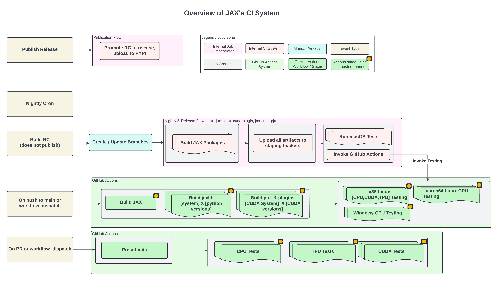

# JAX Continuous Integration

This folder contains the configuration files and scripts used to build and test
JAX. It is typically used by continuous integration (CI) jobs to automate builds
and run comprehensive tests across various platforms and configurations. This
page provides an overview of the JAX CI system, its components, and the
different workflows it supports.

********************************************************************************

## JAX's CI System



JAX's CI system is composed of several interacting components and orchestrates
builds and tests using a hybrid approach, leveraging both an internal CI system
and GitHub Actions as well as an internal build orchestrator for managing
nightly and release flows. It encompasses several distinct workflows, including
comprehensive presubmit checks triggered on pull requests and branch pushes,
bi-hourly continuous builds, extensive nightly builds with broad platform
coverage, and a controlled release process that culminates in PyPI publication.

These flows build four packages: `jax`, `jaxlib`, `jax-cuda-plugin`,
`jax-cuda-pjrt` and support a range of environments, including:

*   **Linux x86:** CPU, TPU, CUDA
*   **Linux aarch64:** CPU, CUDA
*   **Windows x86:** CPU
*   **Mac Arm64:** CPU

### Architecture Overview

1.  **Internal CI System:** An internal CI system is used for specific build and
    test tasks, such as nightly builds, release candidate (RC) builds, and
    Mac-specific testing.

2.  **GitHub Actions:** Used for presubmit checks, continuous integration builds
    and tests, and nightly/release artifact testing.

3.  **Build Orchestrator:** An internal tool used to manage complex workflows
    such as nightly / release flows, promoting RC builds to release, etc.

4.  **Artifact Storage:**

*   Google Cloud Storage (GCS) Buckets: Used for temporary storage of artifacts
    between jobs in GitHub Actions workflows and for storing packages built
    during nightly and release flows before testing.
*   Artifact Registry: Used to store nightly packages, RC packages and final
    releases.
*   PyPI: Where final releases are published.

### CI Workflows and Where They Run

JAX's CI system consists of the following workflows:

1.  **Presubmits:** Presubmits are run in GitHub actions and are triggered on
    pull requests that target the `main` branch and on pushes to the `main` and
    `release` branch. JAX's presubmit run time SLO is about 10 minutes so these
    are typically run using Bazel with remote build execution
    ([RBE](https://bazel.build/remote/rbe)). RBE allows us to execute build and
    test actions on a distributed system, separate from the local machine,
    instead of solely on the local machine. This enables faster build and test
    times by utilizing parallel computing resources and caching across a cluster
    of machines. However, we also use Pytest in workflows where we are not able
    to use RBE such as the TPU presubmit. In such presubmits, we usually run a
    subset of tests to be able to satisfy the presubmit run time SLO. To see the
    list of the presubmit workflows,
    [click here](https://github.com/search?q=repo%3Ajax-ml%2Fjax+path%3A.github%2Fworkflows%2F+%28path%3A**%2F*.yml+OR+path%3A**%2F*.yaml%29+%22pull_request%22&type=code).

2.  **Continuous:** These jobs are run in GitHub actions and are scheduled to
    run once every 2 hours on the `main` branch. It builds JAX packages and runs
    a wide range of tests targeting different environments such as CPU, CUDA
    (L4, H100, B200, etc), and TPU (v4-8, v5e-8, etc.). For more information,
    see
    [wheel_tests_continuous.yml](https://github.com/jax-ml/jax/blob/main/.github/workflows/wheel_tests_continuous.yml)
    ([An example run](https://github.com/jax-ml/jax/actions/workflows/wheel_tests_continuous.yml).)

3.  **Nightly Builds and Tests:** These jobs use an hybrid approach of both the
    internal CI system and GitHub actions. The jobs are triggered once every
    night by the internal build orchestrator tool. It first triggers the jobs in
    the internal CI system to build the JAX packages for different
    configurations (Python versions, CUDA versions, etc) and uploads them to a
    staging bucket in GCS as well as to the nightly artifact registry. Next,
    testing jobs are triggered that download the artifacts from the staging
    bucket and run tests. Mac testing jobs are run in the internal CI system.
    For non-Mac testing, a trigger job is run that invokes the
    [wheel_tests_nightly_release.yml](https://github.com/jax-ml/jax/blob/main/.github/workflows/wheel_tests_nightly_release.yml)
    workflow in GitHub Actions. JAX's nightly artifacts can be found here:
    [jax](https://us-python.pkg.dev/ml-oss-artifacts-published/jax-public-nightly-artifacts-registry/simple/jax),
    [jaxlib](https://us-python.pkg.dev/ml-oss-artifacts-published/jax-public-nightly-artifacts-registry/simple/jaxlib),
    [jax-cuda-plugin](https://us-python.pkg.dev/ml-oss-artifacts-published/jax-public-nightly-artifacts-registry/simple/jax-cuda12-plugin),
    [jax-cuda-pjrt](https://us-python.pkg.dev/ml-oss-artifacts-published/jax-public-nightly-artifacts-registry/simple/jax-cuda12-pjrt).

4.  **Release Builds and Tests:** Release flow is similar to the nightly flow
    except for few differences. First, release process has to be triggered
    manually in the internal build orchestrator and should be done only after a
    release branch (E.g `release/0.5.3`) has been created. The build jobs build
    two sets of artifacts for each package: 1. RC wheels 2. Final version
    wheels. These two sets are pretty much the same package except for their
    metadata and wheel tags. The RC wheels are then uploaded to the staging
    bucket and release artifact registry. After the uploads are done, the test
    jobs are triggered. As with the nightly flow, Mac test jobs are run in the
    internal CI system while non-Mac test jobs are run in GitHub actions. To see
    the GitHub actions run for a particular release, filter the workflow runs by
    its branch name.
    <!-- [To be added after the release process has been switched over to the new system] For e.g, here are the [runs](https://github.com/jax-ml/jax/actions/workflows/wheel_tests_nightly_release.yml?query=branch%3Arelease%2F0.5.3) for `release/0.5.3`. -->

5.  **Promote RC to Final and Publish to PyPI:** If the RC wheels pass all
    testing, then we are ready to promote it as the final version and publish it
    to PyPI. This entire flow is internal and is run in our internal CI system.
    Final version of the packages are published to PyPI and JAX's release
    artifact registry. JAX's release artifacts (RC and final versions) can be
    found here:
    [jax](https://us-python.pkg.dev/ml-oss-artifacts-published/jax-public-release-artifacts-registry/simple/jax),
    [jaxlib](https://us-python.pkg.dev/ml-oss-artifacts-published/jax-public-release-artifacts-registry/simple/jaxlib),
    [jax-cuda-plugin](https://us-python.pkg.dev/ml-oss-artifacts-published/jax-public-release-artifacts-registry/simple/jax-cuda12-plugin),
    [jax-cuda-pjrt](https://us-python.pkg.dev/ml-oss-artifacts-published/jax-public-release-artifacts-registry/simple/jax-cuda12-pjrt).

### JAX's Official CI and Build/Test Scripts

JAX's CI jobs (both internal and those on GitHub actions) run the scripts in
this folder. An overview of the different folders and their purpose is given
below:

-   **ci/**: Contains all build scripts, environment files, and utility scripts.
-   **ci/utilities/**: Contains helper scripts used throughout the build/test
    process. See
    [README.md](https://github.com/jax-ml/jax/blob/main/ci/utilities/README.md)
    for a brief overview of these utility scripts and their behavior.
-   **ci/envs/**: Holds environment files that set `JAXCI` environment variables
    that control build and test configurations. see
    [README.md](https://github.com/jax-ml/jax/blob/main/ci/envs/README.md) to
    see the complete list of these variables and their behavior.

Every build script in this folder first source the `JAXCI` envs in
[default.env](https://github.com/jax-ml/jax/blob/main/ci/envs/default.env) and
then run the
[setup_build_environment.sh](https://github.com/jax-ml/jax/blob/main/ci/utilities/setup_build_environment.sh)
script to set up the build environment.

A brief overview of each build script in this folder is given below:

> [!NOTE]
> Both internal and GitHub action jobs run under the
> [ml-build](https://github.com/tensorflow/tensorflow/tree/master/ci/official/containers)
> Docker image which contains build tools such as Python, Bazelisk, LLVM/Clang,
> manylinux compliant libraries (in Linux images), etc.

-   **build_artifacts.sh:** These build the various JAX artifacts. We build
    three different type of artifacts based on the type of job: Nightly,
    RC/Release, or at HEAD.
-   **run_bazel_test_cpu_rbe.sh/run_bazel_test_cuda_rbe.sh**: These run Bazel
    tests with RBE on every GitHub PR. We test compatibility with both CPU and
    CUDA. On platforms where RBE is not natively supported (e.g Linux Arm64), we
    cross-compile the test targets for Linux Aarch64 on Linux x86. As the tests
    still need to be run on the host machines and because running the tests on a
    single machine can take a long time, we skip running them on these
    platforms.
-   **run_bazel_test_cuda_non_rbe.sh**: These run the following Bazel CUDA
    tests: Single accelerator tests with one GPU apiece and Multi-accelerator
    tests with all GPUs. These jobs depend on local JAX wheels and therefore
    require that the following wheels to be present in the `../dist` folder:
    `jax`, `jaxlib`, `jax-cuda-plugin`, and `jax-cuda-pjrt` wheels. In CI
    builds, we first build these wheels from source and then run the `bazel
    test` command.
-   **run_pytest_*.sh**: These run tests with Pytests and use the JAX wheel
    packages installed on the system. In CI builds, we build the wheels first
    from source and then run the `pytest` commands. We test compatibility with
    CPU, CUDA, and TPU. These are primarily run as part of the continuous and
    nightly/release test jobs except for TPU which is also run as a presubmit
    testing a subset of the tests.

## Different Test Configurations

JAX's CI Test jobs run under different test configurations. These configurations
are described briefly in the sections below.

### XLA Versions

JAX's CI builds rely on XLA, but use different versions depending on the type of
build. To ensure stability and reproducibility, nightly and release builds use a
pinned XLA version specified in the JAX
[workspace](https://github.com/jax-ml/jax/blob/34a2f0ca4a8f8a26d9a056f8785f412bd156dc23/third_party/xla/workspace.bzl#L24-L25).

However, to keep JAX compatible with the latest XLA developments, presubmit and
postsubmit builds utilize the most recent XLA version. This is done by
overriding the default XLA dependency with a local copy of the XLA repository.
We do this by passing `--override_repository=xla=/path/to/local/xla` which
instructs Bazel to depend on the XLA in the local system instead of the version
in the workspace.

The CI system uses the `JAXCI` environment variables to manage this process.
When running jobs that need to use XLA at head, we set `JAXCI_CLONE_MAIN_XLA=1`.
This clones the XLA repository at head and sets `JAXCI_XLA_GIT_DIR` to its path.
[JAX build CLI](https://github.com/jax-ml/jax/blob/main/build/build.py)
automatically adds the necessary Bazel flag (`--override_repository`) to point
to this local XLA version during the build process if `JAXCI_XLA_GIT_DIR` is
set. In jobs where the build CLI is not used such as the RBE presubmits, we
explicitly include `--override_repository=xla="${JAXCI_XLA_GIT_DIR}"` as part
of the test command.

### Enabling/Disabling 64-bit Data Types

By default, JAX enforces single-precision numbers to mitigate the Numpy API’s
tendency to aggressively promote operands to `double`. In order to use
double-precision numbers, we need to set the `JAX_ENABLE_X64` environment
variable. In CI, we test both configurations in presubmits and postsubmits by
using the `JAXCI_ENABLE_X64` environment variable.

<!-- ## Monitoring And Logs [TODO] -->

## [Googlers Only] Connecting to CI Runners for Debugging

If you are a Googler, you can connect to one of the self-hosted runners we have
on GitHub to debug your workflow. For more information, see
go/ml-github-actions:connect.

## Running These Scripts Locally on Your Machine

> [!IMPORTANT]
> If you are a Linux / Windows user, you need to have Docker installed as a
> prerequisite. Additionally, if running on Windows, please run these commands
> in a bash environment as all the scripts are written in Shell.

Follow the steps below to run a CI script locally on your machine.

1.  [Optional] Set `JAXCI` variables in your shell environment. See
    [ci/envs/README.md](https://github.com/jax-ml/jax/blob/main/ci/envs/README.md)
    for the list of `JAXCI` variables and their behavior.

2.  [Linux/Windows]

    Start the Docker container by running:

    ```bash
        ./ci/utilities/run_docker_container.sh
    ```

    This will start a Docker container named "jax". Note that if you set any
    `JAXCI` variables in step 1, they will also be be set in the container.

    Run the script under the Docker container.

    ```bash
        # docker exec jax <build-script>
        docker exec jax ./ci/build_artifacts.sh jaxlib
    ```

3.  [Mac] Execute the build script directly.

    ```bash
        # ./<build-script>
        ./ci/build_artifacts.sh jaxlib
    ```
