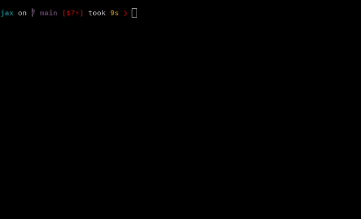

# Compiled prints and breakpoints

<!--* freshness: { reviewed: '2024-03-13' } *-->

The {mod}`jax.debug` package offers some useful tools for inspecting values
inside of compiled functions.

## Debugging with `jax.debug.print` and other debugging callbacks

**Summary:** Use {func}`jax.debug.print` to print traced array values to
stdout in compiled (e.g. `jax.jit` or `jax.pmap`-decorated) functions:

```python
import jax
import jax.numpy as jnp

@jax.jit
def f(x):
  jax.debug.print("🤯 {x} 🤯", x=x)
  y = jnp.sin(x)
  jax.debug.print("🤯 {y} 🤯", y=y)
  return y

f(2.)
# Prints:
# 🤯 2.0 🤯
# 🤯 0.9092974662780762 🤯
```

With some transformations, like `jax.grad` and `jax.vmap`, you can use Python's builtin `print` function to print out numerical values. But `print` won't work with `jax.jit` or `jax.pmap` because those transformations delay numerical evaluation. So use `jax.debug.print` instead!

Semantically, `jax.debug.print` is roughly equivalent to the following Python function

```python
def debug.print(fmt: str, *args: PyTree[Array], **kwargs: PyTree[Array]) -> None:
  print(fmt.format(*args, **kwargs))
```
except that it can be staged out and transformed by JAX. See the {func}`API reference <jax.debug.print>` for more details.

Note that `fmt` cannot be an f-string because f-strings are formatted immediately, whereas for `jax.debug.print`, we'd like to delay formatting until later.

### When to use "_debug_" print?

You should use `jax.debug.print` for dynamic (i.e. traced) array values within JAX transformations
like `jit`, `vmap`, and others.
For printing of static values (like array shapes or dtypes), you can use a normal Python `print` statement.

### Why "_debug_" print?
In the name of debugging, `jax.debug.print` can reveal information about _how_ computations are evaluated:

```python
xs = jnp.arange(3.)

def f(x):
  jax.debug.print("x: {}", x)
  y = jnp.sin(x)
  jax.debug.print("y: {}", y)
  return y
jax.vmap(f)(xs)
# Prints: x: 0.0
#         x: 1.0
#         x: 2.0
#         y: 0.0
#         y: 0.841471
#         y: 0.9092974
jax.lax.map(f, xs)
# Prints: x: 0.0
#         y: 0.0
#         x: 1.0
#         y: 0.841471
#         x: 2.0
#         y: 0.9092974
```
Notice that the printed results are in different orders!

By revealing these inner-workings, the output of `jax.debug.print` doesn't respect JAX's usual semantics guarantees, like that `jax.vmap(f)(xs)` and `jax.lax.map(f, xs)` compute the same thing (in different ways). Yet these evaluation order details are exactly what we might want to see when debugging!

So use `jax.debug.print` for debugging, and not when semantics guarantees are important.

### More examples of `jax.debug.print`

In addition to the above examples using `jit` and `vmap`, here are a few more to have in mind.

#### Printing under `jax.pmap`

When `jax.pmap`-ed, `jax.debug.print`s might be reordered!
```python
xs = jnp.arange(2.)

def f(x):
  jax.debug.print("x: {}", x)
  return x
jax.pmap(f)(xs)
# Prints: x: 0.0
#         x: 1.0
# OR
# Prints: x: 1.0
#         x: 0.0
```

#### Printing under `jax.grad`

Under a `jax.grad`, `jax.debug.print`s will only print on the forward pass:
```python
def f(x):
  jax.debug.print("x: {}", x)
  return x * 2.

jax.grad(f)(1.)
# Prints: x: 1.0
```

This behavior is similar to how Python's builtin `print` works under a `jax.grad`. But by using `jax.debug.print` here, the behavior is the same even if the caller applies a `jax.jit`.

To print on the backward pass, just use a `jax.custom_vjp`:

```python
@jax.custom_vjp
def print_grad(x):
  return x

def print_grad_fwd(x):
  return x, None

def print_grad_bwd(_, x_grad):
  jax.debug.print("x_grad: {}", x_grad)
  return (x_grad,)

print_grad.defvjp(print_grad_fwd, print_grad_bwd)


def f(x):
  x = print_grad(x)
  return x * 2.
jax.grad(f)(1.)
# Prints: x_grad: 2.0
```

#### Printing in other transformations

`jax.debug.print` also works in other transformations like `pjit`.

### More control with `jax.debug.callback`

In fact, `jax.debug.print` is a thin convenience wrapper around `jax.debug.callback`, which can be used directly for greater control over string formatting, or even the kind of output.

Semantically, `jax.debug.callback` is roughly equivalent to the following Python function

```python
def callback(fun: Callable, *args: PyTree[Array], **kwargs: PyTree[Array]) -> None:
  fun(*args, **kwargs)
  return None
```

As with `jax.debug.print`, these callbacks should only be used for debugging output, like printing or plotting. Printing and plotting are pretty harmless, but if you use it for anything else its behavior might surprise you under transformations. For example, it's not safe to use `jax.debug.callback` for timing operations, since callbacks might be reordered and asynchronous (see below).

### Sharp bits
Like most JAX APIs, `jax.debug.print` can cut you if you're not careful.

#### Ordering of printed results
When distinct calls to `jax.debug.print` involve arguments which don't depend on one another, they might be reordered when staged out, e.g. by `jax.jit`:

```python
@jax.jit
def f(x, y):
  jax.debug.print("x: {}", x)
  jax.debug.print("y: {}", y)
  return x + y

f(2., 3.)
# Prints: x: 2.0
#         y: 3.0
# OR
# Prints: y: 3.0
#         x: 2.0
```

Why? Under the hood, the compiler gets a functional representation of the staged-out computation, where the imperative order of the Python function is lost and only data dependence remains. This change is invisible to users with functionally pure code, but in the presence of side-effects like printing, it's noticeable.

To preserve the original order of `jax.debug.print`s as written in your Python function, you can use `jax.debug.print(..., ordered=True)`, which will ensure the relative order of prints is preserved. But using `ordered=True` will raise an error under `jax.pmap` and other JAX transformations involving parallelism, since ordering can't be guaranteed under parallel execution.

#### Asynchronous callbacks

Depending on the backend, `jax.debug.print`s may happen asynchronously, i.e. not in your main program thread. This means that values could be printed to your screen even after your JAX function has returned a value.
```python
@jax.jit
def f(x):
  jax.debug.print("x: {}", x)
  return x
f(2.).block_until_ready()
# <do something else>
# Prints: x: 2.
```

To block on the `jax.debug.print`s in a function, you can call `jax.effects_barrier()`, which will wait until any remaining side-effects in the function have completed as well:

```python
@jax.jit
def f(x):
  jax.debug.print("x: {}", x)
  return x
f(2.).block_until_ready()
jax.effects_barrier()
# Prints: x: 2.
# <do something else>
```
#### Performance impacts

##### Unnecessary materialization

While `jax.debug.print` was designed to have a minimal performance footprint, it can interfere with compiler optimizations and potentially affect the memory profile of your JAX programs.
```python
def f(w, b, x):
  logits = w.dot(x) + b
  jax.debug.print("logits: {}", logits)
  return jax.nn.relu(logits)
```
In this example, we are printing intermediate values in between a linear layer and the activation function. Compilers like XLA can perform fusion optimizations, which might avoid materializing `logits` in memory. But when we use `jax.debug.print` on `logits`, we are forcing those intermediates to be materialized, potentially slowing down the program and increasing memory usage.

Furthermore, when using `jax.debug.print` with `jax.pjit`, a global synchronization occurs that will materialize values on a single device.

##### Callback overhead

`jax.debug.print` inherently incurs communication between an accelerator and its host. The underlying mechanism differs from backend to backend (e.g. GPU vs TPU) but in all cases, we'll need to copy the printed values from device to host. In the CPU case, this overhead is smaller.

Furthermore, when using `jax.debug.print` with `jax.pjit`, a global synchronization occurs that adds some overhead.

### Strengths and limitations of `jax.debug.print`
#### Strengths
* Print debugging is simple and intuitive
* `jax.debug.callback` can be used for other innocuous side-effects

#### Limitations
* Adding print statements is a manual process
* Can have performance impacts

## Interactive inspection with `jax.debug.breakpoint()`

**Summary:** Use `jax.debug.breakpoint()` to pause the execution of your JAX program to inspect values:

```python
@jax.jit
def f(x):
  y, z = jnp.sin(x), jnp.cos(x)
  jax.debug.breakpoint()
  return y * z
f(2.) # ==> Pauses during execution!
```


`jax.debug.breakpoint()` is actually just an application of `jax.debug.callback(...)` that captures information about the call stack. It has the same transformation behaviors as `jax.debug.print` as a result (e.g. `vmap`-ing `jax.debug.breakpoint()` unrolls it across the mapped axis).

### Usage

Calling `jax.debug.breakpoint()` in a compiled JAX function will pause your program when it hits the breakpoint. You'll be presented with a `pdb`-like prompt that allows you to inspect the values in the call stack. Unlike `pdb`, you will not be able to step through the execution, but you are allowed to resume it.

Debugger commands:
* `help` - prints out available commands
* `p` - evaluates an expression and prints its result
* `pp` - evaluates an expression and pretty-prints its result
* `u(p)` - go up a stack frame
* `d(own)` - go down a stack frame
* `w(here)/bt` - print out a backtrace
* `l(ist)` - print out code context
* `c(ont(inue))` - resumes the execution of the program
* `q(uit)/exit` - exits the program (does not work on TPU)

### Examples

#### Usage with `jax.lax.cond`

When combined with `jax.lax.cond`, the debugger can become a useful tool for detecting `nan`s or `inf`s.

```python
def breakpoint_if_nonfinite(x):
  is_finite = jnp.isfinite(x).all()
  def true_fn(x):
    pass
  def false_fn(x):
    jax.debug.breakpoint()
  lax.cond(is_finite, true_fn, false_fn, x)

@jax.jit
def f(x, y):
  z = x / y
  breakpoint_if_nonfinite(z)
  return z
f(2., 0.) # ==> Pauses during execution!
```

### Sharp bits
Because `jax.debug.breakpoint` is a just an application of `jax.debug.callback`, it has the same [sharp bits as `jax.debug.print`](#sharp-bits), with a few more caveats:
* `jax.debug.breakpoint` materializes *even more* intermediates than `jax.debug.print` because it forces materialization of all values in the call stack
* `jax.debug.breakpoint` has more runtime overhead than a `jax.debug.print` because it has to potentially copy all the intermediate values in a JAX program from device to host.


### Strengths and limitations of `jax.debug.breakpoint()`

#### Strengths
* Simple, intuitive and (somewhat) standard
* Can inspect many values at the same time, up and down the call stack

#### Limitations
* Need to potentially use many breakpoints to pinpoint the source of an error
* Materializes many intermediates
