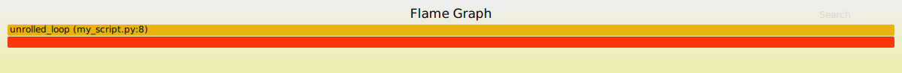

(debugging-slow-tracing-compilation)=
# Debugging slow JAX tracing and XLA compilation

<!--* freshness: { reviewed: '2026-06-11' } *-->

This guide covers how to use JAX and XLA flags to diagnose slow tracing and
compilation, and how to avoid common performance gotchas.

---

## 1. Configuring Diagnostic Flags

JAX provides several built-in configuration options to log tracing and
compilation times.
You can enable these via environment variables,
Python API calls (`jax.config.update`),
or ABSL command-line flags (if `jax.config.config_with_absl()` is called).
(See {doc}`../config_options` for a full guide on setting JAX configuration
options.)

### Logging Compilations and Cache Misses

* **`jax_log_compiles`**: Logs elapsed time for tracing, lowering, and
  compilation as a warning. If the flag is unset (default) the elapsed times
  are still logged as debug messages.

* **`jax_explain_cache_misses`**: Logs an explanation whenever JAX misses
  its in-memory tracing cache or persistent compilation cache.
  Essential for discovering *why* JAX decided to retrace or recompile a
  function.

* **`jax_dump_ir_to`**: Specifies the directory where JAX should dump IR text
  files.
  See [`jax_dump_ir_to`](https://docs.jax.dev/en/latest/config_options.html#jax_dump_ir_to).

* **`jax_dump_ir_modes`**: Comma-delimited list of IR formats to dump.
  A useful mode is `eqn_count_pprof`.
  See [`jax_dump_ir_modes`](https://docs.jax.dev/en/latest/config_options.html#jax_dump_ir_modes).

```python
import jax
jax.config.update("jax_log_compiles", True)
jax.config.update("jax_explain_cache_misses", True)
jax.config.update("jax_dump_ir_to", "/tmp/jax_ir")  # or "sponge"
jax.config.update("jax_dump_ir_modes", "eqn_count_pprof")
```

```bash
# Or via environment variables
JAX_LOG_COMPILES=1 JAX_EXPLAIN_CACHE_MISSES=1 JAX_DUMP_IR_TO=/tmp/jax_ir JAX_DUMP_IR_MODES=eqn_count_pprof python my_script.py
```

You can then try to use an LLM to summarize the log to identify
slow stages and diagnose the problem.

OSS users of JAX may need to enable `INFO` logs from JAX and XLA by setting

```bash
export TF_CPP_MIN_LOG_LEVEL=0
```

---

## 2. What to Look for in the Logs

Once you have enabled `JAX_LOG_COMPILES` and `JAX_EXPLAIN_CACHE_MISSES`,
examine the logs for the following critical markers.

### Tracing, Lowering, and Compilation Durations

When `JAX_LOG_COMPILES` is enabled, JAX logs the exact elapsed time for
each major phase of execution for each top-level function.

```text
W0610 23:50:26.227175 dispatch.py:205] Finished tracing flax_forward for jit in 0.057370424 sec
W0610 23:50:26.240696 pxla.py:703] Compiling jit(flax_forward) with global shapes and types (ShapedArray(bfloat16[16,16,2048]),). Argument mapping: (UnspecifiedValue,).
W0610 23:50:26.521261 dispatch.py:205] Finished jaxpr to MLIR module conversion jit(flax_forward) in 0.280440092 sec
W0610 23:50:44.162414 pxla.py:1234] Finished XLA compilation of jit(flax_forward) in 10.1791505315 sec
```

You may see too many stages, or a few stages that are very slow.
Read further for more details.

### Many Eager Op-by-Op Compilations

If your log exhibits a massive barrage of compilations for tiny
primitive operations before your main computation starts:

```text
I0610 23:32:22.510689 isa_program_util_common.cc:346] (HLO module jit_convert_element_type): Executable fingerprint...
I0610 23:32:22.561443 isa_program_util_common.cc:346] (HLO module jit_iota): Executable fingerprint...
I0610 23:32:22.665594 isa_program_util_common.cc:346] (HLO module jit_add): Executable fingerprint...
```
* **What it means:** Operations like `jnp.abs`, `jnp.round`, `jnp.where`,
  or `jnp.clip` are being executed eagerly on the TPU/GPU outside of a
  `@jax.jit` context (e.g., during weight parameter initialization).
  JAX dispatches eager ops individually,
  forcing XLA to perform a separate compilation for every unique tensor shape.
* **Action:** Wrap this logic in `@jax.jit`.


### Tracing Cache Misses

When JAX retraces a function and `JAX_EXPLAIN_CACHE_MISSES` is specified,
it logs a warning explaining why:

```text
W0610 23:49:11.800984 partial_eval.py:2179] TRACING CACHE MISS at my_script.py:65:8 (MyLayer.__call__):
  never seen function:
    einsum id=55399261860256 defined at aqt_dot_general.py:229
```
* **What it means:** JAX searched its in-memory cache but did not find a
  matching entry for the function handle, argument shapes, or dtypes.
* **Action:** Check if the function object is being recreated dynamically
  (changing `id`) or if argument shapes/dtypes are varying across calls.
  (See [Common Gotchas](#debugging-slow-tracing-compilation-caching-gotchas) for a
  few Python patterns that cause cache misses.)


### XLA Compilation Stage Durations

XLA prints precise timing breakdowns for each compiler pass:

```text
I0610 23:33:55.090166 deepsea_compiler_hlo_passes.cc:6157] HLO_PASSES stage duration: 5.4901s
I0610 23:33:57.655107 deepsea_compiler_base.cc:3735] BACKEND_PASSES stage duration: 2.5636s
I0610 23:33:58.089845 deepsea_compiler_backend.cc:1491] CODE_GENERATION stage duration: 434.59ms
I0610 23:33:59.678832 deepsea_compiler_base.cc:984] END_TO_END stage duration: 10.0876s
```
* **What it means:** `HLO_PASSES` is where XLA optimizes and simplifies the 
  target-independent HLO graph. `BACKEND_PASSES` and `CODE_GENERATION` handle
  device-specific scheduling and assembly.
* **Action:** If `HLO_PASSES` is exceptionally slow, the graph likely
  contains massive unrolled loops. Inspect the `eqn_count_pprof` dump.

---

(debugging-slow-tracing-compilation-caching-gotchas)=
## 3. Common Gotchas That Trigger Cache Misses

JAX uses multiple levels of caches to avoid duplicate work.
Within a JAX process there are caches for tracing, lowering, and compilation.
Many compilation bottlenecks are caused by subtle Python patterns
that unintentionally invalidate JAX's caches.

JAX can also use a persistent compilation cache for use across multiple
JAX processes.
See [Persistent Compilation Cache](https://docs.jax.dev/en/latest/persistent_compilation_cache.html).

### Gotcha: Dynamically Recreating Function Objects

```python
# ❌ BAD: Recreating function object on every call
def top_function(...):
  # Creates a brand new function object with a new memory id on every call
  # to `top_function`.
  def custom_einsum(a, b):
    return jnp.einsum("...i,...i->...", a, b)

  return jax.jit(custom_einsum)(x, y)
```
* **Why it fails:** JAX indexes its in-memory tracing cache using the
  Python `id()` of the function object.
  Because `custom_einsum` is allocated freshly on every call to `top_function`,
  its `id` changes every time.
  JAX treats it as a brand new function and retraces it perpetually.

When `JAX_EXPLAIN_CACHE_MISSES` is enabled,
JAX specifically detects this pattern and logs a warning indicating
that the function appears to be repeatedly redefined:

```text
W0610 23:49:19.396763 partial_eval.py:2179] TRACING CACHE MISS at aqt_flax.py:651:8 (top_function):
  never seen function:
    custom_einsum id=55399361734560 defined at aqt_dot_general.py:229
  but seen another function defined on the same line; maybe the function is
  being re-defined repeatedly, preventing caching?
```

* **The Fix:** Define the function globally outside the class,
  or cache the callable instance in `__init__`.

```python
# ✔️ GOOD: Reusing the same function handle
def custom_einsum(a, b):
  return jnp.einsum("...i,...i->...", a, b)

def top_function(...):
  return jax.jit(custom_einsum)(x, y)
```

### Gotcha: JIT Compiling a Lambda Instead of `functools.partial`

A very similar caching failure occurs when using a `lambda` inside `jax.jit`
to fix arguments or implement partial evaluation.

```python
# ❌ BAD: JIT compiling a freshly created lambda on every call
def add_multiply(a, b, scale):
  return (a + b) * scale

def top_function(x, y, scale_factor):
  # Creates a brand new lambda object with a new memory id on every pass!
  return jax.jit(lambda a, b: add_multiply(a, b, scale=scale_factor))(x, y)
```
* **Why it fails:** Just like dynamically created inner functions,
  Python allocates a new function object for
  `lambda a, b: ...` every time `top_function` executes.
  Because `id(lambda)` changes on every call,
  JAX misses the in-memory tracing cache and retraces the computation
  repeatedly.


* **The Fix:** Use `functools.partial`. JAX has built-in support for 
  `functools.partial` objects—it unwraps them and indexes the tracing cache
  using the underlying function's `id` (`add_multiply`) along with the
  partially bound arguments (`scale_factor`).

```python
# ✔️ GOOD: Using functools.partial
import functools

def add_multiply(a, b, scale):
  return (a + b) * scale

def top_function(x, y, scale_factor):
  # JAX correctly unwraps functools.partial and hits the tracing cache!
  return jax.jit(functools.partial(add_multiply, scale=scale_factor))(x, y)
```

### Gotcha: Eager Python Loops

Iterating over large Python containers of arrays to apply some JAX operations,
such as normalization or quantization, in eager mode, forces XLA to compile a
separate binary for every unique shape among those arrays.

```python
# ❌ BAD: Eager op-by-op PyTree mapping
def quantize(x):
  scale = jnp.max(jnp.abs(x))
  return jnp.round(x * scale)

# Eagerly dispatches jnp.max, jnp.abs, jnp.round for every weight tensor!
params = jax.tree.map(quantize, params)
```
* **The Fix:** Wrap the entire PyTree transformation in `@jax.jit`.

```python
# ✔️ GOOD: Compiles a single fused XLA graph for the entire PyTree
params = jax.jit(lambda p: jax.tree.map(quantize, p))(params)
```

### Gotcha: Python Control Flow (Loop Unrolling in JIT)

If your `@jax.jit` decorated function takes tens of seconds (or more!) to
trace or compile the first time you call it,
but executes quickly when called again, calling your function likely generates
a massive amount of code in JAX's internal representation (Jaxpr).

This typically happens because the function makes heavy use of Python control
flow such as `for` loops.
For a handful of loop iterations, Python unrolling is fine,
but if you need *many* loop iterations,
XLA must optimize thousands of unrolled HLO instructions.

* **How to verify (using `eqn_count_pprof`):** If you configure
`JAX_DUMP_IR_TO=/tmp/jax_ir` and `JAX_DUMP_IR_MODES=eqn_count_pprof`,
JAX dumps a [pprof](https://github.com/google/pprof)-compatible profile where
each sample corresponds to a primitive equation in the Jaxpr.
The stack trace of each equation points to the exact line of Python code
where that equation was created.

For example, consider a function with a long unrolled Python `for` loop:

```python
import jax
import jax.numpy as jnp

@jax.jit
def unrolled_loop(x):
  # ❌ BAD: Unrolls 5,000 identical add equations into the Jaxpr!
  for _ in range(5000):
    x = x + 1.0
  return x

# Run with JAX_DUMP_IR_TO=/tmp/jax_ir JAX_DUMP_IR_MODES=eqn_count_pprof
unrolled_loop(jnp.zeros(10))
```

When you examine the resulting profile using
`pprof -top /tmp/jax_ir/jax_000001_unrolled_loop.eqn_count_pprof`,
`pprof` aggregates the equations by line number,
immediately revealing the exact Python line responsible for the massive
unrolling:

```text
showing top 5 nodes out of 5
      flat  flat%   sum%        cum   cum%
      5000 99.98% 99.98%       5000 99.98%  my_script.py:8 (unrolled_loop)
         1  0.02% 100.0%          1  0.02%  my_script.py:12 (<module>)
```

Alternatively, you can view the profile as an interactive flame graph in your
browser by starting a local `pprof` web server:

```bash
pprof -http=localhost:8080 /tmp/jax_ir/jax_000001_unrolled_loop.eqn_count_pprof
```

In the web UI, select **Flame Graph** from the **View** menu.
This appears as a single massive horizontal bar taking up 99.98% of
the total profile width pinpointing line 8:



* **The Fix:** Rewrite your code to make use of
  JAX's [structured control flow primitives](https://docs.jax.dev/en/latest/control-flow.html#Structured-control-flow-primitives)
  (such as `jax.lax.scan`).

If your code makes use of many arrays with different variable shapes
across loop iterations,
make use of functions like `jax.numpy.where`
to do your computation on padded arrays with fixed shapes.

### Gotcha: Varying Shapes and Dtypes

XLA specializes compiled binaries to exact tensor dimensions and dtypes.
* **Symptom:** Retracing and recompiling whenever a dynamic batch size
  (e.g., final partial batch in a dataset) or variable sequence length occurs.
* **The Fix:** Pad dynamic batches to a fixed bucket size
  (e.g., `batch_size=32`),
  or leverage JAX's experimental support for polymorphic shapes (`jax.export`)
  which can reduce the number of times the code needs to be traced and lowered,
  but does not reduce the number of compilations.
