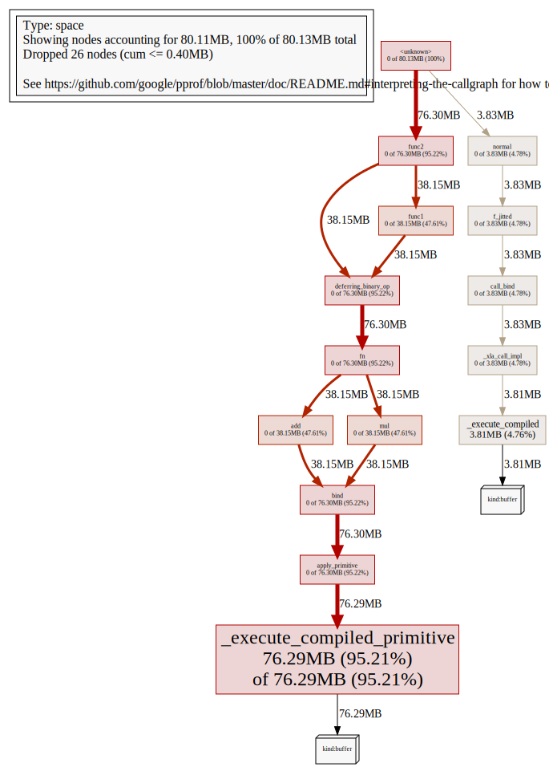
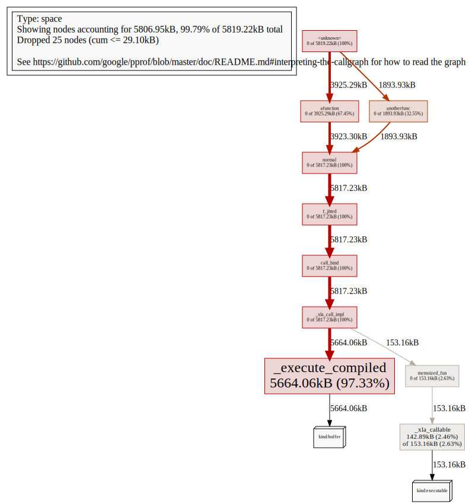
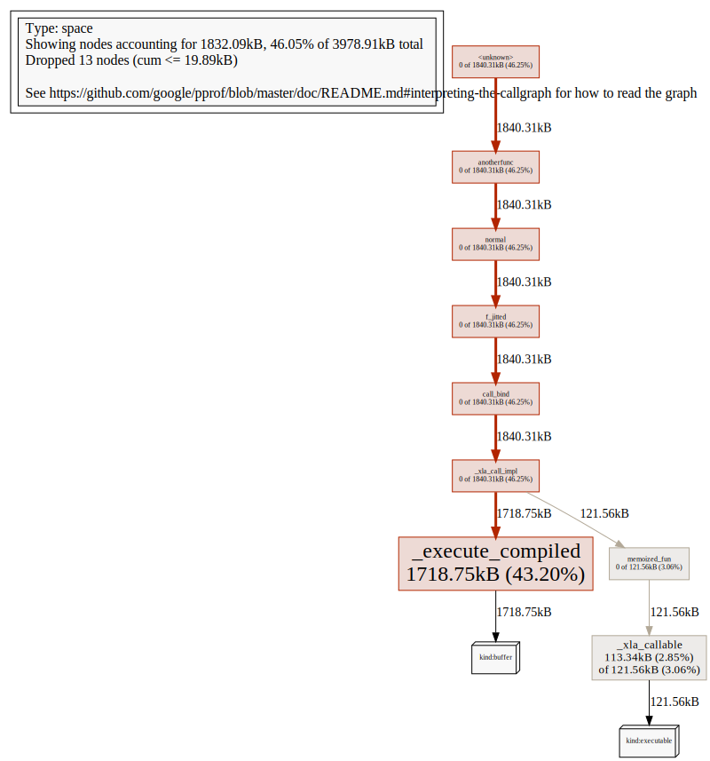

# Device Memory Profiling

The JAX Device Memory Profiler allows us to explore how and why JAX programs are
using GPU or TPU memory. For example, it can be used to:

* Figure out which arrays and executables are in GPU memory at a given time, or
* Track down memory leaks.

## Installation

The JAX device memory profiler emits output that can be interpreted using
pprof (<https://github.com/google/pprof>). Start by installing `pprof`,
by following its
[installation instructions](https://github.com/google/pprof#building-pprof).
At the time of writing, installing `pprof` requires first installing
[Go](https://golang.org/) and [Graphviz](http://www.graphviz.org/), and then
running

```shell
go get -u github.com/google/pprof
```

which installs `pprof` as `$GOPATH/bin/pprof`, where `GOPATH` defaults to
`~/go`.

```{note}
The version of `pprof` from <https://github.com/google/pprof> is not the same as
the older tool of the same name distributed as part of the `gperftools` package.
The `gperftools` version of `pprof` will not work with JAX.
```

## Understanding how a JAX program is using GPU or TPU memory

A common use of the device memory profiler is to figure out why a JAX program is
using a large amount of GPU or TPU memory, for example if trying to debug an
out-of-memory problem.

To capture a device memory profile to disk, use
{func}`jax.profiler.save_device_memory_profile`. For example, consider the
following Python program:

```python
import jax
import jax.numpy as jnp
import jax.profiler

def func1(x):
  return jnp.tile(x, 10) * 0.5

def func2(x):
  y = func1(x)
  return y, jnp.tile(x, 10) + 1

x = jax.random.normal(jax.random.PRNGKey(42), (1000, 1000))
y, z = func2(x)

z.block_until_ready()

jax.profiler.save_device_memory_profile("memory.prof")
```

If we first run the program above and then execute

```shell
pprof --web memory.prof
```

`pprof` opens a web browser containing the following visualization of the device
memory profile in callgraph format:



The callgraph is a visualization of
the Python stack at the point the allocation of each live buffer was made.
For example, in this specific case, the visualization shows that
`func2` and its callees were responsible for allocating 76.30MB, of which
38.15MB was allocated inside the call from `func1` to `func2`.
For more information about how to interpret callgraph visualizations, see the
[pprof documentation](https://github.com/google/pprof/blob/master/doc/README.md#interpreting-the-callgraph).

Functions compiled with {func}`jax.jit` are opaque to the device memory profiler.
That is, any memory allocated inside a `jit`-compiled function will be
attributed to the function as whole.

In the example, the call to `block_until_ready()` is to ensure that `func2`
completes before the device memory profile is collected. See
{doc}`async_dispatch` for more details.

## Debugging memory leaks

We can also use the JAX device memory profiler to track down memory leaks by using
`pprof` to visualize the change in memory usage between two device memory profiles
taken at different times. For example consider the following program which
accumulates JAX arrays into a constantly-growing Python list.

```python
import jax
import jax.numpy as jnp
import jax.profiler

def afunction():
  return jax.random.normal(jax.random.PRNGKey(77), (1000000,))

z = afunction()

def anotherfunc():
  arrays = []
  for i in range(1, 10):
    x = jax.random.normal(jax.random.PRNGKey(42), (i, 10000))
    arrays.append(x)
    x.block_until_ready()
    jax.profiler.save_device_memory_profile(f"memory{i}.prof")

anotherfunc()
```

If we simply visualize the device memory profile at the end of execution
(`memory9.prof`), it may not be obvious that each iteration of the loop in
`anotherfunc` accumulates more device memory allocations:

```shell
pprof --web memory9.prof
```



The large but fixed allocation inside `afunction` dominates the profile but does
not grow over time.

By using `pprof`'s
[`--diff_base` feature](https://github.com/google/pprof/blob/master/doc/README.md#comparing-profiles) to visualize the change in memory usage
across loop iterations, we can identify why the memory usage of the
program increases over time:

```shell
pprof --web --diff_base memory1.prof memory9.prof
```



The visualization shows that the memory growth can be attributed to the call to
`normal` inside `anotherfunc`.