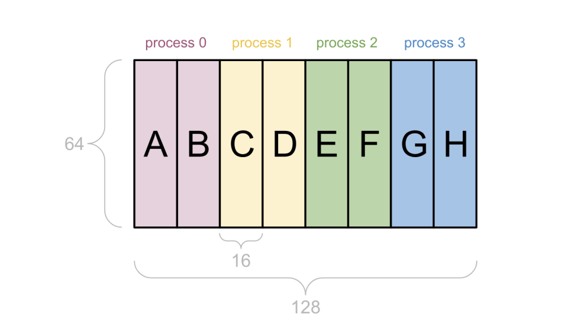
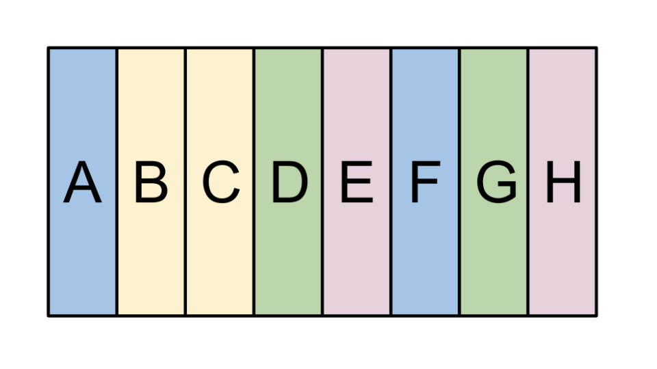
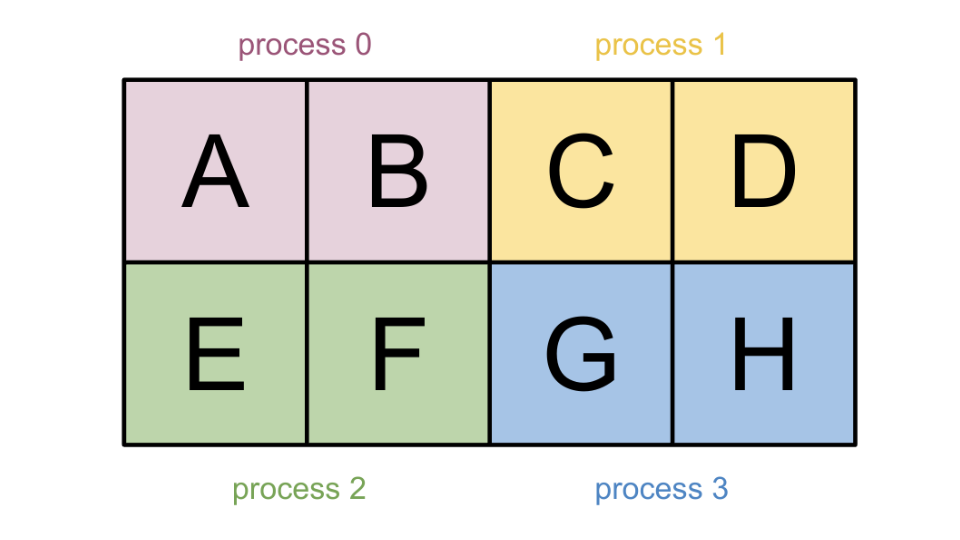
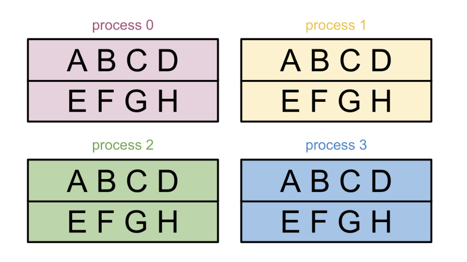
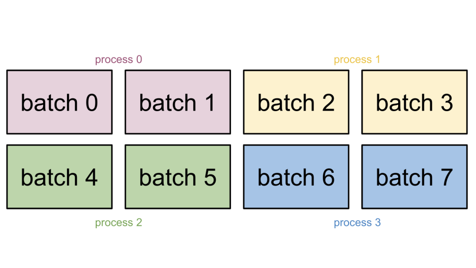
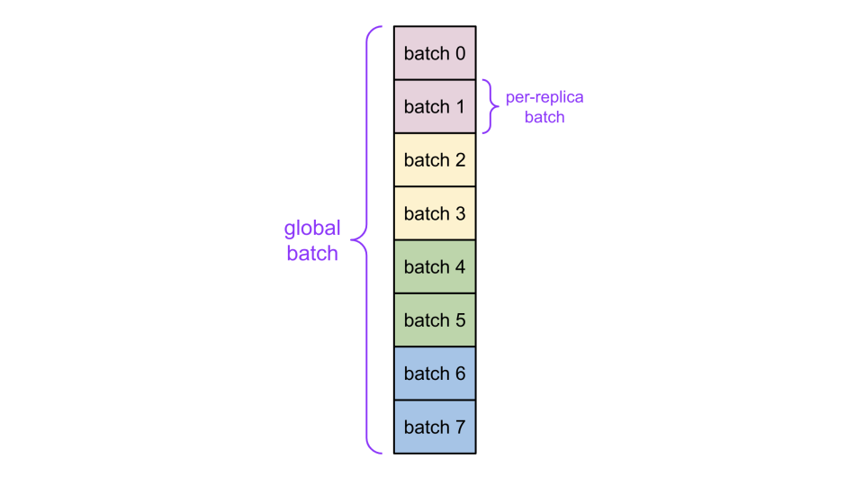
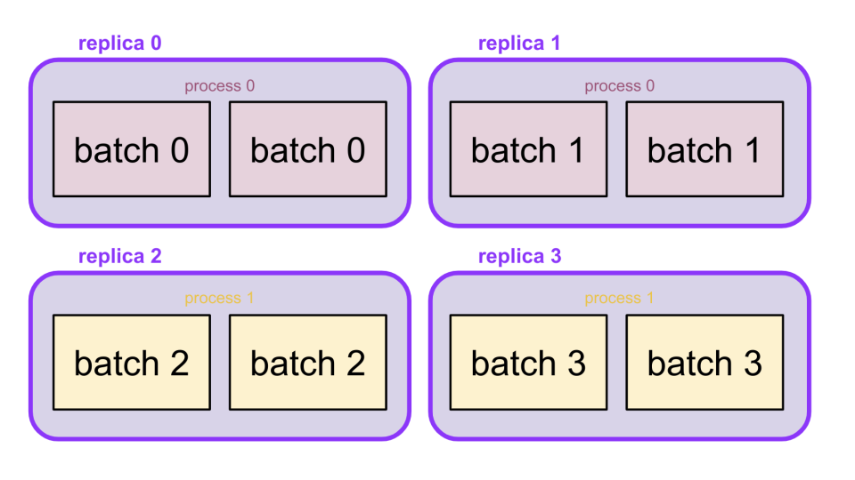
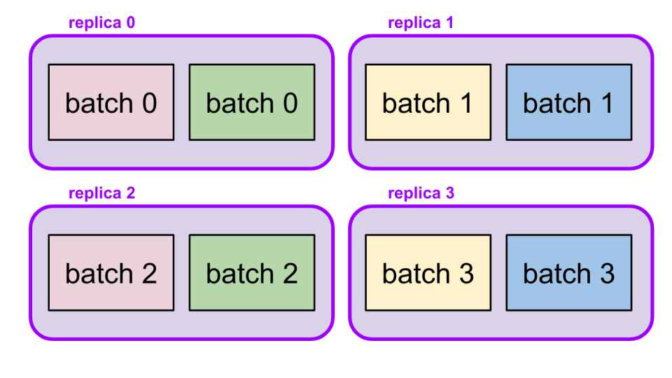
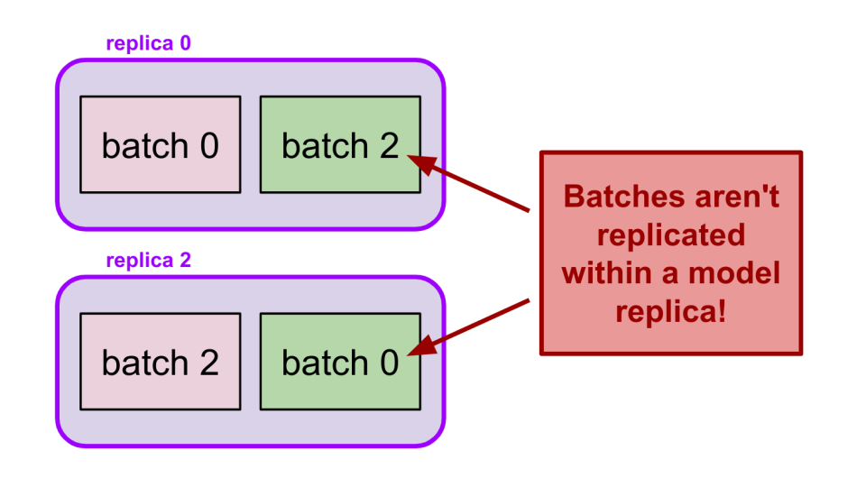

---
jupytext:
  formats: md:myst
  text_representation:
    extension: .md
    format_name: myst
    format_version: 0.13
    jupytext_version: 1.16.4
kernelspec:
  display_name: Python 3
  language: python
  name: python3
---

# Distributed data loading

<!--* freshness: { reviewed: '2024-05-16' } *-->

This high-level guide demonstrates how you can perform distributed data loading — when you run JAX in a {doc}`multi-host or multi-process environment <./multi_process>`, and the data required for the JAX computations is split across the multiple processes. This document covers the overall approach for how to think about distributed data loading, and then how to apply it to *data-parallel* (simpler) and *model-parallel* (more complicated) workloads.

Distributed data loading is usually more efficient (the data is split across processes) but also *more complex* compared with its alternatives, such as: 1) loading the *full global data in a single process*, splitting it up and sending the needed parts to the other processes via RPC; and 2) loading the *full global data in all processes* and only using the needed parts in each process. Loading the full global data is often simpler but more expensive. For example, in machine learning the training loop can get blocked while waiting for data, and additional network bandwidth gets used per each process.

```{note}
When using distributed data loading, it's important that each device (for example, each GPU or TPU) has access to the input data shard(s) that it needs to run the computation. This is what usually makes distributed data loading more complicated and challenging to implement correctly (compared with the alternatives described above). If the incorrect data shards end up on the wrong devices, the computation can still run without errors, since the computation has no way to know what the input data "should" be. However, the final result will often be incorrect, since the input data was different than intended.
```

## General approach for loading a `jax.Array`

Consider a case of creating a single {class}`jax.Array` from raw data not produced by JAX. These concepts apply beyond loading batched data records, such as any multi-process {class}`jax.Array` that wasn't directly produced by a JAX computation. Examples include: 1) loading model weights from a checkpoint; or 2) loading a large spatially-sharded image.

Every {class}`jax.Array` has an associated {mod}`~jax.sharding.Sharding`, which describes which shard of the global data is required by each global device. When you create a {class}`jax.Array` from scratch, you also need to create its `Sharding`. This is how JAX can understand how the data is laid out across devices. You can create whatever `Sharding` you want. In practice, you usually pick a `Sharding` based on what kind of parallelism strategy you are implementing (you will learn more about data and model parallelism in more detail later in this guide). You can also pick a `Sharding` based on how the raw data will be produced within each process.

Once you have defined a {mod}`~jax.sharding.Sharding`, you can use {func}`~jax.sharding.Sharding.addressable_devices()` to provide a list of devices needed to load data for within the current process. (Note: The term "addressable devices" is a more general version of "local devices". The goal is to make sure that each process's data loader provides the right data to all of that process' local devices.

### Examples

For example, consider a `(64, 128)` {class}`jax.Array` that you need to shard across 4 processes with 2 devices each (8 devices total). This will result in 8 unique data shards, one for each device. There are many ways to shard this {class}`jax.Array`. You can perform a 1D sharding across the second dimension of the {class}`jax.Array`, giving each device a `(64, 16)` shard, as demonstrated below:

<center>



</center>

In the above figure, each data shard has its own color to indicate which process needs to load that shard. For example, you assume process `0`'s 2 devices contain shards `A` and `B`, corresponding to the first `(64, 32)` piece of the global data.

You can pick a different distribution of shards to devices. For example:

<center>



</center>

Here is another example — a 2D sharding:

<center>



</center>

However the {class}`jax.Array` happens to be sharded, you have to make sure that each process's data loader is provided with/loads the required shard(s) of the global data. There are several high-level methods for achieving this: 1) load the global data in each process; 2) use a per-device data pipeline; 3) use a consolidated per-process data pipeline; 4) load data in some convenient way and then reshard inside computation.

### Option 1: Load the global data in each process

<center>


</center>

Using this option, each process:

1) Loads the full value needed; and
2) Transfers only the needed shards to that process's local devices.

This is not an efficient approach to distributed data loading, since each process will throw away the data not needed by its local devices, and the total data ingested can be higher than necessary. But this option works and is relatively simple to implement, while the performance overhead may be acceptable for certain workloads (for example, if the global data is small).

### Option 2: Use a per-device data pipeline

<center>


</center>

In this option, each process sets up a data loader for each of its local devices (that is, each device gets its own data loader for just the data shard it requires).

This is efficient in terms of the data loaded. It can also sometimes be simpler to consider each device independently rather than all of a process's local devices at once (refer to _Option 3: Use a consolidated per-process data pipeline_ below). However, having multiple concurrent data loaders can sometimes cause performance issues.

### Option 3: Use a consolidated per-process data pipeline

<center>


</center>

If you choose this option, each process:

1) Sets up a single data loader that loads the data required for all of its local devices; and then
2) Shards the local data before transferring to each local device.

This is the *most efficient way to do distributed loading*. However, it's also the *most complex*, since logic is needed both to figure out which data is needed by each device, and to create a single data loading that loads only all of that data (and, ideally, no other extra data).

### Option 4: Load data in some convenient way, reshard inside computation

<center>


</center>

This option is more challenging to explain, but often easier to implement than the above options (from 1 to 3).

Imagine a scenario where it's difficult or rather impossible to set up data loaders that load exactly the data you need, either for per-device or per-process loaders. However, it may still be possible to set up a data loader per process that loads `1 / num_processes` of the data, just not in the right sharding.

Then, continuing with your 2D example sharding from before, assume it is easier for each process to load a single column of the data:

Then, you can create a {class}`jax.Array` with a {mod}`~jax.sharding.Sharding` representing the per-column data, pass that directly into the computation, and use {func}`jax.lax.with_sharding_constraint` to immediately reshard the column-sharded input to the desired sharding. And since the data is resharded inside the computation, it will be resharded over the accelerator communication links (for example, TPU ICI or NVLink).

This Option 4 has similar benefits to Option 3 (_Use a consolidated per-process data pipeline_):

- Each process still has a single data loader; and
- The global data is loaded exactly once across all processes; and
- The global data has the additional benefit of offering more flexibility in how the data is loaded.

However, this approach uses accelerator interconnect bandwidth to perform the resharding, which may slow down certain workloads. Option 4 also requires that the input data be expressed as a separate `Sharding`, in addition to the target `Sharding`.

## Replication

Replication describes a process where multiple devices have the same data shard. The general options mentioned above (Options 1 through 4) still work with replication. The only difference is that some processes may end up loading the same data shards. This section describes full replication and partial replication.

###  Full replication

**Full replication** is a process where all devices have a full copy of the data (that is, the data "shard" is the entire array value).

In the below example, since there are 8 devices in total (2 per process), you will end up with 8 copies of the full data. Each copy of the data is unsharded, that is the copy lives on a single device:

<center>


</center>

###  Partial replication

**Partial replication** describes a process where there are multiple copies of the data, and each copy is sharded across multiple devices. For a given array value, there are generally many possible ways to perform partial replication (Note: There is always a single fully-replicated {mod}`~jax.sharding.Sharding` for a given array shape).

Below are two possible examples.

In the first example below, each copy is sharded across the two local devices of a process, for a total of 4 copies. This means that each process will need to load the full global data, since its local devices will have a full copy of the data.

<center>



</center>

In the second example below, each copy is still sharded across two devices, but each device pair is spread across two different processes. Process `0` (pink) and process `1` (yellow) both need to load just the first row of the data, and process `2` (green) and process `3` (blue) both need to load just the second row of the data:

<center>


</center>

Now that you've gone over the high-level options for creating a {class}`jax.Array`, let's apply them to data loading for ML applications.

## Data parallelism

In *pure data parallelism* (without model parallelism):

- You replicate the model on each device; and
- Each model replica (that is, each device) receives a different per-replica batch of data.

<center>



</center>

When representing the input data as a single {class}`jax.Array`, the Array contains the data across all replicas for this step (this is called *global batch*), with each shard of the {class}`jax.Array` containing a single per-replica batch. You can represent this as a 1D sharding across all devices (check the example below) — in other words, the global batch is composed of all the per-replica batches concatenated together across the batch axis.

<center>



</center>

Applying this framework, you may conclude that process `0` should get the first quarter (2 out of 8) of the global batch, while process `1` should get the second, and so on.

But how can you know what the first quarter is? And how do you make sure process `0` gets the first quarter? Luckily, there's a very important trick about data parallelism that means you don't have to answer these questions and makes the whole setup simpler.

## Important trick about data parallelism

The trick is you don't need to care which per-replica batch lands on which replica. Therefore, it doesn't matter which process loads a batch. The reason is that since each device corresponds to a model replica performing the same thing, it doesn't matter which device gets which per-replica batch within the global batch.

What this means is that you are free to rearrange the per-replica batches within the global batch. In other words, you are free to randomize which data shard each device gets.

For example:

<center>


</center>

Usually, rearranging the data shards of a {class}`jax.Array`, as demonstrated above, is not a good idea – you're effectively permuting the value of the {class}`jax.Array`! However, for data parallelism, the global batch order isn't meaningful, and you are free to rearrange the per-replica batches in the global batch, as already mentioned before.

This simplifies data loading because it means each device just needs an independent stream of per-replica batches, which can be easily implemented in most data loaders by creating an independent pipeline per process and chunking the resulting per-process batch into per-replica batches.

<center>


</center>

This is an instance of the _Option 2: Consolidated per-process data pipeline_. You can also use other options (such as 0, 1 and 3, which are covered earlier in this document), but this one is relatively simple and efficient.

Here's an example of how to implement this setup using tf.data:

```{code-cell}
import jax
import tensorflow as tf
import numpy as np

################################################################################
# Step 1: setup the Dataset for pure data parallelism (do once)
################################################################################
# Fake example data (replace with your Dataset)
ds = tf.data.Dataset.from_tensor_slices(
    [np.ones((16, 3)) * i for i in range(100)])

ds = ds.shard(num_shards=jax.process_count(), index=jax.process_index())

################################################################################
# Step 2: create a jax.Array of per-replica batches from the per-process batch
# produced from the Dataset (repeat every step). This can be used with batches
# produced by different data loaders as well!
################################################################################
# Grab just the first batch from the Dataset for this example
per_process_batch = ds.as_numpy_iterator().next()

mesh = jax.make_mesh((jax.device_count(),), ('batch',))
sharding = jax.NamedSharding(mesh, jax.sharding.PartitionSpec('batch'))
global_batch_array = jax.make_array_from_process_local_data(
    sharding, per_process_batch)
```

## Data + model parallelism

In **model parallelism** you shard each model replica across multiple devices. If you use **pure model parallelism** (without data parallelism):

- There's just one model replica sharded across all devices; and
- The data is (usually) fully replicated across all devices.

This guide considers a case where you use **both data and model parallelism**:

- You shard each of the multiple model replicas over multiple devices; and
- You partially replicate the data over each model replica — each device in the same model replica gets the same per-replica batch, and devices across model replicas get different per-replica batches.

### Model parallelism within a process

For the purposes of data loading, the simplest approach can be to shard each model replica within the local devices of a single process.

For this example, let's switch to 2 processes with 4 devices each (instead of 4 processes with 2 devices each). Consider a scenario where each model replica is sharded over the 2 local devices of a single process. This results in 2 model replicas per process and 4 model replicas total, as demonstrated below:

<center>



</center>

Here, once again, the input data is represented as a single {class}`jax.Array` with a 1D sharding where each shard is a per-replica batch with an exception:

- Unlike in the pure data parallelism case, you introduce partial replication and make 2 copies of the 1D-sharded global batch.
- This is because each model replica is composed of 2 devices that each need a copy of the per-replica batch.

<center>


</center>

Keeping each model replica within a single process can make things simpler because you can reuse the pure data parallelism setup described above, except you also need to replicate the per-replica batches:

<center>


</center>

```{note}
_It's also very important to replicate the per-replica batches to the correct devices!_ While the very important trick about data parallelism means you don't care which batch ends up on which replica, *you do care that a single replica only gets a single batch*.
```

For example, this is OK:

<center>


</center>

However, if you’re not careful about which local device you load each batch onto, you may accidentally create unreplicated data, even though the {mod}`~jax.sharding.Sharding` (and the parallelism strategy) says the data is replicated:

<center>


</center>

JAX will raise an error if you accidentally create a {class}`jax.Array` with unreplicated data that should be replicated within a single process (this isn't always true for model parallelism across processes though; see the next section).

Here's an example of how to implement per-process model parallelism and data parallelism using `tf.data`:

```{code-cell}
import jax
import tensorflow as tf
import numpy as np

################################################################################
# Step 1: Set up the Dataset with a different data shard per-process (do once)
#         (same as for pure data parallelism)
################################################################################
# Fake example data (replace with your Dataset)
per_process_batches = [np.ones((16, 3)) * i for i in range(100)]
ds = tf.data.Dataset.from_tensor_slices(per_process_batches)

ds = ds.shard(num_shards=jax.process_count(), index=jax.process_index())

################################################################################
# Step 2: Create a jax.Array of per-replica batches from the per-process batch
# produced from the Dataset (repeat every step)
################################################################################
# Grab just the first batch from the Dataset for this example
per_process_batch = ds.as_numpy_iterator().next()

num_model_replicas_per_process = 2 # set according to your parallelism strategy
num_model_replicas_total = num_model_replicas_per_process * jax.process_count()

# Create an example `Mesh` for per-process data parallelism. Make sure all devices
# are grouped by process, and then resize so each row is a model replica.
mesh_devices = np.array([jax.local_devices(process_idx)
                         for process_idx in range(jax.process_count())])
mesh_devices = mesh_devices.reshape(num_model_replicas_total, -1)
# Double check that each replica's devices are on a single process.
for replica_devices in mesh_devices:
  num_processes = len(set(d.process_index for d in replica_devices))
  assert num_processes == 1
mesh = jax.sharding.Mesh(mesh_devices, ["model_replicas", "data_parallelism"])

# Shard the data across model replicas. You don't shard across the
# data_parallelism mesh axis, meaning each per-replica shard will be replicated
# across that axis.
sharding = jax.sharding.NamedSharding(
    mesh, jax.sharding.PartitionSpec("model_replicas"))

global_batch_array = jax.make_array_from_process_local_data(
    sharding, per_process_batch)
```

### Model parallelism across processes

It can get more interesting when model replicas are spread across processes, either:

- Because a single replica can't fit within a process; or
- Because the device assignment just isn't set up that way.

For example, going back to the previous setup of 4 processes with 2 devices each, if you assign devices to replicas like so:

<center>



</center>

This is the same parallelism strategy as the previous per-process model parallelism example – 4 model replicas each sharded across 2 devices. The only difference is the device assignment – each replica's two devices are split across different processes, and each process is only responsible for one copy of each per-replica batch (but for two replicas).

Splitting the model replicas across processes like this may seem like an arbitrary and unnecessary thing to do (and in this example it arguably is), but actual deployments may end up with this kind of device assignment to best take advantage of the communication links between devices.

Data loading now becomes more complicated because some extra coordination is required across processes. In the pure data parallelism and per-process model parallelism cases, it was only important that each process loaded a unique data stream. Now certain processes must load the same data, and some must load different data. In the above example, processes `0` and `2` (in colors pink and green, respectively) must load the same 2 per-replica batches, and processes `1` and `3` (colors yellow and blue, respectively) must also  load the same 2 per-replica batches (but different from process `0` and `2`'s batches).

Furthermore, it's important that each process doesn't mix up its 2 per-replica batches. While you don't care which batch lands on which replica (the very important trick about data parallelism), you need to care that all the devices in a replica get the same batch. For example, this would be bad:

<center>



</center>

```{note}
As of August 2023, JAX cannot detect if {class}`jax.Array` shards across processes are supposed to be replicated but aren't, and will produce wrong results when the computation is run. So be careful not to do this!
```

To get the correct per-replica batch on each device, you need to represent the global input data as the following {class}`jax.Array`:

<center>


</center>
