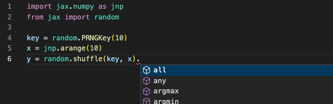

# Type Annotation Roadmap for JAX

- *Author: jakevdp*

- *Date: August 2022*

## Background

Python 3.0 introduced optional function annotations ([PEP 3107](https://peps.python.org/pep-3107/)), which were later codified for use in static type checking around the release of Python 3.5 ([PEP 484](https://peps.python.org/pep-0484/)).
To some degree, type annotations and static type checking have become an integral part of many Python development workflows, and to this end we have added annotations in a number of places throughout the JAX API.
The current state of type annotations in JAX is a bit patchwork, and efforts to add more have been hampered by more fundamental design questions.
This doc attempts to summarize those issues and generate a roadmap for the goals and non-goals of type annotations in JAX.

Why do we need such a roadmap? Better/more comprehensive type annotations are a frequent request from users, both internally and externally.
In addition, we frequently receive pull requests from external users (for example, [PR #9917](https://github.com/jax-ml/jax/pull/9917), [PR #10322](https://github.com/jax-ml/jax/pull/10322)) seeking to improve JAX's type annotations: it's not always clear to the JAX team member reviewing the code whether such contributions are beneficial, particularly when they introduce complex Protocols to address the challenges inherent to full-fledged annotation of JAX's use of Python.
This document details JAX's goals and recommendations for type annotations within the package.

## Why type annotations?

There are a number of reasons that a Python project might wish to annotate their code-base; we'll summarize them in this document as Level 1, Level 2, and Level 3.

### Level 1: Annotations as documentation

When originally introduced in [PEP 3107](https://peps.python.org/pep-3107/), type annotations were motivated partly by the ability to use them as concise, inline documentation of function parameter types and return types. JAX has long utilized annotations in this manner; an example is the common pattern of creating type names aliased to `Any`. An example can be found in `lax/slicing.py` [[source](https://github.com/jax-ml/jax/blob/2bc3e39cd9104071ee39dacac22abd51b94eb27e/jax/_src/lax/slicing.py#L47-L58)]:

```python
Array = Any
Shape = core.Shape

def slice(operand: Array, start_indices: Sequence[int],
          limit_indices: Sequence[int],
          strides: Optional[Sequence[int]] = None) -> Array:
  ...
```

For the purposes of static type checking, this use of `Array = Any` for array type annotations puts no constraint on the argument values (`Any` is equivalent to no annotation at all), but it does serve as a form of useful in-code documentation for the developer.

For the sake of generated documentation, the name of the alias gets lost (the [HTML docs](https://docs.jax.dev/en/latest/_autosummary/jax.lax.slice.html) for `jax.lax.slice` report operand as type `Any`), so the documentation benefit does not go beyond the source code (though we could enable some `sphinx-autodoc` options to improve this: See [autodoc_type_aliases](https://www.sphinx-doc.org/en/master/usage/extensions/autodoc.html#confval-autodoc_type_aliases)).

A benefit of this level of type annotation is that it is never wrong to annotate a value with `Any`, so it will provide a concrete benefit to developers and users in the form of documentation, without added complexity of satisfying the stricter needs of any particular static type checker.

### Level 2: Annotations for intelligent autocomplete
Many modern IDEs take advantage of type annotations as inputs to [intelligent code completion](https://en.wikipedia.org/wiki/Intelligent_code_completion) systems. One example of this is the [Pylance](https://marketplace.visualstudio.com/items?itemName=ms-python.vscode-pylance) extension for VSCode, which uses Microsoft's [pyright](https://github.com/microsoft/pyright) static type checker as a source of information for VSCode's [IntelliSense](https://code.visualstudio.com/docs/editor/intellisense) completions.

This use of type checking requires going further than the simple aliases used above; for example, knowing that the `slice` function returns an alias of `Any` named `Array` does not add any useful information to the code completion engine. However, were we to annotate the function with a `DeviceArray` return type, the autocomplete would know how to populate the namespace of the result, and thus be able to suggest more relevant autocompletions during the course of development.

JAX has begun to add this level of type annotation in a few places; one example is the `jnp.ndarray` return type within the `jax.random` package [[source](https://github.com/jax-ml/jax/blob/2bc3e39cd9104071ee39dacac22abd51b94eb27e/jax/_src/random.py#L359)]:

```python
def shuffle(key: KeyArray, x: Array, axis: int = 0) -> jnp.ndarray:
  ...
```

In this case `jnp.ndarray` is an abstract base class that forward-declares the attributes and methods of JAX arrays ([see source](https://github.com/jax-ml/jax/blob/2bc3e39cd9104071ee39dacac22abd51b94eb27e/jax/_src/numpy/ndarray.py#L41)), and so Pylance in VSCode can offer the full set of autocompletions on results from this function. Here is a screenshot showing the result:



Listed in the autocomplete field are all methods and attributes declared by the abstract `ndarray` class.
We'll discuss further below why it was necessary to create this abstract class rather than annotating with `DeviceArray` directly.

### Level 3: Annotations for static type-checking

These days, static type-checking often is the first thing people think of when considering the purpose of type annotations in Python code.
While Python does not do any runtime checking of types, several mature static type checking tools exist that can do this as part of a CI test suite.
The most important ones for JAX are the following:

- [python/mypy](https://github.com/python/mypy) is more or less the standard in the open Python world. JAX currently runs mypy on a subset of source files within the Github Actions CI checks.
- [google/pytype](https://github.com/google/pytype) is Google's static type checker, and projects which depend on JAX within Google frequently use this.
- [microsoft/pyright](https://github.com/microsoft/pyright) is important as the static type checker used within VSCode for the Pylance completions mentioned previously.

Full static type checking is the strictest of all the type annotation applications, because it will surface an error any time your type annotations are not precisely correct.
On the one hand, this is nice because your static type analysis may catch faulty type annotations (for example, a case where a `DeviceArray` method is missing from the `jnp.ndarray` abstract class).

On the other hand, this strictness can make the type checking process very brittle in packages that often rely on duck-typing rather than strict type-safe APIs.
You'll currently find code comments like `#type: ignore` (for mypy) or `#pytype: disable` (for pytype) peppered throughout the JAX codebase in several hundred places.
These typically represent cases where typing problems have arisen; they may be inaccuracies in JAX type annotations, or inaccuracies in the static type checker's ability to correctly follow the control flow in the code.
On occasion, they are due to real & subtle bugs in the behavior of pytype or mypy.
In rare cases, they may be due to the fact that JAX uses Python patterns that are difficult or even impossible to express in terms of Python's static type annotation syntax.

## Type annotation challenges for JAX

JAX currently has type annotations that are a mixture of different styles, and aimed at all three levels of type annotation discussed above.
Partly, this comes from the fact that JAX's source code poses a number of unique challenges for Python's type annotation system. We'll outline them here.

### Challenge 1: pytype, mypy and developer friction

One challenge JAX currently faces is that package development must satisfy the constraints of two different static type checking systems, `pytype` (used by internal CI and internal Google projects) and `mypy` (used by external CI and external dependencies).
Although the two type checkers have broad overlap in their behavior, each presents its own unique corner cases, as evidenced by the numerous `#type: ignore` and `#pytype: disable` statements throughout the JAX codebase.

This creates friction in development: internal contributors may iterate until tests pass, only to find that on export their pytype-approved code falls afoul of mypy.
For external contributors, it's often the opposite: a recent example is {jax-issue}`#9596` which had to be rolled-back after it failed internal Google pytype checks.
Each time we move a type annotation from Level 1 (`Any` everywhere) to Level 2 or 3 (stricter annotations), it introduces more potential for such frustrating developer experiences.

### Challenge 2: array duck-typing

One particular challenge for annotating JAX code is its heavy use of duck-typing. An input to a function marked `Array` in general could be one of many different types: a JAX `DeviceArray`, a NumPy `np.ndarray`, a NumPy scalar, a Python scalar, a Python sequence, an object with an `__array__` attribute, an object with a `__jax_array__` attribute, or any flavor of `jax.Tracer`.
For this reason, simple annotations like `def func(x: DeviceArray)` will not be sufficient, and will lead to false positives for many valid uses.
This means that type annotations for JAX functions will not be short or trivial, but we would have to effectively develop a set of JAX-specific typing extensions similar to those in the [`numpy.typing` package](https://github.com/numpy/numpy/blob/main/numpy/_typing/_array_like.py).

### Challenge 3: transformations and decorators

JAX's Python API relies heavily on function transformations ({func}`~jax.jit`, {func}`~jax.vmap`, {func}`~jax.grad`, etc.), and this type of API poses a particular challenge for static type analysis.
Flexible annotation for decorators has been a [long-standing issue](https://github.com/python/mypy/issues/1927) in the mypy package, which was only recently resolved by the introduction of `ParamSpec`, discussed in [PEP 612](https://peps.python.org/pep-0612/) and added in Python 3.10.
Because JAX follows [NEP 29](https://numpy.org/neps/nep-0029-deprecation_policy.html), it cannot rely on Python 3.10 features until sometime after mid-2024.
In the meantime, Protocols can be used as a partial solution to this (JAX added this for jit and other methods in {jax-issue}`#9950`) and ParamSpec is possible to use via the `typing_extensions` package (a prototype is in {jax-issue}`#9999`) though this currently reveals fundamental bugs in mypy (see [python/mypy#12593](https://github.com/python/mypy/issues/12593)).
All that to say: it's not yet clear that the API of JAX's function transforms can be suitably annotated within the current constraints of Python type annotation tools.

### Challenge 4: array annotation lack of granularity

Another challenge here is common to all array-oriented APIs in Python, and has been part of the JAX discussion for several years (see {jax-issue}`#943`).
Type annotations have to do with the Python class or type of an object, whereas in array-based languages often the attributes of the class are more important.
In the case of NumPy, JAX, and similar packages, often we would wish to annotate particular array shapes and data types.

For example, the arguments to the `jnp.linspace` function must be scalar values, but in JAX scalars are represented by zero-dimensional arrays.
So in order for annotations to not raise false positives, we must allow these arguments to be *arbitrary* arrays.
Another example is the second argument to `jax.random.choice`, which must have `dtype=int` when `shape=()`.
Python has a plan to enable type annotations with this level of granularity via Variadic Type Generics (see [PEP 646](https://peps.python.org/pep-0646/), slated for Python 3.11) but like `ParamSpec`, support for this feature will take a while to stabilize.

There are some third-party projects that may help in the meantime, in particular [google/jaxtyping](https://github.com/google/jaxtyping), but this uses non-standard annotations and may not be suitable for annotating the core JAX library itself.
All told, the array-type-granularity challenge is less of an issue than the other challenges, because the main effect is that array-like annotations will be less specific than they otherwise could be.

### Challenge 5: imprecise APIs inherited from NumPy

A large part of JAX’s user-facing API is inherited from NumPy within the {mod}`jax.numpy` submodule.
NumPy’s API was developed years before static type checking became part of the Python language, and follows Python’s historic recommendations to use a [duck-typing](https://docs.python.org/3/glossary.html#term-duck-typing)/[EAFP](https://docs.python.org/3/glossary.html#term-EAFP) coding style, in which strict type-checking at runtime is discouraged. As a concrete example of this, consider the {func}`numpy.tile` function, which is defined like this:

```python
def tile(A, reps):
  try:
    tup = tuple(reps)
  except TypeError:
    tup = (reps,)
  d = len(tup)
  ...
```

Here the *intent* is that `reps` would contain either an `int` or a sequence of `int` values, but the *implementation* allows `tup` to be any iterable.
When adding annotations to this kind of duck-typed code, we could take one of two routes:
1. We may choose to annotate the *intent* of the function's API, which here might be something like `reps: Union[int, Sequence[int]]`.
2. Conversely, we may choose to annotate the *implementation* of the function, which here might look something like `reps: Union[ConvertibleToInt, Iterable[ConvertibleToInt]]` where `ConvertibleToInt` is a special protocol that covers the exact mechanism by which our function converts the inputs to integers (i.e. via `__int__`, via `__index__`, via `__array__`, etc.). Note also here that in a strict sense, `Iterable` is not sufficient here because there are objects in Python that duck-type as iterables but do not satisfy a static type check against `Iterable` (namely, an object that is iterable via `__getitem__` rather than `__iter__`.)

The advantage of #1, annotating intent, is that the annotations are more useful to the user in communicating the API contract; while for the developer the flexibility leaves room for refactoring when necessary. The down-side (particularly for gradually-typed APIs like JAX's) is that it's quite likely that user code exists which runs correctly, but would be flagged as incorrect by a type checker.
Gradual typing of an existing duck-typed API means that the current annotation is implicitly `Any`, so changing this to a stricter type may present to users as a breaking change.

Broadly speaking, annotating intent better serves Level 1 type checking, while annotating implementation better serves Level 3, while Level 2 is more of a mixed bag (both intent and implementation are important when it comes to annotations in IDEs).

## JAX type annotation roadmap

With this framing (Level 1/2/3) and JAX-specific challenges in mind, we can begin to develop our roadmap for implementing consistent type annotations across the JAX project.

### Guiding Principles

For JAX type annotation, we will be guided by the following principles:

#### Purpose of type annotations

We would like to support full, *Level 1, 2, and 3* type annotation as far as possible. In particular, this means that we should have restrictive type annotations on both inputs and outputs to public API functions.

#### Annotate for intent

JAX type annotations should in general indicate the **intent** of APIs, rather than the implementation, so that the annotations become useful to communicate the contract of the API. This means that at times inputs that are valid at runtime may not be recognized as valid by the static type checker (one example might be an arbitrary iterator passed in place of a shape that is annotated as `Shape = Sequence[int]`).

#### Inputs should be permissively-typed

Inputs to JAX functions and methods should be typed as permissively as is reasonable: for example, while shapes are typically tuples, functions that accept a shape should accept arbitrary sequences. Similarly, functions that accept a dtype need not require an instance of class `np.dtype`, but rather any dtype-convertible object. This might include strings, built-in scalar types, or scalar object constructors such as `np.float64` and `jnp.float64`. In order to make this as uniform as possible across the package, we will add a {mod}`jax.typing` module with common type specifications, starting with broad categories such as:

- `ArrayLike` would be a union of anything that can be implicitly converted into an array: for example, jax arrays, numpy arrays, JAX tracers, and python or numpy scalars
- `DTypeLike` would be a union of anything that can be implicitly converted into a dtype: for example, numpy dtypes, numpy dtype objects, jax dtype objects, strings, and built-in types.
- `ShapeLike` would be a union of anything that could be converted into a shape: for example, sequences of integer or integer-like objects.
- etc.
  
Note that these will in general be simpler than the equivalent protocols used in {mod}`numpy.typing`. For example, in the case of `DTypeLike`, JAX does not support structured dtypes, so JAX can use a simpler implementation. Similarly, in `ArrayLike`, JAX generally does not support list or tuple inputs in place of arrays, so the type definition will be simpler than the NumPy analog.

#### Outputs should be strictly-typed

Conversely, outputs of functions and methods should be typed as strictly as possible: for example, for a JAX function that returns an array, the output should be annotated with something similar to `jnp.ndarray` rather than `ArrayLike`. Functions returning a dtype should always be annotated `np.dtype`, and functions returning a shape should always be `Tuple[int]` or a strictly-typed NamedShape equivalent. For this purpose, we will implement in {mod}`jax.typing` several strictly-typed analogs of the permissive types mentioned above, namely:

- `Array` or `NDArray` (see below) for type annotation purposes is effectively equivalent to `Union[Tracer, jnp.ndarray]` and should be used to annotate array outputs.
- `DType` is an alias of `np.dtype`, perhaps with the ability to also represent key types and other generalizations used within JAX.
- `Shape` is essentially `Tuple[int, ...]`, perhaps with some additional flexibility to account for dynamic shapes.
- `NamedShape` is an extension of `Shape` that allows for named shapes as used internally in JAX.
- etc.

We will also explore whether the current implementation of `jax.numpy.ndarray` can be dropped in favor of making `ndarray` an alias of `Array` or similar.

#### Err toward simplicity

Aside from common typing protocols gathered in `jax.typing`, we should err on the side of simplicity. We should avoid constructing overly-complex protocols for arguments passed to API functions, and instead use simple unions such as `Union[simple_type, Any]` in the case that the full type specification of the API cannot be succinctly specified. This is a compromise that achieves the goals of Level 1 and 2 annotations, while punting on Level 3 in favor of avoiding unnecessary complexity.

#### Avoid unstable typing mechanisms

In order to not add undue development friction (due to the internal/external CI differences), we would like to be conservative in the type annotation constructs we use: in particular, when it comes to recently-introduced mechanisms such as `ParamSpec` ([PEP 612](https://peps.python.org/pep-0612/)) and Variadic Type Generics ([PEP 646](https://peps.python.org/pep-0646/)), we would like to wait until support in mypy and other tools matures and stabilizes before relying on them.

One impact of this is that for the time being, when functions are decorated by JAX transformations like `jit`, `vmap`, `grad`, etc. JAX will effectively **strip all annotations** from the decorated function. 
While this is unfortunate, at the time of this writing mypy has a laundry-list of incompatibilities with the potential solution offered by `ParamSpec` (see [`ParamSpec` mypy bug tracker](https://github.com/python/mypy/issues?q=is%3Aissue+is%3Aopen++label%3Atopic-paramspec+)), and we therefore judge it as not ready for full adoption in JAX at this time.
We will revisit this question in the future once support for such features stabilizes.

Similarly, for the time being we will avoid adding the more complex & granular array type annotations offered by the [jaxtyping](http://github.com/google/jaxtyping) project. This is a decision we could revisit at a future date.

### `Array` Type Design Considerations

As mentioned above, type annotation of arrays in JAX poses a unique challenge because of JAX's extensive use of duck-typing, i.e. passing and returning `Tracer` objects in place actual arrays within jax transformations.
This becomes increasingly confusing because objects used for type annotation often overlap with objects used for runtime instance checking, and may or may not correspond to the actual type hierarchy of the objects in question.
For JAX, we need to provide duck-typed objects for use in two contexts: **static type annotations** and **runtime instance checks**.

The following discussion will assume that `jax.Array` is the runtime type on-device arrays, which is not yet the case but will be once the work in {jax-issue}`#12016` is complete.

#### Static type annotations
We need to provide an object that can be used for duck-typed type annotations.
Assuming for the moment that we call this object `ArrayAnnotation`, we need a solution which satisfies `mypy` and `pytype` for a case like the following:
```python
@jit
def f(x: ArrayAnnotation) -> ArrayAnnotation:
  assert isinstance(x, core.Tracer)
  return x
```
This could be accomplished via a number of approaches, for example:

- Use a type union: `ArrayAnnotation = Union[Array, Tracer]`
- Create an interface file that declares `Tracer` and `Array` should be treated as subclasses of `ArrayAnnotation`.
- Restructure `Array` and `Tracer` so that `ArrayAnnotation` is a true base class of both.

#### Runtime instance checks
We also must provide an object that can be used for duck-typed runtime `isinstance` checks.
Assuming for the moment that we call this object `ArrayInstance`, we need a solution that passes the following runtime check:
```python
def f(x):
  return isinstance(x, ArrayInstance)
x = jnp.array([1, 2, 3])
assert f(x)       # x will be an array
assert jit(f)(x)  # x will be a tracer
```
Again, there are a couple mechanisms that could be used for this:

- override `type(ArrayInstance).__instancecheck__` to return `True` for both `Array` and `Tracer` objects; this is how `jnp.ndarray` is currently implemented ([source](https://github.com/jax-ml/jax/blob/jax-v0.3.17/jax/_src/numpy/ndarray.py#L24-L49)).
- define `ArrayInstance` as an abstract base class and dynamically register it to `Array` and `Tracer`
- restructure `Array` and `Tracer` so that `ArrayInstance` is a true base class of both `Array` and `Tracer`

A decision we need to make is whether `ArrayAnnotation` and `ArrayInstance` should be the same or different objects. There is some precedent here; for example in the core Python language spec, `typing.Dict` and `typing.List` exist for the sake of annotation, while the built-in `dict` and `list` serve the purposes of instance checks.
However, `Dict` and `List` are [deprecated](https://peps.python.org/pep-0585/#implementation) in newer Python versions in favor of using `dict` and `list` for both annotation and instance checks.

#### Following NumPy's lead

In NumPy's case, `np.typing.NDArray` serves the purpose of type annotations, while `np.ndarray` serves the purpose of instance checks (as well as array type identity).
Given this, it may be reasonable to conform to NumPy's precedent and implement the following:

- `jax.Array` is the actual type of on-device arrays.
- `jax.typing.NDArray` is the object used for duck-typed array annotations.
- `jax.numpy.ndarray` is the object used for duck-typed array instance checks.

This might feel somewhat natural to NumPy power-users, however this trifurcation would likely be a source of confusion: the choice of which to use for instance checks and annotations is not immediately clear.

#### Unifying instance checks and annotation

Another approach would be to unify type checking and annotation via override mechanisms mentioned above.

##### Option 1: Partial unification
A partial unification might look like this:

- `jax.Array` is the actual type of on-device arrays.
- `jax.typing.Array` is the object used for duck-typed array annotations (via `.pyi` interfaces on `Array` and `Tracer`).
- `jax.typing.Array` is also the object used duck-typed instance checks (via an `__isinstance__` override in its metaclass)

In this approach, `jax.numpy.ndarray` would become a simple alias `jax.typing.Array` for backward compatibility.


##### Option 2: Full unification via overrides
Alternatively, we could opt for full unification via overrides:

- `jax.Array` is the actual type of on-device arrays.
- `jax.Array` is also the object used for duck-typed array annotations (via a `.pyi` interface on `Tracer`)
- `jax.Array` is also the object used for duck-typed instance checks (via an `__isinstance__` override in its metaclass)

Here, `jax.numpy.ndarray` would become a simple alias `jax.Array` for backward compatibility.

##### Option 3: Full unification via class hierarchy
Finally, we could opt for full unification via restructuring of the class hierarchy and replacing duck-typing with OOP object hierarchies:

- `jax.Array` is the actual type of on-device arrays
- `jax.Array` is also the object used for array type annotations, by ensuring that `Tracer` inherits from `jax.Array`
- `jax.Array` is also the object used for instance checks, via the same mechanism

Here `jnp.ndarray` could be an alias for `jax.Array`.
This final approach is in some senses the most pure, but it is somewhat forced from an OOP design standpoint (`Tracer` *is an* `Array`?).

##### Option 4: Partial unification via class hierarchy
We could make the class hierarchy more sensible by making `Tracer` and the class for
on-device arrays inherit from a common base class. So, for example:

- `jax.Array` is a base class for `Tracer` as well as the actual type of on-device arrays,
  which might be `jax._src.ArrayImpl` or similar.
- `jax.Array` is the object used for array type annotations
- `jax.Array` is also the object used for instance checks

Here `jnp.ndarray` would be an alias for `Array`.
This may be purer from an OOP perspective, but compared to Options 2 and 3 it drops the notion
that `type(x) is jax.Array` will evaluate to True.

##### Evaluation

Considering the overall strengths and weaknesses of each potential approach:

- From a user perspective, the unified approaches (options 2 and 3) are arguably best, because they remove the cognitive overhead involved in remembering which objects to use for instance checks or annotations: `jax.Array` is all you need to know.
- However, both options 2 and 3 introduce some strange and/or confusing behavior. Option 2 depends on potentially confusing overrides of instance checks, which are [not well supported](https://github.com/pybind/pybind11/issues/2696) for classes defined in pybind11. Option 3 requires `Tracer` to be a subclass array. This breaks the inheritance model, because it would require `Tracer` objects to carry all the baggage of `Array` objects (data buffers, sharding, devices, etc.)
- Option 4 is purer in an OOP sense, and avoids the need for any overrides of typical instance check or type annotation behavior. The tradeoff is that the actual type of on-device arrays becomes something separate (here `jax._src.ArrayImpl`). But the vast majority of users would never have to touch this private implementation directly.

There are different tradeoffs here, but after discussion we've landed on Option 4 as our way forward.

### Implementation Plan

To move forward with type annotations, we will do the following:

1. Iterate on this JEP doc until developers and stakeholders are bought-in.

2. Create a private `jax._src.typing` (not providing any public APIs for now) and put in it the first level of simple types mentioned above:

   - Alias `Array = Any` for the time being, as this will take a bit more thought.
   - `ArrayLike`: a Union of types valid as inputs to normal `jax.numpy` functions
   - `DType` / `DTypeLike` (Note: numpy uses camel-cased `DType`; we should follow this convention for ease of use)
   - `Shape` / `NamedShape` / `ShapeLike`

   The beginnings of this are done in {jax-issue}`#12300`.

3. Begin work on a `jax.Array` base class that follows Option 4 from the previous section. Initially this will be defined in Python, and use the dynamic registration mechanism currently found in the `jnp.ndarray` implementation to ensure correct behavior of `isinstance` checks. A `pyi` override for each tracer and array-like class would ensure correct behavior for type annotations. `jnp.ndarray` could then be make into an alias of `jax.Array`

4. As a test, use these new typing definitions to comprehensively annotate functions within `jax.lax` according to the guidelines above.

6. Continue adding additional annotations one module at a time, focusing on public API functions.

5. In parallel, begin re-implementing a `jax.Array` base class in pybind11, so that `ArrayImpl` and `Tracer` can inherit from it. Use a `pyi` definition to ensure static type checkers recognize the appropriate attributes of the class.

7. Once `jax.Array` and `jax._src.ArrayImpl` have fully landed, remove these temporary Python implementations.

8. When all is finalized, create a public `jax.typing` module that makes the above types available to users, along with documentation of annotation best practices for code using JAX.

We will track this work in {jax-issue}`#12049`, from which this JEP gets its number.
