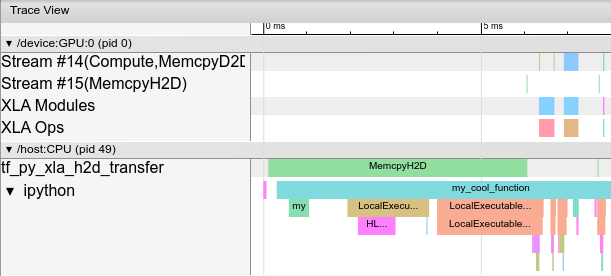
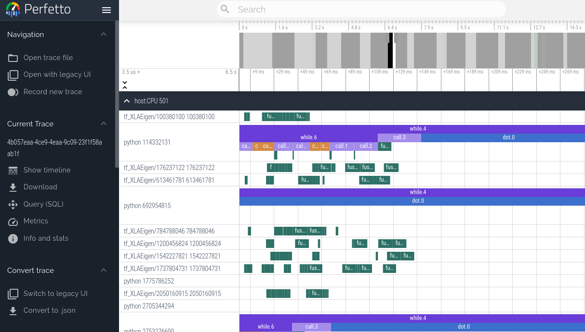
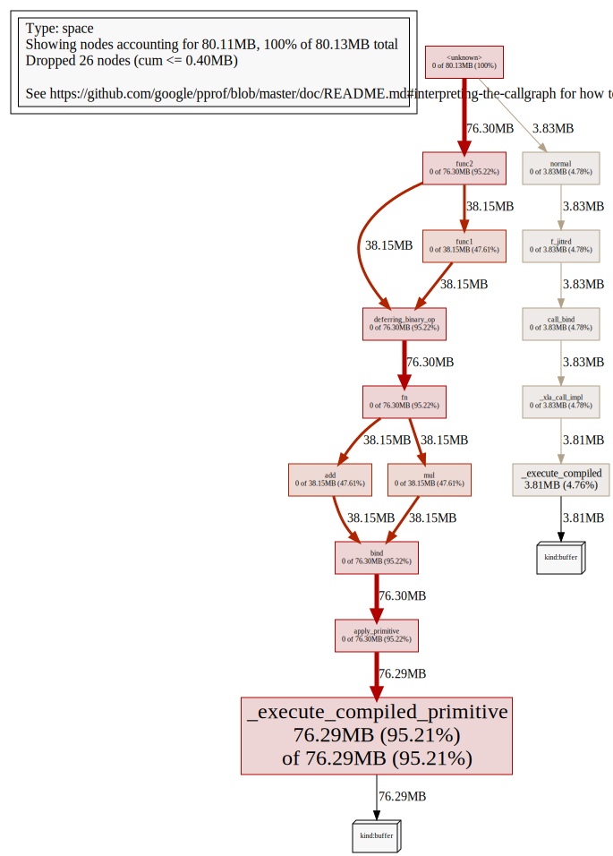
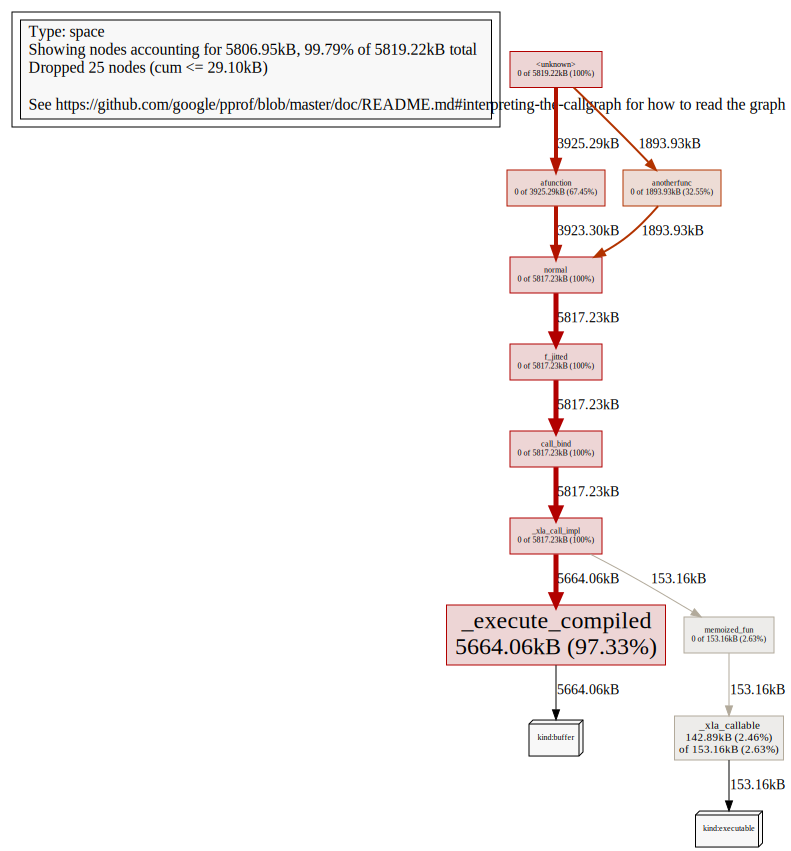
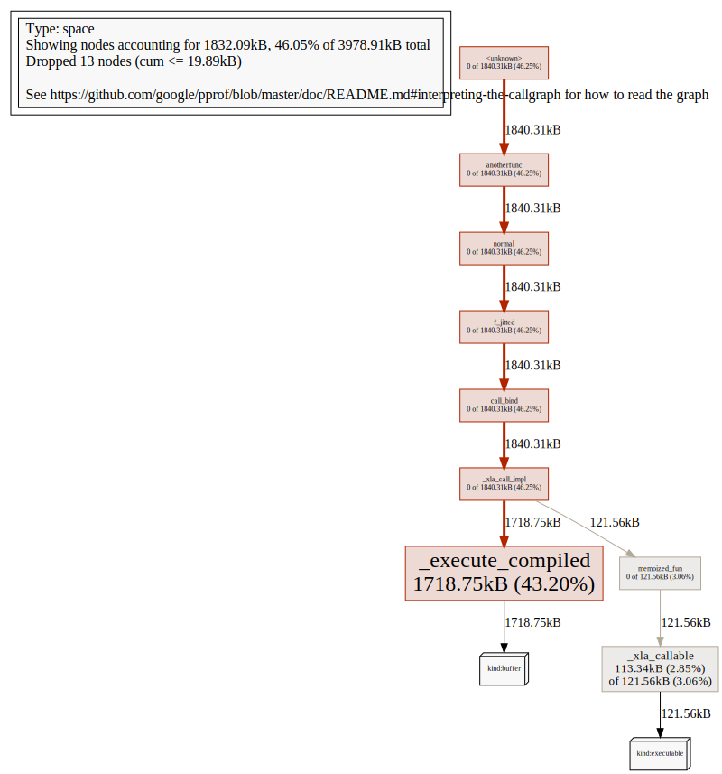

---
jupytext:
  formats: md:myst
  notebook_metadata_filter: nosearch
  text_representation:
    extension: .md
    format_name: myst
    format_version: 0.13
    jupytext_version: 1.16.4
kernelspec:
  display_name: Python 3
  language: python
  name: python3
nosearch: true
---

(jax-201-profiling)=
# Benchmarking and profiling

<!--* freshness: { reviewed: '2026-07-09' } *-->

The golden rule of performance work: measure first. This page covers the three
levels of measurement for JAX programs — *benchmarking* (timing code honestly,
which in JAX takes some care), *profiling computation* (recording a trace of
what actually ran, where, and for how long), and *profiling device memory*
(seeing what's occupying your accelerator's memory, and why). For how JAX
*allocates* GPU memory and what to do about out-of-memory failures, see
{doc}`gpu-memory`.

(jax-201-benchmarking)=
## Benchmarking JAX code

You just ported a tricky function to JAX. Did that actually speed things up?

Keep these JAX-specific behaviors in mind whenever you're timing JAX code,
especially when comparing against any other system:

1. **JAX code is Just-In-Time (JIT) compiled.** Most code written in JAX can be
   written in such a way that it supports JIT compilation, which can make it run
   *much faster* (see {doc}`jit`). To get maximum performance from JAX, you
   should apply {func}`jax.jit` on your outer-most function calls.

   Keep in mind that the first time you run JAX code, it will be slower because
   it is being compiled. This is true even if you don't use `jit` in your own
   code, because JAX's builtin functions are also JIT compiled.
2. **JAX has asynchronous dispatch.** This means that you need to call
   `.block_until_ready()` to ensure that computation has actually happened
   (see {ref}`jax-201-async-dispatch`).
3. **JAX by default only uses 32-bit dtypes.** Be mindful of dtypes when
   making performance comparisons: computing in 64-bit costs more than
   32-bit, so make sure any comparison runs at matched precision (see
   {doc}`/default_dtypes` for controlling JAX's defaults).
4. **Transferring data between CPUs and accelerators takes time.** If you only
   want to measure how long it takes to evaluate a function, you may want to
   transfer data to the device on which you want to run it first.

Here's an example of how to put together all these tricks into a microbenchmark
for comparing JAX versus NumPy, making use of IPython's convenient
[`%time` and `%timeit` magics](https://ipython.readthedocs.io/en/stable/interactive/magics.html#magic-time):

```python
import numpy as np
import jax

def f(x):  # function we're benchmarking (works in both NumPy & JAX)
    return x.T @ (x - x.mean(axis=0))

x_np = np.ones((1000, 1000), dtype=np.float32)  # same as JAX default dtype
%timeit f(x_np)  # measure NumPy runtime

# measure JAX device transfer time
%time x_jax = jax.device_put(x_np).block_until_ready()

f_jit = jax.jit(f)
%time f_jit(x_jax).block_until_ready()  # measure JAX compilation time
%timeit f_jit(x_jax).block_until_ready()  # measure JAX runtime
```

Benchmarks tell you *how fast*; to learn *why*, take a profile.

(jax-201-profiling-computation)=
## Profiling computation

The main profiling tool for JAX is [XProf](https://openxla.org/xprof), which
records and visualizes detailed traces of program execution — per-device
timelines, op-level statistics, memory usage, and more. Two alternatives are
covered afterwards: the Perfetto integration, for a quick interactive look at
a trace, and NVIDIA's Nsight tools for GPU-specific analysis.

(jax-201-xprof)=
### XProf (TensorBoard profiling)

[XProf](https://openxla.org/xprof)
can be used to profile JAX programs. XProf is a great way to acquire and
visualize performance traces and profiles of your program, including activity
on GPU and TPU. The end result looks something like this:



#### Installation

XProf is available as a plugin to TensorBoard, as well as an independently
run program.
```shell
pip install xprof
```

If you have TensorBoard installed, the `xprof` pip package will also install
the TensorBoard Profiler plugin. Be careful to only install one version of
TensorFlow or TensorBoard, otherwise you may encounter the "duplicate plugins"
error described {ref}`below <jax-201-multiple-installs>`. See
<https://www.tensorflow.org/guide/profiler> for more information on installing
TensorBoard.

Profiling with the nightly version of TensorBoard requires the nightly
XProf.
```shell
pip install tb-nightly xprof-nightly
```

#### XProf and TensorBoard

XProf is the underlying tool that powers the profiling and trace capturing
functionality in TensorBoard. As long as `xprof` is installed, a "Profile" tab
will be present within TensorBoard. Using this is identical to launching XProf
independently, as long as it is launched pointing to the same log directory.
This includes profile capture, analysis, and viewing functionality. XProf
supplants the `tensorboard_plugin_profile` functionality that was previously
recommended.

```shell
$ tensorboard --logdir=/tmp/profile-data
[...]
Serving TensorBoard on localhost; to expose to the network, use a proxy or pass --bind_all
TensorBoard 2.19.0 at http://localhost:6006/ (Press CTRL+C to quit)
```

On Google Cloud, we recommend using
[`cloud-diagnostics-xprof`](https://github.com/AI-Hypercomputer/cloud-diagnostics-xprof)
for easy setup and hosting of TensorBoard and XProf and storage of post-run analysis.

#### Programmatic capture

You can instrument your code to capture a profiler trace via the
{func}`jax.profiler.start_trace` and {func}`jax.profiler.stop_trace` methods.
Call {func}`~jax.profiler.start_trace` with the directory to write trace files
to. This should be the same `--logdir` directory used to start XProf.
Then, you can XProf to view the traces.

For example, to take a profiler trace:

```python
import jax

jax.profiler.start_trace("/tmp/profile-data")

# Run the operations to be profiled
key = jax.random.key(0)
x = jax.random.normal(key, (5000, 5000))
y = x @ x
y.block_until_ready()

jax.profiler.stop_trace()
```

Note the {func}`block_until_ready` call. We use this to make sure on-device
execution is captured by the trace. See {ref}`jax-201-async-dispatch` for details on why
this is necessary.

You can also use the {func}`jax.profiler.trace` context manager as an
alternative to `start_trace` and `stop_trace`:

```python
import jax

with jax.profiler.trace("/tmp/profile-data"):
  key = jax.random.key(0)
  x = jax.random.normal(key, (5000, 5000))
  y = x @ x
  y.block_until_ready()
```

#### Viewing the trace

After capturing a trace, you can view it using the XProf UI.

You can launch the profiler UI directly using the standalone XProf command by
pointing it to your log directory:

```shell
$ xprof --port 8791 /tmp/profile-data
Attempting to start XProf server:
  Log Directory: /tmp/profile-data
  Port: 8791
XProf at http://localhost:8791/ (Press CTRL+C to quit)
```

Navigate to the provided URL (e.g., http://localhost:8791/) in your browser
to view the profile.

Available traces appear in the "Runs" dropdown menu on the left. Select the
run you're interested in, and then under the "Tools" dropdown, select
trace_viewer. You should now see a timeline of the execution. You can use the
WASD keys to navigate the trace, and click or drag to select events for more
details. See
[these TensorFlow docs](https://www.tensorflow.org/tensorboard/tensorboard_profiling_keras#use_the_tensorflow_profiler_to_profile_model_training_performance)
for more details on using the trace viewer.

#### Manual capture via XProf

The following are instructions for capturing a manually-triggered N-second trace
from a running program.

1. Start an XProf server:

    ```shell
    xprof --logdir /tmp/profile-data/
    ```

    You should be able to load XProf at <http://localhost:8791/>. You can
    specify a different port with the `--port` flag. See {ref}`jax-201-remote-profiling`
    below if running JAX on a remote server.<br /><br />

1. In the Python program or process you'd like to profile, add the following
   somewhere near the beginning:

   ```python
   import jax.profiler
   jax.profiler.start_server(9999)
   ```

    This starts the profiler server that XProf connects to. The profiler
    server must be running before you move on to the next step. When you're done
    using the server, you can call `jax.profiler.stop_server()` to shut it down.

    If you'd like to profile a snippet of a long-running program (e.g. a long
    training loop), you can put this at the beginning of the program and start
    your program as usual. If you'd like to profile a short program (e.g. a
    microbenchmark), one option is to start the profiler server in an IPython
    shell, and run the short program with `%run` after starting the capture in
    the next step. Another option is to start the profiler server at the
    beginning of the program and use `time.sleep()` to give you enough time to
    start the capture.<br /><br />

1. Open <http://localhost:8791/>, and click the "CAPTURE PROFILE" button
   in the upper left. Enter "localhost:9999" as the profile service URL (this is
   the address of the profiler server you started in the previous step). Enter
   the number of milliseconds you'd like to profile for, and click "CAPTURE".<br
   /><br />

1. If the code you'd like to profile isn't already running (e.g. if you started
   the profiler server in a Python shell), run it while the capture is
   running.<br /><br />

1. After the capture finishes, XProf should automatically refresh. (Not
   all of the XProf profiling features are hooked up with JAX, so it may
   initially look like nothing was captured.) On the left under "Tools", select
   `trace_viewer`.

You should now see a timeline of the execution. You can use the WASD keys to
navigate the trace, and click or drag to select events to see more details at
the bottom. See [these XProf docs](https://openxla.org/xprof/trace_viewer)
for more details on using the trace viewer.

You can also use the following tools:

- [Framework Op Stats](https://openxla.org/xprof/framework_op_stats)
- [Graph Viewer](https://openxla.org/xprof/graph_viewer)
- [HLO Op Stats](https://openxla.org/xprof/hlo_op_stats)
- [Memory Profile](https://openxla.org/xprof/memory_profile)
- [Memory Viewer](https://openxla.org/xprof/memory_viewer)
- [HLO Op Profile](https://openxla.org/xprof/hlo_op_profile)
- [Roofline Model](https://openxla.org/xprof/roofline_analysis)<br /><br />

#### Adding custom trace events

By default, the events in the trace viewer are mostly low-level internal JAX
functions. You can add your own events and functions by using
{class}`jax.profiler.TraceAnnotation` and {func}`jax.profiler.annotate_function` in
your code.

A complementary tool is {func}`jax.named_scope`, which attaches a name to the
*operations* created within its context. Unlike trace annotations, these
names flow into the jaxpr and the compiled HLO, so they show up in XProf's
op-level views (and in compiler dumps), not just on the trace timeline.

#### Configuring profiler options

The `start_trace` method accepts an optional `profiler_options` parameter, which
allows for fine-grained control over the profiler's behavior. This parameter
should be an instance of `jax.profiler.ProfileOptions`.
<!-- TODO: Add API documentation for jax.profiler.ProfileOptions -->

For example, to disable all python and host traces:

```python
import jax

options = jax.profiler.ProfileOptions()
options.python_tracer_level = 0
options.host_tracer_level = 0
jax.profiler.start_trace("/tmp/profile-data", profiler_options=options)

# Run the operations to be profiled
key = jax.random.key(0)
x = jax.random.normal(key, (5000, 5000))
y = x @ x
y.block_until_ready()

jax.profiler.stop_trace()
```

##### General options

1.  `host_tracer_level`: Sets the trace level for host-side activities.

    Supported Values:

    `0`: Disables host (CPU) tracing entirely.

    `1`: Enables tracing of only user-instrumented TraceMe events.

    `2`: Includes level 1 traces plus high-level program execution details like
    expensive XLA operations (default).

    `3`: Includes level 2 traces plus more verbose, low-level program execution
    details such as cheap XLA operations.

2. `device_tracer_level`: Controls whether device tracing is enabled.

    Supported Values:

    `0`: Disables device tracing.

    `1`: Enables device tracing (default).

3.  `python_tracer_level`: Controls whether Python tracing is enabled.

    Supported Values:

    `0`: Disables Python function call tracing (default).

    `1`: Enables Python tracing.

##### Advanced configuration options

###### TPU options

1.  `tpu_trace_mode`: Specifies the mode for TPU tracing.

    Supported Values:

    `TRACE_ONLY_HOST`: This means only host-side (CPU) activities are traced,
    and no device (TPU/GPU) traces are collected.

    `TRACE_ONLY_XLA`: This means only XLA-level operations on the device are
    traced.

    `TRACE_COMPUTE`: This traces compute operations on the device.

    `TRACE_COMPUTE_AND_SYNC`: This traces both compute operations and
    synchronization events on the device.

    If "tpu_trace_mode" is not provided the trace_mode defaults to
    TRACE_ONLY_XLA.

2.  `tpu_num_sparse_cores_to_trace`: Specifies the number of sparse cores to
    trace on the TPU.
3.  `tpu_num_sparse_core_tiles_to_trace`: Specifies the number of tiles within
    each sparse core to trace on the TPU.
4.  `tpu_num_chips_to_profile_per_task`: Specifies the number of TPU chips to
    profile per task.
5.  `tpu_perf_counters`: Controls the collection of performance counters.
    Defaults to `True`.

```{note}
For a complete list of advanced profiling flags, including power monitoring
and periodic counter sampling, see the [Advanced Profiler Options](https://github.com/openxla/xprof/blob/master/docs/advanced_profiler_options.md)
in the OpenXLA XProf repository.
```

###### GPU options

The following options are available for GPU profiling:

*   `gpu_max_callback_api_events`: Sets the maximum number of events collected
    by the CUPTI callback API. Defaults to `2*1024*1024`.
*   `gpu_max_activity_api_events`: Sets the maximum number of events collected
    by the CUPTI activity API. Defaults to `2*1024*1024`.
*   `gpu_max_annotation_strings`: Sets the maximum number of annotation
    strings that can be collected. Defaults to `1024*1024`.
*   `gpu_enable_nvtx_tracking`: Enables NVTX tracking in CUPTI. Defaults to
    `False`.
*   `gpu_enable_cupti_activity_graph_trace`: Enables CUPTI activity graph
    tracing for CUDA graphs. Defaults to `False`.
*   `gpu_pm_sample_counters`: A comma-separated string of GPU
    Performance Monitoring metrics to collect using CUPTI's PM sampling feature
    (e.g. `"sm__cycles_active.avg.pct_of_peak_sustained_elapsed"`). PM sampling
    is disabled by default. For available metrics, see
    [NVIDIA's CUPTI documentation](https://docs.nvidia.com/cupti/main/main.html#metrics-table).
*   `gpu_pm_sample_interval_us`: Sets the sampling interval in microseconds
    for CUPTI PM sampling. Defaults to `500`.
*   `gpu_pm_sample_buffer_size_per_gpu_mb`: Sets the system memory buffer size
    per device in MB for CUPTI PM sampling. Defaults to 64MB. The maximum
    supported value is 4GB.
*   `gpu_num_chips_to_profile_per_task`: Specifies the number of GPU devices to
    profile per task. If not specified, set to 0, or set to an invalid value,
    all available GPUs will be profiled. This can be used to decrease the trace
    collection size.
*   `gpu_dump_graph_node_mapping`: If enabled, dumps CUDA graph node
    mapping information into the trace. Defaults to `False`.

###### Example

```python
options = ProfileOptions()
options.advanced_configuration = {"tpu_trace_mode" : "TRACE_ONLY_HOST", "tpu_num_sparse_cores_to_trace" : 2}
```

Returns `InvalidArgumentError` if any unrecognized keys or option values are
found.

#### Troubleshooting

##### GPU profiling

Programs running on GPU should produce traces for the GPU streams near the top
of the trace viewer. If you're only seeing the host traces, check your program
logs and/or output for the following error messages.

**If you get an error like: `Could not load dynamic library 'libcupti.so.10.1'`**<br />
Full error:
```
W external/org_tensorflow/tensorflow/stream_executor/platform/default/dso_loader.cc:55] Could not load dynamic library 'libcupti.so.10.1'; dlerror: libcupti.so.10.1: cannot open shared object file: No such file or directory
2020-06-12 13:19:59.822799: E external/org_tensorflow/tensorflow/core/profiler/internal/gpu/cupti_tracer.cc:1422] function cupti_interface_->Subscribe( &subscriber_, (CUpti_CallbackFunc)ApiCallback, this)failed with error CUPTI could not be loaded or symbol could not be found.
```

Add the path to `libcupti.so` to the environment variable `LD_LIBRARY_PATH`.
(Try `locate libcupti.so` to find the path.) For example:
```shell
export LD_LIBRARY_PATH=/usr/local/cuda-10.1/extras/CUPTI/lib64/:$LD_LIBRARY_PATH
```

If you still get the `Could not load dynamic library` message after doing this,
check if the GPU trace shows up in the trace viewer anyway. This message
sometimes occurs even when everything is working, since it looks for the
`libcupti` library in multiple places.

**If you get an error like: `failed with error CUPTI_ERROR_INSUFFICIENT_PRIVILEGES`**<br />
Full error:
```shell
E external/org_tensorflow/tensorflow/core/profiler/internal/gpu/cupti_tracer.cc:1445] function cupti_interface_->EnableCallback( 0 , subscriber_, CUPTI_CB_DOMAIN_DRIVER_API, cbid)failed with error CUPTI_ERROR_INSUFFICIENT_PRIVILEGES
2020-06-12 14:31:54.097791: E external/org_tensorflow/tensorflow/core/profiler/internal/gpu/cupti_tracer.cc:1487] function cupti_interface_->ActivityDisable(activity)failed with error CUPTI_ERROR_NOT_INITIALIZED
```

Run the following commands (note this requires a reboot):
```shell
echo 'options nvidia "NVreg_RestrictProfilingToAdminUsers=0"' | sudo tee -a /etc/modprobe.d/nvidia-kernel-common.conf
sudo update-initramfs -u
sudo reboot now
```

See [NVIDIA's documentation on this
error](https://developer.nvidia.com/nvidia-development-tools-solutions-err-nvgpuctrperm-cupti)
for more information.

(jax-201-remote-profiling)=
##### Profiling on a remote machine

If the JAX program you'd like to profile is running on a remote machine, one
option is to run all the instructions above on the remote machine (in
particular, start the TensorBoard server on the remote machine), then use SSH
local port forwarding to access the TensorBoard web UI from your local
machine. Use the following SSH command to forward the default TensorBoard port
6006 from the local to the remote machine:

```shell
ssh -L 6006:localhost:6006 <remote server address>
```

or if you're using Google Cloud:
```bash
$ gcloud compute ssh <machine-name> -- -L 6006:localhost:6006
```

(jax-201-multiple-installs)=
##### Multiple TensorBoard installs

**If starting TensorBoard fails with an error like: `ValueError: Duplicate
plugins for name projector`**

It's often because there are two versions of TensorBoard and/or TensorFlow
installed (e.g. the `tensorflow`, `tf-nightly`, `tensorboard`, and `tb-nightly`
pip packages all include TensorBoard). Uninstalling a single pip package can
result in the `tensorboard` executable being removed which is then hard to
replace, so it may be necessary to uninstall everything and reinstall a single
version:

```shell
pip uninstall tensorflow tf-nightly tensorboard tb-nightly xprof xprof-nightly tensorboard-plugin-profile tbp-nightly
pip install tensorboard xprof
```

### What to look for in a trace

A trace tells you where time actually goes. Some common signatures, and what
they usually mean:

- **Gaps between ops on the device timeline.** The device is idle, waiting on
  the host. Typical causes: eager op-by-op dispatch (wrap more of the program
  in `jax.jit`), Python work on the critical path between steps (data
  loading, logging), or synchronization forced by fetching values back to the
  host (including debug prints — see {doc}`debugging`).
- **A long first step.** Compilation. Expected once per JAX type signature;
  if it keeps happening, you're retracing — see {doc}`slow-compilation`.
- **Many tiny kernels back to back.** Per-op overhead is dominating; larger
  jitted regions give the compiler more to fuse.
- **Long collective ops.** For sharded programs, time spent in ops like
  `all-gather`, `reduce-scatter`, and `all-reduce` is communication. Compare
  it to compute time to judge whether the program is communication-bound, and
  revisit the sharding strategy ({doc}`sharding`) if so.
- **Memory pressure.** Use the Memory Profile and Memory Viewer tools to see
  allocation over time and the breakdown at peak; see
  {ref}`jax-201-memory-profiling` below.

### Profiling distributed code

Traces are captured per process, with one timeline per local device — so a
single-process program running on all eight of a host's GPUs (or all of a TPU
host's chips) is covered out of the box, including the collective operations
that sharded computations execute. For multi-process programs, start a
profiler server in each process; XProf's capture dialog accepts a
comma-separated list of profiler-service addresses, so you can capture
several hosts into one profile. (The multi-process programming story itself
is covered in the systems docs; see {ref}`jax-501-multiprocess`.)

### Viewing program traces with Perfetto

As a lighter-weight alternative to XProf, the JAX profiler can generate
traces viewable in the [Perfetto visualizer](https://ui.perfetto.dev) — handy
for a quick interactive look with nothing to install. Currently, this method
blocks the program until a link is clicked and the Perfetto UI loads the
trace.

```python
with jax.profiler.trace("/tmp/jax-trace", create_perfetto_link=True):
  # Run the operations to be profiled
  key = jax.random.key(0)
  x = jax.random.normal(key, (5000, 5000))
  y = x @ x
  y.block_until_ready()
```

After this computation is done, the program will prompt you to open a link to
`ui.perfetto.dev`. When you open the link, the Perfetto UI will load the trace
file and open a visualizer.



Program execution will continue after loading the link. The link is no longer
valid after opening once, but it will redirect to a new URL that remains valid.
You can then click the "Share" button in the Perfetto UI to create a permalink
to the trace that can be shared with others.

#### Remote profiling

When profiling code that is running remotely (for example on a hosted VM),
you need to establish an SSH tunnel on port 9001 for the link to work. You can
do that with this command:
```bash
$ ssh -L 9001:127.0.0.1:9001 <user>@<host>
```
or if you're using Google Cloud:
```bash
$ gcloud compute ssh <machine-name> -- -L 9001:127.0.0.1:9001
```

#### Manual capture

Instead of capturing traces programmatically using `jax.profiler.trace`, you can
instead start a profiling server in the script of interest by calling
`jax.profiler.start_server(<port>)`. If you only need the profiler server to be
active for a portion of your script, you can shut it down by calling
`jax.profiler.stop_server()`.

Once the script is running and after the profiler server has started, we can
manually capture and trace by running:
```bash
$ python -m jax.collect_profile <port> <duration_in_ms>
```

By default, the resulting trace information is dumped into a temporary directory
but this can be overridden by passing in `--log_dir=<directory of choice>`.
Also, by default, the program will prompt you to open a link to
`ui.perfetto.dev`. When you open the link, the Perfetto UI will load the trace
file and open a visualizer. This feature is disabled by passing in
`--no_perfetto_link` into the command. Alternatively, you can also point
TensorBoard to the `log_dir` to analyze the trace (see the
"XProf (TensorBoard profiling)" section above).

### Nsight

NVIDIA's `Nsight` tools can be used to trace and profile JAX code on GPU. For
details, see the [`Nsight`
documentation](https://developer.nvidia.com/tools-overview).

(jax-201-memory-profiling)=
## Profiling device memory

For most device-memory questions — above all, "why did my program run out of
memory?" — the recommended tool is [XProf](jax-201-xprof), using the same
trace capture described above: take a profile, then open the
[Memory Profile](https://openxla.org/xprof/memory_profile) and
[Memory Viewer](https://openxla.org/xprof/memory_viewer) tools to see memory
usage over time, the breakdown of allocations at peak, and each buffer's size
and lifetime.

JAX also has a second, complementary memory profiler with a different view: a
*snapshot* of every live buffer on the device, attributed to the Python call
stack that allocated it. Where XProf shows what happens *within* a profiled
window, these snapshots show what's resident at a moment you choose — and
snapshots taken at different times can be diffed. That makes them the right
tool for tracking down memory *leaks*: buffers kept alive by Python
references, accumulating across steps.

### Installation

The JAX device memory profiler emits output that can be interpreted using
pprof (<https://github.com/google/pprof>). Start by installing `pprof`,
by following its
[installation instructions](https://github.com/google/pprof#building-pprof).
At the time of writing, installing `pprof` requires first installing
[Go](https://golang.org/) of version 1.16+,
[Graphviz](http://www.graphviz.org/), and then running

```shell
go install github.com/google/pprof@latest
```

which installs `pprof` as `$GOPATH/bin/pprof`, where `GOPATH` defaults to
`~/go`.

```{note}
The version of `pprof` from <https://github.com/google/pprof> is not the same as
the older tool of the same name distributed as part of the `gperftools` package.
The `gperftools` version of `pprof` will not work with JAX.
```

### Understanding how a JAX program is using GPU or TPU memory

A common use of the device memory profiler is to figure out why a JAX program is
using a large amount of GPU or TPU memory, for example if trying to debug an
out-of-memory problem.

To capture a device memory profile to disk, use
{func}`jax.profiler.save_device_memory_profile`. For example, consider the
following Python program:

```python
import jax
import jax.numpy as jnp
import jax.profiler

def func1(x):
  return jnp.tile(x, 10) * 0.5

def func2(x):
  y = func1(x)
  return y, jnp.tile(x, 10) + 1

x = jax.random.normal(jax.random.key(42), (1000, 1000))
y, z = func2(x)

z.block_until_ready()

jax.profiler.save_device_memory_profile("memory.prof")
```

If we first run the program above and then execute

```shell
pprof --web memory.prof
```

`pprof` opens a web browser containing the following visualization of the device
memory profile in callgraph format:



The callgraph is a visualization of
the Python stack at the point the allocation of each live buffer was made.
For example, in this specific case, the visualization shows that
`func2` and its callees were responsible for allocating 76.30MB, of which
38.15MB was allocated inside the call from `func1` to `func2`.
For more information about how to interpret callgraph visualizations, see the
[pprof documentation](https://github.com/google/pprof/blob/master/doc/README.md#interpreting-the-callgraph).

Functions compiled with {func}`jax.jit` are opaque to the device memory profiler.
That is, any memory allocated inside a `jit`-compiled function will be
attributed to the function as a whole.

In the example, the call to `block_until_ready()` is to ensure that `func2`
completes before the device memory profile is collected. See
{ref}`jax-201-async-dispatch` for more details.

### Debugging memory leaks

For a quick first check at the REPL, {func}`jax.live_arrays` returns every
array currently alive on the backend — often enough to spot an accumulating
collection of arrays without any tooling. To *attribute* growing memory to
the code responsible, use snapshots.

We can also use the JAX device memory profiler to track down memory leaks by using
`pprof` to visualize the change in memory usage between two device memory profiles
taken at different times. For example, consider the following program which
accumulates JAX arrays into a constantly-growing Python list.

```python
import jax
import jax.numpy as jnp
import jax.profiler

def afunction():
  return jax.random.normal(jax.random.key(77), (1000000,))

z = afunction()

def anotherfunc():
  arrays = []
  for i in range(1, 10):
    x = jax.random.normal(jax.random.key(42), (i, 10000))
    arrays.append(x)
    x.block_until_ready()
    jax.profiler.save_device_memory_profile(f"memory{i}.prof")

anotherfunc()
```

If we simply visualize the device memory profile at the end of execution
(`memory9.prof`), it may not be obvious that each iteration of the loop in
`anotherfunc` accumulates more device memory allocations:

```shell
pprof --web memory9.prof
```



The large but fixed allocation inside `afunction` dominates the profile but does
not grow over time.

By using `pprof`'s
[`--diff_base` feature](https://github.com/google/pprof/blob/master/doc/README.md#comparing-profiles) to visualize the change in memory usage
across loop iterations, we can identify why the memory usage of the
program increases over time:

```shell
pprof --web --diff_base memory1.prof memory9.prof
```



The visualization shows that the memory growth can be attributed to the call to
`normal` inside `anotherfunc`.
