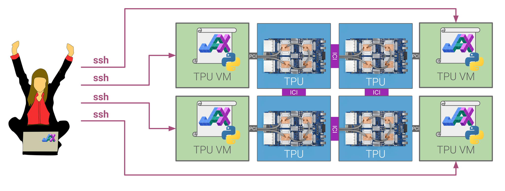
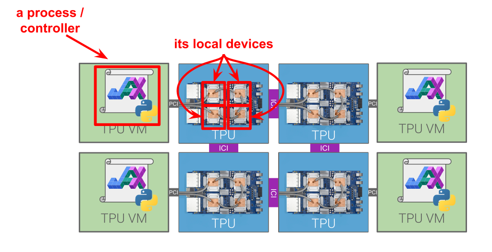

---
jupytext:
  formats: ipynb,md:myst
  text_representation:
    extension: .md
    format_name: myst
    format_version: 0.13
    jupytext_version: 1.16.4
kernelspec:
  display_name: Python 3
  name: python3
---

# Introduction to multi-controller JAX (aka multi-process/multi-host JAX)

By reading this tutorial, you'll learn how to scale JAX computations to more
devices that can fit in a single host machine.

The main idea is to run multiple Python processes, which we sometimes call
"controllers." We can run one (or more) process per host machine. A `jax.Array`
can span all processes, and if each process applies the same JAX function to
it, it's like programming against one big device. To control how data is
distributed and computation is parallelized, you use the same unified sharding
mechanism as in single-process / single-controller JAX. XLA automatically
exploits high-speed networking links between hosts, like TPU ICI or NVLink,
when available.

The big idea:
* **Run multiple Python processes**, which we sometimes call "controllers." We can
  run one (or more) process per host machine.
* **A `jax.Array` can span all processes**, and if each process applies the
  same JAX function to it, it's like programming against one big device.
* **Use the same unified sharding mechanism as in single-controller JAX** to
  control how data is distributed and computation is parallelized. XLA
  automatically exploits high-speed networking links between hosts, like TPU ICI
  or NVLink, when available.
* All processes (usually) run the same Python program. You write this Python
  code almost exactly the same as you would for a single process — just run
  multiple instances of it and JAX takes care of the rest. In other words, except
  for Array creation, you can write your JAX code as if there were one giant
  machine with all devices attached to it.

This tutorial assumes you've read [Distributed arrays and automatic
parallelization](https://docs.jax.dev/en/latest/notebooks/Distributed_arrays_and_automatic_parallelization.html#way-batch-data-parallelism), which is about single-controller JAX.



# Toy example

Before we define terms and walk through the details, here's a toy example:
making a process-spanning `Array` of values and applying `jax.numpy` functions
to it.

```{code-cell}
# call this file toy.py, to be run in each process simultaneously
import jax
import jax.numpy as jnp
from jax.sharding import NamedSharding, PartitionSpec as P

# in this example, get multi-process parameters from sys.argv
import sys
proc_id = int(sys.argv[1])
num_procs = int(sys.argv[2])

# initialize the distributed system
jax.distributed.initialize('localhost:10000', num_procs, proc_id)

# make a mesh that refers to devices from all processes
num_local_devices = jax.local_device_count()  # same as len(jax.local_devices())
mesh = jax.make_mesh((num_procs, num_local_devices), ('i', 'j'))

# make process-local arrays, one per local device
local_arrays = [
    jax.device_put(jnp.array([[proc_id * num_local_devices + i]]), device)
    for i, device in enumerate(jax.local_devices())
]
print(f'process={proc_id} has arrays: {local_arrays}')

# make a contoller- and device-spanning array
global_array = jax.make_array_from_single_device_arrays(
    shape=(num_procs, num_local_devices),
    sharding=NamedSharding(mesh, P('i', 'j')),
    arrays=local_arrays,
)

# apply a simple computation, automatically partitioned
global_result = jnp.sum(jnp.sin(global_array))
print(f'process={proc_id} got result: {global_result}')
```

Here, `mesh` contains devices from all processes. Each process has its own array
called `local_array`, each with distinct values. In contrast, `global_array` is
logically a single shared array, stored distributed across devices from all
processes.

Every process must apply the same operations, in the same order, to
`global_array`. XLA automatically partitions those computations, for example
inserting communication collectives to compute the `jnp.sum` over the full
array. We can print the final result because its value is replicated across
processes.

We can run this code locally on CPU, e.g. using 4 processes and 2 CPU devices
per process:

```bash
$ export JAX_NUM_CPU_DEVICES=2
$ for i in {0..3}; do
  python toy.py $i 4 &
done

# prints (in some order):
process=0 has arrays: [Array([[0]], dtype=int32), Array([[1]], dtype=int32)]
process=2 has arrays: [Array([[4]], dtype=int32), Array([[5]], dtype=int32)]
process=3 has arrays: [Array([[6]], dtype=int32), Array([[7]], dtype=int32)]
process=1 has arrays: [Array([[2]], dtype=int32), Array([[3]], dtype=int32)]
process=0 got result: 0.5537326335906982
process=3 got result: 0.5537326335906982
process=2 got result: 0.5537326335906982
process=1 got result: 0.5537326335906982
```

# Terminology
We sometimes call each Python process running JAX computations a _controller_,
but the two terms are essentially synonymous. Each process has a set of _local
devices_, meaning it can transfer data to and from those devices' memories and
run computation on those devices without involving any other processes. We
sometimes use the term _addressable_ to mean the same thing as local. A device
can only be local to one process; that is, the local device sets are disjoint.



A process's local devices can be queried by evaluating `jax.local_devices()`.
The list of all devices, across all processes, is queried by `jax.devices()`.
That list of all devices is populated by running
`jax.distributed.initialize(...)` on all processes, which sets up a simple
distributed system connecting the processes.

If a `Mesh` only has process-local devices, i.e. those returned by
`jax.local_devices()`, we call it a _local mesh_. If it uses all devices across
processes, i.e. all those returned by `jax.devices()`, we call it a _global
mesh_. In the less common case that a mesh has some devices that are not
process-local, but does not include all devices returned by `jax.devices()`, we
call it a _process-spanning mesh_.

Similarly, when an `Array`'s mesh is local, global, or process-spanning, we call
it a _local array_, _global array_, or _process-spanning array_, respectively.

# Setting up multiple JAX processes

In practice, setting up multiple JAX processes looks a bit different from the
toy example. For instance, instead of all the processes running on one host
machine, we usually launch them on separate hosts. We can do that directly
using `ssh`, or with a cluster manager like Slurm or Kubernetes.

However they're launched, the Python processes need to run
`jax.distributed.initialize(...)`. On Cloud TPU, or using Slurm or Kubernetes,
we can run jax.distributed.initialize() with no arguments as they're
automatically populated. Initializing the system means we can run
`jax.devices()` to report all devices across all processes.

For example, on Cloud TPU, after setting up a `v5litepod-16` (which has 4 host
machines) and installing JAX on each host, we might want to test that we can
connect the processes and list all devices:

```bash
$ TPU_NAME=jax-demo
$ EXTERNAL_IPS=$(gcloud compute tpus tpu-vm describe $TPU_NAME --zone 'us-central1-a' \
                 | grep externalIp | cut -d: -f2)
$ cat << EOF > demo.py
import jax
jax.distributed.initialize()
if jax.process_index() == 0:
  print(jax.devices())
EOF
$ echo $EXTERNAL_IPS | xargs -n 1 -P 0 bash -c '
scp demo.py $0:
ssh $0 "python demo.py" '
```

Here we're using `xargs` to run multiple ssh commands in parallel, each one
running the same Python program on one of the TPU host machines. In the Python
code, we use `jax.process_index()` to print only on one process. Here's what it
prints:

```
[TpuDevice(id=0, process_index=0, coords=(0,0,0), core_on_chip=0), TpuDevice(id=1, process_index=0, coords=(1,0,0), core_on_chip=0), TpuDevice(id=4, process_index=0, coords=(0,1,0), core_on_chip=0), TpuDevice(id=5, process_index=0, coords=(1,1,0), core_on_chip=0), TpuDevice(id=2, process_index=1, coords=(2,0,0), core_on_chip=0), TpuDevice(id=3, process_index=1, coords=(3,0,0), core_on_chip=0), TpuDevice(id=6, process_index=1, coords=(2,1,0), core_on_chip=0), TpuDevice(id=7, process_index=1, coords=(3,1,0), core_on_chip=0), TpuDevice(id=8, process_index=2, coords=(0,2,0), core_on_chip=0), TpuDevice(id=9, process_index=2, coords=(1,2,0), core_on_chip=0), TpuDevice(id=12, process_index=2, coords=(0,3,0), core_on_chip=0), TpuDevice(id=13, process_index=2, coords=(1,3,0), core_on_chip=0), TpuDevice(id=10, process_index=3, coords=(2,2,0), core_on_chip=0), TpuDevice(id=11, process_index=3, coords=(3,2,0), core_on_chip=0), TpuDevice(id=14, process_index=3, coords=(2,3,0), core_on_chip=0), TpuDevice(id=15, process_index=3, coords=(3,3,0), core_on_chip=0)]
```

Woohoo, look at all those TPU cores!

Once the processes are set up, we can start building global `jax.Array`s and
running computations. The remaining Python code examples in this tutorial are
meant to be run on all processes simultaneously, after running
`jax.distributed.initialize(...)`. (A lightweight way to follow along is to edit
demo.py locally, then run the same `xargs` command as above to execute it on all
host machines in parallel.)

# Meshes, `Sharding`s, and computations can span processes and hosts

Recall a `Mesh` pairs an array of `jax.Devices` with a sequence of names, with
one name per array axis. By creating a `Mesh` using devices from multiple
processes, then using that mesh in `Sharding`s, we can construct `Array`s
sharded over devices from multiple processes.

Here's an example that directly constructs a global `Mesh` using
`jax.devices()` to get devices from all processes:

```python
from jax.sharding import Mesh
mesh = Mesh(jax.devices(), ('a',))

# in this case, the same as
mesh = jax.make_mesh((jax.device_count(),), ('a',))  # use this in practice
```

You should probably use the `jax.make_mesh` helper in practice, not only because
it's simpler but also because it can choose more performant device orderings
automatically, but we're spelling it out here. By default it includes all
devices across processes, just like `jax.devices()`.

Once we have a global mesh, we can shard arrays over it. There are a few ways
to efficiently build process-spanning arrays, detailed in the next section, but
for now we'll stick to `jax.device_put` for simplicity:

```python
arr = jax.device_put(jnp.ones((32, 32)), NamedSharding(mesh, P('a')))
if jax.process_index() == 0:
  jax.debug.visualize_array_sharding(arr)
```

On process 0, this is printed:

```
┌───────────────────────┐
│           TPU 0       │
├───────────────────────┤
│           TPU 1       │
├───────────────────────┤
│           TPU 4       │
├───────────────────────┤
│           TPU 5       │
├───────────────────────┤
│           TPU 2       │
├───────────────────────┤
│           TPU 3       │
├───────────────────────┤
│           TPU 6       │
├───────────────────────┤
│           TPU 7       │
├───────────────────────┤
│           TPU 8       │
├───────────────────────┤
│           TPU 9       │
├───────────────────────┤
│          TPU 12       │
├───────────────────────┤
│          TPU 13       │
├───────────────────────┤
│          TPU 10       │
├───────────────────────┤
│          TPU 11       │
├───────────────────────┤
│          TPU 14       │
├───────────────────────┤
│          TPU 15       │
└───────────────────────┘
```

Let's try a slightly more interesting computation:

```python
mesh = jax.make_mesh((jax.device_count() // 2, 2), ('a', 'b'))

def device_put(x, spec):
  return jax.device_put(x, NamedSharding(mesh, spec))

# construct global arrays by sharding over the global mesh
x = device_put(jnp.ones((4096, 2048)), P('a', 'b'))
y = device_put(jnp.ones((2048, 4096)), P('b', None))

# run a distributed matmul
z = jax.nn.relu(x @ y)

# inspect the sharding of the result
if jax.process_index() == 0:
  jax.debug.visualize_array_sharding(z)
  print()
  print(z.sharding)
```

On process 0, this is printed:


```
┌───────────────────────┐
│          TPU 0,1      │
├───────────────────────┤
│          TPU 4,5      │
├───────────────────────┤
│          TPU 8,9      │
├───────────────────────┤
│         TPU 12,13     │
├───────────────────────┤
│          TPU 2,3      │
├───────────────────────┤
│          TPU 6,7      │
├───────────────────────┤
│         TPU 10,11     │
├───────────────────────┤
│         TPU 14,15     │
└───────────────────────┘

NamedSharding(mesh=Mesh('a': 8, 'b': 2), spec=PartitionSpec('a',), memory_kind=device)
```

Here, just from evaluating `x @ y` on all processes, XLA is automatically
generating and running a distributed matrix multiplication. The result is
sharded against the mesh like `P('a', None)`, since in this case the matmul
included a `psum` over the `'b'` axis.


⚠️  When applying JAX computations to process-spanning arrays, to avoid
deadlocks and hangs, **it's crucial that all processes with participating
devices run the same computation at the same time**, or at least in the right
order. That's because the computation may involve collective communication
barriers. If a device over which an array is sharded does not join in the
collective because its controller didn't issue the same computation, the other
devices are left waiting. For example, if only the first three processes
evaluated `x @ y`, while the last process evaluated `y @ x`, the computation would
likely hang indefinitely. This assumption, computations on process-spanning
arrays are run on all participating processes in the same order, is mostly
unchecked.

So the easiest way to avoid deadlocks in multi-process JAX is to run the same
Python code on every process, and beware of any control flow that depends on
`jax.process_index()` and includes communication.

If a process-spanning array is sharded over devices on different processes, it
is an error to perform operations on the array that require the data to be
available locally to a process, like printing. For example, if we run `print(z)`
in the preceding example, we see

```
RuntimeError: Fetching value for `jax.Array` that spans non-addressable (non process local) devices is not possible. You can use `jax.experimental.multihost_utils.process_allgather` to print the global array or use `.addressable_shards` method of jax.Array to inspect the addressable (process local) shards.
```

To print the full array value, we must first ensure it's replicated over
processes (but not necessarily over each process's local devices), e.g. using
`jax.device_put`. In the above example, we can write at the end:

```python
w = device_put(z, P(None, None))
if jax.process_index() == 0:
  print(w)
```

Be careful not to write the `device_put` under the `if process_index() == 0`,
because that would lead to a deadlock as only process 0 initiates the
collective communication and waits indefinitely for the other processes.

Alternatively, to print or otherwise perform Python operations on only
process-local data, we can access `z.addressable_shards`. Accessing that
attribute does not require any communication, so any subset of processes can do
it without needing the others. That attribute is not available under a
`jax.jit`.

# Making process-spanning arrays from process-local data

There are three main ways to create process-spanning arrays:
1. Create or load the full array on all processes, then reshard using
   `jax.device_put` or `jax.lax.with_sharding_constraint`, likely resulting in
   cross-process and cross-device data movement;
2. Create or load on each process an array representing the data that will be
   stored on that process's devices, then assemble it without any cross-process
   data movement using `jax.make_array_from_process_local_data`, which may
   result in local device data movement;
3. Create or load on each process's devices separate arrays, each representing
   the data to be stored on that device, then assemble them without any data
   movement using `jax.make_array_from_single_device_arrays`.

The latter two are most often used in practice.


`jax.make_array_from_process_local_data` is often used for distributed data
loading. It's not as general as `jax.make_array_from_single_device_arrays` and
sometimes the result must be resharded among local devices to achieve the final
intended sharding. Here's an example, using our `v5litepod-16`:

```python
# TODO
```

`jax.make_array_from_single_device_arrays` is the most general way to build a
process-spanning array. It's often used after performing `jax.device_puts` to
send to each device its required data. It is the most low-level, since all data
movement is performed manually (via e.g. `jax.device_put`). Here's an example:

```python
# TODO
```

# Toy examples

TODO

# Serializing distributed `Array`s

# Further reading
* Fault tolerance
* Distributed data loading
