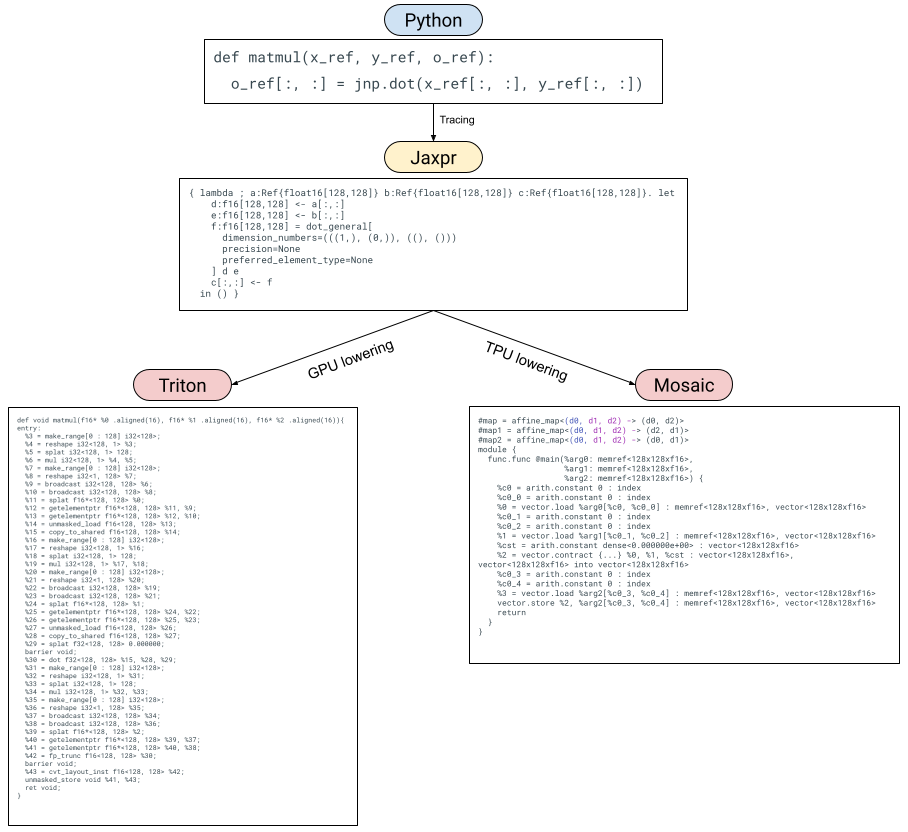

# Pallas Design

<!--* freshness: { reviewed: '2024-04-15' } *-->

In this document, we explain the initial Pallas design.
This is a snapshot of some of the earlier design decisions made
and Pallas's specific APIs might have changed since.

## Introduction

JAX is being used for a diverse set of workloads, from large scale machine
learning to scientific computing.
JAX’s success story is as much a success story for XLA,
the primary compiler that JAX targets – XLA compiles JAX
programs for accelerators and has enabled JAX to scale to the largest ML
models.
JAX describes logical computations in XLA’s representation, HLO.
HLO describes how computations happen logically but not physically.
Given a logical HLO computation, XLA decides how that computation is to be
executed physically.
For a wide variety of ML applications, XLA does a good
job of compiling user programs but inevitably some users hit XLA's
limitations.
In these cases, we need to provide an “escape hatch” to allow
experts to write hand-tuned kernels that outperform XLA at that
point in time.
Furthermore, advances in ML systems research take some time to be
incorporated into XLA and users often want to run ahead with them.
Over time, the compiler can incorporate the optimizations that were proven
out experimentally through hand-tuned kernels.

XLA does offer the `CustomCall` mechanism as an escape hatch, but it
requires users to write C++ and on GPU it requires users to learn the
CUDA programming model.
The CUDA programming model is arguably too low-level for many machine
learning GPU kernels, like matrix multiplication,
and even expert users will have trouble using CUDA to implement efficient
matrix multiplication or multi-headed attention.
Not only this, JAX users are usually familiar with Python and NumPy-style
array programming which doesn’t involve writing any C++ or thinking about
GPU parallelism.
All popular machine learning frameworks share this
idea: manipulating (usually) arrays with high level operations
like `matmul` or `convolution`.
Unfortunately, this means implementing a custom operation via `CustomCall`
is a big investment, involving potentially learning C++ and/or GPU
programming.

[Triton](https://triton-lang.org/main/index.html), a GPU compiler built
and maintained by OpenAI, has taken the ML compiler world by storm.
Triton offers the best of both worlds: an array-based programming model
for GPU kernels. Triton is the primary code generation route
for `torch.compile` in PyTorch 2.0, via the Torch Inductor library.
Triton actively hides some aspects of GPU programming in the name of a
more accessible programming model that can be used from Python and to
generate optimized code from a higher-level representation.
While GPUs are more flexible than what Triton offers, in the ML domain,
Triton seems to be expressive enough for many applications.

In this document, we describe Pallas, an extension to JAX that enables
kernel programming for both GPUs and TPUs using a Triton-like model.
A JAX-based kernel language offers several advantages:
* Although Triton exposes a TPU-like programming model to users,
  i.e. writing programs for tiles of arrays in L1-cache, it is specialized
  enough to GPU that we cannot directly compile Triton for TPU.
  For example, Triton offers atomic operations specifically meant to
  handle parallel writes that don’t necessarily make sense on TPU.
  A higher level front end can abstract away details of the platform
  while surfacing just that tile-based programming model.
  The kernels will thus be portable across different hardware platforms.
* JAX as a tracing-based frontend for numerical computing is both
  mature and well-used.
  By embedding the kernel programming language in JAX itself,
  we can reuse JAX’s tracing infrastructure and provide a
  NumPy-like frontend that’s already familiar to users.
* JAX transformations are key to its success, allowing users to
  express simple programs but transform them to achieve complex
  functionality.
  We can leverage the same transformations (vmap, jvp, etc.) to
  transform user-written kernels.

The open question is: is JAX a good fit for a kernel language at all?
We think so.
Triton demonstrates that an array programming language can be
practical for writing GPU kernels and JAX is just that.
JAX has also proven to be a flexible front-end for compilers and
for program transformations.

We describe Pallas as follows: we first describe the ways in which
we extend JAX to support writing custom kernels.
We then show how we can lower Pallas to both Triton and Mosaic.
We conclude by describing existing and potential ways to transform
Pallas kernels via JAX transformations.

<center>


Visualization of Pallas lowering paths

</center>

## Pallas: Extending JAX for kernels

The key point we’d like to make is that Pallas is just JAX, with some
extensions:
1. Users now use reference types called `Ref`s in their JAX code.
   This gives users more precise control over memory access and
   layout in JAX will more closely resemble physical layout.
2. Users write their JAX programs using a subset of JAX primitives,
   along with a set of Pallas-specific primitives.
3. Users embed their Pallas kernels in an outer JAX program via a
   special `pallas_call` higher-order function, that executes the
   kernel in a map. It is analogous to `pmap` or `shard_map`,
   except with references to shared memory.

We’ll go over these three extensions one at a time, by example.

Note that these APIs are still experimental and subject to change.

### Reference types

Let’s look at an example Pallas program for adding two vectors:

```python
import jax
import jax.numpy as jnp
from jax.experimental import pallas as pl

def add_kernel(x_ref, y_ref, o_ref):
  # In this code, `x_ref`, `y_ref` and `o_ref` are (8,)-shaped `Ref`s
  x = x_ref[:]
  y = y_ref[:]
  o_ref[:] = x + y
x, y = jnp.arange(8), jnp.arange(8, 16)
add = pl.pallas_call(add_kernel, out_shape=jax.ShapeDtypeStruct((8,), jnp.int32))
add(x, y)
```

Unlike a regular JAX program, `add_kernel` does not receive immutable
array arguments.
Instead, it’s provided with references that can be read from and
updated in-place using NumPy-like syntax.
`Ref`s are not a Pallas-specific concept – they were introduced to
JAX to represent stateful computations.
However, we can leverage them when writing kernels that operate on
mutable memory too.

Pallas kernels not only receive `Ref`s corresponding to the inputs
to the kernel, but also receive `Ref`s for the outputs as well
(specified in `pallas_call` via `out_shape`).
`Ref`s are special types that cannot be passed into the usual set of
JAX primitives without being read from first.
When you read from a `Ref` you get a JAX `Array` type out, and you
must write an `Array` into a `Ref`.

#### Reading from/writing into Refs

Reading from a `Ref` corresponds to loading an array into the
lowest level of the memory hierarchy (L1-cache on GPU and vector
registers on TPU). Writing into a `Ref` is analogous.

```python
def f(x_ref, o_ref):
  # Using vanilla Python indexing
  x = x_ref[0, 2:5, :]
  # Or via Numpy advanced int indexing
  o_ref[jnp.arange(3), :] = x

# Note that in order to use NumPy advanced int indexing, you need to broadcast the indices against each other into the desired multidimensional shape:
def f(x_ref):
  # Assume x_ref is (8, 4) and we want to read out a (2, 3) slice
  x = x_ref[jnp.arange(2)[..., None], jnp.arange(3)[None, ...]]
```

Writing to `Ref`s can be done via analogous `__setitem__` style
indexing.

Other forms of indexing (for example, dynamic slicing) can be done
via `pallas.load` and `pallas.store`, new JAX primitives designed to
make loading from/storing into memory easier.
We’ll discuss these new primitives later.

### Extending JAX with new Pallas primitives

Because JAX was designed with HLO in mind, the set of JAX primitives
closely mirrors the set of HLO operations.
Targeting a new compiler (e.g. Triton or Mosaic) means we might need
to supplement JAX’s primitives with new ones specific to the new
compiler.
At the same time, we may not be able to lower all JAX primitives,
so we need to restrict it to a subset.

Because Pallas was initially designed with Triton in mind,
we offer a set of new primitives targeting the Triton programming model.
As we’ll show later, we can lower these primitives to Mosaic as well.

#### `pallas.load` and `pallas.store`

`pallas.load` and `pallas.store` are primitives that allow loading
from memory and storing into memory.
Unlike `__getitem__` and `__setitem__` they are more flexible at the
cost of being more verbose.
Specifically, you can use the `pallas.dynamic_slice` (`pallas.ds` for
short) construct (which should maybe be upstreamed into JAX to be
used with Ref `__getitem__` and `__setitem__`).

```python
def f(x_ref, o_ref):
  # Reading from memory via pallas.load
  x = pl.load(x_ref, (0, slice(2, 5), slice(None)))
  # Using integer indexing automatically broadcasts
  x = pl.load(x_ref, (0, 2 + jnp.arange(3), slice(None)))
  # You can also use `pl.dynamic_slice` (`pl.ds` for short) objects as well
  pl.store(o_ref, (0, pl.ds(start=2, size=3), slice(None)), x)
```


`pallas.load` and `pallas.store` also support masking via the mask
argument.

```python
def f(x_ref, o_ref):
  # Reading from memory via pallas.load
  idx = jnp.arange(8)
  mask = idx < 5
  x = pl.load(x_ref, (idx,), mask=mask, other=float('-inf'))
```

Masking is important when doing out-of-bounds loads/stores.
The operational semantics of masking can be compiler-determined
(if we understand the documentation properly, Triton avoids the read
from/write to memory if it’s masked).

#### `pallas.program_id` and `pallas.num_programs`

As we’ll soon see, we’ll be executing the same Pallas kernels many
times (either in parallel or in a pipeline depending on the backend).
These new primitives tell us “where” we are in the execution of the
kernel.

`pallas.program_id` takes in an axis argument, which tells us which
index in an axis of a multidimensional grid this kernel is currently
executing in (analogous to `threadId` from CUDA programming or
`lax.axis_index` in `jax.pmap`).
Note that we are currently borrowing the “program” terminology from
Triton and in the future we might want to change it to something more
familiar to JAX users.

```python
def f(x_ref, o_ref):
  i = pl.program_id(axis=0)  # execution index in the first axis of the grid
  o_ref[i] = jnp.exp(x_ref[i])
```

`pallas.num_programs` also takes in an axis and returns the grid size
for that axis.

Note that while `program_id` and `num_programs` are Triton-specific
terminology they are easily generalized to make sense on TPU as well.

#### Using a subset of JAX primitives in Pallas

Because we’re writing kernels, not high-level HLO programs, some JAX
primitives may not be able to be represented in our underlying
substrate efficiently.
However, we know we can support most elementwise operations,
simple dot products, and JAX control flow.

While we haven’t yet mapped out exactly all the JAX primitives that
we can support in Pallas kernels, we can certainly identify some that
are not easy to lower or are unlikely to be useful:
* `conv_general` - convolution usually isn’t offered as primitive in
  the underlying hardware.
* `gather/scatter` - the underlying compiler may not support
  noncontiguous memory reads and writes

### Executing Pallas kernels with `pallas_call`

Now that we’ve written our Pallas kernels (a.k.a. JAX with `Ref`s and
the extra Pallas primitives), how do we execute them on a GPU or TPU?
We use `pallas_call`, a higher order function (akin to `jax.jit` and
`jax.pmap`) that executes the kernel.

The signature of `pallas_call` is as follows:

```python
def pallas_call(
    kernel: Callable,
    out_shape: Sequence[jax.ShapeDtypeStruct],
    *,
    in_specs: Sequence[Spec],
    out_specs: Sequence[Spec],
    grid: Optional[Tuple[int, ...]] = None) -> Callable:
  ...
```

When we provide a kernel to `pallas_call` we provide additional
information. The first is `out_shape` which tells the kernel what the
outputs look like (`pallas_call` will pass a `Ref` corresponding to
these into the kernel to be written to).
The rest of the information (`in_specs`, `out_specs`, and `grid`) are
information about how the kernel will be scheduled on the accelerator.

The (rough) semantics for `pallas_call` are as follows:

```python
def pallas_call(kernel, out_shape, *, in_specs, out_specs, grid):
  def execute(*args):
    outputs = map(empty_ref, out_shape)
    grid_indices = map(range, grid)
    for indices in itertools.product(*grid_indices): # Could run in parallel!
      local_inputs = [in_spec.transform(arg, indices) for arg, in_spec in
                      zip(args, in_specs)]
      local_outputs = [out_spec.transform(arg, indices) for arg, out_spec  in
                       zip(outputs, out_specs)]
      kernel(*local_inputs, *local_outputs) # writes to outputs
  return execute
```

Specifically, `pallas_call` will “loop” over grid iteration space,
applying a transformation to the inputs and outputs specified via
the `in_specs` and `out_specs`.
In each iteration, the kernel will be called on the transformed
inputs and outputs. Note that the “loop” over the iteration space
could be executed in parallel (e.g. on GPU).
`pallas_call` also provides no guarantees on the order of loop
iterations over the iteration space, just that every member of the
iteration space will be looped over.
Compilers like Triton and Mosaic will have more specific operational
semantics associated with the grid.

#### Transformation functions

The `in_specs` and `out_specs` arguments to `pallas_call` allow
inputs and outputs to be transformed in some way.
The two options that Pallas offers right now are an identity
transformation (where inputs and outputs are left unchanged),
and `BlockSpec`s, take fixed-size slices of `Ref`s determined by the
loop index.

A `BlockSpec` takes an `index_map` function and a `block_shape`.
Logically, it takes an array and slices it along each axis into
`block_shape` sizes blocks.
The `index_map` function takes loop indices (from the grid index set)
and maps them to block indices.
The transform function converts `Ref`s into logical views of the
`Ref` at the corresponding block.
When we specify `None` in an entry in block_shape,
that corresponds to “mapping” over that dimension,
removing it from the block within the kernel.

```python
class BlockSpec:
  index_map: Callable[[Tuple[Int, ...]], Tuple[Int, ...]]
  block_shape: Tuple[Optional[int], ...]

  def transform(self, ref, *loop_indices):
    block_indices = self.transform_function(loop_indices)
    # Returns a view of `ref` starting at `block_indices` of shape self.block_shape
    ...
```

We could also imagine other `Spec`s that are used with `pallas_call`,
for example a `Spec` that corresponds to overlapping windows to, say,
implement convolutions.

### Immediate benefits of Pallas as a front-end
By offering a JAX front-end for kernel writing, we can immediately
reap some benefits.

#### More flexible front end

The first is that JAX users are already accustomed to the benefits
(and limitations) of programming with JAX and its tracing-based
transformations.
This means users can use closures and other familiar Python constructs
when writing Pallas kernels.
This is unlike the existing AST-parsing-based Triton front end or the
MLIR builders for Mosaic.
For example, this makes Pallas far more amenable to templating than
Triton.

See this example of how we can use higher-order functions in Python
to template a kernel.

```python
def make_kernel(eltwise_kernel):
  def add(x_ref, y_ref, o_ref):
    x = pl.load(x_ref, ())
    y = pl.load(y_ref, ())
    pl.store(o_ref, (), eltwise_kernel(x + y))
  return add

kernel1 = make_kernel(lambda x: x * 2)
kernel2 = make_kernel(jnp.exp)

pl.pallas_call(kernel1, out_shape=x, grid=1)(1., 1.)
pl.pallas_call(kernel2, out_shape=x, grid=1)(1., 1.)
```

#### Emulation mode

By representing kernels as programs with JAX primitives and some new
Pallas primitives, we can also lower Pallas programs to StableHLO
directly and compile/execute them with XLA.
Specifically, a `pallas_call` can be implemented as a `lax.scan` over
the grid.
This enables us to develop GPU or TPU kernels on any XLA-supported
platform (even CPU!) and debug them using JAX/XLA debugging tools
(like `jax.debug.print`).
We can also use the more reliable and better tested XLA numerics to
verify the correctness of the Triton and Mosaic compilers.
One could also imagine perturbing the `scan` ordering to simulate the
parallel reads and writes that happen on GPU.

### GPU Examples

Note all the following examples are for GPU only. They will require tweaks to
the block sizes to work on TPUs.

#### `add`

We modify our `add_kernel` example to operate over (2,)-sized blocks
using `BlockSpec`s.

```python
def add_kernel(x_ref, y_ref, o_ref):
  # In this code, `x_ref`, `y_ref` and `o_ref` are (2,)-shaped `Ref`s
  x = x_ref[:]
  y = y_ref[:]
  o_ref[:] = x + y
x, y = jnp.arange(8), jnp.arange(8, 16)
add = pl.pallas_call(
    add_kernel,
    out_shape=jax.ShapeDtypeStruct((8,), jnp.int32),
    in_specs=[
        pl.BlockSpec((2,), lambda i: i),
        pl.BlockSpec((2,), lambda i: i)
    ],
    out_specs=pl.BlockSpec((2,), lambda i: i),
    grid=(4,))
add(x, y)
```

#### Templated matmul

In this example, we compute tiles of the output by doing an unrolled
accumulation over blocks of rows and columns from our input arrays.
We inline an activation function into the body of the kernel using a
higher order function so we can emit a fused kernel.

```python
def matmul_kernel(x_ref, y_ref, o_ref, *, activation, block_k):
  acc = jnp.zeros((x_ref.shape[0], y_ref.shape[1]), jnp.float32)
  for k in range(x_ref.shape[1] // block_k):
    x = x_ref[:, k*block_k:(k+1)*block_k]
    y = y_ref[k*block_k:(k+1)*block_k, :]
    acc += x @ y
  o_ref[:, :] = activation(acc).astype(o_ref.dtype)

x, y = jnp.ones((512, 256)), jnp.ones((256, 1024))
block_shape = 128, 256, 128

@partial(jax.jit, static_argnames=["block_shape", "activation"])
def matmul(x, y, *, block_shape, activation):
  block_m, block_n, block_k = block_shape
  fused_matmul = pl.pallas_call(
      partial(matmul_kernel, block_k=block_k, activation=activation),
      out_shape=jax.ShapeDtypeStruct((x.shape[0], y.shape[1],), jnp.float32),
      in_specs=[
          pl.BlockSpec((block_m, x.shape[1]), lambda i, j: (i, 0)),
          pl.BlockSpec((y.shape[0], block_n), lambda i, j: (0, j))
      ],
      out_specs=pl.BlockSpec((block_m, block_n), lambda i, j: (i, j)),
      grid=(4, 4),
  )
  return fused_matmul(x, y)

z = matmul(x, y, block_shape=block_shape, activation=jax.nn.gelu)
```
### Lowering Pallas

After users express their Pallas kernels, we lower them to different
representations depending on the target backend.
On GPUs, we lower Pallas to Triton IR, and on TPU we lower Pallas to
Mosaic.

#### Lowering Pallas to Triton for GPU

Lowering Pallas to Triton is easy because Pallas was designed with
Triton as a target language in mind.
The main differences between Pallas and Triton is that Triton doesn’t
have a notion of `BlockSpec`s and also uses pointers when doing
memory loads and stores as opposed to indices.

Triton supports pointers as an array element type in its language
and in Triton you can load from and store to arrays of pointers.
In Pallas, when given a `(4, 5)`-shaped `Ref`, `x_ref`, and then do
like `x_ref[3, 2]`, we need to lower this to computing a Triton
pointer to the appropriate row-major position in `x_ref` (that is,
doing 5 * 3 + 2 * 1).
Similarly, when we lower slices to Triton, e.g. `x_ref[4, :]` we need
to produce an array of pointers `5 * 4 + jnp.arange(3)`.

Other than that, lowering to Triton is fairly straightforward.
JAX dot products can be lowered to Triton dot products and JAX unary
primitives are lowered to their Triton equivalents.
Triton’s atomic operations are lowered via new Pallas atomic
primitives.

#### Lowering Pallas to Mosaic for TPU

Mosaic consumes (mostly) standard dialect MLIR and emits LLO to be
compiled for TPU.
Pallas can be lowered to Mosaic via translating JAX primitives to
MLIR (mostly the `vector` and `arith` dialects).
The `BlockSpec`s can be converted into pipeline schedules
(i.e. the `transform_func`s in Mosaic).

### Transforming Pallas

A natural question is how do JAX transformations interact with Pallas
kernels?
There are two main ways: transformations inside Pallas kernels and
transformations outside Pallas kernels.

Transformation inside Pallas kernels should actually “just work”,
so long as we are able to lower the transformed code.
For example, we could use `jax.grad(jnp.sin)(...)` inside of a JAX
kernel because we can lower a `cos` to both Triton and Mosaic.
However, we might not be able to lower a `jax.vmap(lax.dynamic_slice)`
because it could turn into a gather that we cannot lower.

Transformations of Pallas kernels from the outer JAX programs is
perhaps the more interesting case. How do we handle things like
`vmap(pallas_call)` and `grad(pallas_call)`?

#### `vmap-of-pallas_call`

vmap automatically vectorizes JAX programs. While kernel writers might
want precise control over how a batched kernel will behave differently
from its unbatched variant, we can offer a reasonable default `vmap`
rule for `pallas_call` while offering the `jax.custom_vmap`
customization mechanism. When `pallas_call` is `vmap`-ed, we augment
the `pallas_call` to have an extra grid dimension corresponding to the
new batch dimension and transform the `BlockSpec`s to handle indexing
along that dimension.

#### `grad-of-pallas_call`

`grad` of `pallas_call` enables automatic differentiation of kernels.
`jax.grad` breaks down into applications of three distinct transforms:
`jvp`, `partial_eval` and `transpose`.
In principle, we can reuse most of JAX’s infrastructure when
implementing these rules for `pallas_call` (since it behaves much like
existing JAX higher order primitives).

However, automatic differentiation of kernels can result in a
performance hit due to how memory access is transposed.
If we write a GPU kernel with overlapping-and-parallel reads and
disjoint-but-parallel writes, we automatically transpose it into a
kernel that has overlapping-but-parallel writes (which are slow when
done atomically) and disjoint-and-parallel reads.
To emit a kernel that better uses parallelism with shared memory,
we would need to reorder loops and change how the kernel is vectorized.
Unfortunately, we do not have a program representation amenable to
that in Pallas.
A potential direction to automatically differentiating kernels
efficiently is to explore a different representation, perhaps one
like that in Dex.
We could also look at how Enzyme approaches this problem.
However, AD of Pallas kernels may still be useful for a class of
kernels that does transpose efficiently (for example elementwise
kernels).

In general, though, `jax.custom_vjp` is a viable escape hatch to
express Pallas kernels that work with `jax.grad`.

#### Other transformations

We could imagine other JAX transformations applying to Pallas kernels
that we haven’t explicitly explored yet.
For example, `checkify` is a JAX transformation that does functional
error handling.
We could imagine using `checkify` with pallas_call to allow plumbing
out error codes from GPU kernels that indicate if OOB access or NaNs
were produced.

Another potential transformation to integrate with is
custom_partitioning to enable automatically partitionable kernels to
be used with pjit.
