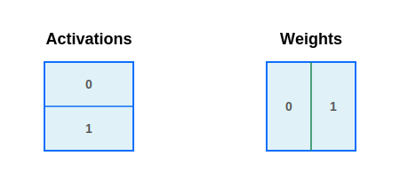

# Collective matrix multiplication

Tensor parallelism (TP) and data parallelism (DP) are the most frequently used
parallelism techniques that make it possible to fit the ever larger models onto
a number of accelerators. However, their joint use means that in our programs,
we sometimes end up with data sharded in ways that don't make it directly
possible to execute an operation without additional communication. One such
problem frequently happens at the beginning of the MLP block of a Transformer.
There, the input activations might be sharded on the batch axis (DP), while the
weights might be partitioned on the output feature dimension (TP).

<center></center>

The contraction dimension is not sharded, so it might seem that we can just
multiply the inputs, but there is a problem: the output can't be sharded along
the same device axis on both of its dimensions!

There's a simple way to solve this problem: we can all-gather activations or
weights (here we focus on the activation side), and then perform a local matrix
multiplication with the other operand sharded. This simple strategy works, but
it has a downside: we can't begin computing the matrix multiplication while the
all-gather is running! That means we're underutilizing our hardware!

To achieve better utilization, we'll show how simple it is to implement a
Pallas:MGPU kernel that overlaps the cross-device communication with the
matrix-multiplication, achieving almost optimal utilization on large enough
problem shapes. Our implementation makes heavy use of the NVLINK interconnect,
which allows us to perform high-bandwidth inter-GPU communication without
involving the host.

This approach already yields considerable performance improvements! If we
consider a f16 matmul with M=1024, K=4096 and N=4096 and normally distributed
data, our benchmarks indicate that it should take about 43us on a single H100.
In the table below, we scale up the M dimension so that the per-shard shape is
M=1024. We can compute an expected lower bound for the execution of our
distributed kernel by multiplying that local runtime estimate by the number of
devices and by adding about 6us for each round of communication (the memory
fences associated with the synchronization are expensive). Benchmarking our
kernel yields the following results:

| Device count | Kernel time | TC utilization | Lower bound | TC utilization | Reference time | TC utilization |
|--------------|-------------|----------------|-------------|----------------|----------------|----------------|
| 2            | 102us       | 68%            | 92us        | 75%            | 147us          | 47%            |
| 4            | 212us       | 66%            | 190us       | 73%            | 290us          | 48%            |
| 8            | 436us       | 64%            | 386us       | 72%            | 565us          | 49%            |

As you can see there are still some opportunities for optimization here, but at
least we're getting much better utilization compared to the baseline
implementation of a NCCL all gather and cuBLAS matmul.

## Algorithm overview: Ring All-Gather

To compute `AllGather(A) @ B`, we form a ring on the participating `D` devices.
At each step, the device takes the last received shard (starting from its local
shard), and passes it to the next device in the ring. While the send is
happening, we compute the matrix multiplication between the last received `A` shard
and the local `B` shard.


More formally, the algorithm proceeds in `D` steps. In step `i` (`0 <= i < D`),
device `d` receives shard `A_{(d + i) % D}` (we don't actually receive in the
first step) from device `(d + 1) % D`, computes `A_{(d + i) % D} @ B_d`, and
writes the result to a slice of the output buffer.  Concurrently with the
compute, the device `d` sends shard `A_{(i + d) % D}` to device `(i - 1) % D`
for its use in step `i + 1` (we don't send in the last step). After `D` steps,
device `d` will have seen every shard of `A` and computed the full output.

## Pallas primitives for inter-device communication

We use three Pallas functions for inter-device communication:

*   **`plgpu.remote_ref(ref, device_id)`**: This function takes a reference to a
    buffer in global memory (GMEM) and returns a reference to the same buffer on a
    *different* device, specified by `device_id`. When communicating over NVLINK,
    this reference can be read or written to directly, even though its data is located
    in remote memory.
*   **`pl.semaphore_signal(sem, device_id=...)`**: Increments a semaphore on a
    target device. This is usually used to indicate completion of some process,
    such as when we notify the remote device that the data it's waiting for has
    been sent.
*   **`pl.semaphore_wait(sem, value=..., decrement=...)`**: Blocks until a local
    semaphore reaches a certain value. If decrement is `True` (default), the
    value of the semaphore is decreased by the awaited amount. If it is `False`,
    the operation is more efficient, but it does not modify the value of the
    semaphore after the wait completes. This is frequently used to await signals
    from a remote device.

## Implementation with Pallas

```{note}
Here, we only present a simplified version of the kernel, which allows us to
focus on the most interesting details. You can find [the full implementation in
our examples directory](https://github.com/jax-ml/jax/blob/main/jax/experimental/pallas/ops/gpu/all_gather_lhs_matmul_mgpu.py).
```

First, we focus on the set-up of our kernel. For the compute part, we will reuse
our optimized matmul kernel implementation from `hopper_matmul_mgpu`. Since the
compute kernel will utilize warp-specialization, we use 3 Pallas threads. It
is also persistent, which means that we launch a grid as large as the number of
SMs (queried from `.core_count` on the JAX device). The compute kernel uses
`pl.run_scoped` for SMEM allocations, so we don't use `scratch_shapes`.

```python
def all_gather_lhs_matmul(
    lhs: jax.Array,
    rhs: jax.Array,
    axis_name,
    *,
    config: hopper_matmul_mgpu.TuningConfig,
    dtype: jnp.dtype = jnp.bfloat16,
) -> jax.Array:
  if (num_devices := jax.device_count()) != jax.process_count():
    raise ValueError("The kernel only supports one device per process")
  if (axis_size := lax.axis_size(axis_name)) != num_devices:
    raise ValueError("The kernel can only work over all devices in a Mesh.")
  ...

  m_shard, k = lhs.shape
  _, n_shard = rhs.shape
  tile_m, tile_n, tile_k = config.tile_m, config.tile_n, config.tile_k
  cta_tile_m = tile_m * (1 + (config.wg_dimension == MatmulDimension.M))
  num_sms = jax.extend.backend.get_default_device().core_count

  def kernel_body(lhs_local_ref, rhs_ref, out_ref, scratch_ref):
    ...

  result, _ = plgpu.kernel(
      kernel_body,
      out_shape=[
          # The output (with M gathered)
          jax.ShapeDtypeStruct((axis_size * m_shard, n_shard), dtype),
          # A scratch buffer for LHS all-gather
          jax.ShapeDtypeStruct((axis_size - 1, m_shard, k), dtype),
      ],
      grid=(num_sms,),
      num_threads=3, # The matmul kernel uses 3 threads: 2 compute and 1 memory
      thread_name="wg",
  )(lhs, rhs)
  return result
```

The kernel above has two outputs. First one is the actual result of our
primitive, while the second one is used as a scratch space to receive the left
operands. Note that we could shrink the leading axis to be smaller than
`axis_size - 1`, but at that point we would need to introduce backpressure to
the sending devices, which requires additional expensive communication.

```{note}
You can see how to deal with this backpressure in the [TPU distributed communication guide](../tpu/distributed.md#run-ahead-and-race-conditions).
```

Let us now look at the outline of the kernel body:

```python
def all_gather_lhs_matmul(...):
  def kernel_body(lhs_local_ref, rhs_ref, out_ref, scratch_ref, out_smem, received_sem):
    wg_idx = lax.axis_index("wg")
    dev_id = lax.axis_index(axis_name)
    # This device sends to dev_id - 1, forming a ring.
    send_dev_id = lax.rem(dev_id + axis_size - 1, axis_size)
    send_scratch_ref = plgpu.remote_ref(scratch_ref, send_dev_id)

    def device_step(lhs_source_ref, device_offset):
      # Invariant: lhs_source_ref contains A_{(dev_id + device_offset) % D}
      # and is ready to be used for computation.

      ...

    # We peel the first step to read data directly from lhs_local_ref.
    device_step(lhs_local_ref, 0)
    @pl.loop(1, num_devices)
    def _device_loop(device_offset):
      device_step(scratch_ref.at[device_offset - 1], device_offset)
```

We locate our position in the ring by querying `lax.axis_index(axis_name)` and
compute the index of the next device, to which we will be sending the data
(`send_dev_id`). Then, we loop over invocations of the `device_body` as many
times as there are devices. We peel the first step of the loop, because we use
the local reference as the source for the send in that step only (after that the
sends originate from the data previously received in the scratch buffer).

We are ready to investigate the main loop now:

```python
def all_gather_lhs_matmul(...):
  ...

  def kernel_body(lhs_local_ref, rhs_ref, out_ref, scratch_ref, out_smem, received_sem):
    ...

    def device_step(lhs_source_ref, device_offset):
      # We are computing block (dev_id + device_offset) % D of the output.
      out_device_idx = lax.rem(device_offset + dev_id, axis_size)
      out_device_m_slice = pl.ds(out_device_idx * m_shard, m_shard)

      # In step `device_offset`, we send A_{(dev_id + device_offset) % D} to
      # the next device in the ring, into scratch slot `device_offset`.
      # We also don't send on the last step since that would return the data
      # back to its original source.
      next_scratch_slot = device_offset
      is_send_wg = wg_idx == 0 # Only one warpgroup per CTA sends
      has_send_space = next_scratch_slot < axis_size - 1
      should_send = is_send_wg & has_send_space

      # This function will be called by hopper_matmul_mgpu.kernel in the body
      # of its pipeline. We use it to take the tile of LHS loaded into SMEM and
      # issue a TMA send to the next device in the ring.
      def send_lhs(m_idx, n_idx, k_idx, a_smem, b_smem, send_ref, should_send):
        del b_smem  # Unused.
        # We only send when n_idx == 0 to avoid sending the same data
        # multiple times when revisiting the left operand.
        @pl.when(should_send & jnp.bool(n_idx == 0))
        def _():
          k_slice = pl.ds(k_idx * tile_k, tile_k)
          m_slice = pl.ds(m_idx * cta_tile_m, cta_tile_m)
          plgpu.copy_smem_to_gmem(a_smem, send_ref.at[m_slice, k_slice])
          # Wait for previous copies to complete. We pass in delay_release=1
          # to the pipeline in the matmul kernel to ensure that it doesn't
          # overwrite the input until at least the next step completes, but it
          # will not wait any longer.
          plgpu.wait_smem_to_gmem(1, wait_read_only=True)

      hopper_matmul_mgpu.kernel(
          lhs_source_ref,  # LHS shard for this step
          rhs_ref,  # RHS shard is always the same
          out_ref.at[out_device_m_slice],  # Slice of output to update
          out_smem,
          config=config,
          pipeline_callback=functools.partial(
              send_lhs,
              send_ref=send_scratch_ref.at[next_scratch_slot],
              should_send=should_send,
          ),
          delay_release=1,
      )

      # Wait for the next scratch to arrive for the next step's computation.
      # Each device signals its neighbor when it has finished sending.
      @pl.when(should_send)
      def _signal():
        # Make sure our remote copy is done, then signal.
        plgpu.wait_smem_to_gmem(0, wait_read_only=False)
        pl.semaphore_signal(received_sem, device_id=send_dev_id)
      @pl.when(has_send_space)
      def _wait():
        # Here, we wait for the data to arrive from the previous device in the
        # ring. At each step, will expect to receive a signal from each SM.
        # We use decrement=False to make this operation slightly faster, but
        # this also means that we need to scale the expected number of signals
        # by the number of steps taken so far (as the value only increases).
        pl.semaphore_wait(received_sem, value=(device_offset + 1) * num_sms, decrement=False)

    ...
```

A few things happen here in a sequence:
1. We begin by computing the slice of the
  output that we will compute at this step of the loop.
2. Then, we call into the optimized matmul kernel, but injecting it with a
  `pipeline_callback`. We use it to take advantage of the fact that the compute
  kernel has to fetch the left operand into SMEM, and we instruct the TMA engine
  to asynchronously stream the local data to the next device. The traffic is
  transparently routed through NVLINK by the hardware. It is worth noting that we
  only issue sends from one of the compute threads and only when we visit the left
  operand for the first time (it might be reloaded many times to compute many
  output tiles).
3. Finally, the sending thread makes sure that the sends have completed and
   signals the `received_sem` on the receiving device to indicate that. After
   that, all threads wait until they are sure that all the data for the next
   step of the loop has been received (the wait is skipped on the last step).

## Integrating the kernel with JAX

To invoke the kernel, you need to wrap it into `jax.shard_map`:
```python
m_shard, n_shard, k = 1024, 1024, 1024
dtype = jnp.float16
mesh = jax.make_mesh((jax.device_count(),), ("x",),
                     axis_types=(jax.sharding.AxisType.Explicit,))
with jax.set_mesh(mesh):
  a = jax.random.normal(jax.random.key(1), (m_shard * jax.device_count(), k), dtype)
  b = jax.random.normal(jax.random.key(2), (k, n_shard * jax.device_count()), dtype)
  a = jax.sharding.reshard(a, P("x", None))
  b = jax.sharding.reshard(b, P(None, "x"))

  # Example config for 8xH100. You might need to retune to your shape.
  config = hopper_matmul_mgpu.TuningConfig(
      tile_m=128, tile_n=128, tile_k=64, max_concurrent_steps=4,
      grid_minor_dim=MatmulDimension.N, grid_tile_width=8,
      wg_dimension=MatmulDimension.N,
  )

  kernel = jax.jit(
      jax.shard_map(
          functools.partial(all_gather_lhs_matmul, axis_name="x", config=config),
          out_specs=P(None, "x"),
          check_vma=False,
      )
  )
  c = kernel(a, b)
```