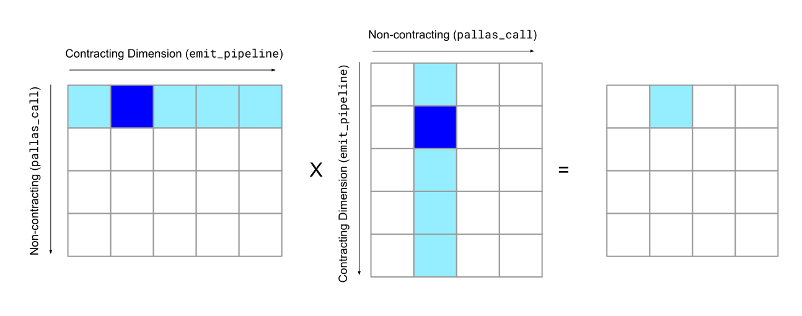
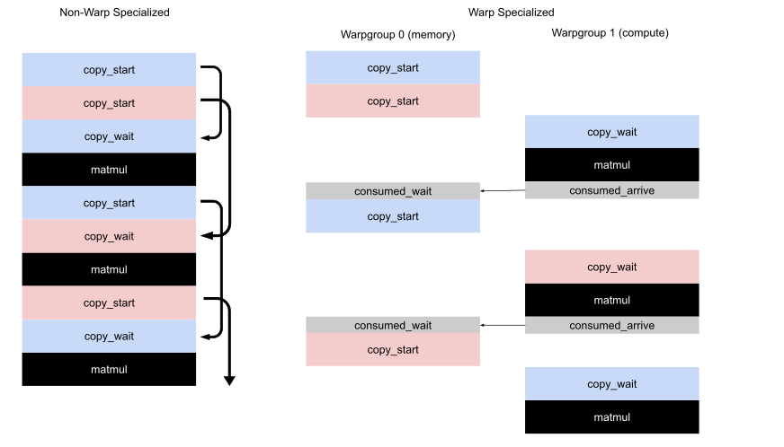
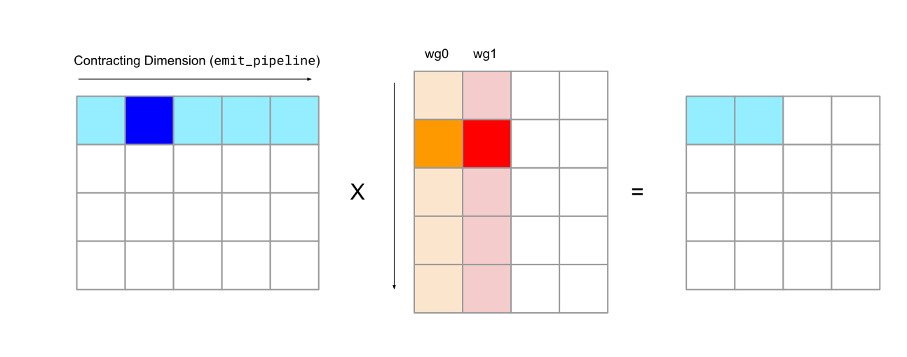

---
jupyter:
  jupytext:
    formats: ipynb,md
    main_language: python
    text_representation:
      extension: .md
      format_name: markdown
      format_version: '1.3'
      jupytext_version: 1.16.4
  kernelspec:
    display_name: Python 3
    name: python3
---

<!-- #region id="bJ5yuIr-M0x0" -->
## Mosaic GPU Pipelining

This guide covers software pipelining using the Mosaic GPU backend for Pallas.

For a general overview of the pipelining API in Pallas, we recommend that users first read the [Pallas Pipelining API](https://docs.jax.dev/en/latest/pallas/pipelining.html#pallas-pipelining-api). Pipelining in Pallas is programmed explicitly. For those who are familiar with Triton, this is a significant difference in programming model because in Triton, pipelining is an optimization that is inferred automatically by the compiler.

<!-- #endregion -->

```python id="dGAa3iO5DoRT"
import jax
from jax import lax
from jax import numpy as jnp
from jax.experimental.pallas import mosaic_gpu as plgpu
from jax.experimental import pallas as pl
import numpy as np
```

<!-- #region id="Pv9j90hVyswo" -->

### Pipelining with Mosaic GPU


While the Mosaic GPU backend supports pipelining via `pl.pallas_call`, the recommended approach is to use the `emit_pipeline` function to pipeline over sequential loops, and to use `pl.pallas_call` to partition the problem in parallel over the CUDA grid. `emit_pipeline` follows the same API as `pl.pallas_call` except it exposes a few additional GPU-specific options.

```python
def emit_pipeline(
    body: Callable[..., None],
    *,
    grid: tuple[int, ...],
    in_specs: Sequence[pallas_core.BlockSpec] = (),
    out_specs: Sequence[pallas_core.BlockSpec] = (),
    max_concurrent_steps: int,
    delay_release: int,
) -> Callable:
```

- `body`, `grid` have the same semantics as in `pl.pallas_call`. The `grid` denotes how many invocations of the `body` function to run. In contrast with a CUDA grid, the pipeline grid is guaranteed to run sequentially.
- `in_specs` and `out_specs` also work the same as `pl.pallas_call`, except they also accept `plgpu.GPUBlockSpec` instances that can be used specify GPU-specific transforms, such as swizzling. See [memory reference transforms](https://docs.jax.dev/en/latest/pallas/gpu/reference.html#memory-reference-transforms) for more detail on available transformations.
- `max_concurrent_steps` controls the maximum number of pipeline stages to use. Using additional stages will consume more SMEM to hold temporary buffers, so this option should be used carefully.
- `delay_release` allows the user to specify the number of steps to wait before re-using a buffer. This is useful for certain optimizations such as allowing multiple async matmuls in flight to keep the tensor core pipeline filled.


As an alternative to `emit_pipeline`, Mosaic GPU also implements the existing `pl.pallas_call` API for pipelining. Pipelining with `pl.pallas_call` directly requires the user to pass in a `plgpu.GPUCompilerParams` object as the `compiler_params` argument, which specifies the following options that are relevant for pipelining:
- `dimension_semantics`: A tuple of `Literal['parallel', 'sequential']` that specifies iteration semantics for each grid dimension. `parallel` will partition the corresponding dimension over the CUDA grid, and `sequential` dimensions will be pipelined sequentially. **Note that if no dimensions are marked `sequential`, no pipelining will happen!**
- `max_concurrent_steps`: the number of pipeline stages; identical to the option in `emit_pipeline`.
- `delay_release`: the number of steps to wait before buffer re-use; idential to the option in `emit_pipeline`.


<!-- #endregion -->

<!-- #region id="Qp3X6wylJtoa" -->
### GPU Memory Spaces

Refs can exist in one of 3 memory spaces, specified by passing in the appropriate memory space into the `BlockSpec`, i.e. `BlockSpec(memory_space=plgpu.GPUMemorySpace.GMEM)`.

- `plgpu.GPUMemorySpace.SMEM` allocates a Ref in Shared Memory (SMEM). SMEM Refs can be dereferenced using array indexing syntax to store values in registers for compute, i.e. `x = y_ref[...]`.

- `plgpu.GPUMemorySpace.GMEM` allocates a Ref in Global Memory (GMEM/HBM). Any Refs allocated in GMEM are not pipelined, and values cannot be accessed directly using array indexing operations. Instead, GMEM must be accessed via SMEM using `plgpu.copy_gmem_to_smem` for reading, or `plgpu.copy_smem_to_gmem` for writing, or pipelined into SMEM using `plgpu.emit_pipeline`.

- `plgpu.GPUMemroySpace.TMEM` allocates a Ref in Tensor Memory (TMEM). This is a TensorCore Gen 5 (Blackwell) feature for storing arguments and results of asynchronous matrix multiplication instructions. Like GMEM, TMEM cannot be accessed directly but must first be copied to/from SMEM.

The primary purpose of `emit_pipeline` is used to overlap TensorCore computation with data transfers between GMEM and SMEM, since asynchronous copies between GMEM/SMEM have a long latency, but all TensorCore computation must happen in registers or SMEM Refs.
<!-- #endregion -->

<!-- #region id="0uzcrDCtKABQ" -->
### Example: Matmul Kernel on Hopper GPUs
<!-- #endregion -->

<!-- #region id="vILVdlqEdoEK" -->
Let's begin with a matrix multiplication example designed to run on Hopper GPUs. This kernel utilizes the Hopper-specific `wgmma` (warpgroup matrix multiply accumulate) instruction, which issues a matrix multiplication that runs asynchronously on the TensorCore. Under the hood, `wgmma` is a warpgroup-level instruction in which all 128 CUDA threads in a warpgroup collectively issue a matrix multiplication command. But since a program "thread" in Mosaic GPU conveniently corresponds to a warpgroup, all details of `wgmma` at the CUDA thread level are abstracted away.

This kernel implements a blockwise matrix multiplication of two matrices of shape `[M, K] @ [K, N] = [M, N]`, where each output block is computed in parallel over the CUDA grid. This grid is specified as the `grid` argument to the outer `pl.pallas_call`, and iterates over the non-contracting dimensions M, N of the matrix multiplication.
<!-- #endregion -->

<!-- #region id="KSvqVNdy726B" -->



<!-- #endregion -->

<!-- #region id="10ebHCQ571Fn" -->

Within a block, we run a sequential pipeline using `plgpu.emit_pipeline` that reduces over the contracting dimension K of the matrix multiplication. On each iteration of the pipeline, we load one tile from each input matrix, multiply them, and then store the result in an accumulator Ref (`plgpu.ACC`). `plgpu.ACC` is a special type of Ref that lives in registers and holds the intermediate results of WGMMA. Once we have accumulated over the entire contracting dimension, we write out the result to the output Ref.

To perform the actual matrix multiplication, we call `plgpu.wgmma` with the accumulator, LHS, and RHS sides as arguments in order to push the arguments into the TensorCore pipeline. Since `wgmma` is an asynchronous instruction, `plgpu.wgmma_wait(N)` is used to wait until there are no more than N `wgmma` operations left in-flight. In this particular implementation we wait for 1 in-flight WGMMA, meaning that the WGMMA we queue on the current iteration will be waited for on the next iteration.
- `wgmma` wants it's arguments to be in a specific format, defined in the [CUDA documentation](https://docs.nvidia.com/cuda/parallel-thread-execution/#register-fragments-and-shared-memory-matrix-layouts). These are implemented by the `TilingTransform` and `SwizzleTransform` transformations on the input BlockSpecs.
- We use the `delay_release` parameter in conjunction with `plgpu.wgmma_wait(1)` to always allow one `WGMMA` operation to stay in-flight in order to ensure good TensorCore utilization. Without this, we would be flushing the TensorCore pipeline on every iteration of the kernel.
<!-- #endregion -->

```python id="6Vf5_VA9iCD1"
def matmul(a, b, tile_m=128, tile_n=128, swizzle=128):
  dtype = jnp.float16
  elems_128b = swizzle // jnp.dtype(dtype).itemsize
  tile_k = elems_128b
  grid_m = m // tile_m
  grid_k = k // tile_k
  grid_n = n // tile_n
  assert tile_m % elems_128b == 0

  transforms = (
          plgpu.TilingTransform((8, elems_128b)),
          plgpu.SwizzleTransform(128),
      )

  def kernel(a_gmem, b_gmem, o_smem, acc):
    def kernel_body(_, a_smem, b_smem):
      plgpu.wgmma(acc, a_smem, b_smem)
      plgpu.wgmma_wait(1)

    # pl.program_id obtains the index into the pallas_call grid.
    pid_m = pl.program_id(0)
    pid_n = pl.program_id(1)
    plgpu.emit_pipeline(
        kernel_body,
        in_specs=[
            plgpu.GPUBlockSpec(
                (tile_m, tile_k), lambda k: (pid_m, k), transforms=transforms
            ),
            plgpu.GPUBlockSpec(
                (tile_k, tile_n), lambda k: (k, pid_n), transforms=transforms
            ),
        ],
        grid=(grid_k,),
        max_concurrent_steps=2,
        delay_release=1,
    )(a_gmem, b_gmem)

    o_smem[...] = acc[...].astype(dtype)

  return pl.pallas_call(
      kernel,
      in_specs=[
          pl.BlockSpec(memory_space=plgpu.GMEM),
          pl.BlockSpec(memory_space=plgpu.GMEM),
      ],
      out_specs=plgpu.GPUBlockSpec(
          (tile_m, tile_n), lambda m, n: (m, n), transforms=transforms
      ),
      out_shape=jax.ShapeDtypeStruct((m, n), jnp.float16),
      scratch_shapes=[plgpu.ACC((tile_m, tile_n), jnp.float32)],
      grid=(grid_m, grid_n),
  )(a, b)

m = 132 * 128
n = 4 * 128
k = 10 * 64
key1, key2 = jax.random.split(jax.random.key(42), 2)
a = jax.random.uniform(key1, shape=(m, k), dtype=jnp.float16)
b = jax.random.uniform(key2, shape=(k, n), dtype=jnp.float16)

result = matmul(a, b)

np.testing.assert_allclose(result, a @ b)
```

<!-- #region id="lIYV7PN9J8Px" -->
### Warp Specialization

Warp specialization is a technique where we program each warp/warpgroup to perform a single task in order to give the GPU hardware the flexibility to schedule them at runtime. Recall that each streaming multiprocessor (SM) in a GPU contains warp schedulers that can swap execution between warps, so for example when one warp is blocked it can begin executing a different warp. In practice, this can be more performant than programming a single instruction stream and having the compiler statically schedule the operations to overlap the instructions them optimally.

In particular, we are interested in warpgroup specialization on Hopper+ GPUs, where we have a separate thread issuing TMAs (GMEM/SMEM copies) from the threads performing arithmetic, since indexing calculations and issuing TMAs can take up a significant amount of time and potentially leave the TensorCore idle. The figure below depicts a standard, non-specialized kernel on the left where TMAs (async copies) and matrix multiplication are written to a single instruction stream, and a warp-specialized version on the right where communication and arithmetic are handled on separate warpgroups. A *consumed barrier* is used to synchronize between the specialized warpgroups that signals to the memory thread when it is safe to begin the next TMA.


<!-- #endregion -->

<!-- #region id="n-y90IC7v7vL" -->



<!-- #endregion -->

<!-- #region id="ZH0Pui5kFSdD" -->
Warp specialization can be enabled in Pallas by using the `plgpu.emit_pipeline_warp_specialized` helper. It shares the a similar API as the standard `emit_pipeline`, and currently supports the following arguments:

```python
plgpu.emit_pipeline_warp_specialized(
  body: Callable,
  *
  grid: tuple[int, ...],
  in_specs: Sequence[pallas_core.BlockSpec] = (),
  out_specs: Sequence[pallas_core.BlockSpec] = (),
  max_concurrent_steps: int,
  carry_coroutine: Callable
  num_compute_wgs: int,
  memory_registers: int
  wg_axis: str,
  memory_thread_idx: int | None = None,
)
```

There are a few arguments specific to this pipeline emitter, which are:
- `num_compute_wgs` specifies how many compute threads to use. The pipeline emitter always uses a single memory thread.
- `memory_registers` controls how many registers to allocate to the memory thread. The remaining registers are partitioned evenly amongst the compute threads.
- `wg_axis` the name of the warpgroup axis (as specified by the `thead_name` argument of `GPUMesh`).
- `memory_thread_idx` specifies which thread to designate as the memory thread. Defaults to the last thread.
- `carry_coroutine` is a Python coroutine that enables you to carry values in registers through the pipeline. The coroutine runs only on the compute threads and defines the initialization of the carry and consumption of the final carry. All compute thread specific arrays should be instantiated here so the memory thread does not materialize them in registers -- otherwise, you may experience slowdowns due to register spills.

The kernel body of the warp specialized pipeline is run in parallel by all compute warpgroups, and SMEM is shared between compute warpgroups since they are scheduled within the same CUDA block.`lax.axis_index` can be used inside the kernel to obtain the warpgroup ID in order to divide up work amongst compute warpgroups.

<!-- #endregion -->

<!-- #region id="ZGbK5gIvFZKy" -->
### Example: Matrix Multiplication with Warp Specialization

The following example extends the previous matrix multiplication example to use warp specialization. This particular kernel uses 2 compute warpgroups, which operate on separate columns of the RHS matrix but share the same LHS. Each invocation of the pipeline therefore computes 2 adjacent blocks in the output matrix.

<!-- #endregion -->

<!-- #region id="NYWBqa9-bp2p" -->



<!-- #endregion -->

<!-- #region id="OkWmfqn7b53M" -->
We use the `carry_coroutine` pattern to initialize the WGMMA accumulator, and copy the final accumulator from registers into SMEM. Here, the carry coroutine is defined in the function `compute_thread`. It is critical that the accumulator be created inside of the `compute_thread` function to avoid allocating it in the memory thread which would waste registers. To perform the. WGMMA, we wrap the `wgmma` instruction in a `pl.run_state` in order to create an accumulator ref that is initialized to the carry value.

Instead of using `pl.pallas_call` to call the kernel, we instead use the GPU-specific `plgpu.kernel` entry point. `plgpu.kernel` allows us to specify the number of warpgroups to launch per CUDA block via the `num_threads` argument, and allows us to specify a `thread_name` we can use to query the warpgroup index inside of the kernel.

<!-- #endregion -->

```python id="EJhWnwJlFGaT"
def matmul_warp_specialized(a, b, tile_m=128, tile_n=128, swizzle=128,
                            compute_wgs=2):
  dtype = jnp.float16
  elems_128b = swizzle // jnp.dtype(dtype).itemsize
  tile_k = elems_128b
  grid_m = m // tile_m
  grid_k = k // tile_k
  grid_n = n // tile_n
  assert tile_m % elems_128b == 0

  transforms = (
          plgpu.TilingTransform((8, elems_128b)),
          plgpu.SwizzleTransform(128),
      )

  def kernel(a_gmem, b_gmem, o_gmem, o_smem):
    wg_idx = lax.axis_index("wg")
    wg_slice = pl.ds(wg_idx * tile_n, tile_n)
    # pl.program_id obtains the index into the pallas_call grid.
    pid_m = pl.program_id(0)
    pid_n = pl.program_id(1)

    def compute_thread():
      acc = plgpu.layout_cast(
          jnp.full((tile_m, tile_n), 0, dtype=jnp.float32), plgpu.Layout.WGMMA,
      )
      # yield returns execution to the pipelined loop and returns
      # the final carry.
      final_acc, = yield (acc,)
      o_smem[:, wg_slice] = final_acc[...].astype(dtype)

    def kernel_body(_, a_smem, b_smem, carry):
      acc, = carry
      b_smem_wg = b_smem.at[:, wg_slice]
      def do_wgmma(acc_ref):
        plgpu.wgmma(acc_ref, a_smem, b_smem_wg)
      acc = pl.run_state(do_wgmma)(
                          plgpu.ACC.init(acc))
      return (acc,)

    pipeline = plgpu.emit_pipeline_warp_specialized(
        kernel_body,
        in_specs=[
            plgpu.GPUBlockSpec(
              (tile_m, tile_k), lambda k: (pid_m, k), transforms=transforms
            ),
            plgpu.GPUBlockSpec(
              (tile_k, tile_n * 2), lambda k: (k, pid_n),transforms=transforms
            ),
        ],
        grid=(grid_k,),
        carry_coroutine=compute_thread,
        max_concurrent_steps=2,
        num_compute_wgs=compute_wgs,
        memory_registers=40,
        memory_thread_idx=2,
        wg_axis="wg",
    )
    # Call the pipeline
    pipeline(a_gmem, b_gmem)
    # Copy the output from SMEM to GMEM.
    plgpu.commit_smem()
    m_slice = pl.ds(pid_m * tile_m, tile_m)
    n_slice = pl.ds(pid_n * tile_n * 2, tile_n * 2)
    plgpu.copy_smem_to_gmem(o_smem, o_gmem.at[m_slice, n_slice])
    plgpu.wait_smem_to_gmem(0)

  return plgpu.kernel(
      kernel,
      out_shape=jax.ShapeDtypeStruct((m, n), jnp.float16),
      scratch_shapes=[
          plgpu.SMEM((tile_m, tile_n * 2), jnp.float16)
          ],
      grid=(grid_m, grid_n // 2),
      grid_names=("m", "n"),
      num_threads=3,  # 2 compute, 1 memory.
      thread_name="wg"
  )(a, b)

m = 132 * 128
n = 4 * 128
k = 10 * 64
key1, key2 = jax.random.split(jax.random.key(42), 2)
a = jax.random.uniform(key1, shape=(m, k), dtype=jnp.float16)
b = jax.random.uniform(key2, shape=(k, n), dtype=jnp.float16)

result = matmul_warp_specialized(a, b)

np.testing.assert_allclose(result, a @ b)
```
