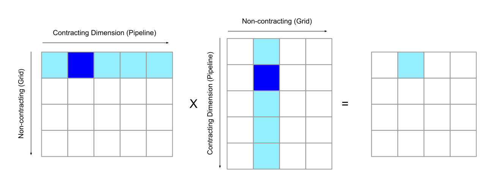

---
jupyter:
  jupytext:
    formats: ipynb,md
    main_language: python
    text_representation:
      extension: .md
      format_name: markdown
      format_version: '1.3'
      jupytext_version: 1.16.4
  kernelspec:
    display_name: Python 3
    name: python3
---

<!-- #region id="9552ee76" -->
(pallas_mgpu_pipelining)=
<!-- #endregion -->
<!-- #region id="bJ5yuIr-M0x0" -->

## Mosaic GPU Pipelining

This guide covers software pipelining using the Mosaic GPU backend for Pallas.

For a general overview of the pipelining API in Pallas, we recommend that users first read {ref}`pallas_software_pipelining`. Pipelining in Pallas is programmed explicitly. For those who are familiar with Triton, this is a significant difference in programming model because in Triton, pipelining is an optimization that is done automatically by the compiler.

<!-- #endregion -->

```python id="dGAa3iO5DoRT"
import jax
from jax import lax
from jax import numpy as jnp
from jax.experimental.pallas import mosaic_gpu as plgpu
from jax.experimental import pallas as pl
import numpy as np
```

<!-- #region id="Pv9j90hVyswo" -->

### Pipelining with Mosaic GPU

The recommended approach to pipeline using Mosaic GPU is to use the `plgpu.emit_pipeline` function to pipeline over sequential loops (and to use `plgpu.kernel` to partition the problem in parallel over the CUDA grid). `emit_pipeline` follows a similar API as `pl.pallas_call` except it exposes a few additional GPU-specific options.

- `body`, `grid` have similar semantics as in `pl.pallas_call`. The `grid` denotes how many invocations of the `body` function to run. In contrast with a CUDA grid, the pipeline grid is guaranteed to run sequentially.
- `in_specs` and `out_specs` also work similarly to `pl.pallas_call`, except they also accept `plgpu.BlockSpec` instances that can be used specify GPU-specific transforms, such as swizzling. See [memory reference transforms](https://docs.jax.dev/en/latest/pallas/gpu/reference.html#memory-reference-transforms) for more detail on available transformations.
- `max_concurrent_steps` controls the maximum number of concurrent memory transfers. Using additional concurrent steps will consume more SMEM to hold temporary buffers, but it can improve the utilization of the memory subsystem. We recommend autotuning this parameter. Low values (e.g. 2) can sometimes achieve higher occupancy (due to lower SMEM usage) which can improve throughput in ALU-heavy kernels, but will introduce more noise due to the hardware taking care of scheduling. Larger values (between 4 and 6) will work best for kernels that can't take advantage of extra occupancy
- `delay_release` allows the user to specify an additional number of iterations to wait before the buffer is re-used by the pipeline. For example, a buffer copied into SMEM on iteration 0 with `delay_release=1` and `max_concurrent_steps=2` will not be re-used until iteration 3, as opposed to iteration 2 for a standard double-buffered strategy. `delay_release=1` is necessary if you don't await a `plgpu.wgmma` operation on the pipeline operands, as otherwise the pipeline will begin overwriting the buffers while the WGMMA is still reading them. This is useful for certain optimizations such as allowing multiple async matmuls in flight to keep the tensor core pipeline filled, but care must be taken when using such a strategy as **omitting this parameter will silent data races**, and it reduces the efficiency of `emit_pipeline` as we are overlapping fewer memory transfers.

#### Compatibility API using `pl.pallas_call`

As an alternative to `emit_pipeline` and to maintain compatibility with Pallas TPU, Mosaic GPU also implements the existing `pl.pallas_call` API. By default, `pl.pallas_call` on Mosaic GPU will partition your kernel in parallel over the CUDA grid. You can opt-in to pipelining by passing in a `plgpu.CompilerParams` object as the `compiler_params` argument, which specifies the following options that are relevant for pipelining:
- `dimension_semantics`: A tuple of `Literal['parallel', 'sequential']` that specifies iteration semantics for each grid dimension. `parallel` will partition the corresponding dimension over the CUDA grid, and `sequential` dimensions will be pipelined sequentially. **Note that if no dimensions are marked `sequential`, no pipelining will happen!**
- `max_concurrent_steps`: identical to the option in `plgpu.emit_pipeline`.
- `delay_release`: identical to the option in `plgpu.emit_pipeline`.

Pipelining lets you re-use scratch buffers across the sequential iterations of the grid (e.g. for implementing reductions). Additionally, `pallas_call` supports using `plgpu.BlockSpec` objects in place of `pl.BlockSpec` objects when using the Mosaic GPU backend, allowing you to specify GPU-specific memory transformations.

We recommend that users use `plgpu.kernel` rather than `pl.pallas_call` as `plgpu.kernel` supports more features (such as specifying the number of warpgroups and warp specialization).

<!-- #endregion -->

<!-- #region id="Qp3X6wylJtoa" -->
### GPU Memory Spaces

Refs exist primarily in one of two memory spaces, which can be explicitly specified by the `memory_space` argument of `BlockSpec`, i.e. `BlockSpec(memory_space=plgpu.GPUMemorySpace.GMEM)`.

- `plgpu.GPUMemorySpace.SMEM` allocates a Ref in Shared Memory (SMEM). SMEM Refs can be dereferenced using array indexing syntax to store values in registers for compute, i.e. `x = y_ref[...]`. This memory space used for a Ref when using `emit_pipeline`.

- `plgpu.GPUMemorySpace.GMEM` allocates a Ref in Global Memory (GMEM/HBM). Any Refs allocated in GMEM are not pipelined, and values cannot be accessed directly using array indexing operations. Instead, GMEM must be accessed via SMEM using `plgpu.copy_gmem_to_smem` for reading, or `plgpu.copy_smem_to_gmem` for writing, or pipelined into SMEM using `plgpu.emit_pipeline`.

The primary purpose of `emit_pipeline` is used to overlap TensorCore computation with data transfers between GMEM and SMEM, since asynchronous copies between GMEM/SMEM have a long latency, but all TensorCore computation must operate on registers (or SMEM Refs in the case of matrix multiplication).
<!-- #endregion -->

<!-- #region id="0uzcrDCtKABQ" -->
### Example: Matmul Kernel on Hopper GPUs
<!-- #endregion -->

<!-- #region id="vILVdlqEdoEK" -->
Let's begin with a matrix multiplication example designed to run on Hopper GPUs. This kernel utilizes the Hopper-specific `wgmma` (warpgroup matrix multiply accumulate) instruction. `wgmma` is issued by a single Mosaic GPU thread and runs asynchronously on the TensorCore.

Our example kernel implements a blockwise matrix multiplication of two matrices of shape `[M, K] @ [K, N] = [M, N]`, where each output block is computed in parallel over the CUDA grid. This grid is specified as the `grid` argument to the outer `plgpu.kernel`, and parallelizes over the non-contracting dimensions M, N of the matrix multiplication.
<!-- #endregion -->

<!-- #region id="KSvqVNdy726B" -->

<center></center>

<!-- #endregion -->

<!-- #region id="10ebHCQ571Fn" -->

Within a program instance, we run a sequential pipeline using `plgpu.emit_pipeline` that reduces over the contracting dimension K of the matrix multiplication. On each iteration of the pipeline, we load one tile from each input matrix, multiply them, and then store the result in an accumulator Ref (`plgpu.ACC`). `plgpu.ACC` is a special type of Ref that lives in registers and holds the intermediate results of WGMMA. Once we have accumulated over the entire contracting dimension, we write out the result to the output Ref.

To perform the actual matrix multiplication, we call `plgpu.wgmma` with the accumulator, LHS, and RHS Refs as arguments in order to push the arguments into the TensorCore pipeline. All WGMMA operations are executed in order, so this can be viewed as pushing operations into a queue. Since `wgmma` is an asynchronous instruction, `plgpu.wgmma_wait(N)` is used to wait until there are no more than N `wgmma` operations left in-flight. In this particular implementation we wait for 1 in-flight WGMMA, meaning that the WGMMA we queue on the current iteration will be waited for on the next iteration.
- `wgmma` wants it's arguments to be in a specific format, defined in the [CUDA documentation](https://docs.nvidia.com/cuda/parallel-thread-execution/#register-fragments-and-shared-memory-matrix-layouts). These are implemented by the `TilingTransform` and `SwizzleTransform` transformations on the input BlockSpecs. Note that in the future transforms will be inferred automatically by Mosaic GPU and these will not need to be manually specified. See the [wgmma reference](https://docs.jax.dev/en/latest/pallas/gpu/reference.html#hopper-wgmma) for full details on using this instruction.
- We use the `delay_release` parameter in conjunction with `plgpu.wgmma_wait(1)` to always allow one `WGMMA` operation to stay in-flight in order to ensure good TensorCore utilization. Without this, we would be flushing the TensorCore pipeline on every iteration of the kernel.
<!-- #endregion -->

```python id="6Vf5_VA9iCD1"
def matmul(a, b, tile_m=128, tile_n=128, swizzle=128):
  dtype = jnp.float16
  swizzle_elems = swizzle // jnp.dtype(dtype).itemsize
  tile_k = swizzle_elems
  grid_m = m // tile_m
  grid_k = k // tile_k
  grid_n = n // tile_n
  assert tile_m % swizzle_elems == 0

  # Note: Transforms will be inferred automatically
  # by Mosaic GPU in the future.
  transforms = (
    plgpu.TilingTransform((8, swizzle_elems)),
    plgpu.SwizzleTransform(swizzle),
  )

  def kernel(a_gmem, b_gmem, o_gmem, o_smem, acc):
    def pipeline_step(_, a_smem, b_smem):
      plgpu.wgmma(acc, a_smem, b_smem)
      plgpu.wgmma_wait(1)

    # pl.program_id obtains the index into the grid.
    pid_m = pl.program_id(0)
    pid_n = pl.program_id(1)

    pipeline = plgpu.emit_pipeline(
        pipeline_step,
        in_specs=[
            plgpu.BlockSpec(
                (tile_m, tile_k), lambda k: (pid_m, k), transforms=transforms
            ),
            plgpu.BlockSpec(
                (tile_k, tile_n), lambda k: (k, pid_n), transforms=transforms
            ),
        ],
        grid=(grid_k,),
        max_concurrent_steps=2,
        delay_release=1,
    )

    pipeline(a_gmem, b_gmem)
    # Store WGMMA accumulator to SMEM and then to GMEM.
    o_smem[...] = acc[...].astype(dtype)
    plgpu.commit_smem()
    m_slice = pl.ds(pid_m * tile_m, tile_m)
    n_slice = pl.ds(pid_n * tile_n, tile_n)
    plgpu.copy_smem_to_gmem(o_smem, o_gmem.at[m_slice, n_slice])
    plgpu.wait_smem_to_gmem(0)

  return plgpu.kernel(
      kernel,
      out_shape=jax.ShapeDtypeStruct((m, n), jnp.float16),
      scratch_shapes=dict(
          o_smem=plgpu.SMEM((tile_m, tile_n), jnp.float16),
          acc=plgpu.ACC((tile_m, tile_n), jnp.float32)
      ),
      # grid specifies the CUDA grid.
      # Instances of `kernel` will be executed in parallel over this grid.
      grid=(grid_m, grid_n),
      grid_names=("m", "n"),
  )(a, b)

m = 132 * 128
n = 4 * 128
k = 10 * 64
key1, key2 = jax.random.split(jax.random.key(42), 2)
a = jax.random.uniform(key1, shape=(m, k), dtype=jnp.float16)
b = jax.random.uniform(key2, shape=(k, n), dtype=jnp.float16)

result = matmul(a, b)

np.testing.assert_allclose(result, a @ b)
```

<!-- #region id="lIYV7PN9J8Px" -->
### Warp Specialization

Warp specialization is a technique where we program each warp/warpgroup to perform a single task in order to give the GPU hardware the flexibility to schedule them at runtime. Recall that each streaming multiprocessor (SM) in a GPU contains warp schedulers that can swap execution between warps, so for example when one warp is stalling it can begin executing a different warp. In practice, this can be more performant than programming a single instruction stream where the compiler must statically schedule the operations and attempt to overlap them optimally.

In particular, we are interested in warpgroup specialization on Hopper+ GPUs, where it can be useful to have a separate warpgroup issuing TMAs (GMEM/SMEM copies) from the warpgroups performing arithmetic, since indexing calculations and issuing TMAs can take up a significant amount of time and potentially leave the TensorCore idle. The figure below depicts a standard, non-specialized kernel on the left where TMAs (async copies) and matrix multiplication are issued from a single instruction stream, and a warp-specialized version on the right where communication and arithmetic are handled on separate warpgroups. A *consumed barrier* is used to synchronize between the specialized warpgroups that signals to the memory warpgroup when it is safe to begin the next TMA.


<!-- #endregion -->

<!-- #region id="n-y90IC7v7vL" -->

<center></center>


<!-- #endregion -->

<!-- #region id="ZH0Pui5kFSdD" -->
Warp specialization can be enabled in Pallas by using the `plgpu.emit_pipeline_warp_specialized` helper. This pipeline helper handles all of the logic in the memory thread, and the user only needs to specify the work done in the compute threads. It shares the a similar API as the standard `emit_pipeline`, and currently supports the following arguments:

```python
plgpu.emit_pipeline_warp_specialized(
  body: Callable,
  *
  grid: tuple[int, ...],
  in_specs: Sequence[pallas_core.BlockSpec] = (),
  out_specs: Sequence[pallas_core.BlockSpec] = (),
  max_concurrent_steps: int,
  compute_context: Callable
  num_compute_wgs: int,
  memory_registers: int
  wg_axis: str,
  memory_thread_idx: int | None = None,
)
```

There are a few arguments specific to this pipeline emitter, which are:
- `num_compute_wgs` specifies how many compute threads/warpgroups to use. The pipeline emitter always uses a single memory thread, so in `plgpu.kernel` you should specify `num_threads=num_compute_wgs+1`.
- `memory_registers` controls how many registers to allocate to the memory thread. The remaining registers are partitioned evenly among the compute threads. The default value is 40 and should be adjusted up or down depending on whether register spills are encountered.
- `wg_axis` the name of the thread/warpgroup axis (as specified by the `thead_name` argument of `plgpu.kernel`).
- `memory_thread_idx` specifies which Pallas thread to designate as the memory thread. Defaults to the last thread.
- `compute_context` is a enables you to specify a prologue/epilogue to the pipeline that only runs in the compute thread. The function allows you to define the initialization and consumption of a loop carry through the pipeline. All compute thread specific arrays should be instantiated here so the memory thread does not materialize them in registers -- otherwise, you may experience slowdowns due to register spills.

The pipeline body of the warp specialized pipeline is run in parallel by all compute threads, and SMEM is shared between compute threads since they are scheduled within the same CUDA block.`lax.axis_index` can be used inside the kernel to obtain the Pallas thread index in order to divide up work amongst compute threads.

<!-- #endregion -->

<!-- #region id="ZGbK5gIvFZKy" -->
### Example: Matrix Multiplication with Warp Specialization

The following example extends the previous matrix multiplication example to use warp specialization. This particular kernel uses 2 compute threads, which operate on separate columns of the RHS matrix but share the same LHS. Each invocation of the pipeline therefore computes 2 adjacent blocks in the output matrix.

<!-- #endregion -->

<!-- #region id="NYWBqa9-bp2p" -->

<center></center>

<!-- #endregion -->

<!-- #region id="OkWmfqn7b53M" -->
We use the `compute_context` pattern to initialize the WGMMA accumulator, and copy the final accumulator from registers into SMEM. Here, the compute context is defined in the function `compute_thread`. It is critical that the accumulator be created inside of the `compute_thread` function to avoid allocating it in the memory thread which would waste registers. To perform the WGMMA, we wrap the `wgmma` instruction in a `pl.run_state` in order to create an accumulator ref that is initialized to the carry value.

Instead of using `pl.pallas_call` to call the kernel, we instead use the GPU-specific `plgpu.kernel` entry point. `plgpu.kernel` allows us to specify the number of threads to launch per CUDA block via the `num_threads` argument, and allows us to specify a `thread_name` we can use to query the Pallas thread index inside of the kernel.

<!-- #endregion -->

```python id="EJhWnwJlFGaT"
def matmul_warp_specialized(a, b, tile_m=128, tile_n=128, swizzle=128,
                            compute_wgs=2):
  dtype = jnp.float16
  elems_128b = swizzle // jnp.dtype(dtype).itemsize
  tile_k = elems_128b
  grid_m = m // tile_m
  grid_k = k // tile_k
  grid_n = n // tile_n
  assert tile_m % elems_128b == 0

  transforms = (
          plgpu.TilingTransform((8, elems_128b)),
          plgpu.SwizzleTransform(128),
      )

  def kernel(a_gmem, b_gmem, o_gmem, o_smem):
    wg_idx = lax.axis_index("wg")
    wg_slice = pl.ds(wg_idx * tile_n, tile_n)
    # pl.program_id obtains the index into the pallas_call grid.
    pid_m = pl.program_id(0)
    pid_n = pl.program_id(1)

    def compute_thread(pipeline):
      acc = plgpu.layout_cast(
          jnp.full((tile_m, tile_n), 0, dtype=jnp.float32), plgpu.Layout.WGMMA,
      )
      # yield marks the place where the pipelined loop will be inserted.
      # Its argument are the initial carry values, and its result is the carry
      # value after the loop completes.
      final_acc = pipeline(acc)
      o_smem[:, wg_slice] = final_acc[...].astype(dtype)

    def kernel_body(_, a_smem, b_smem, carry):
      acc = carry
      b_smem_wg = b_smem.at[:, wg_slice]
      def do_wgmma(acc_ref):
        plgpu.wgmma(acc_ref, a_smem, b_smem_wg)
      acc = pl.run_state(do_wgmma)(
                          plgpu.ACC.init(acc))
      return acc

    pipeline = plgpu.emit_pipeline_warp_specialized(
        kernel_body,
        in_specs=[
            plgpu.BlockSpec(
              (tile_m, tile_k), lambda k: (pid_m, k), transforms=transforms
            ),
            plgpu.BlockSpec(
              (tile_k, tile_n * 2), lambda k: (k, pid_n),transforms=transforms
            ),
        ],
        grid=(grid_k,),
        compute_context=compute_thread,
        max_concurrent_steps=2,
        num_compute_wgs=compute_wgs,
        memory_registers=40,
        memory_thread_idx=2,
        wg_axis="wg",
    )
    # Call the pipeline
    pipeline(a_gmem, b_gmem)
    # Copy the output from SMEM to GMEM.
    plgpu.commit_smem()
    m_slice = pl.ds(pid_m * tile_m, tile_m)
    n_slice = pl.ds(pid_n * tile_n * 2, tile_n * 2)
    plgpu.copy_smem_to_gmem(o_smem, o_gmem.at[m_slice, n_slice])
    plgpu.wait_smem_to_gmem(0)

  return plgpu.kernel(
      kernel,
      out_shape=jax.ShapeDtypeStruct((m, n), jnp.float16),
      scratch_shapes=dict(
          o_smem=plgpu.SMEM((tile_m, tile_n * 2), jnp.float16)
      ),
      grid=(grid_m, grid_n // 2),
      grid_names=("m", "n"),
      num_threads=3,  # 2 compute, 1 memory.
      thread_name="wg"
  )(a, b)

m = 132 * 128
n = 4 * 128
k = 10 * 64
key1, key2 = jax.random.split(jax.random.key(42), 2)
a = jax.random.uniform(key1, shape=(m, k), dtype=jnp.float16)
b = jax.random.uniform(key2, shape=(k, n), dtype=jnp.float16)

result = matmul_warp_specialized(a, b)

np.testing.assert_allclose(result, a @ b)
```
