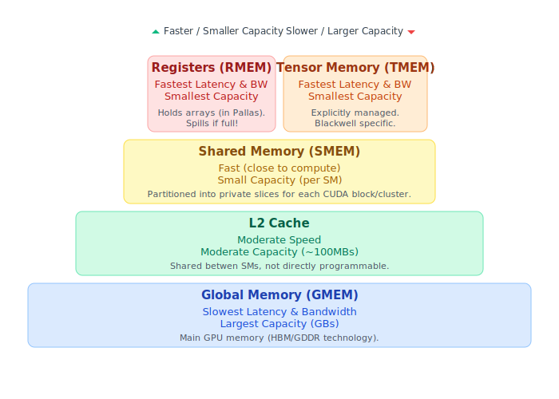
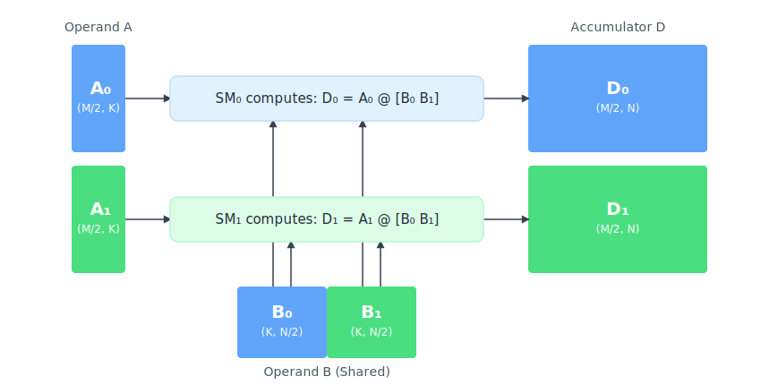

# Writing Mosaic GPU kernels with Pallas

This page is a reference for the most important features of the Pallas:MGPU backend.
It's not a tutorial and as such we do not expect everyone to read it top to bottom.
Still, it is worth going over
just to familiarise yourself with some patterns you can find in other tutorials.

In the following examples, we're going to assume the following imports are in scope:
```python
import jax.experimental.pallas as pl
import jax.experimental.pallas.mosaic_gpu as plgpu
```

## What is a GPU?

Technically, the NVIDIA GPU architecture looks as follows: the GPU is partitioned into
_streaming multiprocessors_ (SMs). The way this manifests in the CUDA programming model
is that each _CUDA thread block_ (or CTA) is scheduled on exactly one SM, but multiple
blocks can be scheduled onto a single SM at a time.

Each SM contains a chunk of fast memory called _shared memory_ (SMEM) and 4 subdivisions,
each containing a _warp scheduler_ and compute units (ALU, TensorCore, ...).
This is also reflected in the CUDA programs: each _warp_ (a group of consecutive 32 CUDA
threads in a block) is assigned to one of those subdivisions in a round-robin fashion.
Similarly to blocks, each warp is assigned to exactly one subdivision (it never migrates),
but multiple warps can be assigned to the same SM subdivision. At each clock cycle, the
warp scheduler from each subdivision tries to select one of its resident warps to execute
the next instruction.

<center></center>

Going further, recent CUDA versions also outline the concept of a _warpgroup_, which are
4 consecutive warps. Knowing how the hardware looks like, we can see where this is coming
from: 4 consecutive warps occupy the 4 quarters of an SM and let us issue instructions
that utilize the whole SM.

```{note}
A GPU can be viewed in many different ways and in here we want to focus on a slightly
simplified model that is very TensorCore-centric. This should help you navigate the
complexities of writing kernels involving the TensorCore, but keep in mind that the
real picture is more complicated.
```

For our purposes, TensorCore operations have grown so big that it no longer makes much
sense to follow the CUDA model. As such, to us, a GPU is a collection of single-threaded cores
(SMs) with one thread of Pallas:MGPU corresponding to a CUDA warpgroup. In this model, each
operation you perform in the kernel occupies the whole CUDA warpgroup, and its constituent
warps always run in lockstep (modulo the jitter from hardware scheduling) and never take
different paths through control flow (with the small exception of `core_map` that we will
discuss later). One notable addition here is that we still allow you to co-schedule multiple
of those Pallas-level threads on the same SM so that they can cooperate and communicate
through shared memory (we realize that by putting them in the same CUDA block).

```{note}
From now on, whenever we say "thread", we refer to the Pallas thread, not a CUDA thread/lane.
```

```{note}
This is very similar to a programming model popularized by [Triton](https://triton-lang.org/),
but as you will see there are a few differences. Mosaic GPU tends to be more low level,
which usually means you will have to put in more work, but it also puts you more in control.
In our view both approaches have their merits and we encourage you to pick the backend that
suits your needs the best! Pallas supports and will continue to support Triton as an alternative
GPU backend.
```

### In-order execution & using multiple hardware units

Unlike more complicated CPU architectures GPU only support in-order execution. That, however,
does not mean that at any given time only a single instruction is running! Each SM quarter
has multiple independent functional units: TensorCore, Arithmetic logic unit (ALU),
Load/Store (LSU), Special function unit (SFU).  If the first instruction targets one of the
units and is followed by another one (that does not use the result of the first one), then the
warp scheduler can issue the second one before the first one completes. This is often referred
to as instruction-level parallelism (ILP) and is a common theme in modern TensorCore kernels:
TensorCore operations are so big and take so many cycles to complete, that it is a waste to not
try to use other units in the meantime.

To extend this even further, we can take advantage of this hardware-unit-level parallelism by
allowing multiple Pallas threads to run concurrently. If one of the threads primarily
occupies the ALU, while another one primarily issues TensorCore related instructions, we can
take advantage of the efficient context switching built into the warp schedulers to keep both
units busy. This is one of the core idea behind algorithms such as [FlashAttention 3](https://arxiv.org/abs/2407.08608)
or [CUTLASS ping-pong matmul kernels](https://pytorch.org/blog/cutlass-ping-pong-gemm-kernel/).

For more information on how warp scheduling and instruction issue works, we recommend reading
[Analyzing Modern NVIDIA GPU cores](https://arxiv.org/abs/2503.20481).

### Memory spaces

The GPU features a few different memory spaces that can be totally ordered from largest (in
terms of capacity) and slowest (in both total bandwidth and latency of a single access).

<center></center>

The biggest memory space is `plgpu.GMEM`, for _global memory_. In recent data-center grade GPUs
this memory space is often measured in tens or even hudreds of gigabytes, but it is also the
slowest one.

The next memory space, used for the L2 cache, is also more or less global in the
sense that it is shared by the whole GPU, but its use can only be influenced indirectly through
cache hints. As such, there's no way to manually place values in there and so this memory space
is not exposed in Pallas:MGPU. While only about a 100MB in size, this memory has considerably
higher bandwidth than GMEM, and so it is still often recommended to take advantage of it while
writing high-performance kernels.

Next in line is _shared memory_, or `plgpu.SMEM`. This memory is located directly inside each SM
and so it is partitioned. Unless block clusters are used (see the section of clusters below),
each block is only allowed to access its own SMEM allocations.

Finally, the lowest level memory space is the _register memory_. This is where every single value
(i.e. JAX array) in a Pallas kernel will be located. If the compiler runs out of registers to
store those arrays, it will insert _spills_, meaning that it will periodically store and reload
values to memory. Those spills often introduce other significant performance degradations and so
we recommend avoiding them. The warning messages about spills can be clearly seen in the `ptxas`
messages during kernel compilation. To make them visible, run with `MOSAIC_GPU_DUMP_PTXAS=1`
in your environment.

The Blackwell GPU generation, has one additional memory space called _tensor memory_ or `plgpu.TMEM`.
TMEM is very similar to register memory, only it is explicitly allocated and managed by you.
It is used to store the MMA accumulator, operand metadata (for sparsity or scaling),
and optionally the left MMA operand. See the Blackwell MMA section for more information about TMEM.

#### Requesting/allocating memory in specific memory spaces

Kernel inputs or outputs are placed in SMEM by default. If you want to access them as GMEM references
add `memory_space=plgpu.GMEM` to their `BlockSpec`. If you want the kernel to be called with the whole
input or output array in GMEM, it is sufficient to specify `BlockSpec(memory_space=plgpu.GMEM)`.

`SMEM` and `TMEM` can be allocated explicitly in the `scratch_shapes` argument of `pl.pallas_call`,
or using `pl.run_scoped`. To allocate a reference, simply call the memory space object with the
requested shape and dtype.  For example: `plgpu.SMEM((128, 128), jnp.float16)` will allocate a 128x128
array of float16 elements in shared memory.

#### Taking advantage of the L2 cache

While the L2 cache cannot be managed manually, its noticeably higher bandwidth compared to global
memory makes it worth thinking about. The simplest way to take advantage of it, is to reorder
the parallel grid dimensions so that invocations that are scheduled in similar time periods also
access the same input data.

While the CUDA programming model does not guarantee anything about the order in which the blocks
are assigned to SMs, in recent generations the heuristic seems to simply iterate over the
`(x, y, z)` CUDA grids in column-major order (i.e. `x` is the fastest-changing dimension and
`z` is the slowest). Similarly, Pallas:MGPU does not guarantee how a user-specified grid is mapped to
the CUDA grid (Pallas supports grids of arbitrary rank, not just up to 3D). However, you can assume that
the iteration will happen in _row-major_ order. That is, if a grid has dimensions `(a, b)`, then
`b` will be the fastest-changing dimension and `a` will be the slower one.

To give a practical example of this, consider a plain matrix multiplication kernel. There, one
usually uses two parallel grid dimensions `(m, n)`, corresponding to tiling the two non-contracting
dimensions.  If we use this simple scheme, in Pallas:MGPU all programs with id `(0, ...)` will be
scheduled before any block with id `(1, ...)`. And, collectively, the programs with `m=0` have to
read all of the `B` operand! If the `n` or `k` dimensions are very large, there is no chance that
we'll be able to get cache hits from the `(1, ...)` programs from accesses made by the `(0, ...)`
programs. For simplicity, assuming we can only run 16 blocks at a time, we see this access pattern
from the first scheduled wave:

<center>
<object type="image/svg+xml" data="../../_static/pallas/gpu/grid_tiling_off.svg" style="padding-bottom: 10px;">
    Your browser does not support SVGs or scripting is disabled.
    This would be an image showing the access pattern of first 16 blocks without grid tiling.
</object>
</center>

However, if we simply rearrange the grid to be `(m // mt, n, mt)` (and then replace `pl.program_id(0)`
with `pl.program_id(0) * mt + pl.program_id(2)` in the kernel), it is straightforward to see that a
band of programs along both dimensions will be scheduled concurrently (instead of scheduling a single
row). This greatly increases the number of concurrent programs that load similar slices of data,
usually significantly improves the L2 utilization and hence the overall performance of the kernel
(if it was memory bound). Continuing our example with 16 blocks and using `mt=4`, we get the following
access pattern:

<center>
<object type="image/svg+xml" data="../../_static/pallas/gpu/grid_tiling_on.svg" style="padding-bottom: 10px;">
    Your browser does not support SVGs or scripting is disabled.
    This would be an image showing the access pattern of first 16 blocks with grid tiling.
</object>
</center>

Note that even though the number of active blocks hasn't changed, the total footprint of the data they
access has halved! We get a much higher chance of getting L2 hits now.

## Array layouts and memory reference transforms

In Pallas, the data structures you work with (arrays and references) have a
**logical shape** (e.g., a 128x128 matrix). This
logical shape must be mapped to a **physical representation** (how the data is
actually represented in the GPU's memory). The specific mapping depends on where the
data resides:

1.  **Array Layouts:** Arrays are stored in register memory and we call this mapping
    a _layout_. Layouts define how the elements of an array are
    distributed across the registers available to the CUDA lanes that form a Pallas thread.
2.  **Memory Reference Transforms:** For mutable references pointing
    to `SMEM`, this mapping is called a _transform_.
    Transforms describe how the logical data structure is arranged within that
    block of memory.

These concepts are crucial for performance, especially when interacting with
specialized hardware units like TensorCores or optimizing memory access
patterns.

```{note}
We are working on a mode that will deal with assigning layouts and transforms fully
automatically (although with way to provide hints and more control). The APIs listed
below will likely continue to function, but will become optional.
```

### Memory reference transforms

Transforms are applied when a memory reference is first allocated. Pallas
primitives that operate on these references will automatically account for their
associated transforms.

```
def body(..., scratch_ref):
  # Asynchronous copy will reformat the GMEM data to match the SMEM transforms
  plgpu.copy_gmem_to_smem(..., scratch_ref, barrier)
  barrier.wait()
  plgpu.wgmma(..., scratch_ref)  # wgmma only accepts properly transformed refs
  ...
```

There are two ways in which references are allocated and each has a way to select
the desired transforms:

**1. Using `plgpu.BlockSpec`**

```python
transforms = (plgpu.TileTransform((8, 64)), plgpu.SwizzleTransform(128))
f = pl.pallas_call(
  in_specs=plgpu.BlockSpec(in_block_shape, in_index_map, transforms=transforms),
  out_specs=plgpu.BlockSpec(out_block_shape, out_index_map, transforms=transforms),
  ...
)
```

Note that unlike `plgpu.BlockSpec`, `pl.BlockSpec` does *not* allow specifying
transforms.

**2. Specifying the `transforms` argument on the allocated `SMEM`**

```python
transforms = (plgpu.TileTransform((8, 64)), plgpu.SwizzleTransform(128))
f = pl.pallas_call(
  scratch_shapes=plgpu.SMEM((128, 128), jnp.float16, transforms=transforms),
  ...
)
```

The available transforms are:
* `plgpu.TileTransform(tile_shape)`, which organizes the data into contiguous,
  non-overlapping tiles of shape `tile_shape`.  The data of one tile is always
  fully linearized (row-major), before another tile begins (tiles are also
  traversed in row-major order). As an example, applying `TileTransform((8,
  64))` to a `(128, 128)` reference means the data corresponding to the logical
  slice `[0:8, 0:64]` will be stored first (row-major), followed by
  `[0:8, 64:128], [8:16, 0:64], [8:16, 64:128]`, and so on. A different way to achieve
  this would be to take the input array `x` and traverse
  `x.reshape(128 // 8, 128 // 64, 8, 64).transpose(0, 2, 1, 3)` in row-major order.
* `plgpu.SwizzleTransform(swizzle_in_bytes)`, which transforms the data as described in the
  [PTX docs](https://docs.nvidia.com/cuda/parallel-thread-execution/#tensor-swizzling-modes) and
  [CUDA docs](https://docs.nvidia.com/cuda/cuda-c-programming-guide/#the-swizzle-modes).
  Swizzling is useful, because it allows transferring data in MMA-related layouts
  between register and shared memory without bank conflicts. The exact details
  of how the memory looks like after swizzling _are not that important_, since
  all primitives will account for it automatically. Note that the swizzle amount
  is specified in bytes (only 128, 64, 32 and 16 are supported), and is usually
  accompanied by a `TileTransform` (which uses elements in its shape!).
* `plgpu.TransposeTransform(permutation)`, which permutes the dimensions of the array before it is linearized.
  This is primarily useful in that it lets you change the layout during the GMEM-SMEM copies (only
  do keep in mind that changing the minormost/last dimension is not supported by the hardware).

### Array layouts

There are a few useful layouts we have defined for you so far:
* `plgpu.Layout.WGMMA`, which is the layout in which the Hopper-generation TensorCore
  expects the MMA accumulator or 16-bit input operands to have in registers.
* `plgpu.Layout.WGMMA_ROW`, which is the layout obtained after the above after reducing
  it along the rows. Re-broadcasting the rows is free and will produce a value with `WGMMA`
  layout.
* `plgpu.Layout.WGMMA_COL`, which is an analogue of the one above, only reduced along
  columns instead of rows.
* `plgpu.Layout.WG_STRIDED`, where the value is partitioned equally among the 128
  CUDA lanes making up a Pallas thread. The consecutive elements (after vectorization)
  are assigned to the lanes in a round-robin fashion. Very simple and effective when
  no interaction with TensorCores is needed.
* `plgpu.Layout.WG_SPLAT`, indicating that the value is constant. Each CUDA lane will
  hold a single register that contains the value. You normally never have to interact
  with this layout, as it is implicitly used when constant values are created and
  is always implicitly convertible to other layouts.

At the moment, in the default mode of operation, array layout propagation happens
only in a forward direction and there is little implicit support for reconciling
layout conflicts: only splat layouts can be implicitly converted into any other
layout. If you e.g. try to add two arrays that have a different layout, the lowering
will complain and fail. There are very limited facilities that let you convert between
layouts, and we usually recommend storing the value to SMEM and reading it back in
the target layout.

## MMA (TensorCore)

In this section, we focus on how Pallas:MGPU kernels can utilize the TensorCore unit.
The programming interface of the TensorCore changes significantly between different
NVIDIA GPU generations, which is why the lowest-level interfaces differ in Pallas:MGPU as well.

Each MMA operation is associated with three operands:
* the accumulator `D` of shape `(M, N)`,
* the left input `A` of shape `(M, K)`,
* the right input `B` of shape `(K, N)`.
All operands must have the same element type.

Each use of MMA involves a few steps:
1. Allocating the space for the accumulator (MMA implicitly performs `D += A @ B`)
2. Preparing the `A` and `B` operands
3. Issuing the operation
4. Waiting for the operation to complete
5. Reading out the result

Steps 2.-4. are usually performed in a loop over the contraction dimension (`K`).

(memory-space-a-b-mma)=
### Memory space of `A` and `B` operands

The `A` and `B` operands are generally best passed in through SMEM, where they can
be conveniently loaded using `plgpu.copy_gmem_to_smem`. For those operands to be
compatible with MMA operations, they need to have the appropriate tiling and swizzling
transforms specified upon their allocation. For all currently supported generations,
the TensorCore requires the data to be laid out into row-major 2D tiles of shape
`(8, swizzle_elems)`, where `swizzle_elems` is derived by dividing the swizzle by the
element type bytewidth.  The currently supported swizzles are: 128, 64, and 32. Larger
swizzles are preferable as they improve the performance of GMEM-to-SMEM copies.

```python
def mma_transforms(shape_dtype: jax.ShapeDtypeStruct):
  assert len(shape_dtype.shape) == 2
  if shape_dtype.shape[0] % 8:
    raise ValueError("Number of rows must be divisible by 8")
  for swizzle_bytes in (128, 64, 32):
    swizzle_elems = swizzle_bytes // shape_dtype.dtype.itemsize
    if shape_dtype.shape[-1] % swizzle_elems == 0:
      return (plgpu.TilingTransform((8, swizzle_elems)),
              plgpu.SwizzleTransform(swizzle_bytes))
  raise ValueError("Failed to find transforms for the specified window type")
```

If the operands need to be transformed, the `A` operand can be passed in through a different
memory space (architecture dependent, see below). The `B` operand _must_ be located in SMEM.

### Transposed operands

When performing MMA on 16-bit operands, the TensorCore can automatically transpose the
input data. For example, the `A` reference is allowed to be of shape `(K, M)`, but it
has to be transposed before passing it into the mma function. For example:
```python
assert acc_ref.shape == (M, N) and a_ref.shape == (K, M) and b_ref.shape == (K, N)
a_ref_t = plgpu.transpose_ref(a_ref, (1, 0))
assert a_ref_t.shape == (M, K)  # The shape expected by plgpu.wgmma
plgpu.wgmma(acc, a_ref_t, b_ref)
```
An analogous operation is allowed on the `B` reference in this case too.

### Hopper (`wgmma`)

In this section, we cover the basics of using the Hopper-generation TensorCores, exposed in
PTX as the [`wgmma.mma_async` instruction](https://docs.nvidia.com/cuda/parallel-thread-execution/#asynchronous-warpgroup-level-matrix-instructions-wgmma-mma).

#### Allocating the accumulator

In the Hopper hardware architecture the accumulator is allocated in registers, but in Pallas
it is modeled as a mutable reference, as each MMA operation accumulates in-place.
There are two ways to allocate the accumulator.

To create a zero-initialized accumulator you can use `pl.run_scoped` with a
`plgpu.ACC((m, n), dtype)` type.
```python
def compute(acc_ref):
  ...
  return acc_ref[...]
output = pl.run_scoped(compute, plgpu.ACC((m, n), jnp.float32))
```
Dereferencing the accumulator reference, as seen in the end of the `compute` function will
implicitly await all outstanding WGMMA operations.

If you'd like to initialize it with an existing array, you can use `pl.run_state` with
`plgpu.ACC.init(init_array)`:
```python
def compute(acc_ref):
  ...
  return # pl.run_state only returns the final value of the accumulator
output = pl.run_state(compute)(plgpu.ACC.init(init_array))
```
If `pl.run_state` has accumulator operands, it implicitly awaits all outstanding WGMMA
operations before returning the final values.

#### Preparing the `A` and `B` operands

As discussed above, we recommend passing in `A` and `B` through shared memory. In this
case the correct tiling and swizzling transforms must be specified.

`plgpu.wgmma` additionally allows passing in `A` through registers (i.e. not an SMEM
reference but as a regular JAX array). This mode, however, comes with a number of
significant drawbacks and it is very difficult to ensure sufficient synchronization to
make this safe.

TODO: Explain the conditions under which it is acceptable to do this.

#### Issuing the operation

The supported MMA shapes are such that:
* `M` is divisible by 64
* `N` is divisible by 8 and not greater than 256
* `K` is a multiple of `swizzle` divided by the operand's element type bytewidth

The currently supported data types are: `jnp.float32`, `jnp.bfloat16` and `jnp.float16`.
The accumulator `D` must be a `jnp.float32`, with the exception of `jnp.float16` inputs,
in which case it is allowed to be `jnp.float16` as well.

#### Waiting for the operation to complete

Each `plgpu.wgmma` call implicitly synchronizes with all previous `plgpu.wgmma` calls, such
that once control returns from it, we guarantee that no WGMMA other than the last issued
one is still running. As such, any SMEM regions that were read by previously issued WGMMA
instructions can be reused. This is especially relevant for pipelining WGMMA with async memory copies:
```python
buffers = 3  # In reality you might want even more
assert a_smem.shape == (buffers, m, k)
assert b_smem.shape == (buffers, k, n)
assert acc_ref.shape == (m, n)

def fetch_a_b(ki, slot):
  a_slice = ... # Replace with the right M/K slice
  b_slice = ... # Replace with the right K/N slice
  plgpu.copy_gmem_to_smem(a_gmem.at[a_slice], a_smem.at[slot], a_loaded.at[slot])
  plgpu.copy_gmem_to_smem(b_gmem.at[b_slice], b_smem.at[slot], b_loaded.at[slot])

def loop_body(i, _):
  slot = jax.lax.rem(i, buffers)
  plgpu.barrier_wait(a_loaded.at[slot])
  plgpu.barrier_wait(b_loaded.at[slot])
  plgpu.wgmma(acc_ref, a_smem.at[slot], b_smem.at[slot])
  # We know that only the last issued WGMMA is running, so we can issue a async load in
  # into the other buffer
  load_i = i + buffers - 1
  load_slot = jax.lax.rem(load_i, buffers)
  @pl.when(jnp.logical_and(load_i >= buffers, load_i < num_steps))
  def _do_fetch():
    fetch_a_b(load_i, slot)
for slot in range(buffers):
  fetch_a_b(slot, slot)
jax.lax.fori_loop(0, num_steps, loop_body, None)
```

### Blackwell (`tcgen05`)

The Blackwell generation has significantly redesigned the TensorCore subunit.
It is now significantly more independent from the regular warp schedulers and
no longer uses or even supports using registers as its operands. In their place,
a new memory space called _tensor memory_ (TMEM) has been introduced. What's
more TensorCores from pairs of SMs can now pool their resources and compute
larger MMA operations that span both SMs. We call this a ["collective MMA operation"](#collective-mma).

#### Allocating the accumulator / Using TMEM

TMEM references can be allocated in the same way in which all other references
are allocated---using {py:func}`pl.run_scoped <jax.experimental.pallas.run_scoped>`:

```python
@functools.partial(pl.run_scoped, tmem_ref=plgpu.TMEM((128, 128), jnp.float32))
def barrier_scope(tmem_ref):
  ...
```

Not all shapes can be allocated in TMEM. Only 2D references are supported, and
the number of rows (the size of the first dimension) must be 128 or 64 at the
moment.

What's more, if the data type has a bitwidth smaller than 32-bits, it is necessary
to declare if the allocation is supposed to be packed (e.g. putting two 16-bit
elements into a single 32-bit cell in TMEM) or not (with each element padded up
to 32-bits). MMA accumulators (fp32 or fp16) are never packed, but if the left
operand it passed in TMEM, it must always be packed:

```python
@functools.partial(pl.run_scoped,
                   acc_ref=plgpu.TMEM((128, 128), jnp.float16, packed=False),
                   lhs_ref=plgpu.TMEM((128, 128), jnp.float16, packed=True))
def barrier_scope(acc_ref, lhs_ref):
  plgpu.tcgen05_mma(acc_ref, lhs_ref, rhs_smem_ref, ...)
  ...
```

Another interesting complication with TMEM is that all operations on it are asynchronous.
For that reason, reads and writes using the Python subscript syntax that are normally
used e.g. for SMEM are not allowed for TMEM.

##### Loads

Loads can be performed using {py:func}`plgpu.async_load_tmem <jax.experimental.pallas.mosaic_gpu.async_load_tmem>` and awaited using {py:func}`plgpu.wait_load_tmem <jax.experimental.pallas.mosaic_gpu.wait_load_tmem>`:

```python
smem_ref[...] = plgpu.async_load_tmem(tmem_ref)
plgpu.commit_smem()
plgpu.copy_smem_to_gmem(smem_ref, gmem_ref)
plgpu.wait_smem_to_gmem(0)
plgpu.wait_load_tmem()  # Wait for the read to fully complete before we overwrite tmem_ref again.
```

The load semantics are quite confusing, in that the array returned from the load
can be safely used without any additional synchronization. However, if the read
TMEM region is ever overwritten again (e.g. by a store or an MMA operation), the
thread that issued the load must first call `plgpu.wait_load_tmem()` to ensure
the program remains race-free.

```{note}
One way to make peace with this seemingly causality-breaking behavior (data
arrives in registers before it is fully read from TMEM) is to consider that it
might be an effect of an interaction of a limitation and a convenience feature
in the PTX compiler. We don't know if this is true, but at least it makes sense.

The convenience feature is that the compiler can reliably track the usage of
registers produced by TMEM loads and will insert the minimum number of delays
necessary to ensure the data arrives from TMEM before it's used. The read
operation is unrolled into many instructions, meaning that they don't have to
all be awaited before we start consuming the registers filled in by the first load.
This is why we don't need to guard the use of the result.

The limitation is that the compiler cannot reliably perform alias analysis on
TMEM loads and stores, which is why any load and store that is not separated
by an explicit wait is considered safe to execute concurrently. The alternative
would unnecessarily pessimize the performance of loads and stores that are truly
unrelated. This is why we need to explicitly wait before we reuse TMEM again.
```

##### Stores

Conversely, stores are performed using {py:func}`plgpu.async_store_tmem <jax.experimental.pallas.mosaic_gpu.async_store_tmem>` and awaited using {py:func}`plgpu.commit_tmem <jax.experimental.pallas.mosaic_gpu.commit_tmem>`:

```python
plgpu.async_store_tmem(tmem_ref, smem_ref[...])
plgpu.commit_tmem()
smem_ref2[...] = plgpu.async_load_tmem(tmem_ref)  # Safe to read from tmem_ref now
```

#### Preparing the `A` and `B` operands

We recommend passing in `A` and `B` through shared memory. In this case the
[correct tiling and swizzling transforms must be specified](#memory-space-a-b-mma).
The `A` operand can be passed in as a TMEM reference as well, but it must be packed.

#### Issuing the operation

The supported **non-collective** MMA shapes are such that:
* `M` is 64 or 128
* `N` is divisible by 8 and not greater than 512
* `K` is a multiple of `8 * swizzle` divided by the bitwidth of element type

The supported [**collective** MMA](#collective-mma) shapes are such that:
* `M` is 128 or 256 (half of that per block)
* `N` is divisible by 8 and not greater than 256 (not greater than 128 in each block)
* `K` is a multiple of `8 * swizzle` divided by the bitwidth of element type

The currently supported floating-point data types are: `jnp.bfloat16`,
`jnp.float16`, `jnp.float8_e5m2`, `jnp.float8_e4m3fn`. The accumulator can be
a `jnp.float32` or `jnp.float16`, with the exception of `jnp.bfloat16` when it
must be a `jnp.float32`.

The only currently supported integer data type is `jnp.int8` with a `jnp.int32`
accumulator.

```{note}
According to our benchmarks, here are some performance rules-of-thumb:

* Non-collective MMA should always use M=128 and N >= 128.
  - M=64 causes a significant performance drop.
  - N=64 causes a noticeable performance drop, but not as significant as M=64.
* Collective MMA is always reasonably fast, but not faster than non-collective MMA.
  - The biggest benefit from collective MMA is not higher TensorCore throughput
    but the ability to share data between SMs, allowing to increase the arithmetic
    intensity of the kernel.
* Swizzle and transposes do not seem to affect performance in a significant way.
```

#### Waiting for the operation to complete

Awaiting the result of a {py:func}`plgpu.tcgen05_mma <jax.experimental.pallas.mosaic_gpu.tcgen05_mma>`
call requires the use of a `Barrier`. We recommend reading through the reference
documentation for [`Barrier`s](#barrier), and especially its
[Blackwell-related subsection](#awaiting-tcgen05-instructions) for more information.

If the barrier is passed in directly to
the {py:func}`plgpu.tcgen05_mma <jax.experimental.pallas.mosaic_gpu.tcgen05_mma>`,
completing a wait on that barrier will indicate that the final accumulator has
been written to TMEM. For example:

```python
@functools.partial(pl.run_scoped, barrier_ref=plgpu.Barrier(orders_tensor_core=True))
def barrier_scope(barrier_ref):
  plgpu.tcgen05_mma(acc_tmem, lhs_ref, rhs_ref, barrier_ref, accumulate=False)
  plgpu.barrier_wait(barrier_ref)
  # We can read the result now.
  result = plgpu.async_load_tmem(acc_tmem)
  ...
```

If no barrier is given to {py:func}`plgpu.tcgen05_mma <jax.experimental.pallas.mosaic_gpu.tcgen05_mma>`,
its completion will be tracked only once {py:func}`plgpu.tcgen05_commit <jax.experimental.pallas.mosaic_gpu.tcgen05_commit>` is called:

```python
@functools.partial(pl.run_scoped, barrier_ref=plgpu.Barrier(orders_tensor_core=True))
def barrier_scope(barrier_ref):
  plgpu.tcgen05_mma(acc_tmem, lhs_ref, rhs_ref, accumulate=False)
  plgpu.tcgen05_mma(acc_tmem, lhs_ref2, rhs_ref2)
  plgpu.tcgen05_commit(barrier_ref)
  plgpu.barrier_wait(barrier_ref)
  # We can read the result now. Both MMAs have completed.
  result = plgpu.async_load_tmem(acc_tmem)
  ...
```

(collective-mma)=
#### Collective MMA

The Blackwell generation gains a new way to perform MMA operations, where the
TensorCores of 2 SMs in a cluster collaborate on a single MMA operation. The
`B` operand from each SM is shared with the other. The `D` and `A` operands are
local to each SM and not shared.

<center></center>

This means that to perform a collective MMA with shape M, N, and K, the operands
in each of the two Pallas threads should be of sizes: `(M // 2, K)` for `A`,
`(K, N // 2)` for `B` and `(M // 2, N)` for `D` (the accumulator). Stacking the
two accumulators on top would recover the result of performing a MxNxK matrix
multiplication.

To make loading of the `B` operand easier, {py:func}`plgpu.copy_gmem_to_smem <jax.experimental.pallas.mosaic_gpu.copy_gmem_to_smem>`
can be used together with `collective_axes` and `partitioned_axis` to indicate
that the two Pallas threads along the collective axis should load the same slice,
but each will only obtain half of it. Unlike a copy with `collective_axes` alone
it does not utilize TMA multicast (since each thread loads a distinct slice of
data), but it can simplify the indexing logic a bit.

```python
plgpu.copy_gmem_to_smem(
    b_gmem,  # [K, N]
    b_smem,  # [K, N // 2]
    b_tma_barrier,
    collective_axes="x",
    partitioned_axis=1,
)
```

## Using `core_map`

`pl.pallas_call` is suitable for kernels where a single Pallas thread can
perform the whole computation for an entire CUDA block. The `pl.core_map`
function relaxes this restriction, allowing for using multiple threads within a
single block (e.g. for warp specialization) or across multiple blocks in a block
cluster (e.g. to utilize multicast TMA).

### Replacing `pl.pallas_call` with `pl.core_map` or `plgpu.kernel`

Let us begin with a simple Pallas kernel that increments an array:

```python
@functools.partial(
  pl.pallas_call,
  grid=(2,),
  in_specs=[pl.BlockSpec(block_shape=(128,), index_map=lambda i: (i,))],
  out_specs=pl.BlockSpec(block_shape=(128,), index_map=lambda i: (i,)),
  out_shape=jax.ShapeDtypeStruct((256,), jnp.float32), # Total output shape
)
def run_kernel(x_ref, y_ref):
  # x_ref and y_ref are in SMEM!
  y_ref[...] = x_ref[...] + 1

x = jnp.arange(256, dtype=jnp.float32)
y = run_kernel(x)
np.testing.assert_array_equal(y, x + 1)
```

We can write a similar kernel using `pl.core_map`. One big difference is that
unlike `pl.pallas_call`, no GMEM<->SMEM copies will be inserted automatically.
If you want them, you can either insert them yourself or use the
{py:func}`plgpu.emit_pipeline <jax.experimental.pallas.mosaic_gpu.emit_pipeline>`
helper. We recommend reviewing the [software pipelining guide](./pipelining.md).

```python
@pl.run_state
def run_kernel(refs):
  x_ref, y_ref = refs
  # Here, we're not in the kernel yet! pl.run_state simply changes the JAX
  # immutable arrays into mutable GMEM (not SMEM!) references.

  # Define the mesh: 2 CUDA blocks over 1 axis called "x"
  mesh = plgpu.Mesh(grid=(2,), grid_names=("x",))

  @pl.core_map(mesh)  # core_map executes the body
  def kernel_body():
    # Once we enter the pl.core_map scope, we are in the body of the kernel.
    block_slice = pl.ds(jax.lax.axis_index("x") * 128, 128)
    y_ref[block_slice] = x_ref[block_slice] + 1

x = jnp.arange(256, dtype=jnp.float32)
y_init = jnp.zeros_like(x)
_, y = run_kernel((x, y_init))
np.testing.assert_array_equal(y, x + 1)
```

While `pl.core_map` is a powerful API, it is also quite low-level and is pretty
much always used in under `pl.run_state` (to make JAX arrays into refs) or
`pl.run_scoped` (to allocate for scratch refs). For that reason, we also
provide a convenience API `plgpu.kernel`:

```python
@functools.partial(
    plgpu.kernel,
    out_shape=jax.ShapeDtypeStruct((256,), jnp.float32),
    grid=(2,),
    grid_names=("x",),
)
def run_kernel(x_ref, y_ref):
  # x_ref and y_ref are in GMEM!
  block_slice = pl.ds(jax.lax.axis_index("x") * 128, 128)
  y_ref[block_slice] = x_ref[block_slice] + 1

x = jnp.arange(256, dtype=jnp.float32)
y = run_kernel(x)  # No need to preallocate outputs as in pl.core_map.
np.testing.assert_array_equal(y, x + 1)
```

```{note}
The `plgpu.Mesh` used with `pl.core_map` defines a topology for computation
*within a single GPU*, specifying how work is distributed across CUDA blocks
(the `grid`), Pallas threads within a block (`num_threads`), and potentially
CUDA block clusters (`cluster`). This is analogous to how `jax.sharding.Mesh`
defines a topology for distributed computation *across multiple devices* in JAX.
Both involve SPMD programs executing across the defined topology. Furthermore,
you can run "collectives" over the Pallas threads and cluster (e.g., using
`plgpu.ClusterBarrier` or collective async copies), similar to how JAX
collectives (`psum`, `all_gather`, etc.) operate across devices in a JAX `Mesh`.
Both also use named axes, and `jax.lax.axis_index(axis_name)` can be used to get
a thread's or block's coordinate.
```

### Using multiple Pallas threads per CUDA block

Below, you can find an example of two Pallas threads within a single block
synchronizing through a barrier and even exchanging data through SMEM.

```python
x = jnp.arange(128, dtype=jnp.float32)

@functools.partial(
  plgpu.kernel, out_shape=x,
  scratch_shapes=[plgpu.SMEM(x.shape, x.dtype), plgpu.Barrier()],
  num_threads=2, thread_name="pallas_thread",
)
def run_kernel(x_ref, y_ref, smem_ref, barrier_ref):
  thread_id = jax.lax.axis_index("pallas_thread")

  @pl.when(thread_id == 0)
  def producer_thread():
    smem_ref[...] = x_ref[...] + 1
    plgpu.barrier_arrive(barrier_ref)  # Signal the consumer thread

  @pl.when(thread_id == 1)
  def consumer_thread():
    plgpu.barrier_wait(barrier_ref)  # Wait for the producer thread
    out_ref[...] = smem_ref[...] + 1

y = run_kernel(x)  # There's no need to preallocate the input anymore.
np.testing.assert_array_equal(y, x + 2)
```

While this example is simple, you can find a more complicated example in the
[synchronization section](#cross-thread-synchronization).

Multiple threads are frequently used in high-performance kernels such as the
latest flash attention variants or ping-pong matrix multiplication. In both of
those, there are 2 compute threads in the program that use the SM's ALU
and TensorCore in an alternating fashion to ensure no execution conflicts.

Another common technique is to allocate one Pallas thread and devote it entirely
to scheduling asynchronous copies for data consumed by other threads. While
implementing this scheme from scratch can be complicated, we provide a
convenient helper API: `plgpu.emit_pipeline_warp_specialized`.

### Using CUDA block clusters

The kernel below launches a single cluster of 2 CUDA blocks and uses the TMA
multicast feature to collectively perform a copy of GMEM into SMEM of both
blocks. All blocks participating in the collective copy must schedule the exact
same copy for the program to be valid.

```python
@functools.partial(
  plgpu.kernel,
  out_shape=jax.ShapeDtypeStruct((2, 128), jnp.float32),
  scratch_shapes=[plgpu.SMEM((128,), jnp.float32), plgpu.Barrier()],
  cluster=(2,),
  cluster_names=("cluster",),
)
def run_kernel(x_ref, y_ref, smem_ref, barrier_ref):
  # Specifying collective_axes will enable TMA multicast automatically.
  plgpu.copy_gmem_to_smem(x_ref, smem_ref, barrier_ref, collective_axes="cluster")
  plgpu.barrier_wait(barrier_ref)
  plgpu.copy_smem_to_gmem(smem_ref, o_ref.at[jax.lax.axis_index("cluster")])
  plgpu.wait_smem_to_gmem(0)

x = jnp.arange(128, dtype=jnp.float32)
y = run_kernel(x)
# Each block gets the same data and writes it out.
np.testing.assert_array_equal(y, jnp.stack([x, x], axis=0))
```

### Collective allocations in `pl.run_scoped`

When using `pl.core_map` with multiple Pallas threads (i.e., `num_threads > 1`
in `plgpu.Mesh`), allocations made via `pl.run_scoped` (for SMEM or Barriers)
must be performed _collectively by all threads_. This is indicated by specifying
a `collective_axis` argument to the `run_scoped`, which has two effects:
1. it promises that all threads will call the same allocation, and
2. all threads will receive the exact same allocation.

If collective_axes is not specified or does not include the Pallas thread axis,
each thread would get its own private copy of the scratch variable. This is
usually undesired and not supported at the moment.

## Synchronization structures and primitives

In this section, we go over the most important functions and data structures
used for synchronization between threads and also some asynchronous operations.

### `commit_smem`

Regular reads/writes to references are guaranteed to produce values consistent
with the sequential program order. For example, in the following program, it is
guaranteed that `value` is equal to `value2`.
```python
ref[...] = value
value2 = ref[...]
```

This guarantee, however, does not extend to asynchronous primitives such as async
copies or MMA operations. To make the SMEM writes visible to those primitives, you
are required to explicitly synchronize with them using the `plgpu.commit_smem()` function.

For example:
```python
smem_ref[...] = value
plgpu.commit_smem()
plgpu.copy_smem_to_gmem(smem_ref, ...)
```
or:
```python
smem_ref[...] = value
plgpu.commit_smem()
plgpu.wgmma(smem_ref, ...)
```

This explicit synchronization is also required in the other direction, for
example:
```python
v = plgpu.load(smem_ref, ())
plgpu.commit_smem()
plgpu.copy_gmem_to_smem(..., smem_ref, ...)
```

Failing to call this function is likely to cause subtle data races, due to those asynchronous
hardware units reading stale data from SMEM. Unfortunately, this function is relatively expensive,
which is why we rely on you, the user, to insert it in the minimal number of places where it's necessary.

(barrier)=
### `Barrier`

This is essentially a thin wrapper around an array of PTX `mbarrier` types and is
passed in as a reference. All functions involving barriers expect to only get a single
barrier argument, and so if the reference contains multiple, you have to extract one
of them explicitly using `barriers.at[index]`. `Barrier`s are always allocated in SMEM
and as such have relatively low overheads. Each barrier can be configured to complete
after a fixed number of "arrivals" (by default 1).

To block a thread until a barrier completes, use the following function:
```python
plgpu.barrier_wait(barrier)
```

```{warning}
It is critical to ensure that the synchronization scheme makes it impossible for two
barrier completions to happen without a call to `plgpu.barrier_wait` in between them.
For example, if you use `Barrier`s to synchronize two producer/consumer threads, you
need to perform barrier synchronization going both ways to introduce "backpressure"
that will stop one thread from arriving twice before the other one had a chance to await.
Failing to satisfy this will corrupt the data structure and can cause surprising failures
(including CUDA runtime errors). See below for an example of a valid program with two threads.
```

```{warning}
Another critical restriction is that the number of barrier completions must equal the
number of barrier waits throughout the barrier's lifetime. It is not allowed to end a scoped
allocation of a barrier when it has an unawaited completion. Otherwise, when it is
reused by the compiler, leaving it in this state can cause problems downstream.
```

```{warning}
Finally, it is crucial to ensure that each thread that ever waits on a `Barrier`
takes part in all `wait` operations on it. It is not allowed to e.g. await every
other completion of a barrier from one thread, and all other completions from another
one. Doing so will lead to deadlocks. To recap: when a `Barrier` is used to wait in
some thread, it must observe every single completion of that barrier (by waiting on it).

Note that the `Barrier` can receive arrivals from any source, without restrictions.
```

There are three operations that can complete a barrier:

#### Asynchronous GMEM-to-SMEM copies

When an asynchronous GMEM-to-SMEM copy is being executed by the TMA engine, it will
post progress updates to the barrier given to `plgpu.copy_gmem_to_smem`. Once the copy
is complete, the barrier will complete one arrival as well.

(cross-thread-synchronization)=
#### Explicit arrival (cross-thread synchronization)

Any thread can explicitly arrival on a barrier using the following function:
```python
plgpu.barrier_arrive(barrier)
```

This is especially useful when synchronizing two threads that are in producer/consumer
roles. In this case, we recommend allocating two arrays of `Barrier`s, with size equal
to the size of the "queue" used to pass data between the two threads. For example,
assume one thread continues writing tiles of an array to SMEM while another thread
reads them. We triple-buffer the SMEM region to allow more asynchrony between the two
threads:

```python
tid = jax.lax.axis_index("thread")
assert queue.shape == (buffering, *item_shape)
assert produced.shape == consumed.shape == (buffering,)

def thread0_body(i, _):
  slot = jax.lax.rem(i, buffering)
  @pl.when(i >= buffering)
  def _await_consumed():
    plgpu.barrier_wait(consumed.at[slot])  # Wait for consumption of the value before overwriting it
  # Option 1: Compute the next value
  queue[slot] = produce()
  plgpu.barrier_arrive(produced.at[slot])  # Signal the value is ready
  # Option 2: Produce the value through async_copy
  # plgpu.copy_gmem_to_smem(..., queue.at[slot], barrier=produced.at[slot])
pl.when(tid == 0)(lambda: jax.lax.fori_loop(0, steps, thread0_body, None))

def thread1_body(i, _):
  slot = jax.lax.rem(i, buffering)
  plgpu.barrier_wait(produced.at[slot])  # Wait for the value to be ready
  consume(queue[slot])  # Load and compute
  plgpu.barrier_arrive(consumed.at[slot])  # Signal that the value is consumed
pl.when(tid == 1)(lambda: jax.lax.fori_loop(0, steps, thread1_body, None))
```

(awaiting-tcgen05-instructions)=
#### Awaiting `tcgen05` TensorCore instructions

Before we begin, an important warning:

```{warning}
On Blackwell generation of GPUs, `Barrier` operations by default have relaxed
semantics with respect to the TensorCore operations. This means that by default
any TensorCore-related operation (including TMEM operation) can be moved by the
compiler _after a barrier signal_. Similarly, any TensorCore-related operation
can be moved _before a barrier wait_.

If you mean to use `Barrier`s to indicate to other threads that a TensorCore
operation is complete, allocate the barrier with `orders_tensor_core=True`. This
argument will insert the necessary instructions to prevent the problematic
reordering mentioned above.
```

Unlike in older GPUs, the only way to observe the completion of
Blackwell-generation TensorCore instructions is to pass in a `Barrier` reference
to the {py:func}`plgpu.tcgen05_mma <jax.experimental.pallas.mosaic_gpu.tcgen05_mma>`
function. Once the MMA is complete, the TensorCore will arrive on the barrier.

Note that this use of `Barrier`s requires that they are created with
`orders_tensor_core=True`, since they are used to synchronize with TensorCore
operations.

```python
@functools.partial(pl.run_scoped, barrier_ref=plgpu.Barrier(orders_tensor_core=True))
def barrier_scope(barrier_ref):
  plgpu.tcgen05_mma(acc_tmem, lhs_ref, rhs_ref, barrier_ref, accumulate=False)
  plgpu.barrier_wait(barrier_ref)
  # We can read the result now
  result = plgpu.async_load_tmem(acc_tmem)
  ...
```

### `ClusterBarrier`

TODO

### `Semaphore`

TODO

## Asynchronous copies

TODO

## Inline Mosaic GPU

TODO

## Compiler parameters

TODO

## Debugging

Mosaic GPU exposes a number of environment variables to diagnose issues with the
generated low-level code:

* `MOSAIC_GPU_DUMP_PTXAS` allows dumping the compilation logs from `ptxas` to
  standard output when set;
* `MOSAIC_GPU_DUMP_PTX` allows dumping the PTX code generated during compilation
  to standard output when set;
* `MOSAIC_GPU_DUMP_MLIR_PASSES` allows dumping the IR after every MLIR pass
  in the compilation pipeline to standard output;
* `MOSAIC_GPU_DUMP_SASS` allows dumping the SASS code produced at the end of
  compilation to standard output;
* `MOSAIC_GPU_DUMP_SASS_CTRL` allows dumping the SASS control codes following
  [NervanaSystems/maxas](https://github.com/NervanaSystems/maxas) to standard
  output;
* `MOSAIC_GPU_DUMP_TO` allows specifying a directory path (that must exist)
  where all of the above will be dumped as files.
* `MOSAIC_GPU_LLVM_DEBUG_ONLY` allows specifying a comma-separated list of
  [LLVM debug types](https://llvm.org/docs/ProgrammersManual.html#fine-grained-debug-info-with-debug-type-and-the-debug-only-option),
  in order to produce relevant LLVM debugging logs. This environment variable is
  only available in debug builds (i.e. builds without `NDEBUG`).
* `MOSAIC_GPU_DUMP_LLVM` allows dumping LLVM IR when set. It is equivalent to
  setting `MOSAIC_GPU_LLVM_DEBUG_ONLY=serialize-to-llvm`, and both environment
  variables compose. Like `MOSAIC_GPU_LLVM_DEBUG_ONLY`, this environment
  variable is only available in debug builds.
