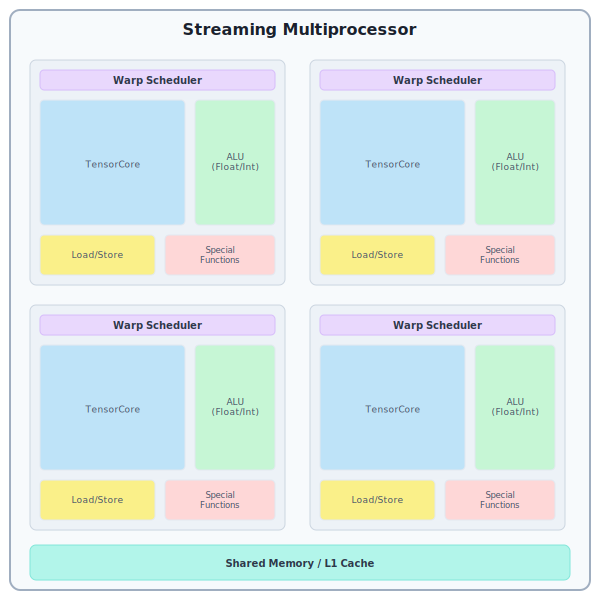

# Writing Mosaic GPU kernels with Pallas

This page is a reference for the most important features of the Pallas:MGPU backend.
It's not a tutorial and as such we do not expect everyone to read it top to bottom.
Still, it is worth going over
just to familiarise yourself with some patterns you can find in other tutorials.

In the following examples, we're going to assume the following imports are in scope:
```python
import jax.experimental.pallas as pl
import jax.experimental.pallas.mosaic_gpu as plgpu
```

## What is a GPU?

Technically, the NVIDIA GPU architecture looks as follows: the GPU is partitioned into
_streaming multiprocessors_ (SMs). The way this manifests in the CUDA programming model
is that each _CUDA thread block_ (or CTA) is scheduled on exactly one SM, but multiple
blocks can be scheduled onto a single SM at a time.

Each SM contains a chunk of fast memory called _shared memory_ (SMEM) and 4 subdivisions,
each containing a _warp scheduler_ and compute units (ALU, TensorCore, ...).
This is also reflected in the CUDA programs: each _warp_ (a group of consecutive 32 CUDA
threads in a block) is assigned to one of those subdivisions in a round-robin fashion.
Similarly to blocks, each warp is assigned to exactly one subdivision (it never migrates),
but multiple warps can be assigned to the same SM subdivision. At each clock cycle, the
warp scheduler from each subdivision tries to select one of its resident warps to execute
the next instruction.



Going further, recent CUDA versions also outline the concept of a _warpgroup_, which are
4 consecutive warps. Knowing how the hardware looks like, we can see where this is comming
from: 4 consecutive warps occupy the 4 quarters of an SM and let us issue instructions
that utilize the whole SM.

> A GPU can be viewed in many different ways and in here we want to focus on a slightly
  simplified model that is very TensorCore-centric. This should help you navigate the
  complexities of writing kernels involving the TensorCore, but keep in mind that the
  real picture is more complicated.

For our purposes, TensorCore operations have grown so big that it no longer makes much
sense to follow the CUDA model. As such, to us, a GPU is a collection of single-threaded cores
(SMs) with one thread of Pallas:MGPU corresponding to a CUDA warpgroup. In this model, each
operation you perform in the kernel occupies the whole CUDA warpgroup, and its constituent
warps always run in lockstep (modulo the jitter from hardware scheduling) and never take
different paths through control flow (with the small exception of `core_map` that we will
discuss later). One notable addition here is that we still allow you to co-schedule multiple
of those Pallas-level threads on the same SM so that they can cooperate and communicate
through shared memory (we relize that by putting them in the same CUDA block).

> This is very similar to a programming model popularized by [Triton](https://triton-lang.org/),
  but as you will see there are a few differences. Mosaic GPU tends to be more low level,
  which usually means you will have to put in more work, but it also puts you more in control.
  In our view both approaches have their merits and we encourage you to pick the backend that
  suits your needs the best! Pallas supports and will continue to support Triton as an alternative
  GPU backend.

### In-order execution & using multiple hardware units

Unlike more complicated CPU architectures GPU only support in-order execution. That, however,
does not mean that at any given time only a single instruction is running! Each SM quarter
has multiple independent functional units: TensorCore, Arithmetic logic unit (ALU),
Load/Store (LSU), Special function unit (SFU).  If the first instruction targets one of the
units and is followed by another one (that does not use the result of the first one), then the
warp scheduler can issue the second one before the first one completes. This is often referred
to as instruction-level parallelism (ILP) and is a common theme in modern TensorCore kernels:
TensorCore operations are so big and take so many cycles to complete, that it is a waste to not
try to use other units in the meantime.

To extend this even further, we can take advantage of this hardware-unit-level parallelism by
allowing multiple Pallas threads (warpgroups) to run concurrently. If one of the threads primarily
occupies the ALU, while another one primarily issues TensorCore related instructions, we can
take advantage of the efficient context switching built into the warp schedulers to keep both
units busy. This is one of the core idea behind algorithms such as [FlashAttention 3](https://arxiv.org/abs/2407.08608)
or [CUTLASS ping-pong matmul kernels](https://pytorch.org/blog/cutlass-ping-pong-gemm-kernel/).

For more information on how warp scheduling and instruction issue works, we recommend reading
[Analyzing Modern NVIDIA GPU cores](https://arxiv.org/abs/2503.20481).

## Array layouts and reference transforms

TODO

## MMA (TensorCore)

In this section, we focus on how Pallas:MGPU kernels can utilize the TensorCore unit.
NVIDIA continues to change the programming interface of the TensorCore significantly
between different hardware generations, which is why the lowest-level interfaces
differ in Pallas:MGPU as well.

### Hopper (`wgmma`)

TODO

### Blackwell (`tcgen05`)

TODO

## Using `core_map`

TODO

## Synchronization structures and primitives

### `commit_smem`

TODO

### `Barrier`

This is essentially a thin wrapper around an array of PTX `mbarrier` types and is
passed in as a reference. All functions involving barriers expect to only get a single
barrier argument, and so if the reference contains multiple, you have to extract one
of them explicitly using `barriers.at[index]`.

`Barrier`s are always allocated in SMEM and as such have relatively low overheads.
There are three primary use cases that require the use of `Barrier`s:

1. Awaiting asynchronous GMEM-to-SMEM copies

TODO

2. Cross-warpgroup synchronization

TODO

3. Awaiting `tcgen05` TensorCore instructions

TODO

### `ClusterBarrier`

TODO

### `Semaphore`

TODO

## Asynchronous copies

TODO

## Inline Mosaic GPU

TODO

## Compiler parameters

TODO
