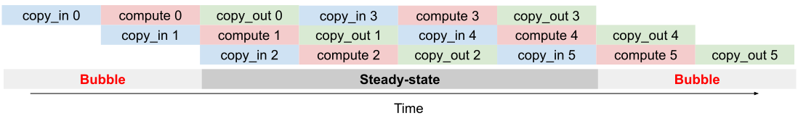
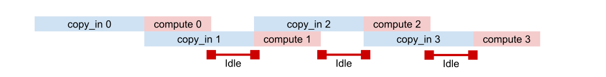
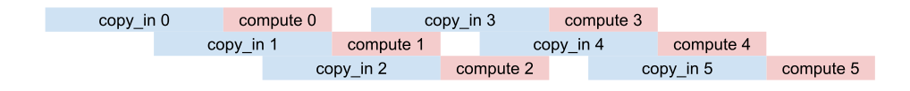

---
jupyter:
  jupytext:
    main_language: python
    text_representation:
      extension: .md
      format_name: markdown
      format_version: '1.3'
      jupytext_version: 1.16.4
  kernelspec:
    display_name: Python 3
    name: python3
---

<!-- #region id="C93Xlf0DRW9H" -->

(pallas_software_pipelining)=

# Software Pipelining

Software pipelining is an important technique in performance optimization by overlapping multiple asynchronous operations even if there are data dependencies between them. In the context of kernel writing, the most common form of pipelining involves overlapping communication and memory transfers with compute such that the hardware accelerator never stalls while waiting for data to arrive. Therefore, we will solely focus on the problem of communication-compute pipelining in this tutorial. We will begin by covering the problem conceptually, outlining the Pallas API for writing pipelines, and going over some realistic examples using the API.

This tutorial only covers the conceptual foundations of pipelining. For platform-specific references, please see {ref}`pallas_tpu_pipelining`, or GPU (coming soon!) specific pipelining references.

<!-- #endregion -->

```python id="YkOjspo5BKPD"
import jax
from jax import numpy as jnp
from jax.experimental import pallas as pl
import numpy as np
```

<!-- #region id="shnVghWUSvpx" -->
## Memory Hierarchies

The first step in understanding pipelining conceptually involves understanding the different forms of memory available and the tradeoffs between them. Most hardware architectures (including CPUs, GPUs, and TPUs) utilize a wide variety of memory spaces that tradeoff capacity vs latency/bandwidth. For the purpose of Pallas, we are typically interested in registers, SRAM, DRAM, and potentially network communication:
- **Registers** are the the memory physically closest to the processor, and typically values must be loaded directly into registers before doing any compute on them.
- **SRAM** (also known as Shared Memory/L1 and L2 cache on GPUs, or VMEM on TPUs) also lives fairly close to the processor, but has larger capacity than registers.
SRAM on modern ML accelerators typically range in the 10-100MB range (TPU v5p contains 96MB of VMEM, and H100 GPUs contain ~30MB of L1 cache and 50MB of L2).
It's reasonable to expect the latency to access SRAM to be on the order of 10x longer than accessing a register.
- **DRAM** (also known as HBM) has much higher capacity than SRAM, typically in the 10-100GB range for modern ML accelerators. However, the latency is roughly on the order of 10x longer to access compared to SRAM.
- **Network** communication becomes crucial for larger workloads when the size of DRAM on a single device becomes insufficient or when we'd like to take advantage of parallel computations. We do not cover distributed pipelining in this tutorial, but see the [distributed TPU kernels](https://docs.jax.dev/en/latest/pallas/tpu/distributed.html) guide for writing pipelines across multiple devices.


<!-- d1eabbb4e925d283 -->


<!-- #endregion -->

<!-- #region id="WvW6Lo7d2jfb" -->

In order to perform computation on values X and Y that live in HBM, we need to:

1. Copy the values x and y into SRAM.
2. Load the values from SRAM into registers.
3. Execute the computation and store the result into registers.
4. Store the values in the output registers into SRAM.
5. Copy the output values in SRAM back to HBM.

Let’s implement a Pallas function that does just that!
<!-- #endregion -->

```python id="IrPhDFnT3Nvw" executionInfo={"status": "ok", "timestamp": 1744764235906, "user_tz": 420, "elapsed": 108, "user": {"displayName": "Justin Fu", "userId": "17543197034567316452"}} outputId="8bc03872-fd9f-4610-9d53-d4b46be560f4"
# Note: This is a TPU example.

def add_matrices_kernel(x_sram_ref, y_sram_ref, z_sram_ref):
  # Load x and y from SRAM into registers
  x_regs = x_sram_ref[:, :]
  y_regs = y_sram_ref[:, :]
  # Execute a vectorized add
  z_regs = x_regs + y_regs
  # Store the output values in registers back into SRAM
  z_sram_ref[:, :] = z_regs


def add_matrices(x: jax.Array, y: jax.Array) -> jax.Array:
  # pallas_call will first allocate scratch buffers for `x` and `y` in SRAM.
  # It will then copy `x` and `y` from HBM into SRAM.
  z = pl.pallas_call(
      add_matrices_kernel, out_shape=jax.ShapeDtypeStruct(x.shape, x.dtype)
  )(x, y)
  # pallas_call will also copy the output from SRAM back into HBM.
  return z


x, y = jnp.ones((512, 512)), jnp.ones((512, 512))
add_matrices(x, y)
```

<!-- #region id="gGjtwv9u3UNK" -->
We've written two functions: `add_matrices_kernel` and `add_matrices`.

`add_matrices_kernel` operates using `Refs` that live in SRAM. Loading from a SRAM Ref produces a value that lives in registers. Values in registers behave like jax.Arrays in that we can use `jnp` and `jax.lax` operations on them to produce new values that live in registers. When we produce the values we'd like to return, we store them in the output SRAM `Ref`.

The `add_matrices` function acts on `jax.Array`s and returns a `jax.Array`. Inside it, we pass `x` and `y` into pallas_call. `pallas_call` is responsible for copying `x` and `y` into SRAM and for allocating the SRAM buffers that the kernel operates on (including allocating `z_vmem_ref`, the output SRAM buffer). After the kernel function is finished running, `pallas_call` will also copy the value in `z_vmem_ref` to HBM, resulting in an output `jax.Array`.

Pallas exposes access to lower level memory spaces like SRAM but writing performant kernels requires more care in utilizing the various memory spaces. For example, we need to consider both:

- **Memory capacity**. SRAM is small! If our arrays are too big, the above kernel would not work because we cannot fit the input into SRAM. For reference, an `f32[2048, 2048]` array is 16MiB, so our above kernel won't scale beyond moderately sized arrays.

- **Memory bandwidth**. Copying to/from HBM and SRAM takes a long time, at least compared to most compute instructions. The `add_matrices` function above will likely spend more time copying between HBM and SRAM than actually performing the addition itself.

With these two constraints in mind, we'll have to rethink our strategy for getting performance out of our accelerators.


<!-- #endregion -->

<!-- #region id="0Ebs2pCDgsEW" -->
## Pipelining Basics


How can we take advantage of the strengths of each form of type memory in the hierarchy, and be able to operate on large arrays stored in HBM while still utilizing fast SRAM for compute? Pipelining is a very general programming pattern which will allow us to do exactly this, but it requires transforming your problem into smaller sub-problems that can be overlapped in parallel.

The first step in pipelining is to divide our problem into smaller subproblems that can fit inside of SRAM. For example, an elementwise operation is can be trivially transformed by operating on one slice of the source array at a time, which results in the following 3 steps (also known as stages):  

1. **copy_in**: Copy a slice `A[i]` from HBM to SRAM `X`.
2. **compute**: Load `X` into registers, compute a result, and store in SRAM `Y`
3. **copy_out**: Copy result `Y` back into HBM `A[i]`.

Note that there is a data-dependence between steps 1-3, and we cannot trivially overlap them since we need step (1) to complete before starting step (2), and so on. However, there is no data dependence across multiple invocations of the subproblem - that is, we can execute step (1) for block `A[i+1]` while executing step (2) for block `A[i]` and step (3) for block `A[i-1]`.


<!-- #endregion -->

<!-- #region id="8vCtShhBjzTd" -->



<!-- #endregion -->

<!-- #region id="Qs3F--kwiOJm" -->
The diagram above depicts how an idealized pipelined program can be scheduled across time. The key insight is that in the majority of the kernel, the copy operations are executed in parallel with compute operations, meaning we can ideally "hide" the cost of transferring between HBM/SRAM with computation and keep the processor busy with as much uptime as possible.

The initial startup time and final teardown time known as "bubbles", where only a subset of the stages are being executed while the pipeline is being "filled" or "drained". The bulk of the time is spent in the "steady-state" phase of the pipeline, where each pipeline stage is being executed in parallel across different iterations of the subproblem. While with more general pipelining approaches the goal is to achieve N-way parallelism (where N is the number of stages), with kernel pipelining we are usually bottlenecked either by memory bandwidth or processing speed. Therefore, our goal with kernel pipelining is typically to achieve full utilization of the FLOPs/s of our processor, meaning that at any point in time there is always a `compute` block active. In the figure above, the compute block is active in 6/8 timeslots, and assuming we are fully utilizing the processor in each compute timeslot, we would have achieved 75% utilization of the processor.
<!-- #endregion -->

<!-- #region id="ZcSzl4N6pPbG" -->
### Deriving a Double-Buffered Pipeline

Now lets look at how we could implement a pipeline in pseudocode. Consider the following elementwise program, where we load values from HBM (`A[i]`) with a `copy_in` instruction, add 1 to the result, and store the result back to HBM with `copy_out`:

<pre>
for i in range(N):
  copy_in(A[i], X)
  Y = X + 1
  copy_out(Y, A[i])
</pre>
The issue with this approach is that `copy_in` and `copy_out` are typically blocking operations. So we are forced to wait for the copies to finish while the GPU/TPU is idle, then perform compute while the memory is idle. What we would like to do is to "pre-fetch" the input value that is required on the next iteration of the loop asynchronously while performing the computation for the current loop, so that compute and memory communication are happening simultaneously.

In order to reason about the code transformation we will make, lets unroll the loop for N=4, and decompose the copy instructions into separate `copy_start` and `copy_wait` operations to be able to express asynchrony:
<pre>
  # Itr 1
  copy_in_start(A[0], X)
  copy_in_wait(X)
  Y = X + 1
  copy_out_start(Y, A[0])
  copy_out_wait(Y)

  # Itr 2
  copy_in_start(A[1], X)
  copy_in_wait(X)
  Y = X + 1
  copy_out_start(Y, A[1])
  copy_out_wait(Y)

  # Itr 3
  copy_in_start(A[2], X)
  copy_in_wait(X)
  Y = X + 1
  copy_out_start(Y, A[2])
  copy_out_wait(Y)

  # Itr 4
  copy_in_start(A[3], X)
  copy_in_wait(X)
  Y = X + 1
  copy_out_start(Y, A[3])
  copy_out_wait(Y)
</pre>

Once the loop has been unrolled, the pipelining transformation simply involves issuing `copy_start` instructions as early as possible, and `copy_wait` values as late as possible (right before we need the value). However, in the current state of the loop there is a fake data dependency through X - we cannot simultaneously perform an async copy into X while using it for computation or else we may have a race condition. Therefore, we can use a **multiple-buffering** technique where we keep 2 buffers for each input X and each output Y. With 2 buffers, we can push the `copy_in_start` one iteration ahead (with 3 buffers you can push 2 iterations, and so on) and we rewrite our loop as follows:
<pre>
  # Prologue
  <b>copy_in_start(A[0], X[0])</b>
  
  # Itr 1
  <b>copy_in_start(A[1], X[1])</b>
  copy_in_wait(X[0])
  Y[0] = X[0] + 1
  copy_out_start(Y[0], A[0])
  copy_out_wait(Y[0])

  # Itr 2 - Steady state
  <b>copy_in_start(A[2], X[0])</b>
  copy_in_wait(X[1])
  Y[1] = X[1] + 1
  copy_out_start(Y[1], A[1])
  copy_out_wait(Y[1])

  # Itr 3 - Steady state
  <b>copy_in_start(A[3], X[1])</b>
  copy_in_wait(X[0])
  Y[0] = X[0] + 1
  copy_out_start(Y[0], A[2])
  copy_out_wait(Y[0])

  # Itr 4 - No copy-in
  copy_in_wait(X[1])
  Y[1] = X[1] + 1
  copy_out_start(Y[1], A[2])
  copy_out_wait(Y[1])
</pre>

Next, we can push the `copy_out_wait` as late as possible, right before we need to write into Y on the subsequent loop iteration.

<pre>
  # Prologue
  copy_in_start(A[0], X[0])
  
  # Itr 1
  copy_in_start(A[1], X[1])
  copy_in_wait(X[0])
  Y[0] = X[0] + 1
  copy_out_start(Y[0], A[0])

  # Itr 2 - Steady state
  copy_in_start(A[2], X[0])
  copy_in_wait(X[1])
  Y[1] = X[1] + 1
  copy_out_start(Y[1], A[1])
  <b>copy_out_wait(Y[0])</b>

  # Itr 3 - Steady state
  copy_in_start(A[3], X[1])
  copy_in_wait(X[0])
  Y[0] = X[0] + 1
  copy_out_start(Y[0], A[2])
  <b>copy_out_wait(Y[1])</b>

  # Itr 4 - No copy-in
  copy_in_wait(X[1])
  Y[1] = X[1] + 1
  copy_out_start(Y[1], A[2])
  <b>copy_out_wait(Y[0])</b>

  # Epilogue
  <b>copy_out_wait(Y[1])</b>
</pre>

Finally, re-rolling our loop back into a for loop, we obtain the following pipelined loop:

```
# Prologue
copy_in_start(A[0], X[0])

# Main loop
for i in range(N):
  cur_slot = i % 2
  next_slot = (i + 1) % 2

  if i < N:
    copy_in_start(A[i+1], X[next_slot])
  
  copy_in_wait(X[cur_slot])
  Y[cur_slot] = X[cur_slot] + 1
  copy_out_start(Y[cur_slot], A[i])

  if i > 0:
    copy_out_wait(Y[next_slot])

# Epilogue
copy_out_wait(Y[1])
```

If we want to generalize this loop to handle a broader set of computations, notice that we essentially need to specify 3 pieces of information to the pipeline:

- The **grid**, or the bounds of the for loop that specifies the number of subproblems to compute. In our example we had a 1-dimensional grid with size `(N,)`.
- The **kernel**, or the actual computation happening once the inputs have been loaded into SRAM. In our example we performed an elementwise addition `Y = X + 1`.
- The **data_slices**, which map a subproblem to corresponding slices into the HBM buffer. In our example the data slice was the identity function `lambda i: i`.

By allowing the user to specify these pieces of information we can write a wide variety of programs following this pattern:
```python
def double_buffered_pipeline(
    grid: tuple[int, ...],
    kernel: Callable,
    in_slices: Callable,
    out_slices: Callable):
  # Prologue
  copy_in_start(in_hbm[in_slices(0)], in_sram[0])

  # Main loop
  grid_size = prod(grid)
  for i in range(grid_size):
    cur_slot = i % 2
    next_slot = (i + 1) % 2
    if i < grid_size:
      copy_in_start(in_hbm[data_slices(i+1)], in_sram[next_slot])
    copy_in_wait(in_sram[cur_slot])

    kernel(inputs, outputs)

    copy_out_start(out_sram[cur_slot], out_hbm[out_slices(i)])
    if i > 0:
      copy_out_wait(out_sram[next_slot])

  # Epilogue
  copy_out_wait(out_sram[1])
```
<!-- #endregion -->

<!-- #region id="ziBuvv8jDgxo" -->
Now that we've seen how to manually implement a pipelined loop, let's look into how to use the Pallas API.
<!-- #endregion -->

<!-- #region id="niMr39cPkJ2m" -->
## Pallas Pipelining API

Pallas offers a pipelining API that abstracts away the boilerplate of maintaining multiple buffers and overlapping asynchronous communication with computation. The basics of this API are covered in {ref}`pallas_quickstart`, so we will go over the API briefly here for completeness and discuss some sharp edges that arise from the use of pipelining.


### Grid

The program **grid** is a tuple of integers specifying the number of subproblems as an array. The structure of the pipeline can be interpreted as a nested for-loop where the bounds of each loop.

```
# For grid (N, M, K)
for n in range (N):
  for m in range(M):
    for k in range(K):
      kernel()
```

The kernel will be invoked a total of `prod(grid)` times. For more details, see [grid and blockspecs](https://docs.jax.dev/en/latest/pallas/grid_blockspec.html#grid-a-k-a-kernels-in-a-loop).

### BlockSpecs

A BlockSpec specifies the size and slice of data copied to the kernel on each subproblem. The basic constructor to `pl.BlockSpec` involves specifying the `block_shape`, the size of a slice of data, and `index_map`, a function that takes in the program ids of the current subproblem and outputs _blocked_ indices into the source buffer. Blocked indices specify which block to copy on each iteration, assuming the source buffer has been carved into blocks of shape as `block_shape`. The `memory_space` argument specifies what memory space to copy the inputs to - be default this will be SRAM.

```python
pl.BlockSpec(
  block_shape: tuple[int, ...],
  index_map: Callable,
  memory_space: pl.MemorySpace
)
```
There should be one BlockSpec for each input and each output to the kernel. For more details, see [grid and blockspecs](https://docs.jax.dev/en/latest/pallas/grid_blockspec.html#grid-a-k-a-kernels-in-a-loop).

### Kernel

The kernel function specifies what compute to perform on each subproblem. The kernel function should return no outputs, and instead all outputs should be written into the output buffers that are passed into the kernel. All inputs and output buffers are SRAM buffers by default (unless the user has overridden the behavior by specifying a `memory_space` on the corresponding `BlockSpec`).

```python
def kernel(*input_buffers, *output_buffers):
  # ... perform compute
  # ... store result into output buffers
```

The index of the current subproblem can be queried inside the kernel using `pl.program_id(grid_axis: int)`.


### Pallas Call

The `pl.pallas_call` function is the main entry point to Pallas and performs pipelined execution when a grid and BlockSpecs are supplied. It has the following signature:
```python
def pallas_call(
  kernel,
  grid: tuple[int, ...],
  in_specs: Sequence[PyTree[BlockSpec]],
  out_specs: PyTree[BlockSpec],
  out_shape: PyTree[jax.ShapeDtypeStruct],
) -> Callable:
```
`pallas_call` will return a callable function that when invoked with input values, will return outputs of the same shape as `out_shape`.

`in_specs`, `out_specs`, and `out_shape` are PyTrees of their respective element type. The PyTrees for `in_specs` and the input buffers supplied to the kernel should match, and the PyTrees for `out_specs` and `out_shape` should also match.

<!-- #endregion -->

<!-- #region id="0mHZ63eAq_8j" -->
### Example - Elementwise Kernel revisited

Let's revisit the initial `add_matrices_kernel` from the beginning of the tutorial, except using pipelining. We will add two input arrays of shape `f32[4096, 4096]` that live in HBM. As subproblems, we will carve up the inputs into `block_shape=(512, 512)` blocks and only add two blocks together at a time in the kernel. Because addition is elementwise, each `index_map` is identical and selects out the `i, j`th block on the `i, j`th iteration.
<!-- #endregion -->

```python id="iqr_qjONAHN9"
# Note: This is a TPU example.

total_shape = (4096, 4096)
block_shape = (512, 512)

def add_matrices_pipelined_kernel(x_ref, y_ref, o_ref):
  o_ref[...] = x_ref[...] + y_ref[...]

def add_matrices_pipelined(x: jax.Array, y: jax.Array):
  return pl.pallas_call(
    add_matrices_pipelined_kernel,
    grid=tuple(total // block for (total, block) in zip(total_shape, block_shape)),
    in_specs=[
      pl.BlockSpec(block_shape, index_map=lambda i, j: (i, j)),
      pl.BlockSpec(block_shape, index_map=lambda i, j: (i, j))
    ],
    out_specs=pl.BlockSpec(block_shape, index_map=lambda i, j: (i, j)),
    out_shape=jax.ShapeDtypeStruct(total_shape, dtype=jnp.float32),
  )(x, y)

x = jax.random.uniform(jax.random.key(0), total_shape, dtype=jnp.float32)
y = jax.random.uniform(jax.random.key(1), total_shape, dtype=jnp.float32)
result = add_matrices_pipelined(x, y)
np.testing.assert_array_equal(
    result, x + y
)
```

<!-- #region id="UWHD0_qm6DL7" -->
It turns out that with this API, writing a pipelined kernel is not much more lines of code than writing our original naive addition kernel!
<!-- #endregion -->

<!-- #region id="BZ-4U6Cv6cvU" -->
### Parameterizing a Kernel

It's common to parameterize the block shapes in our kernel. Block sizes are perhaps the most important parameter to tune when optimizing the performance of Pallas kernels! They give us control over the pipeline (for example, picking smaller blocks adds more iterations to our pipelined loop where each iteration has less work to do). Let's write a a function that does so:
<!-- #endregion -->

```python id="RZTAiwrZ6srD"
def add_matrices_pipelined_param(
    x: jax.Array, y: jax.Array, *, bm: int = 256, bn: int = 256
) -> jax.Array:
  m, n = x.shape
  block_spec = pl.BlockSpec((bm, bn), lambda i, j: (i, j))
  return pl.pallas_call(
      add_matrices_kernel,
      out_shape=x,
      in_specs=[block_spec, block_spec],
      out_specs=block_spec,
      grid=(m // bm, n // bn),
  )(x, y)

np.testing.assert_array_equal(
    add_matrices_pipelined_param(x, y, bm=256, bn=256), x + y
)
np.testing.assert_array_equal(
    add_matrices_pipelined_param(x, y, bm=128, bn=128), x + y
)
np.testing.assert_array_equal(
    add_matrices_pipelined_param(x, y, bm=512, bn=512), x + y
)
```

<!-- #region id="vO8VkbYj_ral" -->
## Sharp edges

While pipelining provides a close approximation to the mental model of simply calling a kernel function in a loop, there are a number of sharp edges that arise from the use of intermediate buffers that are not fully hidden from the user and can result in subtle bugs.

### Buffer Revisiting

In general, a good rule-of-thumb to follow is that **the input buffers passed into the kernel function should be interpreted as read-only, and output buffers are write only**.

Writing to inputs and reading from outputs will in most cases result in incorrectness. This is because the SRAM buffers passed to a kernel only contain copies of the data contained in the underlying HBM buffer. If an input SRAM buffer is updated, the updated results will never be written back out to HBM, and if an output buffer is updated, it's updated value is never read into SRAM. This issue is analogous to staleness issues encountered when using caches in general.

There are two cases where a buffer supports both reads and writes - accumulation (discussed next), and marking a pair of input and output buffers as input-output aliased by passing in the `input_output_aliases` argument to `pallas_call`.


### Reductions and accumulation

**Reduction/accumulation should only be performed over the last (innermost) dimensions of the grid, and the buffer should be initialized manually first.**

Reductions are one of the few cases where the pipeline supports both reading and writing to an output buffer, but the reason it works is subtle.
The Pallas pipeline emitter performs an optimization where if the data slices between two consecutive iterations are the same, the pipeline will not issue a `copy_in`/`copy_out` on that buffer. This means the same SRAM buffer used in a previous iteration will be passed into the kernel again on the following iteration, and thus any writes that were issued to the output buffer will become visible on the next iteration. Once the data slice changes, the final accumulated SRAM buffer will be written out to HBM. This is also why reductions must be performed over the last dimensions of the grid -- we want to finish all of the accumulation while the output buffer is in SRAM in the innermost loop, then write it to HBM and never touch that output block again.

As a concrete example, let's consider performing the following computation for reducing an `(8, 1024, 1024)` array along the first axies into a `(1024, 1024)` array.


<!-- #endregion -->

```python id="4qz1ET-_f9fJ" executionInfo={"status": "ok", "timestamp": 1744763773938, "user_tz": 420, "elapsed": 244, "user": {"displayName": "Justin Fu", "userId": "17543197034567316452"}} outputId="e43067ef-933a-45a5-912a-e224151cfa60"
x = jnp.ones((8, 1024, 1024))
jnp.sum(x, axis=0)
```

<!-- #region id="yX762DRrgCOG" -->
To do this using `pallas_call`, we could use a grid of size `(8,)` and in each iteration i load `x[i]` into SRAM. Then we could add `x[i]` to an output SRAM buffer. Let's implement this naively first.
<!-- #endregion -->

```python id="ZEi1_vQVf-81" executionInfo={"status": "ok", "timestamp": 1744763774254, "user_tz": 420, "elapsed": 79, "user": {"displayName": "Justin Fu", "userId": "17543197034567316452"}} outputId="581744b7-ddc1-4dc1-98ec-03c852772eda"
# Note: This is a TPU example.

# Warning: this implementation is incorrect!
def incorrect_sum_kernel(x_ref, o_ref):
  o_ref[...] += x_ref[...]

def incorrect_sum(x: jax.Array,
              block_size: tuple[int, ...] = (256, 256)) -> jax.Array:
  reduction_size, *out_shape = x.shape
  grid = (reduction_size, *(out // blk for out, blk in zip(out_shape, block_size)))
  return pl.pallas_call(
      incorrect_sum_kernel,
      grid=grid,
      # None in `block_shape` means we pick a size of 1 and squeeze it away
      in_specs=[pl.BlockSpec((None, *block_size), lambda i, j, k: (i, j, k))],
      out_specs=pl.BlockSpec(block_size, lambda i, j, k: (j, k)),
      out_shape=jax.ShapeDtypeStruct(out_shape, x.dtype),
  )(x)

result = incorrect_sum(x)
print(result)
```

<!-- #region id="MglScPDD9618" -->
This result is completely wrong!

There are two errors inside this kernel. First, we are accumulating along the first grid dimension instead of the last grid dimension. Second, `o_ref` is initially contains garbage values and thus we need to initialize it to zeros before we begin accumulation.

After fixing these two issues, we obtain the following corrected kernel. In this new kernel, we use `@pl.when` to create a conditional that checks when the program ID is `0` along the reduction axis, indicating we are beginning to accumulate into a new output block. We have also moved the reduction dimension to the last axis of the `grid`.
<!-- #endregion -->

```python id="XtgD4nMa9_Bd" executionInfo={"status": "ok", "timestamp": 1744763774523, "user_tz": 420, "elapsed": 104, "user": {"displayName": "Justin Fu", "userId": "17543197034567316452"}} outputId="9ef07cdf-9e22-4dc8-c17f-c96172639801"
# Note: This is a TPU example.

def correct_sum_kernel(x_ref, o_ref):
  @pl.when(pl.program_id(2) == 0)
  def _():
    o_ref[...] = jnp.zeros_like(o_ref)
  o_ref[...] += x_ref[...]

def correct_sum(x: jax.Array,
              block_size: tuple[int, ...] = (256, 256)) -> jax.Array:
  reduction_size, *out_shape = x.shape
  # We moved the reduction to the last axis of the grid.
  grid = (*(out // blk for out, blk in zip(out_shape, block_size)), reduction_size)
  return pl.pallas_call(
      correct_sum_kernel,
      grid=grid,
      # None in `block_shape` means we pick a size of 1 and squeeze it away
      in_specs=[pl.BlockSpec((None, *block_size), lambda i, j, k: (k, i, j))],
      out_specs=pl.BlockSpec(block_size, lambda i, j, k: (i, j)),
      out_shape=jax.ShapeDtypeStruct(out_shape, x.dtype),
  )(x)

result = correct_sum(x)
print(result)
```

<!-- #region id="BckuFg6qcnVw" -->

## Analyzing the performance

What is the performance of a pipelined kernel? This question can vary depending on where the bottleneck is the hardware is. We are typically interested in 3 quantities:
- **Memory latency** $α$, the minimum latency of a memory transfer.
- **Memory bandwidth** $β$, the rate in bytes/second that we can transfer from HBM to SRAM.
- **FLOP/s** $F$, or floating-point-operations per second, the number of calculations per second that the processor can perform.

We refer to a program as **compute-bound** if the processing speed FLOPs/s is the bottleneck, and as **memory-bound** if the bandwidth or latency are the bottleneck. Generally, our goal is to optimize a kernel such that it is compute-bound, meaning we are utilizing all of the available processing power of our hardware.

Suppose we are running a program that requires $X$ bytes of memory transfers per kernel iteration, and runs $Y$ floating-point operations per iteration. The ratio of $X$ to $Y$ varies depending on the type of compute -- for elementwise operations such as addition or multiplication, they will both scale equally. However, for operations such as matrix multiplication, compute scales cubically with the size of the problem while memory scales quadratically.

In a **compute-bound** regime, a pipeline running $N$ iterations would take $(\alpha + X/\beta) + N (Y/F)$ seconds, where the first term represents the cost of the initial bubble (multiply by a factor of 2 if there is also a bubble at the end), and the second term represents the total time of the steady-state of the pipeline. Assuming that N is large and there is enough work to produce a long pipeline, the dominating term in the runtime is $F$, the processing speed of the accelerator.


<!-- #endregion -->

<!-- #region id="NDY4mcae_nMO" -->


<!-- #endregion -->

<!-- #region id="HFWcaAudW4z1" -->
In a **memory-bound** regime it is useful to identify if the problem is the latency versus the bandwidth. If the bandwidth is the bottleneck, then the total runtime would take $\alpha + N(X / \beta)$ seconds. In contrast with a latency-bound regime, the memory copies happen serially because the bandwidth is already saturated. Being memory-bound is generally not ideal as there will be gaps in time where the processor is idle, and in most hardware configurations the memory bandwidth $\beta$ is orders of magnitude slower than the processing speed $F$.
<!-- #endregion -->

<!-- #region id="gqcCDsGg_sca" -->



<!-- #endregion -->

<!-- #region id="V4YQCZf1W7X5" -->
If the bottleneck is specifically the latency and not the bandwidth, it is possible to fix the problem by inserting additional pipeline stages at the cost of additional SRAM required to store more buffers. With sufficient stages, the problem will either become compute or bandwidth bound again depending on which bottleneck we hit first during the steady-stage stage of the pipeline. The downside, however, of a multi-stage pipeline is that the size of the bubble is proportional to the number of stages so it is important to make sure the pipeline is long enough such that the bubble does not take up a substantial amount of the total runtime.

<!-- #endregion -->

<!-- #region id="Sj5PFl0s_yc6" -->



<!-- #endregion -->

<!-- #region id="ar4NVxxFfKEb" -->
Pallas on TPU only supports double-buffering, as TPU programs can operate on larger block sizes and double-buffering is typically enough to cover the latency. On GPU, the number of pipeline stages can be specified in both the Triton (via `TritonCompilerParams`) and Mosaic GPU backends (via argument to the pipeline emitter). See the platform-specific pipelining documentation for more details.
<!-- #endregion -->
