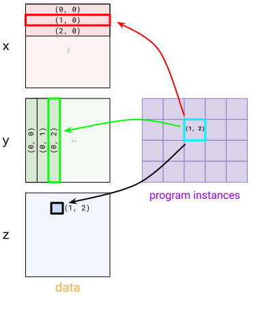

---
jupytext:
  formats: ipynb,md:myst
  text_representation:
    extension: .md
    format_name: myst
    format_version: 0.13
    jupytext_version: 1.15.2
kernelspec:
  display_name: Python 3 (ipykernel)
  language: python
  name: python3
---

# Pallas Quickstart

Pallas is an extension to JAX that enables writing custom kernels for GPU and TPU. Pallas allows you to use the same JAX functions and APIs but operates at a *lower* level of abstraction.

Specifically, Pallas requires users to think about memory access and how to divide up computations across multiple compute units in a hardware accelerator. On GPUs, Pallas lowers to Triton and on TPUs, Pallas lowers to Mosaic.

Let's dive into some examples.

> Note: Pallas is still an experimental API and you may be broken by changes!

+++

## Hello world in Pallas

```{code-cell} ipython3
from functools import partial

import jax
from jax.experimental import pallas as pl
import jax.numpy as jnp
import numpy as np
```

We'll first write the "hello world" in Pallas, a kernel that adds two vectors.

```{code-cell} ipython3
def add_vectors_kernel(x_ref, y_ref, o_ref):
  x, y = x_ref[...], y_ref[...]
  o_ref[...] = x + y
```

**`Ref` types**

Let's dissect this function a bit. Unlike most JAX functions you've probably written, it does not take in `jax.Array`s as inputs and doesn't return any values. Instead it takes in *`Ref`* objects as inputs. Note that we also don't have any outputs but we are given an `o_ref`, which corresponds to the desired output.

**Reading from `Ref`s**

In the body, we are first reading from `x_ref` and `y_ref`, indicated by the `[...]` (the ellipsis means we are reading the whole `Ref`; alternatively we also could have used `x_ref[:]`). Reading from a `Ref` like this returns a `jax.Array`.

**Writing to `Ref`s**

We then write `x + y` to `o_ref`. Mutation has not historically been supported in JAX -- `jax.Array`s are immutable! `Ref`s are new (experimental) types that allow mutation under certain circumstances. We can interpret writing to a `Ref` as mutating its underlying buffer.

+++

So we've written what we call a "kernel", which we define as a program that will run as an atomic unit of execution on an accelerator, without any interaction with the host. How do we invoke it from a JAX computation? We use the `pallas_call` higher-order function.

```{code-cell} ipython3
@jax.jit
def add_vectors(x: jax.Array, y: jax.Array) -> jax.Array:
  return pl.pallas_call(add_vectors_kernel,
                        out_shape=jax.ShapeDtypeStruct(x.shape, x.dtype)
                        )(x, y)
add_vectors(jnp.arange(8), jnp.arange(8))
```

`pallas_call` lifts the Pallas kernel function into an operation that can be called as part of a larger JAX program. But, to do so, it needs a few more details. Here we specify `out_shape`, an object that has a `.shape` and `.dtype` (or a list thereof).
`out_shape` determines the shape/dtype of `o_ref` in our `add_vector_kernel`.

`pallas_call` returns a function that takes in and returns `jax.Array`s.

+++

**What's actually happening here?**

Thus far we've described how to think about Pallas kernels but what we've actually accomplished is we're writing a function that's executed very close to the compute units.

On GPU, `x_ref` corresponds to a value in high-bandwidth memory (HBM) and when we do `x_ref[...]` we are copying the value from HBM into static RAM (SRAM) (this is a costly operation generally speaking!). We then use GPU vector compute to execute the addition, then copy the resulting value in SRAM back to HBM.

On TPU, we do something slightly different. Before the kernel is ever executed, we fetch the value from HBM into SRAM. `x_ref` therefore corresponds to a value in SRAM and when we do `x_ref[...]` we are copying the value from SRAM into a register. We then use TPU vector compute to execute the addition, then copy the resulting value back into SRAM. After the kernel is executed, the SRAM value is copied back into HBM.

We are in the process of writing backend-specific Pallas guides. Coming soon!

+++

## Pallas programming model

+++

In our "hello world" example, we wrote a very simple kernel. It takes advantage of the fact that our 8-sized arrays can comfortably fit inside the SRAM of hardware accelerators. In most real-world applications, this will not be the case!

+++

Part of writing Pallas kernels is thinking about how to take big arrays that live in high-bandwidth memory (HBM, also known as DRAM) and expressing computations that operate on "blocks" of those arrays that can fit in SRAM.

### Grids

To automatically "carve" up the inputs and outputs, you provide a `grid` and `BlockSpec`s to `pallas_call`.

A `grid` is a tuple of integers (e.g. `()`, `(2, 3, 4)`, or `(8,)`) that specifies an iteration space.
For example, a grid `(4, 5)` would have 20 elements: `(0, 0), (0, 1), ..., (0, 4), (1, 0), ..., (3, 4)`.
We run the kernel function once for each element, a style of single-program multiple-data (SPMD) programming.

<center>


A 2D grid
</center>

When we provide a `grid` to `pallas_call`, the kernel is executed as many times as `prod(grid)`. Each of these invocations is referred to as a "program", To access which program (i.e. which element of the grid) the kernel is currently executing, we use `program_id(axis=...)`. For example, for invocation `(1, 2)`, `program_id(axis=0)` returns `1` and `program_id(axis=1)` returns `2`.

Here's an example kernel that uses a `grid` and `program_id`.

```{code-cell} ipython3
def iota_kernel(o_ref):
  i = pl.program_id(0)
  o_ref[i] = i
```

We now execute it using `pallas_call` with an additional `grid` argument.

```{code-cell} ipython3
def iota(len: int):
  return pl.pallas_call(iota_kernel,
                        out_shape=jax.ShapeDtypeStruct((len,), jnp.int32),
                        grid=(len,))()
iota(8)
```

On GPUs, each program is executed in parallel on separate threads. Thus, we need to think about race conditions on writes to HBM. A reasonable approach is to write our kernels in such a way that different programs write to disjoint places in HBM to avoid these parallel writes. On the other hand, parallelizing the computation is how we can execute operations like matrix multiplications really quickly.

On TPUs, programs are executed in a combination of parallel and sequential (depending on the architecture) so there are slightly different considerations.

+++

### Block specs

+++

With `grid` and `program_id` in mind, Pallas provides an abstraction that takes care of some common indexing patterns seen in a lot of kernels.
To build intution, let's try to implement a matrix multiplication.

A simple strategy for implementing a matrix multiplication in Pallas is to implement it recursively. We know our underlying hardware has support for small matrix multiplications (using GPU and TPU tensorcores), so we just express a big matrix multiplication in terms of smaller ones.

Suppose we have input matrices $X$ and $Y$ and are computing $Z = XY$. We first express $X$ and $Y$ as block matrices. $X$ will have "row" blocks and $Y$ will have "column" blocks.

$$
\begin{align*}
X = \begin{bmatrix}
X_0 \\ X_1
\end{bmatrix}
\end{align*}
$$

$$
\begin{align*}
Y = \begin{bmatrix}
Y_0 & Y_1
\end{bmatrix}
\end{align*}
$$

$$
\begin{align*}
Z &=
\begin{bmatrix}
X_0 \\ X_1
\end{bmatrix}
\begin{bmatrix}
Y_0 & Y_1
\end{bmatrix} \\
&=
\begin{bmatrix}
X_0 Y_0 & X_0 Y_1 \\
X_1 Y_0 & X_1 Y_1
\end{bmatrix}
\end{align*}
$$

Our strategy is that because $Z$ is also a block matrix, we can assign each of the programs in our Pallas kernel one of the output blocks. Computing each output block corresponds to doing a smaller matrix multiply between a "row" block of $X$ and a "column" block of $Y$.

+++

To express this pattern, we use `BlockSpec`s. A `BlockSpec` specifies a block shape for each input and output, and an "index map" function, that maps a set of program indices to a block index.

<center>



A visualization of a `BlockSpec`

</center>

For a concrete example, let's say we'd like to multiply two `(1024, 1024)` matrices `x` and `y` together to produce `z`, and would like to parallelize the computation 4 ways. We split up `z` into 4 `(512, 512)` blocks where each block is computed with a `(512, 1024) x (1024, 512)` matrix multiplication. To express this, we'd first use a `(2, 2)` grid (one block for each program).

For `x`, we use `BlockSpec(lambda i, j: (i, 0), (512, 1024))`  -- this carves `x` up into "row" blocks. To see this see how both program instances `(1, 0)` and `(1, 1)` pick the `(1, 0)` block in `x`. For `y`, we use a transposed version `BlockSpec(lambda i, j: (0, j), (1024, 512))`. Finally, for `z` we use `BlockSpec(lambda i, j: (i, j), (512, 512))`.

These `BlockSpec`s are passed into `pallas_call` via `in_specs` and `out_specs`.

Underneath the hood, `pallas_call` will automatically carve up your inputs and outputs into `Ref`s for each block that will be passed into the kernel.

```{code-cell} ipython3
def matmul_kernel(x_ref, y_ref, z_ref):
  z_ref[...] = x_ref[...] @ y_ref[...]

def matmul(x: jax.Array, y: jax.Array):
  return pl.pallas_call(
    matmul_kernel,
    out_shape=jax.ShapeDtypeStruct((x.shape[0], y.shape[1]), x.dtype),
    grid=(2, 2),
    in_specs=[
      pl.BlockSpec(lambda i, j: (i, 0), (x.shape[0] // 2, x.shape[1])),
      pl.BlockSpec(lambda i, j: (0, j), (y.shape[0], y.shape[1] // 2))
    ],
    out_specs=pl.BlockSpec(
      lambda i, j: (i, j), (x.shape[0] // 2, y.shape[1] // 2)
    )
  )(x, y)
k1, k2 = jax.random.split(jax.random.PRNGKey(0))
x = jax.random.normal(k1, (1024, 1024))
y = jax.random.normal(k2, (1024, 1024))
z = matmul(x, y)
np.testing.assert_allclose(z, x @ y)
```

Note that this is a very naive implementation of a matrix multiplication but consider it a starting point for various types of optimizations.
Let's add an additional feature to our matrix multiply: fused activation. It's actually really easy! Just pass a higher-order activation function into the kernel.

```{code-cell} ipython3
def matmul_kernel(x_ref, y_ref, z_ref, *, activation):
  z_ref[...] = activation(x_ref[...] @ y_ref[...])

def matmul(x: jax.Array, y: jax.Array, *, activation):
  return pl.pallas_call(
    partial(matmul_kernel, activation=activation),
    out_shape=jax.ShapeDtypeStruct((x.shape[0], y.shape[1]), x.dtype),
    grid=(2, 2),
    in_specs=[
      pl.BlockSpec(lambda i, j: (i, 0), (x.shape[0] // 2, x.shape[1])),
      pl.BlockSpec(lambda i, j: (0, j), (y.shape[0], y.shape[1] // 2))
    ],
    out_specs=pl.BlockSpec(
      lambda i, j: (i, j), (x.shape[0] // 2, y.shape[1] // 2)
    ),
  )(x, y)
k1, k2 = jax.random.split(jax.random.PRNGKey(0))
x = jax.random.normal(k1, (1024, 1024))
y = jax.random.normal(k2, (1024, 1024))
z = matmul(x, y, activation=jax.nn.relu)
np.testing.assert_allclose(z, jax.nn.relu(x @ y))
```

To conclude, let's highlight a cool feature of Pallas: it composes with `jax.vmap`! To turn this matrix multiplication into a batched version, we just need to `vmap` it.

```{code-cell} ipython3
k1, k2 = jax.random.split(jax.random.PRNGKey(0))
x = jax.random.normal(k1, (4, 1024, 1024))
y = jax.random.normal(k2, (4, 1024, 1024))
z = jax.vmap(partial(matmul, activation=jax.nn.relu))(x, y)
np.testing.assert_allclose(z, jax.nn.relu(jax.vmap(jnp.matmul)(x, y)))
```
