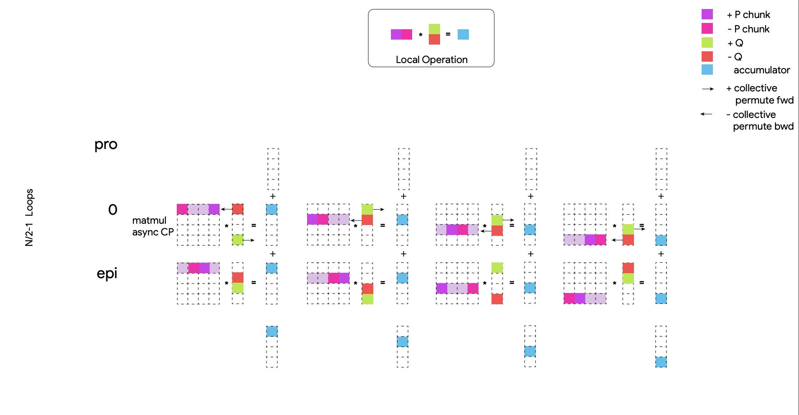

Pallas Collectives
===================
Pallas has support for manual DMA (between memories of the same chip) and remote DMA (between memories of different chips) support. It also has an API for nesting pipelines of compute overlapped collectives.

Manual DMAs are a necessary imperative escape hatch for maximum performance, but we hope that nested pipelines will minimize where they are used in codebases.

Manual DMAs
------------

.. code-block:: python

  from jax.experimental import pallas as pl
  from jax.experimental.pallas import tpu as pltpu

  def move_data(src_ref, dst_ref, sem, send_sem, recv_sem):
    local_copy = pltpu.async_copy(src_ref, dst_ref.at[0:8], sem)
    local_copy.wait()

    # Should do a barrier the first time we communicate
    # with another chip.
    barrier_sem = pltpu.get_barrier_semaphore()
    pltpu.semaphore_signal(barrier_sem, device_id=neighbor)
    pltpu.semaphore_wait(barrier_sem)

    dev_id = pltpu.device_id()
    other_dev_id = 1 - dev_id
    remote_copy = pltpu.async_remote_copy(
      src_ref, dst_ref.at[0:8], send_sem, recv_sem, other_dev_id,
      device_id_type=pltpu.DeviceIdType.LOGICAL,
    )
    # remote_copy.wait() for both.
    remote_copy.wait_send()
    remote_copy.wait_recv()

    # Both APIs have make_ variants for building a descriptor without starting
    # it. This allows us to start a DMA in one grid iteration and wait for it
    # in another.
    local_copy = pltpu.make_async_copy(src_ref, dst_ref.at[0:8], sem)
    local_copy.start()
    local_copy.wait()
  
  src_data = pltpu.VMEM((8,128), jnp.float32)
  dst_data = pltpu.VMEM((16,128), jnp.float32)
  semaphore = pltpu.SemaphoreType.DMA

  # Inside a kernel:
  pltpu.run_scoped(
    move_data, src_data, dst_data, *((semaphore,) * 3)
  )

  # Or alternatively to use data that is live across iterations:
  pl.pallas_call(
      move_data,
      grid_spec=pltpu.PrefetchScalarGridSpec(
          num_scalar_prefetch=0,
          # Could also use other memory spaces and input/outputs.
          scratch_shapes=[src_data, dst_data, semaphore],
      ),
  )()

.. warning::
   Care must be taken when using DMAs to write to inputs or outputs as the reads and writes to these are pipelined with the execution of the body of your kernel. The pipeline double buffering will cause undefined behavior if you try to carry out a DMA across grid iterations where the block windows/indices of the operands are changing. Modifying inputs is also generally not supported as there is no mechanism for the writes to make it to the source buffer from the current ref of the current block.

Custom Pipelines
-----------------

Pipeline/Grid Recap
~~~~~~~~~~~~~~~~~~~~

In :doc:`../quickstart` we saw how when we write a kernel like this:

.. code-block:: python

  def matmul_kernel(x_ref, y_ref, z_ref):
    z_ref[...] = x_ref[...] @ y_ref[...]

  def matmul(x: jax.Array, y: jax.Array):
    return pl.pallas_call(
      matmul_kernel,
      out_shape=jax.ShapeDtypeStruct((x.shape[0], y.shape[1]), x.dtype),
      grid=(2, 2),
      in_specs=[
        pl.BlockSpec(lambda i, j: (i, 0), (x.shape[0] // 2, x.shape[1])),
        pl.BlockSpec(lambda i, j: (0, j), (y.shape[0], y.shape[1] // 2))
      ],
      out_specs=pl.BlockSpec(
        lambda i, j: (i, j), (x.shape[0] // 2, y.shape[1] // 2)
      )
    )(x, y)
  k1, k2 = jax.random.split(jax.random.PRNGKey(0))
  x = jax.random.normal(k1, (1024, 1024))
  y = jax.random.normal(k2, (1024, 1024))
  z = matmul(x, y)
  np.testing.assert_allclose(z, x @ y)

We do a series of pipelined nested loops over the grid indices, slicing and prefetching the inputs for the next iteration and writing the outputs of the previous iteration as we are running the current one.

.. image:: ../../_static/pallas/BlockSpec.png
   :align: center
   :alt: Kernel block spec visualization.

Problem: Collective Matmuls & Compute vs. Comms Windows
~~~~~~~~~~~~~~~~~~~~~~~~~~~~~~~~~~~~~~~~~~~~~~~~~~~~~~~~

The benefits of this declarative approach to writing kernels comes at the cost of coupling the windows you do compute on with the windows you do communication on.

Let's say we have a matmul that looks like this:

.. list-table::
   :header-rows: 1

   * - argument
     - dim 0
     - dim 1
   * - lhs
     - m
     - k
   * - rhs
     - k
     - n
   * - out
     - m
     - n

If the :code:`lhs`'s :code:`k`-sized dimension is sharded over :code:`n` chips and the :code:`rhs`'s is not, we'd want to all-gather the sharded dimension over chips to be able to carry out the matmul.

If we were to carry out the operations serially, we would need to first do the communication while our flops are going to waste and then do the computation while our bandwidth isn't being used. Instead, we can do a small part of the communication and then pipeline the communication with chunks of the computation. Something like the following diagram:

For optimal utilization we'd want to make sure we have enough compute to completely hide all the transfers.

.. code-block:: python

  num_flops = (2 * m * n * k) / chips
  # Assume 2 bytes per element.
  data = 2 * m * k
  is_compute_bound = (num_flops / data) > (flops / bw)
  is_compute_bound = n > chips * (flops / bw)

Depending on the number of chips and their arithmetic intensity, this can put quite a bit of upwards pressure on the size of n. In some cases that might be fine. For certain complex kernels it might not be optimal or even possible to allocate blocks big enough to make this equation hold.

Solution: Custom Pipelines == Nested Pallas Calls!
~~~~~~~~~~~~~~~~~~~~~~~~~~~~~~~~~~~~~~~~~~~~~~~~~~~

Ideally we can use Pallas' templating capabilities to turn any kernel into one that overlaps some sort of communication pattern. Otherwise we'd be rewriting every kernel for every collective we want to overlap it with. This is where the idea for nested grids came from.

.. note::
   The :code:`emit_pipeline` API is implemented entirely using public Pallas APIs, an illustration of Pallas meta-programming.

Basic Nested Pipeline Example
******************************

.. code-block:: python

  def existing_matmul_kernel(x_ref, y_ref, z_ref):
      @pl.when(pl.program_id(2) == 0)
      def _():
        z_ref[...] = jnp.zeros(z_ref.shape, jnp.float32)

      z_ref[...] += x_ref[...] @ y_ref[...]

  def parent_matmul_kernel(x_ref, y_ref, z_ref):
    pltpu.emit_pipeline(
        existing_matmul_kernel,
        grid=(4, 4, 4),
        in_specs=[
            pl.BlockSpec(lambda i, j, k: (i, k), (128, 128)),
            pl.BlockSpec(lambda i, j, k: (k, j), (128, 128)),
        ],
        out_specs=pl.BlockSpec(lambda i, j, k: (i, j), (128, 128)),
    )(x_ref, y_ref, z_ref)

  z = pl.pallas_call(
      parent_matmul_kernel,
      out_shape=jax.ShapeDtypeStruct((512, 512), jnp.float32),
      in_specs=[
          pl.BlockSpec(memory_space=pltpu.TPUMemorySpace.ANY),
          pl.BlockSpec(memory_space=pltpu.TPUMemorySpace.ANY),
      ],
      out_specs=pl.BlockSpec(memory_space=pltpu.TPUMemorySpace.ANY),
  )(x, y)

Nested Pipeline with Output Accumulation
*****************************************

.. code-block:: python

  def matmul_kernel(x_ref, y_ref, z_ref):

    def parent_matmul_kernel(should_accumulate_out):
      pltpu.emit_pipeline(
          existing_matmul_kernel,
          grid=(4, 4, 4),
          in_specs=[
            pl.BlockSpec(lambda i, j, k: (i, k), (128, 128)),
            pl.BlockSpec(lambda i, j, k: (k, j), (128, 128)),
        ],
        out_specs=pl.BlockSpec(lambda i, j, k: (i, j), (128, 128)),
        # Prefix-pytree of out_specs.
        should_accumulate_out=should_accumulate_out,
      )(x_ref, y_ref, z_ref)

    emit_pipeline(False)
    emit_pipeline(True)

  z = pl.pallas_call(
      matmul_kernel,
      out_shape=jax.ShapeDtypeStruct((512, 512), jnp.float32),
      in_specs=[
          pl.BlockSpec(memory_space=pltpu.TPUMemorySpace.ANY),
          pl.BlockSpec(memory_space=pltpu.TPUMemorySpace.ANY),
      ],
      out_specs=pl.BlockSpec(memory_space=pltpu.TPUMemorySpace.ANY),
  )(x, y)

Fusing Nested Pipelines (Realistic AG Matmul)
~~~~~~~~~~~~~~~~~~~~~~~~~~~~~~~~~~~~~~~~~~~~~~

To solve the fact that each child pipeline introduces its own bubbles at their start and end, we must add a layer of complexity via prologue and epilogue callbacks. We danced around with more restrictive but simpler ways of expressing this, but ultimately the behavior here will be very specific to the collective pattern being implemented and you might want to prefetch or wait on pipeline arguments differently based on which ones are participating in the collective.

For pipeline fusion to work we also need to allocate things at the parent grid level. :code:`emit_pipeline_with_allocations` makes that simple.

Here is a full realistic example:

.. code-block:: python

  grid_k = sharded_k // tk
  pipeline, make_pipeline_allocations = pltpu.emit_pipeline_with_allocations(
      partial(existing_matmul_kernel, acc_steps=grid_k),
      grid=(sharded_n // tn, m // tm, grid_k),
      in_specs=[
          pl.BlockSpec(lambda n, m, k: (m, k), (tm, tk)),
          pl.BlockSpec(lambda n, m, k: (k, n), (tk, tn)),
      ],
      out_specs=pl.BlockSpec(lambda n, m, k: (m, n), (tm, tn)),
      # Prefix-pytree of out_specs.
      should_accumulate_out=True,
  )

  # Given shapes:
  # lhs: A 2d, jnp.ndarray with shape [m, k // lax.psum(1, collective_axes.axes)].
  # rhs: A wd, jnp.ndarray with shape [k, n].

  # We start with a prologue that gets us the lhs chunk that our left neighbor
  # will send backward for us to send forward. After that at every step we do
  # compute on our local chunks while overlapping the backward and forward
  # collective permutes of lhs. We add to the same accumulator at every step.
  # Effectively, this permute + compute pattern achieves an all-gather of lhs
  # that is overlapped with the matmul.

  # We wait for the permutes in the pipeline epilogues so we can fuse the
  # inner compute pipeline across matmul steps and avoid bubbles.
  def all_gather_lhs_matmul_kernel(
      lhs_ref,  # [m, sharded_k]
      rhs_ref,  # [k, n]
      out_ref,  # [m, n]
      # Fwd/bwd, and double buffered.
      lhs_scratch_ref,  # [2, 2, m, sharded_k]
      acc_scratch_ref,  # [tm, tn]
      bwd_recv_sem,
      bwd_send_sem,
      fwd_recv_sem,
      fwd_send_sem,
      pipeline_allocations,
  ):
    step = pl.program_id(0)
    fwd_bwd = pl.program_id(1)
    is_first_step = step == 0
    is_not_last_step = step != steps - 1
    is_start_of_step = fwd_bwd == 0
    is_end_of_step = jnp.logical_not(is_start_of_step)
    is_start = jnp.logical_and(is_first_step, is_start_of_step)
    is_end = jnp.logical_and(step == steps - 1, is_end_of_step)
    compute_buffer = lax.rem(step, 2)
    send_buffer = 1 - compute_buffer
    my_id = lax.axis_index('x')
    right_neighbor = lax.rem(my_id + 1, num_devices)
    left_neighbor = lax.rem(my_id - 1, num_devices)
    left_neighbor = jnp.where(
        left_neighbor < 0, left_neighbor + num_devices, left_neighbor
    )

    prologue_fwd_copy = pltpu.make_async_remote_copy(
        lhs_ref,
        lhs_scratch_ref.at[1, compute_buffer],
        fwd_send_sem,
        fwd_recv_sem,
        device_id=right_neighbor,
    )

    @pl.when(is_start)
    @pltpu.trace('sync_and_bwd_prologue')
    def _sync_and_bwd_prologue():
      barrier_sem = pltpu.get_barrier_semaphore()
      pltpu.semaphore_signal(barrier_sem, device_id=left_neighbor)
      pltpu.semaphore_signal(barrier_sem, device_id=right_neighbor)
      pltpu.semaphore_wait(barrier_sem, 2)
      prologue_bwd_copy = pltpu.make_async_copy(
          lhs_ref,
          lhs_scratch_ref.at[0, compute_buffer],
          bwd_send_sem,
      )
      prologue_bwd_copy.start()
      prologue_fwd_copy.start()
      prologue_bwd_copy.wait()

    bwd_kwargs, fwd_kwargs = [
        {
            'src_ref': scratch_ref.at[compute_buffer],
            'dst_ref': scratch_ref.at[send_buffer],
            'send_sem': send_sem,
            'recv_sem': recv_sem,
            'device_id': device_id,
        }
        for scratch_ref, send_sem, recv_sem, device_id in [
            (
                lhs_scratch_ref.at[0],
                bwd_send_sem,
                bwd_recv_sem,
                left_neighbor,
            ),
            (
                lhs_scratch_ref.at[1],
                fwd_send_sem,
                fwd_recv_sem,
                right_neighbor,
            ),
        ]
    ]

    @pl.when(jnp.logical_and(is_not_last_step, is_start_of_step))
    @pltpu.trace('send_next_dma')
    def _send_next_dma():
      pltpu.make_async_remote_copy(**bwd_kwargs).start()
      pltpu.make_async_remote_copy(**fwd_kwargs).start()

    def get_rhs_slice(step, is_start_of_step=is_start_of_step):
      bwd_rhs_offset = lax.rem(my_id + step, num_devices)
      fwd_rhs_offset = lax.rem(my_id - step - 1, num_devices)
      fwd_rhs_offset = jnp.where(
          fwd_rhs_offset < 0, fwd_rhs_offset + num_devices, fwd_rhs_offset
      )
      offset = jnp.where(is_start_of_step, bwd_rhs_offset, fwd_rhs_offset)
      return pl.ds(
          pl.multiple_of(offset * sharded_k, sharded_k),
          sharded_k,
      )

    with pltpu.trace('dots'):

      def epilogue(epilogue_args: pltpu.PipelineCallbackArgs):

        @pl.when(is_start)
        @pltpu.trace('fwd_prologue')
        def _fwd_prologue():
          prologue_fwd_copy.wait()

        @pl.when(jnp.logical_and(is_not_last_step, is_end_of_step))
        @pltpu.trace('wait_on_prev_dma')
        def _wait_on_prev_dma():
          pltpu.make_async_remote_copy(**bwd_kwargs).wait()
          pltpu.make_async_remote_copy(**fwd_kwargs).wait()

        def prefetch_pipeline_inputs():
          prefetch_compute_buffer = jnp.where(
              is_start_of_step, compute_buffer, send_buffer
          )
          prefetch_fwd_bwd = lax.rem(fwd_bwd + 1, 2)
          prefetch_pipeline_refs = epilogue_args.make_pipeline_refs(
              lhs_scratch_ref.at[prefetch_fwd_bwd, prefetch_compute_buffer],
              rhs_ref.at[
                  get_rhs_slice(
                      jnp.where(is_start_of_step, step, step + 1),
                      jnp.logical_not(is_start_of_step),
                  )
              ],
              out_ref,
          )
          return epilogue_args.start_pipeline_prefetch(
              pltpu.PipelinePrefetchArgs(
                  prefetch_pipeline_refs,
                  epilogue_args.pipeline_allocations,
                  epilogue_args.pipeline_buffers,
              ),
              # Force copy lhs because we just permuted it.
              force_copy=([True, False], False),
          )

        return lax.cond(
            jnp.logical_not(is_end),
            prefetch_pipeline_inputs,
            lambda: (
                epilogue_args.pipeline_buffers.input,
                epilogue_args.pipeline_buffers.in_out,
            ),
        )

      pipeline(
          lhs_scratch_ref.at[fwd_bwd, compute_buffer],
          rhs_ref.at[get_rhs_slice(step)],
          out_ref,
          scratchs=[acc_scratch_ref],
          allocations=pipeline_allocations,
          init_allocations=is_start,
          prologue=lambda _: (
              # Input and accum prologue input copy start skip conditions.
              (
                  # Prefix-pytree support means this broadcasts up to both inputs.
                  jnp.logical_not(is_start),
                  jnp.logical_not(is_start),
              ),
              # Force input and accum input copy wait.
              ([True, False], False),
          ),
          epilogue=epilogue,
          # Only skip prologue output copy wait if starting and there is no
          # previous output.
          out_prologue=lambda _: is_start,
          # Skip epilogue output copy wait unless it's the end.
          out_epilogue=lambda _: jnp.logical_not(is_end),
      )

  kernel = pl.pallas_call(
      all_gather_lhs_matmul_kernel,
      out_shape=[
          jax.ShapeDtypeStruct((m, sharded_n), out_dtype),
          jax.ShapeDtypeStruct((2, 2, m, sharded_k), x.dtype),
      ],
      grid_spec=pltpu.PrefetchScalarGridSpec(
          num_scalar_prefetch=0,
          in_specs=[
              pl.BlockSpec(memory_space=pltpu.TPUMemorySpace.ANY),
              pl.BlockSpec(memory_space=pltpu.TPUMemorySpace.ANY),
          ],
          out_specs=[pl.BlockSpec(memory_space=pltpu.TPUMemorySpace.ANY)] * 2,
          grid=(steps, 2),
          scratch_shapes=[pltpu.VMEM((tm, tn), jnp.float32)]
          + [pltpu.SemaphoreType.DMA] * 4
          + [
              make_pipeline_allocations(
                pltpu.TPUMemorySpace.ANY((), x.dtype),
                pltpu.TPUMemorySpace.ANY((), y.dtype),
                pltpu.TPUMemorySpace.ANY((), out_dtype),
              )
            ],
      ),
      # Needed for barrier semaphore.
      mosaic_params=dict(collective_id=0),
  )
