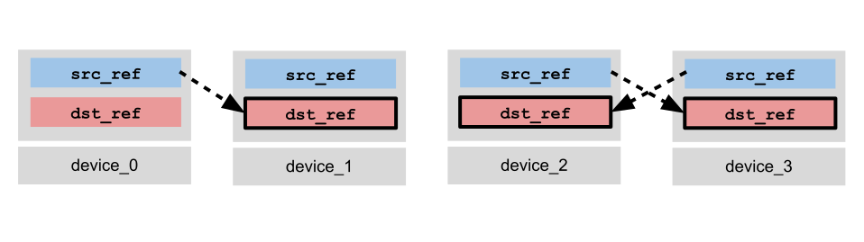
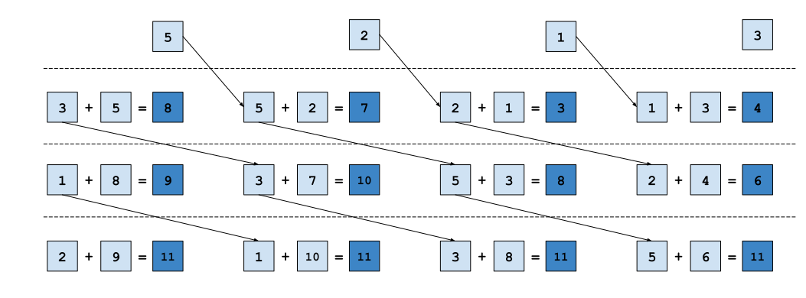

---
jupytext:
  formats: ipynb,md:myst
  main_language: python
  text_representation:
    extension: .md
    format_name: myst
    format_version: 0.13
    jupytext_version: 1.16.4
kernelspec:
  display_name: Python 3 (ipykernel)
  language: python
  name: python3
---

+++ {"id": "zSNjLhGQJMgq"}

# Distributed Computing in Pallas for TPUs

In this tutorial, we will cover the basics of distributed computing in Pallas on TPUs. We will learn about TPU topologies, communication using the remote DMA primitive, and calling a distributed kernel from JAX using `jax.shard_map`. We will also cover some more advanced kernel writing techniques, such as double-buffering, bi-directional bandwidth optimization, and nested pipelining. As educational examples, we will learn how to implement various collective primitives from JAX, such as `lax.ppermute`, `lax.all_gather`, `lax.psum`, and `lax.psum_scatter`.

Some recommended readings beforehand:
 - [Pallas Pipelining on TPU](pallas_tpu_pipelining)
 - [Collectives with `jax.shard_map`](shard_map_collectives_tutorial)

```{code-cell} ipython3
---
executionInfo:
  elapsed: 52
  status: ok
  timestamp: 1744390458993
  user:
    displayName: Justin Fu
    userId: '17543197034567316452'
  user_tz: 420
id: PyAGnWc9yI8T
outputId: c5912653-c34b-4810-c373-4a2787691317
---
import functools
import jax
from jax import lax
from jax import numpy as jnp
from jax.experimental import pallas as pl
from jax.experimental.pallas import tpu as pltpu

P = jax.sharding.PartitionSpec

num_devices = jax.local_device_count()
assert num_devices > 1, "Please run this notebook with more than one device."
assert "TPU" in jax.devices()[0].device_kind, "Please run this notebook with TPU devices."
print(f"Running with {num_devices} {jax.devices()[0].device_kind} devices.")
```

+++ {"id": "DySMGNByclMi"}

## TPU Topologies

TPUs are typically deployed in pods of multiple devices connected via a high-bandwidth interchip interconnect (ICI) for communication within the pod that is much faster than a typical network connection. For example, the specifications sheet for a [TPU v5p](https://cloud.google.com/tpu/docs/v5p) states an ICI bandwidth of 4.8Tb/s per chip (for reference, TPU v5p also has 21Tb/s of *local* HBM bandwidth). The ICI allows us to implement fast and performant distributed kernels that require high-bandwidth communication within a pod, and use the datacenter network for parallelization over less bandwidth-intensive operations, such as data-parallelism over a batch dimension.

TPUs pods are typically arranged in an ND torus topology. The following graphic gives several examples of configurations of different sizes.


Flattened as a graph, the torus can be visualized as follows. Each edge (orange or black) is a bidirectional connection between two devices. You will commonly hear about rings in conjunction with discussion about device topologies — a key feature of a torus is that when taking a slice along an axis of the pod, such as the nodes `[(0,1), (1, 1), (2, 1), (3, 1)]` or `[(0, 1), (1, 1)]`, we have a ring of devices. This is a feature we can use to simplify communication patterns within the pod.


+++ {"id": "1Oc_WD1hChfN"}

## Remote Direct Memory Access (RDMA) Model

TPUs communicate via a push-only model known as a remote direct memory access (RDMA). A TPU is allowed to issue copy instruction to push from a local buffer to any buffer on another device within the same pod that executes asynchronously from the main program thread. However, a TPU can only read data that is stored locally. This is in contrast to more traditional multi-core programming where it is possible to both read from and write to values to a shared memory.

### Async Remote Copy Operation
The `pltpu.make_async_remote_copy` function is used to create a remote DMA descriptor object which parameterizes both a "send" operation and a "receive" operation. Here's its signature:

```python
 def make_async_remote_copy(
     src_ref: Ref,
     dst_ref: Ref,
     send_sem: Ref[SemaphoreType],
     recv_sem: Ref[SemaphoreType],
     device_id: int | tuple[int, ...],
     device_id_type: DeviceIdType
 ) -> AsyncCopyDescriptor:
```

- `src_ref` is the local `Ref` (in any memory space) containing the data you wish to send to `dst_ref` on another device.
- `dst_ref` is the remote `Ref` (in any memory space) at which data will be copied to on the target device.
- `send_sem` is a DMA semaphore used to block until all data has been sent from `src_ref`.
- `recv_sem` is a DMA semaphore used to block until the expected number of bytes have been received at `dst_ref`. The sender of the DMA will write to the receiver's `recv_sem`.
- `device_id` is the device ID of the target device to send to.
- `device_id_type` specifies the format of `device_id`, which can either be in LOGICAL format (integer device ID), or in MESH format (an ND-tuple index into the logical device mesh). The default mode is MESH.

`make_async_remote_copy` returns a descriptor object on which you use the `.start()` method to initiate the DMA, and the `.wait_send()` to block on `send_sem` and `.wait_recv()` to block on `recv_sem` (or `.wait()` to block on both). If a device is only expected to send data, it is sufficient to only call `.start()` and `.wait_send()`, and likewise if a device is only receiving it is sufficient to only call `.wait_recv()`. If using a SPMD pattern where all devices execute the DMA, each device will generally call both `.start()` and `.wait()`.
```python
dma_descriptor = make_async_remote_copy(src_ref, dst_ref, send_sem, recv_sem, device_id)
dma_descriptor.start() # Initiate the DMA (non-blocking).
# ... do other work
dma_descriptor.wait_send() # Block until all data has been sent.
dma_descriptor.wait_recv() # Block until all data has been received.
```

As an example, let's visualize a DMA where we consider 4 devices (indexed 0, 1, 2, 3). We consider a scheme where device 0 copies to device 1, and device 2 & 3 copy to each other. In practice, we can create such an asymmetric communication pattern by using `@pl.when` to branch on the device ID.

(1) Each device creates the DMA descriptor. Devices 0, 2, and 3 call `.start()` to initiate the DMA from `src_ref`. Device 1 is skips the `.start()` and does nothing, e.g. by using `pl.when`.


(2) As `.start()` is non-blocking, each device is free to do other computation while the DMA is in flight. Devices 0, 2, and 3 call `.wait_send()` to wait on `send_sem` which blocks until all data has been sent.


(3) Finally, devices 1, 2, and 3 will call `.wait_recv()` to wait on `recv_sem` until all data has arrived at `dst_ref`.



The above communication pattern can be written as follows:
```python
def example_kernel(input_ref, output_ref, send_sem, recv_sem):
    device_id = lax.axis_index('x')
    copy_0_to_1 = pltpu.make_async_remote_copy(
        src_ref=input_ref,
        dst_ref=output_ref,
        send_sem=send_sem,
        recv_sem=recv_sem,
        device_id=1,
    )
    copy_2_to_3 = pltpu.make_async_remote_copy(
        src_ref=input_ref,
        dst_ref=output_ref,
        send_sem=send_sem,
        recv_sem=recv_sem,
        device_id=3,
    )
    copy_3_to_2 = pltpu.make_async_remote_copy(
        src_ref=input_ref,
        dst_ref=output_ref,
        send_sem=send_sem,
        recv_sem=recv_sem,
        device_id=2,
    )
    @pl.when(device_id == 0)
    def _():
      copy_0_to_1.start()
      copy_0_to_1.wait_send()
    @pl.when(device_id == 1)
    def _():
      copy_0_to_1.wait_recv()
    @pl.when(device_id == 2)
    def _():
      copy_2_to_3.start()
      copy_2_to_3.wait_send()
      copy_3_to_2.wait_recv()
    @pl.when(device_id == 3)
    def _():
      copy_3_to_2.start()
      copy_3_to_2.wait_send()
      copy_2_to_3.wait_recv()
```

### DMA Semaphores

`send_sem` and `recv_sem` are instances of a special type of semaphore reserved exclusively for use with DMAs. They must be allocated with the `tpu.SemaphoreType.DMA` type when specifying input specs to `pallas_call`.

Internally, DMA semaphores can be thought of as integer-valued progress trackers. On DMA start, the local device will begin to increment the value of `send_sem` and the receiver's `recv_sem` asynchronously. Waiting on a semaphore will block until the value of the semaphore reaches the total bytes of data sent/received; when the value is reached, waiting threads are released and the semaphore's value is decremented by the same amount. This means that either all data has been sent (for `send_sem`) or all data has been received (for `dst_sem`). The value of the semaphore can be read with `pl.semaphore_read`, but note that the underlying semantics of the value could change between hardware generations (e.g. the value may not represent exactly the number of bytes sent, although this is a useful mental model to have when reasoning about the behavior of the semaphore).

### Routing

A sender is allowed to send data to any receiver within the same pod, even if they do not share a direct connection (the exception to this rule is for TPU v5e, where devices can only route to a power of 2 offset from themselves). TPUs have an internal routing mechanism which can pass data along to the next device on the path to the destination. However, communicating in this way is not recommended as you have no control over network contention as a kernel writer. The examples we will cover in this tutorial minimize inefficient communication by only transferring data to neighboring devices.

### Failure modes

If using remote DMAs incorrectly, you may encounter several failure modes which can be difficult to debug. The general symptoms of buggy DMA usage are crashes, hanging, or silent data corruption:
- If semaphores exit the program with an invalid non-zero value, Pallas will crash and exit the program.
- If semaphores are waited on but an insufficient number of bytes are received (i.e. there is no sender, or if the sent data is less than the size of `dst_ref` on the receiving device), the program may hang indefinitely waiting for bytes that are never sent. In this case the program would need to be restarted.
- If encountering a race condition, there could be silent data corruption if two simultaneous writes or a simultaneous read and write occur.

Some common causes of the above include:
- If a device calls `.wait_recv()` but no other device sends to it, the kernel may hang.
- If a device is sent a more bytes than it expected to receive, it may also crash due to non-zero semaphore states. If sent less, it may hang indefinitely.
- If DMAs are started but the semaphores are not waited on, the program may crash due to non-zero semaphore states.
- If two devices copy to the same destination, you may encounter non-deterministic results due to a race condition, or crashing due to  non-zero semaphore states.

+++ {"id": "vpGSN1Sui0Bu"}

### Example: Right Permute (`lax.ppermute`)

Let's dive into a very basic example. We will implement a kernel that performs a right permutation, where each device sends its slice of the data to its right neighbor.

Suppose we had an array with 512 elements, which we shard into slices of size 128 across 4 devices. Each device will pass its slice to the next device, and the output will consist of the same data, but with the slices rotated by 1. This is identical to the `lax.ppermute` operation where the permutation is set to `(n, (n+1) % 4)`.

In order to call the kernel in distributed mode, we wrap the `pallas_call` in a `shard_map` transformation. From there, we can write the kernel the same way as you would write a normal single-device Pallas kernel, except we now have access to remote DMA instructions. JAX collective primitives such as `lax.axis_index` can be used to obtain a `device_id` that can be used to compute which target devices to copy to, by referencing the same named axes names passed into `shard_map`.

```{code-cell} ipython3
---
executionInfo:
  elapsed: 152
  status: ok
  timestamp: 1744390459367
  user:
    displayName: Justin Fu
    userId: '17543197034567316452'
  user_tz: 420
id: YkyIKN2thZ-V
outputId: 26719bb9-87ff-46dd-af90-a114ce332417
---
partition = P(None, 'x')
mesh = jax.make_mesh((num_devices,), ('x',))
sharding = jax.sharding.NamedSharding(mesh, partition)

# Create an input array that shards the last dimension across
# all devices.
input_arr = jax.random.uniform(jax.random.key(0), (8, 128 * num_devices))
input_arr = jax.device_put(input_arr, sharding)


def right_permute_kernel(input_ref, output_ref, send_sem, recv_sem):
  my_id = lax.axis_index('x')
  right_neighbor = lax.rem(my_id + 1, num_devices)
  remote_copy_op = pltpu.make_async_remote_copy(
      src_ref=input_ref,
      dst_ref=output_ref,
      send_sem=send_sem,
      recv_sem=recv_sem,
      device_id=(right_neighbor,),
      device_id_type=pltpu.DeviceIdType.MESH,
  )
  remote_copy_op.start()
  remote_copy_op.wait()


out_shape = jax.ShapeDtypeStruct((8, 128), jnp.float32)
grid_spec = pltpu.PrefetchScalarGridSpec(
    num_scalar_prefetch=0,
    # MemorySpace.ANY will (usually) place the tensor in HBM.
    in_specs=[
        pl.BlockSpec(memory_space=pltpu.MemorySpace.ANY),
    ],
    out_specs=pl.BlockSpec(memory_space=pltpu.MemorySpace.ANY),
    scratch_shapes=(
        # We allocate DMA semaphores in scratch memory.
        [pltpu.SemaphoreType.DMA] * 2
    ),
)
right_permute = pl.pallas_call(
    right_permute_kernel,
    out_shape=out_shape,
    grid_spec=grid_spec,
)
# Wrap the kernel within a shard_map to call.
pallas_result = jax.jit(
    jax.shard_map(
        right_permute,
        mesh=mesh,
        in_specs=partition,
        out_specs=partition,
        check_vma=False,
    )
)(input_arr)

# Compare Pallas result to XLA shard_map result.
perm = tuple((src, (src + 1) % num_devices) for src in range(num_devices))

xla_result = jax.jit(
    jax.shard_map(
        lambda x: lax.ppermute(x, 'x', perm),
        mesh=mesh, in_specs=partition, out_specs=partition)
)(input_arr)

print('Input = ', input_arr[0, ::128])
print('Pallas Result = ', pallas_result[0, ::128])
print('lax.ppermute Result = ', xla_result[0, ::128])
print(
    'Difference |Pallas - lax.ppermute| = ',
    jnp.mean(jnp.abs(pallas_result - xla_result)),
)
```

+++ {"id": "iyfhdGXuUnq2"}

### Example: All-gather (`lax.all_gather`)

In this next example we will implement the all-gather collective operation, which has a JAX equivalent in `lax.all_gather`. In contrast with the right-permute example from above which only involves a pair of source and destination neighbors, an all-gather operation requires communication between all devices and therefore we must think about how data is routed between them. The specifics of how we implement this are dictated by the device topology, for which we assume is a ring.

#### Ring Communication Pattern

We will write our kernel assuming a ring topology. Rings are a natural fit for TPUs as slicing along any dimension of a torus produces a ring. When writing collectives, we often only need to think about 1D slices of our torus at a time because the different dimensions of the torus are reserved for different types of parallelism (data vs. model, for example).

The strategy we will use is to write a looped kernel, where on each iteration a device receives one slice of the sharded array from its left neighbor, and copies the previously received slice to its right neighbor. After `num_devices` iterations, each device will have a copy of the entire array in its local HBM.


We can re-purpose Pallas's `grid` argument to implement the loop. Rather than iterating over tiles of an array as we have done in previous tutorials, we instead set the grid to `(num_devices,)` to indicate that we want to loop over the number of devices and use `pl.program_id` to obtain the loop iteration inside of the Pallas kernel. The following code snippet demonstrates how to implement this:

```{code-cell} ipython3
---
executionInfo:
  elapsed: 209
  status: ok
  timestamp: 1744390459789
  user:
    displayName: Justin Fu
    userId: '17543197034567316452'
  user_tz: 420
id: ojQEZB5mBRqM
outputId: 3a4373f8-1fb5-4a6b-b88e-3461c2609021
---
partition = P('x', None)
mesh = jax.make_mesh((num_devices,), ('x',))
sharding = jax.sharding.NamedSharding(mesh, partition)

# Create an input array that shards the first dimension across
# all devices.
input_arr = jax.random.uniform(jax.random.key(0), (8 * num_devices, 128))
input_arr = jax.device_put(input_arr, sharding)


def all_gather_kernel(input_ref,
                      output_ref,
                      local_copy_sem,
                      send_sem,
                      recv_sems):
  outer_step = pl.program_id(0)
  my_id = lax.axis_index('x')
  right_neighbor = lax.rem(my_id + 1, num_devices)
  copy_slot = my_id - outer_step
  copy_slot = lax.rem(copy_slot + num_devices, num_devices)

  @pl.when(outer_step == 0)
  def _():
    local_copy_op = pltpu.make_async_copy(
      src_ref=input_ref,
      dst_ref=output_ref.at[my_id],
      sem=local_copy_sem,
    )
    local_copy_op.start()
    local_copy_op.wait()

  # Copy to our right neighbor.
  # Note that we will also be receiving data from our left neighbor,
  # but at `copy_slot-1` rather than `copy_slot`! This makes use of the fact
  # that the indices do not need to be symmetric between remote DMAs.
  remote_copy_op = pltpu.make_async_remote_copy(
      src_ref=output_ref.at[copy_slot],
      dst_ref=output_ref.at[copy_slot],
      send_sem=send_sem,
      recv_sem=recv_sems.at[outer_step],
      device_id=(right_neighbor,),
      device_id_type=pltpu.DeviceIdType.MESH,
  )
  remote_copy_op.start()
  remote_copy_op.wait()

out_shape = jax.ShapeDtypeStruct((num_devices, 8, 128), jnp.float32)
grid_spec = pltpu.PrefetchScalarGridSpec(
            num_scalar_prefetch=0,
            in_specs=[
                # MemorySpace.ANY will (usually) place the tensor in HBM.
                pl.BlockSpec(memory_space=pltpu.MemorySpace.ANY),
            ],
            out_specs=pl.BlockSpec(memory_space=pltpu.MemorySpace.ANY),
            scratch_shapes=(
              # DMA semaphores are allocated in scratch memory.
              # We allocated one semaphore for a local HBM-VMEM copy,
              # and one for the remote send semaphore.
              [pltpu.SemaphoreType.DMA] * 2
              # We additionally allocate one receive semaphore per device.
              # This is to avoid situations where we have multiple
              # DMAs in flight, as we do not want to share a receive
              # semaphore between the DMAs.
              + [pltpu.SemaphoreType.DMA((num_devices-1,))]

            ),
            grid=(num_devices-1,)
        )

all_gather = pl.pallas_call(
      all_gather_kernel,
      out_shape=out_shape,
      grid_spec=grid_spec,
  )

# Wrap the kernel within a shard_map to call.
pallas_result = jax.jit(
      jax.shard_map(
          all_gather,
          mesh=mesh,
          in_specs=partition,
          out_specs=partition,
          check_vma=False
      )
)(input_arr)

# Compare Pallas result to XLA shard_map result.
xla_result = jax.jit(
    jax.shard_map(
        lambda x: lax.all_gather(x, 'x'),
        mesh=mesh, in_specs=partition, out_specs=partition
    )
)(input_arr)

print('Input: ', input_arr.shape, input_arr[::8, 0])
print('Pallas Result: ', pallas_result.shape, pallas_result[:, 0, 0])
print('lax.all_gather Result: ', xla_result.shape, xla_result[:, 0, 0])
print('Difference |Pallas - lax.all_gather| = ',
      jnp.mean(jnp.abs(pallas_result - xla_result)))
```

+++ {"id": "KgU7HI2pS4om"}

A detail worth mentioning here is the use of multiple receive semaphores. Because we only block on the receiving device, it is still possible for a sender to have sent multiple DMAs in flight before the receiver has finished processing the first one (see the next section and reduce-sum example which discusses race conditions in more detail). In this situation we may hit a situation where the same semaphore is being used for multiple DMAs occurring simultaneously. To avoid this, we allocate `num_devices-1` semaphores so there is no risk of reuse. While this race condition is unlikely to happen on such a small kernel, on larger kernels there is more chance for devices to fall out of sync and potentially cause a silent failure.

+++ {"id": "EDCmAaHVtY7x"}

## Advanced Techniques

Now that we have seen how to write several basic kernels using remote DMA operations, we will go over more advanced techniques for synchronization and writing efficient kernels.

+++ {"id": "8M_kdl0FCtrL"}

### Synchronization: Regular and Barrier Semaphores

The examples we implemented in the basic tutorial do not require special handling of synchronization as all necessary communication writes to disjoint buffers. However, other operations may require more complex communication patterns that need additional synchronization primitives to avoid race conditions. Pallas provides two additional primitives to help with this: regular and barrier semaphores.

#### Regular Semaphores

Regular semaphores are the standard tool used to synchronize across multiple devices. Semaphores are fundamentally counters - they can be incremented by any device after which a device can block until the value of the semaphore reaches a specific value (and then decrement the value).

The three main operations that can be used on regular semaphores are signal, wait, and read:
```python
def semaphore_signal(
    sem: Ref[SemaphoreType],
    inc: int,
    device_id: int | tuple[int, ...],
    device_id_type: DeviceIdType
) -> None:
  ... # Increments the semaphore `sem` on the target device `device_id` by `inc`.
  
def semaphore_wait(
    semaphore: Ref[SemaphoreType],
    value: int,
) -> None:
  ... # Blocks until the locally allocated copy of `sem` reaches `value`, then decrement by `value` and proceed.
    
def semaphore_read(
    sem: Ref[SemaphoreType],
) -> jax.Array:
  ...  # Returns the current value of `sem` as an `int32[]`.
```

In order to use regular semaphores, they can be allocated in the same way as a DMA semaphore, but by specifying `pltpu.SemaphoreType.REGULAR` rather than `pltpu.SemaphoreType.DMA`.

Semaphores must be zero at the end of a Pallas program to complete successfully. There are two error cases where this may happen:
 - If a semaphore is over-signaled, the program will end with non-zero (>0) semaphores. In this case, the program will crash upon completion. This is useful for debugging as non-zero semaphores typically means there is a bug somewhere inside of the program.
 - If a semaphore is over-waited, the program will hang on the blocking `semaphore_wait` call while it waits for the semaphore to be incremented. In this case the device or program will need to be restarted.

#### Barrier Semaphores

Barrier semaphores are globally-allocated semaphores used to synchronize devices across an entire program and ensure that all devices have entered the Pallas kernel.

If a Pallas kernel is executed within the context of a larger XLA program, we need to ensure that all devices that communicate have entered the kernel. However, DMA and regular semaphores are both locally scoped - they are only understood by other devices that have entered the kernel. Barrier semaphores serve as a globally understood semaphore that can be used for synchronization no matter where in the XLA program the device is currently executing.

By default, if you do not specify a barrier semaphore, Pallas will automatically insert a barrier semaphore at the beginning of your program. However, it can be more efficient to write your own. Barrier semaphores are similar to regular semaphores in that they are counters that can be incremented via `semaphore_signal` and can be decremented via `semaphore_wait`. They are created by calling `get_barrier_semaphore()` within a kernel. Typically, we use barriers once at the beginning of a kernel to synchronize with all devices we are communicating with.

```python
from jax.experimental.pallas import tpu as pltpu

def example_kernel(...):
  # Use barrier semaphores at the beginning of a kernel.
  # is_start_of_kernel = ...
  # right_neighbor = ...
  # ...
  @pl.when(is_start_of_kernel)
  def _():
    barrier_sem = pltpu.get_barrier_semaphore()
    # Increment the semaphore of your right neighbor.
    pltpu.semaphore_signal(
          barrier_sem,
          device_id=right_neighbor,
          device_id_type=pltpu.DeviceIdType.LOGICAL,
    )
    # Wait until your left neighbor has incremented your semaphore
    pltpu.semaphore_wait(barrier_sem, 1)
  # ...
```

When using barrier semaphores, the `collective_id` compiler parameter must be passed to `pallas_call` to specify which barrier semaphore is being used. A TPU has a small, fixed number of barrier semaphores available (typically on the order of 20-30) and therefore they should be used sparingly. In order to ensure correctness, only kernels that share the same communication pattern should use the same `collective_id`. For example, if two kernels synchronize only with neighbors on the same mesh axis, they are allowed to share the same `collective_id`. However, if two kernels synchronize along different axes, they must have different `collective_id`s. Failure to do so may result in race conditions that are difficult to debug.

```python
kernel = pl.pallas_call(
      example_kernel,
      ...,
      compiler_params=pltpu.CompilerParams(collective_id=0),
)
```

+++ {"id": "zy20AxN5TSLA"}

### Double-buffering

In order to avoid reading from a local `Ref` that is also being written into by another device and creating a race condition, a useful technique is the "double-buffered" strategy where we allocate a two `Ref`s for each destination value. On each iteration, one `Ref` will be designated as a "working" slot, and the other will be designated as a "receiving" slot. The device is free to use the working slot for computation, but will only copy data into its neighbor's receiving slot. The working and receiving slots alternate every iteration, so that once a copy is finished, the old receiving slot becomes the new working slot, and vice versa. Using this scheme properly, data is never read from and written to the same buffer.

The following code skeleton demonstrates how double-buffering can be used. We keep a running iteration counter in the variable `iteration`, and the `working_slot` and `receiving_slot` alternate between 0 and 1 every iteration. `dst_ref` is allocated as a double-buffer and has the size `[2, ...]`. On each iteration, we read from the working slot using `dst_ref.at[working_slot, ...]` and use the value to perform computation. Simultaneously, we copy to our neighbor's `dst_ref.at[receiving_slot]` to avoid overwriting their `working_slot` value. By structuring our communication in this fashion it is possible to overlap the communication latency of the remote DMA with local computation while minimizing the risk of race conditions.
```python
def kernel(...):
  # ...
  iteration = pl.program_id(0)
  working_slot = lax.rem(iteration, 2)
  receiving_slot = 1 - working_slot
  # ...

  local_copy_op = pltpu.make_async_copy(
    src_ref=dst_ref.at[working_slot, ...],
    dst_ref=local_scratch_ref,
    sem=local_copy_sem,
  )
  local_copy_op.start()
  remote_copy_op = pltpu.make_async_remote_copy(
    src_ref=src_ref,
    dst_ref=dst_ref.at[receiving_slot, ...],
    send_sem=send_sem,
    recv_sem=recv_sem,
    device_id=target_device,
    device_id_type=pltpu.DeviceIdType.MESH,
  )
  remote_copy_op.start()
  
  local_copy_op.wait()
  # ... do work on local_scratch while waiting for async_copy_op to finish.
  remote_copy_op.wait()

```

In terms of synchronization, the double-buffered construction works if all devices are executing on the same iteration. If a sender manages to get one iteration ahead of its receiver, it's `working_slot` and `receiving_slot` indices will be flipped compared to the receiver, meaning that it could be writing into the `working_slot` at the same time the receiver is reading from it. In order to avoid this, it may be necessary to use a semaphore to synchronize the sender with the receiver, or add additional buffering slots ("triple", "quadruple", or N-buffered) to allow additional run-ahead at the cost of more memory. In our previous `all_gather` example, note that the kernel contained a receiving buffer with N slots, which avoids race conditions altogether. In our next kernel, we will instead go through an example which uses a double-buffer with explicit synchronization.

+++ {"id": "Or0Itv72No5d"}

### Example: All-Reduce Sum (`lax.psum`)

We will now implement an all-reduce sum kernel using double-buffering and semaphores for synchronization. For those familiar with collective operations in JAX, the equivalent operation is `lax.psum`. All-reduce is a standard collective operation where the objective is to reduce along an axis of an array, but the array is sharded across multiple devices.


In the above example, we have the array [5, 2, 1, 3] sharded across 4 devices. An all-reduce sum operation would sum all values and replicate the result on each device, leading to the result [11, 11, 11, 11] sharded across all 4 devices.

The naive implementation of all-reduce would be to gather all required values onto each device, and then reduce. However, we can improve the performance of this implementation by interleaving communication with computation. An interleaved, single-direction all-reduce can be visualized as follows. On each iteration, we receive an input value from our left neighbor, and concurrently pass input along to our next neighbor while incrementing it with our local accumulator. After N-1 iterations, each device will have a copy of the full sum in it's memory.



#### Putting it all together

The following kernel demonstrates how to combine these principles into a functional kernel.

The prologue (executed when `outer_step==0`) first initiates a barrier with both neighbors to ensure that they have also entered the kernel. It also handles initialization for all `Ref`s and handles the first remote copy to the right neighbor's "working" slot.

The main body assumes that a value has already been copied into our local working slot, either from the previous iteration or from the prologue. A complicating factor is that our destination buffers live in HBM, but we need to load values to VMEM before we perform arithmetic. Therefore, we simultaneously copy the working slot value into our VMEM (`receive_scratch`) and pass the value on to our right neighbor's receiving slot. Once the value has been copied into our VMEM, we can accumulate it into our result (contained in `o_ref`).

A subtle race condition can occur if one device runs one loop ahead of it's right neighbor. In this case, it could copy into the receiver's `working_slot` at the same time the receiver is reading from it. In order to avoid this, each device will block on a `REGULAR` semaphore before copying into the right neighbor's `dst_ref` until it has signaled that it is done reading from its `working_slot`. This race condition is rarely triggered for a small kernel such as this example, but can it can be explicitly triggered if for example using a `pltpu.delay` instruction to artificially hang a device.

Note that this is not an optimal or fully general kernel, as the block sizes must entirely fit in VMEM and we could better interleave communication and accumulation. We will discuss these optimizations in later sections.

```{code-cell} ipython3
---
executionInfo:
  elapsed: 248
  status: ok
  timestamp: 1744390460289
  user:
    displayName: Justin Fu
    userId: '17543197034567316452'
  user_tz: 420
id: XrY5bMlvBroQ
outputId: 9216e749-48d2-43ff-d64b-bd419acf3e11
---
partition = P(None, 'x')
mesh = jax.make_mesh((num_devices,), ('x',))
sharding = jax.sharding.NamedSharding(mesh, partition)

input_arr = jax.random.uniform(jax.random.key(0), shape=(8, 128 * num_devices))
input_arr = jax.device_put(input_arr, sharding)


def local_barrier(left_neighbor, right_neighbor, double_barrier=True):
  """Performs a barrier with neighbors on the global barrier semaphore.

  Optionally performs a second barrier, which prevents a potential race
  when reusing the same collective_id across kernel invocations.
  """
  barrier_sem = pltpu.get_barrier_semaphore()
  for neighbor in [left_neighbor, right_neighbor]:
    pltpu.semaphore_signal(
      barrier_sem,
      inc=1,
      device_id=(neighbor,),
      device_id_type=pltpu.DeviceIdType.MESH,
    )
  pltpu.semaphore_wait(barrier_sem, 2)
  if double_barrier:
    # The double-barrier prevents a race condition where one neighbor can
    # re-enter the kernel again on a subsequent call and increment the
    # barrier semaphore a second time. This would unblock the current device
    # even if the other neighbor is not ready yet.
    # To implement a double-barrier, we stack-allocate a second REGULAR
    # semaphore using run_scoped.
    @functools.partial(pl.run_scoped,
                       second_barrier=pltpu.SemaphoreType.REGULAR)
    def _(second_barrier):
      for neighbor in [left_neighbor, right_neighbor]:
        pltpu.semaphore_signal(
          second_barrier,
          inc=1,
          device_id=(neighbor,),
          device_id_type=pltpu.DeviceIdType.MESH,
        )
      pltpu.semaphore_wait(second_barrier, 2)


def all_reduce_kernel(
    x_ref,
    o_ref,
    hbm_scratch,
    copy_sem,
    remote_recv_sem,
    remote_send_sem,
    capacity_sem,
    receive_scratch,
):
  outer_step = pl.program_id(0)
  working_slot = lax.rem(outer_step, 2)
  receiving_slot = 1 - working_slot

  my_id = lax.axis_index('x')
  right_neighbor = lax.rem(my_id + 1, num_devices)
  left_neighbor = lax.rem(my_id - 1 + num_devices, num_devices)

  @pl.when(outer_step == 0)
  def _():
    # Barrier with both neighbors at the start, since we will be
    # communicating with both.
    local_barrier(left_neighbor, right_neighbor)

    # Initialize o_ref, acc_scratch, and hbm_scratch.
    o_ref[...] = jnp.zeros_like(o_ref)
    receive_scratch[...] = jnp.zeros_like(receive_scratch)
    initial_copy = pltpu.make_async_remote_copy(
        src_ref=x_ref,
        dst_ref=hbm_scratch.at[working_slot],
        send_sem=remote_send_sem,
        recv_sem=remote_recv_sem,
        device_id=(right_neighbor,),
        device_id_type=pltpu.DeviceIdType.MESH,
    )
    initial_copy.start()
    initial_copy.wait()

  # Signal to our left neighbor that we are ready to receive.
  # Without this signal, our left neighbor can be >=1 iteration ahead,
  # meaning it could write into our working slot.
  pltpu.semaphore_signal(
      capacity_sem,
      inc=1,
      device_id=(left_neighbor,),
      device_id_type=pltpu.DeviceIdType.MESH,
  )

  # Copy the partial result our left neighbor sent to us into VMEM for
  # computation.
  local_copy = pltpu.make_async_copy(
      src_ref=hbm_scratch.at[working_slot],
      dst_ref=receive_scratch,
      sem=copy_sem,
  )
  local_copy.start()

  # Block until our right neighbor is ready to receive.
  pltpu.semaphore_wait(capacity_sem, 1)
  # Pass the value to our right neighbor.
  remote_copy = pltpu.make_async_remote_copy(
      src_ref=hbm_scratch.at[working_slot],
      dst_ref=hbm_scratch.at[receiving_slot],
      send_sem=remote_send_sem,
      recv_sem=remote_recv_sem,
      device_id=(right_neighbor,),
      device_id_type=pltpu.DeviceIdType.MESH,
  )
  remote_copy.start()
  # Finish local copy and accumulate while remote_copy is happening.
  local_copy.wait()
  o_ref[...] += receive_scratch[...]
  # Block until remote copy finishes.
  remote_copy.wait()


out_shape = (
    jax.ShapeDtypeStruct((8, 128), jnp.float32),
    # We allocate the double-buffer as a Pallas output so that it is
    # resident in HBM.
    jax.ShapeDtypeStruct((2, 8, 128), jnp.float32),  # hbm_scratch
)

grid_spec = pltpu.PrefetchScalarGridSpec(
    num_scalar_prefetch=0,
    in_specs=[
        # Our input lives in VMEM
        pl.BlockSpec(memory_space=pltpu.MemorySpace.VMEM),
    ],
    out_specs=[
        # Our output lives in VMEM
        pl.BlockSpec(memory_space=pltpu.MemorySpace.VMEM),
        # Our double-buffer lives in HBM
        pl.BlockSpec(memory_space=pltpu.MemorySpace.ANY),
    ],
    grid=(num_devices,),
    scratch_shapes=(
        [pltpu.SemaphoreType.DMA] * 3
        + [pltpu.SemaphoreType.REGULAR]  # capacity_sem
        + [pltpu.VMEM((8, 128), jnp.float32)]  # receive_scratch
    ),
)

kernel = pl.pallas_call(
    all_reduce_kernel,
    out_shape=out_shape,
    grid_spec=grid_spec,
    compiler_params=pltpu.CompilerParams(collective_id=0),
)

pallas_result = jax.jit(
    jax.shard_map(
        kernel,
        mesh=mesh,
        in_specs=partition,
        out_specs=partition,
        check_vma=False,
    )
)(input_arr)
pallas_result = jax.block_until_ready(pallas_result)[0]


def lax_sum(x):
  return lax.psum(x, 'x')


xla_result = jax.jit(
    jax.shard_map(
        lax_sum, mesh=mesh, in_specs=P(None, 'x'), out_specs=P(None, 'x')
    )
)(input_arr)

print('Input = ', input_arr[0, ::128])
print('Pallas result = ', pallas_result[0, ::128])
print('lax.psum result = ', xla_result[0, ::128])
difference = jnp.mean(jnp.abs(pallas_result - xla_result))
print('Difference |Pallas - lax.psum| = ', difference)
```

+++ {"id": "d8bsZAzQreC_"}

### Run-ahead and Race Conditions

As a general rule of thumb, to maximize performance we want to allow a device to run-ahead of other devices without synchronization as much as possible without sacrificing correctness of the program. While we could enforce a barrier across all devices at the beginning of each iteration, this bottlenecks the performance of the program to the slowest device on each loop. By relaxing synchronization and allowing a moderate amount of run-ahead, we can better accommodate variance in latency between iterations and devices because a device that is slow on one iteration could catch up on the next iteration.

In the all-reduce kernel we wrote previously, we allow devices to run ahead but by less than one iteration compared to its neighbors (however, non-neighboring devices could be more than 1 iteration apart). To see why the semaphore synchronization is necessary, consider the case when one device (say device 2) hangs and falls behind the other devices. An RDMA has no "handshake" — only the receiver is blocked while waiting for the data to arrive. Therefore, each device can run up to one iteration ahead before it becomes blocked waiting for the next RDMA to arrive. If we have N devices, this means that the final device can be up to N iterations ahead of the first device.


Without adding synchronization in the other direction (forcing senders to block), device 1 could potentially run up to `N` iterations (`N = num_devices`) ahead of device 2, sending multiple writes and overwriting values in the process. To solve this in the `all_reduce` kernel we wrote previously we implemented a "handshake" protocol where the receiver signals back to the sender that it is ready to receive, and only then does the sender begin issuing the next RDMA.

+++ {"id": "UD8lNrqsUeXy"}

### Bi-directional Communication

In our previous kernels, we communicated in a single direction around a ring from left-to-right. However, as ICI connections are bi-directional, we are effectively wasting half of the total bandwidth by not sending values in the opposite direction from right-to-left. In this next kernel we will demonstrate an example which communicates in both directions to maximize ICI bandwidth.

+++ {"id": "4KjakLhbBk73"}

### Example: Bi-directional Reduce-Scatter (`lax.psum_scatter`)

A reduce-scatter operation is the combination of an all-reduce followed by a scatter. Or alternatively, an all-reduce is the combination of a reduce-scatter followed by all-gather.

The following graphic depicts the semantics of this operation. We assume that each device starts with a collection of partial sums (denoted by a letter + number, such as `A0`). The goal is to reduce along one axis (numbers), while sharding along the other axis (letters).


In order to implement a bi-directional communication strategy, we slice each input block in half, and designate a direction for each half. The top half of each block will be passed from right-to-left, and the bottom half will be passed from left-to-right. A second deviation from the communication patterns of our previous all-reduce and all-gather kernels is that we will also pass around accumulators or partial sums and keep the inputs local to each device. This is in contrast to the previous examples where we passed around inputs but kept the accumulator local to the device. Passing around the accumulator is a more natural fit for this problem as in contrast to all-reduce, most of the data in the inputs are not part of the output that will be stored locally on the device. (e.g. `B0`, `C0`, and `D0` in the above graphic will not be stored on the device holding `A` at the end).

The following diagram illustrates this communication pattern, where the colored boxes represent accumulators (not inputs!). Initially, the accumulator is simply the value that was contained in the input. At each iteration of the algorithm, we will receive a partial sum from our neighbors in each direction. We then compute the correct slice of our input to accumulate into the partial buffer, then pass the new partial sum along to our next neighbor. After N iterations, the accumulator will have passed through each device, meaning that it will hold the full sum in the end.


In terms of construction of the kernel, we introduce an additional `phase` dimension to the Pallas grid, which denotes which accumulator (left or right) we are currently computing on. We let `phase=0` denote the accumulator moving to the left, and `phase=1` denote the accumulator moving to the right. We then pipeline the two phases, such that while computing the result for one phase we are transferring our previously computed values in the opposite direction in preparation for the next phase. For example, when we are on `phase=0` (left), we first begin a DMA to transfer results we computed in the previous iteration to our right neighbor (right-DMA). Then, we accumulate into the left-buffer and save the result to HBM. We then wait for the right-DMA to complete so that it is ready for `phase=1` (right).

```{code-cell} ipython3
---
executionInfo:
  elapsed: 362
  status: ok
  timestamp: 1744390460871
  user:
    displayName: Justin Fu
    userId: '17543197034567316452'
  user_tz: 420
id: nRauUAxNHg28
---
partition = P(None, 'x')
mesh = jax.make_mesh((num_devices,), ('x',))
sharding = jax.sharding.NamedSharding(mesh, partition)

# We need a block size of (16, 128) to ensure that a half-slice is at least
# of size (8, 128), which is the size of a VREG. This makes tiling easier
# for the compiler.
block_size = (16, 128)
input_arr = jax.random.uniform(
    jax.random.key(0),
    shape=(block_size[0] * num_devices, block_size[1] * num_devices),
)
input_arr = jax.device_put(input_arr, sharding)

LEFT = 0
RIGHT = 1


def mod(x, n):
  return lax.rem(x + n, n)


def signal(left_or_right, semaphore):
  my_id = lax.axis_index('x')
  if left_or_right == LEFT:
    neighbor = mod(my_id - 1, num_devices)
  else:
    neighbor = mod(my_id + 1, num_devices)
  pltpu.semaphore_signal(
      semaphore,
      inc=1,
      device_id=(neighbor,),
      device_id_type=pltpu.DeviceIdType.MESH,
  )


def reduce_scatter_kernel(
    x_ref,
    o_ref,
    hbm_scratch,
    local_copy_sem,
    left_recv_sem,
    left_send_sem,
    right_recv_sem,
    right_send_sem,
    left_capacity_sem,
    right_capacity_sem,
    accum_scratch,
):
  outer_step = pl.program_id(0)
  phase = pl.program_id(1)
  is_start = jnp.logical_and(outer_step == 0, phase == 0)
  last_iteration = outer_step == pl.num_programs(0) - 1

  working_slot = lax.rem(outer_step, 2)
  receiving_slot = 1 - working_slot
  my_id = lax.axis_index('x')
  right_neighbor = mod(my_id + 1, num_devices)
  left_neighbor = mod(my_id - 1, num_devices)

  left_copy_device = mod(my_id + outer_step + 1, num_devices)
  right_copy_device = mod(my_id - outer_step - 1, num_devices)
  # Slices can be specified using pl.ds(start, size)
  left_copy_slice = pl.ds(0, block_size[0] // 2)
  right_copy_slice = pl.ds(block_size[0] // 2, block_size[0] // 2)
  current_phase_slice = pl.ds(phase * (block_size[0] // 2), block_size[0] // 2)

  initial_left_copy = pltpu.make_async_remote_copy(
      src_ref=x_ref.at[my_id, left_copy_slice],
      dst_ref=hbm_scratch.at[working_slot, left_copy_slice],
      send_sem=left_send_sem,
      recv_sem=left_recv_sem,
      device_id=(left_neighbor,),
      device_id_type=pltpu.DeviceIdType.MESH,
  )

  initial_right_copy = pltpu.make_async_remote_copy(
      src_ref=x_ref.at[my_id, right_copy_slice],
      dst_ref=hbm_scratch.at[working_slot, right_copy_slice],
      send_sem=right_send_sem,
      recv_sem=right_recv_sem,
      device_id=(right_neighbor,),
      device_id_type=pltpu.DeviceIdType.MESH,
  )

  left_copy = pltpu.make_async_remote_copy(
      src_ref=hbm_scratch.at[working_slot, left_copy_slice],
      dst_ref=hbm_scratch.at[receiving_slot, left_copy_slice],
      send_sem=left_send_sem,
      recv_sem=left_recv_sem,
      device_id=(left_neighbor,),
      device_id_type=pltpu.DeviceIdType.MESH,
  )
  right_copy = pltpu.make_async_remote_copy(
      # Note: Right copy is flipped with regards to slots since we are copying
      # to the next outer_step iteration.
      src_ref=hbm_scratch.at[receiving_slot, right_copy_slice],
      dst_ref=hbm_scratch.at[working_slot, right_copy_slice],
      send_sem=right_send_sem,
      recv_sem=right_recv_sem,
      device_id=(right_neighbor,),
      device_id_type=pltpu.DeviceIdType.MESH,
  )

  # --- Prologue ---
  @pl.when(is_start)
  def _():
    # Barrier with both neighbors at the start, since we will be
    # communicating with both.
    local_barrier(left_neighbor, right_neighbor)

    # Initialize o_ref, acc_scratch, and hbm_scratch with initial copies.
    o_ref[...] = jnp.zeros_like(o_ref[...])
    accum_scratch[...] = jnp.zeros_like(accum_scratch[...])

    initial_left_copy.start()
    initial_left_copy.wait()
    initial_right_copy.start()

    # We tell our left neighbor that it is allowed to send to the right.
    # (and vice versa for right neighbor)
    signal(LEFT, right_capacity_sem)
    signal(RIGHT, left_capacity_sem)

  # --- Body ---
  # At the beginning of our kernel body, we start a DMA which copies
  # the result we computed in the previous phase to our neighbor.
  # This allows us to overlap the communication of sending our previous phase
  # with the computation for the current phase.
  @pl.when(~is_start)
  def _():
    @pl.when(phase == LEFT)
    def _():
      # We block here until our right neighbor tells use we can send to
      # the right.
      pltpu.semaphore_wait(right_capacity_sem, 1)
      right_copy.start()

    @pl.when(phase == RIGHT)
    def _():
      # We block here until our left neighbor tells use we can send to
      # the left.
      pltpu.semaphore_wait(left_capacity_sem, 1)
      left_copy.start()

  local_copy = pltpu.make_async_copy(
      src_ref=hbm_scratch.at[working_slot, current_phase_slice],
      dst_ref=accum_scratch,
      sem=local_copy_sem,
  )
  local_copy.start()
  local_copy.wait()

  @pl.when(~last_iteration)
  def _():
    @pl.when(phase == LEFT)
    def _():
      accum_scratch[...] += x_ref[left_copy_device, left_copy_slice]

    @pl.when(phase == RIGHT)
    def _():
      accum_scratch[...] += x_ref[right_copy_device, right_copy_slice]

  local_copy = pltpu.make_async_copy(
      src_ref=accum_scratch,
      dst_ref=hbm_scratch.at[working_slot, current_phase_slice],
      sem=local_copy_sem,
  )
  local_copy.start()
  local_copy.wait()

  @pl.when(is_start)
  def _():
    initial_right_copy.wait()

  # At the end of our kernel body, we wait on the DMA of the previous phase
  # to make sure the results are ready for the next phase.
  @pl.when(~is_start)
  def _():
    @pl.when(phase == LEFT)
    def _():
      right_copy.wait()
      signal(LEFT, right_capacity_sem)

    @pl.when(phase == RIGHT)
    def _():
      left_copy.wait()
      signal(RIGHT, left_capacity_sem)

  # --- Epilogue ---
  # Store result on last iteration.
  @pl.when(last_iteration)
  def _():
    # Clean up semaphores so that they exit with a value of 0.
    @pl.when(phase == LEFT)
    def _():
      o_ref[left_copy_slice, ...] = accum_scratch[...]
      pltpu.semaphore_wait(right_capacity_sem, 1)

    @pl.when(phase == RIGHT)
    def _():
      o_ref[right_copy_slice, ...] = accum_scratch[...]
      pltpu.semaphore_wait(left_capacity_sem, 1)


out_shape = (
    jax.ShapeDtypeStruct((block_size[0], block_size[1]), jnp.float32),  # output
    # Shape: [working/recv, block[0], block[1]]
    jax.ShapeDtypeStruct(
        (2, block_size[0], block_size[1]), jnp.float32
    ),  # hbm_scratch
)

grid_spec = pltpu.PrefetchScalarGridSpec(
    num_scalar_prefetch=0,
    in_specs=[
        pl.BlockSpec(memory_space=pltpu.MemorySpace.VMEM),
    ],
    out_specs=[
        pl.BlockSpec(memory_space=pltpu.MemorySpace.VMEM),
        pl.BlockSpec(memory_space=pltpu.MemorySpace.ANY),
    ],
    grid=(num_devices, 2),
    scratch_shapes=(
        [pltpu.SemaphoreType.DMA] * 5
        + [pltpu.SemaphoreType.REGULAR] * 2  # Capacity semaphores
        + [
            pltpu.VMEM((block_size[0] // 2, block_size[1]), jnp.float32)
        ]  # accum_scratch
    ),
)


def pallas_reduce_scatter(input_arr):
  input_arr = input_arr.reshape(num_devices, block_size[0], block_size[1])
  return pl.pallas_call(
      reduce_scatter_kernel,
      out_shape=out_shape,
      grid_spec=grid_spec,
      compiler_params=pltpu.CompilerParams(collective_id=0),
  )(input_arr)[0]


pallas_result = jax.jit(
    jax.shard_map(
        pallas_reduce_scatter,
        mesh=mesh,
        in_specs=P(None, 'x'),
        out_specs=P('x', None),
        check_vma=False,
    )
)(input_arr)

pallas_result = jax.block_until_ready(pallas_result)
```

```{code-cell} ipython3
---
executionInfo:
  elapsed: 917
  status: ok
  timestamp: 1744390461967
  user:
    displayName: Justin Fu
    userId: '17543197034567316452'
  user_tz: 420
id: E-NMh-_teoi4
outputId: 6c8b82bc-ed64-4cc1-8c5f-65e29cdb333c
---
# Compare our result to XLA.
def lax_reduce_sum_scatter(x):
  x = x.reshape(num_devices, block_size[0], block_size[1])
  return lax.psum_scatter(x, 'x')


xla_result = jax.jit(
    jax.shard_map(
        lax_reduce_sum_scatter,
        mesh=mesh,
        in_specs=P(None, 'x'),
        out_specs=P('x', None),
    )
)(input_arr)

print('Input:', input_arr.shape, input_arr[::4, 0])
print('Pallas Result:', pallas_result.shape, pallas_result[::4, 0])
print('lax.psum_scatter Result:', xla_result.shape, xla_result[::4, 0])
print(
    'Difference |Pallas - lax.psum_scatter|:',
    jnp.max(jnp.abs(pallas_result - xla_result)),
)
```

+++ {"id": "ThKas40r40Ji"}

### Nested Remote and Local DMA Pipelines

A limitation of the previous all-reduce and reduce-scatter kernels that we wrote is that the blocks we copy via remote DMA must be small enough to fit in our working VMEM that we use for accumulation. For some kernels it may be advantageous to use larger block sizes to better utilize the TPU. For example, a matrix multiplication requires on the order of $O(N^3)$ compute operations, but only $O(N^2)$ memory transfers. Therefore, we want each block of work transferred between devices to be large enough such that the operation becomes compute bound and we can hide the communication cost using pipelining. For reference, the VMEM of a TPU (for generations v4/v5) is typically on the order of 10-100MB, whereas HBM ranges from 10-100GB.

To address this problem, we need to be able to write an "inner kernel" that handles local HBM-VMEM pipelining inside of the "outer kernel" that handles pipelining larger HBM-HBM transfers between devices. Pallas offers an API for constructing nested pipelines using the `emit_pipeline` function. The basic call signature for `emit_pipeline` follows that of a standard `pallas_call` by specifying a `grid` and `BlockSpec`s for the inputs and outputs:

```python
def emit_pipeline(
    kernel: Callable,
    grid: tuple[int],
    in_specs: PyTree[BlockSpec] = None,
    out_specs: PyTree[BlockSpec] = None,
    should_accumulate_out: bool = False,
    dimension_semantics: tuple[GridDimensionSemantics] = None,
) -> Callable:
  ... # Returns a custom pipeline given an inner kernel and BlockSpecs.
```

Indeed, one can view `pallas_call` itself as simply a wrapper around `emit_pipeline`. Because our outer kernel only involves remote HBM-HBM transfers, we are not using any of the built-in pipelining that `pallas_call` provides for HBM-VMEM transfers. The following code skeleton demonstrates what a typical program structure would look like using this pattern:

```python

def outer_kernel(...):
  # ... do work to pipeline remote HBM-HBM transfers (outer kernel)

  def inner_kernel(...):
    # ... do work (inner kernel)
  pltpu.emit_pipeline(
          inner_kernel,
          grid=inner_grid,
          in_specs=...,
          out_specs=...,
  )(inner_kernel_args)
  # ... do more work (outer kernel)

pl.pallas_call(
  outer_kernel,
  grid=outer_grid,
  in_specs=...
  out_specs=...
  scratch=inner_kernel_allocs
)
```

+++ {"id": "DzFeQjYaasX5"}

### Example: Reduce-Scatter with large HBM blocks

In this next example we will modify our previous reduce-scatter example to utilize a nested inner pipeline. Note that the communication and computation costs of `reduce_scatter` both scale linearly with the size of the input, so we do not necessarily expect to see the operation become compute-bound with larger block sizes. This example is purely for demonstration purposes on how to use the pipeline emitter.

We will increase the block sizes of the outer kernel such that they would be undesirable to place inside of VMEM, and allocate all inputs and outputs in HBM (`memory_space=MemorySpace.ANY`). The only major change from our previous kernel is the body of the kernel where accumulation is done. Rather than manually copying from HBM to VMEM, accumulating, and copying back to HBM, we use `emit_pipeline` to handle the memory transfers for us. Accumulation is done in an inner kernel with a much smaller, VMEM-friendly block size.

In our previous kernel we had the following kernel body to copy data from HBM to the VMEM accumulator, increment, and then copy the results back to HBM:

```python
local_copy = pltpu.make_async_copy(
    src_ref=hbm_scratch.at[working_slot, current_phase_slice],
    dst_ref=accum_scratch,
    sem=local_copy_sem,
)
local_copy.start()
local_copy.wait()
@pl.when(~last_iteration)
def _():
  @pl.when(phase == LEFT)
  def _():
    accum_scratch[...] += x_ref[left_copy_device, left_copy_slice]
  @pl.when(phase == RIGHT)
  def _():
    accum_scratch[...] += x_ref[right_copy_device, right_copy_slice]
local_copy = pltpu.make_async_copy(
    src_ref=accum_scratch,
    dst_ref=hbm_scratch.at[working_slot, current_phase_slice],
    sem=local_copy_sem,
)
local_copy.start()
local_copy.wait()
```

Our new kernel replaces it with the following `emit_pipeline` call:

```python
def inner_kernel(input_ref, accum_ref):
  accum_ref[...] = input_ref[...]
accum_pipeline = pltpu.emit_pipeline(inner_kernel,
                                     in_specs=[inner_block_spec],
                                     out_specs=inner_block_spec,
                                     should_accumulate_out=True,
                                     grid=inner_grid)
@pl.when(~last_iteration)
def _():
  @pl.when(phase == LEFT)
  def _():
    accum_pipeline(x_ref.at[left_copy_device, left_copy_slice],
                   hbm_scratch.at[working_slot, left_copy_slice],
    )
  @pl.when(phase == RIGHT)
  def _():
    accum_pipeline(x_ref.at[right_copy_device, right_copy_slice],
                   hbm_scratch.at[working_slot, right_copy_slice],
    )
```

The full kernel is as follows:

```{code-cell} ipython3
---
executionInfo:
  elapsed: 997
  status: ok
  timestamp: 1744390463178
  user:
    displayName: Justin Fu
    userId: '17543197034567316452'
  user_tz: 420
id: 27jni-pSartL
---
partition = P(None, 'x')
mesh = jax.make_mesh((num_devices,), ('x',))
sharding = jax.sharding.NamedSharding(mesh, partition)

# We pick a large outer kernel block size that we do not want to place
# in VMEM. For pedagogical purposes we use (4096, 4096), although in
# principle this can be much larger.
outer_block_size = (4096, 4096)
# We pick a smaller VMEM block size for the inner kernel.
inner_block_size = (128, 128)
input_arr = jax.random.uniform(
    jax.random.key(0),
    shape=(
        outer_block_size[0] * num_devices,
        outer_block_size[1] * num_devices,
    ),
)
input_arr = jax.device_put(input_arr, sharding)


inner_grid = (
    outer_block_size[0] // inner_block_size[0] // 2,
    outer_block_size[1] // inner_block_size[1],
)
inner_block_spec = pl.BlockSpec(
    index_map=lambda i, j: (i, j),
    block_shape=inner_block_size,
    memory_space=pltpu.MemorySpace.ANY,
)


def reduce_scatter_kernel(
    x_ref,
    o_ref,
    hbm_scratch,
    left_recv_sem,
    left_send_sem,
    copy_sem,
    right_recv_sem,
    right_send_sem,
    left_capacity_sem,
    right_capacity_sem,
):
  outer_step = pl.program_id(0)
  phase = pl.program_id(1)
  is_start = jnp.logical_and(outer_step == 0, phase == 0)
  last_iteration = outer_step == pl.num_programs(0) - 1

  working_slot = lax.rem(outer_step, 2)
  receiving_slot = 1 - working_slot
  my_id = lax.axis_index('x')
  right_neighbor = mod(my_id + 1, num_devices)
  left_neighbor = mod(my_id - 1, num_devices)

  left_copy_device = mod(my_id + outer_step + 1, num_devices)
  right_copy_device = mod(my_id - outer_step - 1, num_devices)
  left_copy_slice = pl.ds(0, outer_block_size[0] // 2)
  right_copy_slice = pl.ds(outer_block_size[0] // 2, outer_block_size[0] // 2)
  current_phase_slice = pl.ds(
      phase * (outer_block_size[0] // 2), outer_block_size[0] // 2
  )

  initial_left_copy = pltpu.make_async_remote_copy(
      src_ref=x_ref.at[my_id, left_copy_slice],
      dst_ref=hbm_scratch.at[working_slot, left_copy_slice],
      send_sem=left_send_sem,
      recv_sem=left_recv_sem,
      device_id=(left_neighbor,),
      device_id_type=pltpu.DeviceIdType.MESH,
  )

  initial_right_copy = pltpu.make_async_remote_copy(
      src_ref=x_ref.at[my_id, right_copy_slice],
      dst_ref=hbm_scratch.at[working_slot, right_copy_slice],
      send_sem=right_send_sem,
      recv_sem=right_recv_sem,
      device_id=(right_neighbor,),
      device_id_type=pltpu.DeviceIdType.MESH,
  )

  left_copy = pltpu.make_async_remote_copy(
      src_ref=hbm_scratch.at[working_slot, left_copy_slice],
      dst_ref=hbm_scratch.at[receiving_slot, left_copy_slice],
      send_sem=left_send_sem,
      recv_sem=left_recv_sem,
      device_id=(left_neighbor,),
      device_id_type=pltpu.DeviceIdType.MESH,
  )
  right_copy = pltpu.make_async_remote_copy(
      src_ref=hbm_scratch.at[receiving_slot, right_copy_slice],
      dst_ref=hbm_scratch.at[working_slot, right_copy_slice],
      send_sem=right_send_sem,
      recv_sem=right_recv_sem,
      device_id=(right_neighbor,),
      device_id_type=pltpu.DeviceIdType.MESH,
  )

  # --- Prologue ---
  @pl.when(is_start)
  def _():
    # Barrier with both neighbors at the start, since we will be
    # communicating with both.
    local_barrier(left_neighbor, right_neighbor)

    initial_left_copy.start()
    initial_left_copy.wait()
    initial_right_copy.start()

    # We tell our left neighbor that it is allowed to send to the right.
    # (and vice versa for right neighbor)
    signal(LEFT, right_capacity_sem)
    signal(RIGHT, left_capacity_sem)

  @pl.when(~is_start)
  def _():
    @pl.when(phase == LEFT)
    def _():
      # We block here until our right neighbor tells use we can send to
      # the right.
      pltpu.semaphore_wait(right_capacity_sem, 1)
      right_copy.start()

    @pl.when(phase == RIGHT)
    def _():
      # We block here until our left neighbor tells use we can send to
      # the left.
      pltpu.semaphore_wait(left_capacity_sem, 1)
      left_copy.start()

  # --- Body ---
  def inner_kernel(input_ref, accum_ref):
    # We do not explicitly use += because we set should_accumulate_out=True.
    accum_ref[...] = input_ref[...]

  accum_pipeline = pltpu.emit_pipeline(
      inner_kernel,
      in_specs=[inner_block_spec],
      out_specs=inner_block_spec,
      should_accumulate_out=True,
      grid=inner_grid,
  )

  @pl.when(~last_iteration)
  def _():
    @pl.when(phase == LEFT)
    def _():
      accum_pipeline(
          x_ref.at[left_copy_device, left_copy_slice],
          hbm_scratch.at[working_slot, left_copy_slice],
      )

    @pl.when(phase == RIGHT)
    def _():
      accum_pipeline(
          x_ref.at[right_copy_device, right_copy_slice],
          hbm_scratch.at[working_slot, right_copy_slice],
      )

  # --- Epilogue ---
  @pl.when(is_start)
  def _():
    initial_right_copy.wait()

  @pl.when(~is_start)
  def _():
    @pl.when(phase == LEFT)
    def _():
      right_copy.wait()
      signal(LEFT, right_capacity_sem)

    @pl.when(phase == RIGHT)
    def _():
      left_copy.wait()
      signal(RIGHT, left_capacity_sem)

  # Store result on last iteration.
  @pl.when(last_iteration)
  def _():
    output_copy = pltpu.make_async_copy(
        src_ref=hbm_scratch.at[working_slot, current_phase_slice],
        dst_ref=o_ref.at[current_phase_slice],
        sem=copy_sem,
    )
    output_copy.start()
    output_copy.wait()

    # Clean up semaphores so that they exit with a value of 0.
    @pl.when(phase == LEFT)
    def _():
      pltpu.semaphore_wait(right_capacity_sem, 1)

    @pl.when(phase == RIGHT)
    def _():
      pltpu.semaphore_wait(left_capacity_sem, 1)


out_shape = (
    jax.ShapeDtypeStruct(
        (outer_block_size[0], outer_block_size[1]), jnp.float32
    ),
    # Shape: [working/recv, block[0], block[1]]
    jax.ShapeDtypeStruct(
        (2, outer_block_size[0], outer_block_size[1]), jnp.float32
    ),  # hbm_scratch
)

grid_spec = pltpu.PrefetchScalarGridSpec(
    num_scalar_prefetch=0,
    in_specs=[
        pl.BlockSpec(memory_space=pltpu.MemorySpace.ANY),
    ],
    out_specs=[
        pl.BlockSpec(memory_space=pltpu.MemorySpace.ANY),
        pl.BlockSpec(memory_space=pltpu.MemorySpace.ANY),
    ],
    grid=(num_devices, 2),
    scratch_shapes=(
        [pltpu.SemaphoreType.DMA] * 5
        + [pltpu.SemaphoreType.REGULAR] * 2  # Capacity semaphores
    ),
)


def pallas_reduce_scatter(input_arr):
  input_arr = input_arr.reshape(
      num_devices, outer_block_size[0], outer_block_size[1]
  )
  return pl.pallas_call(
      reduce_scatter_kernel,
      out_shape=out_shape,
      grid_spec=grid_spec,
      compiler_params=pltpu.CompilerParams(collective_id=0),
  )(input_arr)[0]


pallas_result = jax.jit(
    jax.shard_map(
        pallas_reduce_scatter,
        mesh=mesh,
        in_specs=P(None, 'x'),
        out_specs=P('x', None),
        check_vma=False,
    )
)(input_arr)

pallas_result = jax.block_until_ready(pallas_result)
```

```{code-cell} ipython3
---
executionInfo:
  elapsed: 1132
  status: ok
  timestamp: 1744390464532
  user:
    displayName: Justin Fu
    userId: '17543197034567316452'
  user_tz: 420
id: cTEyiMDyx9Y0
outputId: 70ce154e-dab2-4ae0-e297-c4774d29da85
---
# Now we compare our result to XLA.
def lax_reduce_sum_scatter(x):
  x = x.reshape(num_devices, outer_block_size[0], outer_block_size[1])
  return lax.psum_scatter(x, 'x')


xla_result = jax.jit(
    jax.shard_map(
        lax_reduce_sum_scatter,
        mesh=mesh,
        in_specs=P(None, 'x'),
        out_specs=P('x', None),
    )
)(input_arr)

print('Input:', input_arr.shape, input_arr[::4, 0])
print('Pallas Result:', pallas_result.shape, pallas_result[::4, 0])
print('lax.psum_scatter Result:', xla_result.shape, xla_result[::4, 0])
print(
    'Difference |Pallas - lax.psum_scatter|:',
    jnp.max(jnp.abs(pallas_result - xla_result)),
)
```

+++ {"id": "zz5AFbriliyv"}

## Final Notes

### Megacore

Certain TPUs contain multiple cores in a [Megacore](pallas_tpu_megacore) configuration. In this configuration, our general recommendation is to only initiate DMAs from a single core, and only perform HBM-HBM transfers. To do this, set one of the grid axes to the number of cores (can be obtained via `jax.devices()[0].num_cores`) and the dimension_semantics to `"parallel"`. Then, you can use `core_index = pl.program_id(axis)` to obtain the core index along that axis, and use `@pl.when(core_index==i)` to execute code specific to that core.

### Interaction with XLA

In this tutorial we covered several kernel examples which replicate the functionality of collective operations in JAX such as `lax.all_gather`, `lax.psum`, and `lax.psum_scatter`. An important caveat to note is that a Pallas kernel is somewhat opaque to the XLA compiler and may cause it to miss some optimizations it would normally perform. For example, XLA can asynchronously dispatch collective operations in order to interleave communication and computation without writing a custom kernel. This is not guaranteed to happen when Pallas kernels are involved so it is important to profile your program to see if this is an issue. Another example is the fact that the `emit_pipeline` function we used in this tutorial to generate nested pipelines is not visible to the XLA compiler, and therefore cannot be fused with neighboring operations.

### Next Steps

Excellent follow-up exercises for the reader could include implementing a distributed matrix multiplication, implementing `lax.all_to_all`, and relaxing synchronization to allow for additional run-ahead.
