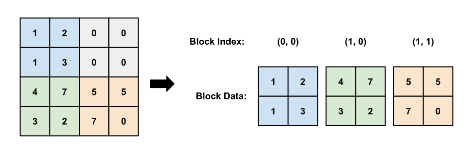

---
jupytext:
  formats: ipynb,md:myst
  main_language: python
  text_representation:
    extension: .md
    format_name: myst
    format_version: 0.13
    jupytext_version: 1.16.4
kernelspec:
  display_name: Python 3
  name: python3
---

+++ {"id": "ZHuzXqQ-9JUQ"}

(pallas_scalar_prefetch_guide)=

# Scalar Prefetch and Block-Sparse Computation

In this tutorial, we will cover the basics of block-sparse computing in Pallas. Sparse computation is a major reason to write custom Pallas kernels over simply using JAX/XLA, since it is generally difficult to express programs that perform a dynamic amount of computation in XLA due to static array shapes. In this tutorial we will learn how to use the scalar prefetch feature of Pallas in order to write block-sparse kernels that can dynamically skip over computation and blocks of memory.

```{code-cell}
---
executionInfo:
  elapsed: 56
  status: ok
  timestamp: 1726001133029
  user:
    displayName: Justin Fu
    userId: '17543197034567316452'
  user_tz: 420
id: ibeIs_6QFMAM
outputId: d72edb91-4529-4650-c9e9-b96788608635
---
import functools
import timeit
import numpy as np
import jax
from jax import numpy as jnp
from jax import lax
from jax.experimental import checkify
from jax.experimental import pallas as pl
from jax.experimental.pallas import tpu as pltpu

assert "TPU" in jax.devices()[0].device_kind, "Please run this notebook with TPU devices."
print("Running on", jax.devices()[0].device_kind)
```

+++ {"id": "FIDGpPTEIcOa"}

## Dynamic Block Indexing with Scalar Prefetch

We will be exploiting the "scalar prefetch" feature of Pallas to enable us to write sparse kernels. Scalar prefetch allows you to pass in a small amount of data into SMEM ("scalar memory") that is loaded before the start of the pipeline ("prefetch"). Because this data is loaded before the pipeline, it is available for use in the `index_map` for each BlockSpec, allowing the you to perform data-dependent indexing calculations. The main goal of this tutorial is to go over common programming patterns that utilize this feature.

To use scalar prefetch, use `pltpu.PrefetchScalarGridSpec` in place of the standard `pl.GridSpec`:

```python
class PrefetchScalarGridSpec:
  def __init__(self,
    num_scalar_prefetch: int,
    grid: tuple[int, ...],
    in_specs: PyTree[BlockSpec],
    out_specs: PyTree[BlockSpec],
    scratch_shapes: tuple[MemorySpace, ...]):
      ...
```

The `num_scalar_prefetch` parameter indicates the number of scalar prefetch values. When this is set to a non-zero value, it changes the call signature of the kernel and index maps to expect additional prefetch values. The prefetch `Ref`s passed in to the `index_map` and kernel are all allocated in SMEM and are not partitioned into blocks as they do not have a BlockSpec defined. Moreover, the order of arguments to both `index_map` and kernel are always fixed and described below:

- Each `BlockSpec`'s `index_map` now expects the prefetch `Ref`s to come after the grid indices:
```python
def index_map(*grid_indices, *prefetch_refs):
    ...
```

- The user-defined kernel expects prefetch `Ref`s to come before the input `Ref`s. Additionally, the scratch refs come after the output `Ref`s.
```python
def kernel(*prefetch_refs, *input_refs, *output_refs, *scratch_refs):
    ...
```

- When calling a new kernel using `pallas_call`, the function returned by `pallas_call` also expects the scalar prefetch arguments to come before the inputs, e.g.
```python
kernel = pl.pallas_call(...)
result = kernel(*prefetch_args, *input_args)
```

+++ {"id": "pA8RmHEA2HN3"}

## Example: Block Dynamic Slice with Scalar Prefetch

Let's begin with a basic example that demonstrates how to use the scalar prefetch feature. We will implement a block-aligned dynamic slice kernel which simply extracts a block out of larger array based on user-specified indices:

1. Outside of the kernel, we compute the block index to extract as: `block_idx = (start[0] // size[0], start[1] // size[1])`

2. We pass `block_idx` as a scalar prefetch argument into `pallas_call`.

3. In our index map, we use the block index to select the corresponding block by returning `(block_idx[0], block_idx[1])`.

Of course, this kernel is limited in that our slice sizes must fit inside of a kernel block (limited by VMEM size) and we can only start on size-aligned indices. A more advanced kernel would decouple the kernel block size with the slice size and allow non-aligned start indices.

```{code-cell}
---
executionInfo:
  elapsed: 143
  status: ok
  timestamp: 1726003877561
  user:
    displayName: Justin Fu
    userId: '17543197034567316452'
  user_tz: 420
id: FWeTBlEYlCGD
outputId: 4b04a441-c97c-4d0d-d167-c60d4d31fd2e
---
def dynamic_slice_kernel(indices, x_ref, o_ref):
  del indices
  o_ref[...] = x_ref[...]

@checkify.checkify
@functools.partial(jax.jit, static_argnums=(2,))
def block_dynamic_slice(x, starts, sizes):
  grid_spec = pltpu.PrefetchScalarGridSpec(
      num_scalar_prefetch=1,
      grid=(1, 1),
      in_specs=[pl.BlockSpec(
          sizes,
          lambda i, j, block_idx: (block_idx[0], block_idx[1]))],
      out_specs=pl.BlockSpec(sizes, lambda *_: (0, 0)),
  )

  kernel = pl.pallas_call(
    dynamic_slice_kernel,
    grid_spec=grid_spec,
    out_shape=jax.ShapeDtypeStruct(shape=sizes, dtype=x.dtype),
  )
  # Checkify inserts a runtime assert that starts are divisible by block size.
  checkify.check(starts[0] % sizes[0] == 0, "Starts must be divisible by size.")
  checkify.check(starts[1] % sizes[1] == 0, "Starts must be divisible by size.")
  block_idx = jnp.array([starts[0] // sizes[0], starts[1] // sizes[1]])
  return kernel(block_idx, x)

shape = (512, 512)
x = jnp.reshape(jnp.arange(np.prod(shape), dtype=jnp.int32), shape)
err, result = block_dynamic_slice(x, starts=(128, 256), sizes=(128, 128))
err.throw()
ref = lax.dynamic_slice(x, start_indices=(128, 256), slice_sizes=(128, 128))
diff = jnp.max(jnp.abs(result - ref))
print("Error |result - lax.dynamic_slice| =", diff)
```

+++ {"id": "K2dod4lkoifa"}

## Sparse Kernels: Representing Sparse Data

Before we dive into implementing sparse kernels, let's first review how sparse matrices are represented. While there are several popular formats for storing sparse matrices, we will be following a blocked variant of the coordinate-list format (COO) in which we will store a matrix as a list of `(block_index, block_data)` pairs. All blocks that are not explicitly stored in the list are assumed to be zero, meaning we can save a significant amount of memory if there are many zero blocks in the matrix.

The following figure demonstrates how we convert a 4x4 dense matrix (left) into a block-COO format (right) with a block size of 2x2. Note that in the sparse format, we can avoid explicitly storing the upper-right block which consists of all zero elements.



We will use the following helper function to sample a block-sparse matrix. It returns a dense matrix used for checking our results, as well as a list of block data and indices for each axis.

```{code-cell}
:id: 1gLiSvgIYUEx

def generate_block_sparse_mat(key, M, N, blk_M, blk_N, p=0.2, dtype=jnp.float32):
  """Returns a sampled matrix and its block-sparse representation.

  Args:
    key: RNG Key.
    M: Major array dimension.
    N: Minor array dimension.
    blk_M: Block size along M dimension.
    blk_N: Block size along N dimension.
    p: Probability that a block will be non-zero.
    dtype: dtype of the sampled matrix.

  Returns:
    dense_mat: A (M, N) dense sampled array.
    block_data: A (num_blocks, blk_M, blk_N) array of data blocks representing
      the non-zero blocks of the matrix.
    indices_i: A (num_blocks,) array of block indices for the first axis.
    indices_j: A (num_blocks,) array of block indices for the second axis.
  """
  mask_key, blocks_key = jax.random.split(key)
  num_blocks = (M // blk_M, N // blk_N)
  # We first sample a block mask, denoting which blocks are nonzero.
  block_mask = jax.random.bernoulli(mask_key, p=p, shape=num_blocks)
  num_blocks = jnp.sum(block_mask)
  indices = jnp.where(block_mask)
  # For each non-zero block, we sample a block of random values.
  block_data = jax.random.uniform(blocks_key,
                                  shape=(num_blocks, blk_M, blk_N),
                                  dtype=dtype)
  # For checking purposes, create the dense version of the sparse matrix.
  dense_mat = jnp.zeros((M, N), dtype=dtype)
  for blk in range(num_blocks):
    idx_i = indices[0][blk]
    idx_j = indices[1][blk]
    slice_i = slice(idx_i * blk_M, (idx_i + 1) * blk_M)
    slice_j = slice(idx_j * blk_N, (idx_j + 1) * blk_N)
    dense_mat = dense_mat.at[slice_i, slice_j].set(block_data[blk])
  return dense_mat, block_data, indices[0], indices[1]
```

+++ {"id": "eFyoZSTOH9Fk"}

## Example: Sparse @ Dense Matrix Multiplication

In our first example, we will multiple a sparse LHS matrix with a dense RHS matrix to produce a dense output.

We will structure our kernel grid with 2 loops - the outer loop over the columns of the RHS/output, and inner loop over the sparse blocks of the LHS. During each inner loop iteration, we load one block from the LHS and lookup the corresponding block on in the RHS using the block index of the contracting dimension (K). We multiply the two blocks together and accumulate into the correct output block. One outer loop iteration will compute a result for an entire column as depicted by the following diagram:


It is important that we group the block indices by row (e.g. `[0, 0, 1, 2, 3, 3]`) before we pass them into the kernel for two reasons. First, in our kernel we need to know when to initially zero-out the accumulator in the output ref, and it is easy to do so if the row indices are grouped. Second, the pipelining logic for Pallas does not allow us to re-visit blocks in the output `Ref` on non-consecutive iterations, and therefore we need to do all accumulation into an output block in consecutive kernel iterations. This is because the pipeline emitter will realize that we loading the same output block on consecutive iterations and keep the block in VMEM. When we change output block Pallas will finally store the output into HBM and assume we never touch it again. Failure to access output blocks consecutively will result in incorrect values even though the kernel is otherwise logically correct.

```{code-cell}
---
executionInfo:
  elapsed: 673
  status: ok
  timestamp: 1725919879291
  user:
    displayName: Justin Fu
    userId: '17543197034567316452'
  user_tz: 420
id: WfyV2WWhjsyA
outputId: fa4d4fff-bc6b-4dc9-ac14-63276ca14131
---
M = N = K = 16384
blk_M = blk_N = blk_K = 512


def dsd_kernel(idxs_i_ref, idxs_k_ref, # Scalar prefetch inputs.
               x_ref, y_ref, _, o_ref, # Kernel inputs.
               accum_scratch,
               ):
  """A DSD (Dense = Sparse @ Dense) matmul kernel."""
  del idxs_k_ref
  blk_idx = pl.program_id(1)
  is_start = blk_idx == 0
  changed_blocks = (idxs_i_ref[blk_idx] != idxs_i_ref[jnp.maximum(blk_idx-1, 0)])
  @pl.when(is_start | changed_blocks)
  def _():
    accum_scratch[...] = jnp.zeros_like(accum_scratch)
  accum_scratch[...] += jnp.dot(x_ref[0, :, :], y_ref[...], preferred_element_type=jnp.float32)

  next_block_change = (idxs_i_ref[blk_idx] != idxs_i_ref[jnp.minimum(blk_idx+1, num_blocks)])
  is_end = blk_idx == (num_blocks - 1)
  @pl.when(is_end | next_block_change)
  def _():
    o_ref[...] = accum_scratch[...].astype(o_ref.dtype)


def x_map(j, blk_idx, blk_idxs_i, blk_idxs_k):
  del j, blk_idxs_i, blk_idxs_k
  return (blk_idx, 0, 0)
def y_map(j, blk_idx, blk_idxs_i, blk_idxs_k):
  del blk_idxs_i
  return (blk_idxs_k[blk_idx], j)
def o_map(j, blk_idx, blk_idxs_i, blk_idxs_k):
  del blk_idxs_k
  return (blk_idxs_i[blk_idx], j)

(X_dense, X_blocks, indices_i, indices_k) = generate_block_sparse_mat(
    jax.random.key(0), M, K, blk_M, blk_K, p=0.1, dtype=jnp.bfloat16)
num_blocks = X_blocks.shape[0]
Y = jax.random.uniform(jax.random.key(1), shape=(K, N), dtype=jnp.bfloat16)
zeros = jnp.zeros((M, N), dtype=jnp.bfloat16)
out_shape = jax.ShapeDtypeStruct((M, N), dtype=jnp.bfloat16)

grid_spec = pltpu.PrefetchScalarGridSpec(
    num_scalar_prefetch=2,
    # Note that while num_blocks is static here, Pallas does support
    # dynamic grid sizes.
    grid=(N // blk_N, num_blocks),
    in_specs=[pl.BlockSpec((1, blk_M, blk_K), x_map),
              pl.BlockSpec((blk_K, blk_N), y_map),
              # Placeholder for a zeros-array used by input_output_aliases.
              pl.BlockSpec((blk_M, blk_N), o_map),
              ],
    out_specs=pl.BlockSpec((blk_M, blk_N), o_map),
    scratch_shapes=[pltpu.VMEM((blk_M, blk_N), dtype=jnp.float32)]
)
kernel = pl.pallas_call(
  dsd_kernel,
  grid_spec=grid_spec,
  out_shape=out_shape,
  # We use input-output aliases to zero-out o_ref for blocks that we never
  # visit. By passing in an array of zeros we avoid having o_ref start with
  # uninitialized values.
  input_output_aliases={4: 0},  # Map zeros to o_ref.
)
args = (indices_i, indices_k, X_blocks, Y, zeros)
result = kernel(*args)

ref = X_dense @ Y
diff = jnp.abs(ref - result)
print('mean |result - ref|:', jnp.mean(diff))
```

+++ {"id": "2KDgPKF2tUjq"}

We can do a quick benchmark to compare the performance of our sparse kernel compared to a dense matmul in JAX. On a TPU v5e chip, this kernel achieves a roughly ~6x speed increase compared to the theoretical 10x from the sparsity factor.

There are a few main tips for performance here, mainly centered around reducing the communication overhead between HBM/VMEM:
- Using `dtype=jnp.bfloat16` is critical for performance since it reduces memory bandwidth by half.
- Using larger block sizes also helps, since matrix multiply is an $O(N^3)$ compute and $O(N^2)$ memory operation. As $N$ grows larger, the kernel becomes compute-bound. However, a counter-argument to this in practice is that smaller block sizes also enables data to be more sparse, so this is a parameter that should be selected carefully.

```{code-cell}
---
executionInfo:
  elapsed: 6576
  status: ok
  timestamp: 1725919886762
  user:
    displayName: Justin Fu
    userId: '17543197034567316452'
  user_tz: 420
id: CkzjqnekpZbx
outputId: 1ae9031e-705a-4d05-f8b9-d09623918300
---
# Benchmark Sparse Pallas kernel vs reference JAX implementation

def benchmark(f, ntrials: int = 100):
  def run(*args, **kwargs):
    # Compile function first
    jax.block_until_ready(f(*args, **kwargs))
    # Time function
    result = timeit.timeit(lambda: jax.block_until_ready(f(*args, **kwargs)),
                           number=ntrials)
    time = result / ntrials
    return time
  return run


n_trials = 100

pallas_impl = lambda *args: kernel(*args)
time = benchmark(pallas_impl, n_trials)(indices_i, indices_k, X_blocks, Y, zeros)
print("Sparse Kernel: %.3f ms (avg over %d trials)" % (time * 1000, n_trials))

ref_impl = jax.jit(lambda x, y: x @ y)
time = benchmark(ref_impl, n_trials)(X_dense, Y)
print("Reference: %.3f ms (avg over %d trials)" % (time * 1000, n_trials))
```

+++ {"id": "Q1KKd5vTCwnB"}

## Sparse Access Patterns on Dense Data

In our previous example we considered the case when the data itself is sparse. This manifested itself in the kernel structure as a dimension in the kernel grid that was dynamic and looped over the number of nonzero blocks (`num_blocks`).

A second useful programming pattern emerges when the underlying is data is dense, but we wish to perform sparse computation over it. Our kernel grid in this case will be dense, but we wish to skip over some blocks in the grid as indicated by a block-sparse mask. This type of programming pattern is commonly arises when using masks in many machine learning applications, such as causal or local masks in self-attention. In these cases, we can entirely skip over computation in blocks where the mask is zeroed-out. Examples of this programming pattern can be found in the Splash Attention and Grouped Matrix Multiplication kernels located in `jax/experimental/pallas/ops/tpu`, or in PyTorch's [FlexAttention](https://pytorch.org/blog/flexattention/).

The main performance consideration with dealing with a sparse access pattern on dense data is the interaction with pipelining. On any given kernel iteration, the Pallas pipeline emitter will attempt to prefetch the next block of data by calling the `index_map` for each `BlockSpec` on the next iteration of the grid. However, if our computation is sparse we may be skipping the computation for the next block in the grid, so we need some method to tell the pipeline instead begin fetching the *next block that we are not skipping*. In order to do this, we need to construct *prefetch maps* which contains indices to the next non-skipped block of data for each kernel input. The following diagram illustrates how a prefetch map could be constructed for a block-sparse mask that is stored in a COO-like format.


*Left: A sparse access pattern, where the color blue denotes blocks with non-zero masks that we need to compute. Right: The prefetch map, where each element of the array contains the index of the next non-zero block data.*

Once the prefetch map has been constructed, we can pass the map as a scalar prefetch argument and query it in the `index_map` function of the BlockSpec.

```python
def mask_index_map(prefetch_map, i, j, ...):
  next_nonzero_block = prefetch_map[i, j]
  return (next_nonzero_block, 0, 0)
```

We can construct similar index maps for the other inputs to the kernel. For dense inputs you will most likely need to construct prefetch maps which point to the next non-zero block index in the grid. Our next example will provide an example of using these prefetch maps.

+++ {"id": "ii7rzL5YIA8-"}

## Example: Dense @ Dense Matrix Multiplication with a Block-Sparse Output Mask

+++ {"id": "ecjiqWfA2RlV"}

In our next example we will cover dense matrix multiplication fused with a sparse output mask using a prefetch map to improve pipelining performance. We will use the mask to selectively skip computing output blocks that are zeroed-out, therefore saving on computation costs.

As we will be working with a sparse mask, we will begin by implementing a function that converts an `N x M` mask stored in dense format into a block-sparse format. We additionally need to compute prefetch maps to help the pipeline emitter know which block to fetch next. In total, our `sparsify_mask` function computes:
- A `block_mask` of shape `(num_N_blocks, num_M_blocks)` indicating if a block is all-zeros (value `0`) or contains non-zero elements (value `1`). If the `block_mask` has a value of 0 we can skip computing the block in the kernel.
- A `prefetch_mask` array of shape `(num_N_blocks, num_M_blocks)` consisting of indices into `mask_data` for the next non-zero block.
- A `prefetch_i` array of shape `(num_N_blocks, num_M_blocks)` consisting of the next non-masked `i` index of the mask.
- A `prefetch_j` array of shape `(num_N_blocks, num_M_blocks)` consisting of the next non-masked `j` index of the mask.
- A `mask_data` array of shape `(num_blocks, blk_N, blk_M)` containing data for non-zero blocks of the mask.

```{code-cell}
:id: 19zGcliL2SJy

def sparsify_mask(mask: jax.Array,
                  block_shape: tuple[int, int]):
  """Preprocesses a mask into a sparse representation.

  Args:
    mask: A boolean array of shape [M, N]
    block_shape: The size of a single block.

  Returns:
    block_mask: A block_shape array of booleans indicating whether a block
      is all-zeros (0) or contains non-zero elements (1).
    prefetch_mask: A block_shape array of integers indicating the index of the
      next non-zero block.
    mask_data: A (num_blocks, block_shape) array containing
      the data for non-zero blocks of the mask.
  """
  M, N = mask.shape
  bm, bn = block_shape

  block_mask = jnp.zeros((M // bm, N // bn), dtype=mask.dtype)
  mask_types_finder = []
  mask_data = []
  mask_type_idxs = []

  next_mask_type_idx = 0
  prefetch_mask = jnp.zeros_like(block_mask)
  next_i = (M // bm) - 1
  next_j = (N // bn) - 1
  prefetch_i = jnp.zeros_like(block_mask)
  prefetch_j = jnp.zeros_like(block_mask)
  for i in range(M // bm, -1, -1):
    for j in range(N // bn, -1, -1):
      mask_block = mask[i * bm :(i + 1) * bm,
                        j * bn :(j + 1) * bn]
      is_nonzero = jnp.any(mask_block)
      if is_nonzero:
        try:
          type_index = mask_types_finder.index(str(mask_block))
        except ValueError:
          type_index = len(mask_types_finder)
          mask_types_finder.append(str(mask_block))
          mask_data.append(mask_block)
        next_mask_type_idx = type_index
        next_i = i
        next_j = j
      else:
        type_index = -1
      mask_type_idxs.append(type_index)
      block_mask = block_mask.at[i, j].set(is_nonzero)
      prefetch_mask = prefetch_mask.at[i, j].set(next_mask_type_idx)
      prefetch_i = prefetch_i.at[i, j].set(next_i)
      prefetch_j = prefetch_j.at[i, j].set(next_j)
  return block_mask, prefetch_mask, prefetch_i, prefetch_j, jnp.stack(mask_data)
```

+++ {"id": "w4b7ckKq67Xw"}

In terms of the structure of the kernel, we use the same grid pattern as the standard matrix multiplication kernel we covered in previous tutorials with a 3 loops over the `N`, `M`, and `K` dimensions. Within the kernel itself, we first check the `block_mask` to see if the mask for the current output block was all zeros. If the mask is all zeros, we can skip computation and move onto the next block; otherwise we need to compute the matrix multiplication and then mask the result.

```{code-cell}
---
executionInfo:
  elapsed: 5374
  status: ok
  timestamp: 1725919713252
  user:
    displayName: Justin Fu
    userId: '17543197034567316452'
  user_tz: 420
id: 4YQ9OmbTCSjT
outputId: 2d752609-34f2-4059-e8ba-4d80afe8cb26
---
M = N = K = 16384
blk_M = blk_N = 512
blk_K = 1024

def sparse_mask_matmul(
    block_mask_ref, prefetch_mask, prefetch_i, prefetch_j, # Scalar prefetch inputs.
    x_ref, y_ref, mask_ref, o_ref,  # Kernel inputs.
    accum_scratch
    ):
  del prefetch_mask, prefetch_i, prefetch_j
  i, j, k = pl.program_id(0), pl.program_id(1), pl.program_id(2)
  should_compute = block_mask_ref[i, j] != 0
  @pl.when(k == 0)
  def _():
    o_ref[...] = jnp.zeros_like(o_ref)
    accum_scratch[...] = jnp.zeros_like(accum_scratch[...])

  # We only compute the output for blocks with non-zero masks.
  # Otherwise we skip the computation entirely.
  @pl.when(should_compute)
  def _():
    result = jnp.dot(x_ref[...], y_ref[...], preferred_element_type=jnp.float32)
    accum_scratch[...] += result
    @pl.when(k == pl.num_programs(2) - 1)
    def _():
      o_ref[...] = (mask_ref[0, ...] * accum_scratch[...]).astype(o_ref.dtype)

X = jax.random.normal(jax.random.key(0), shape=(M, K), dtype=jnp.bfloat16)
Y = jax.random.normal(jax.random.key(1), shape=(K, N), dtype=jnp.bfloat16)
mask = jnp.ones((M, N), dtype=jnp.int32)
mask = jnp.tril(mask)
block_mask, prefetch_mask, prefetch_i, prefetch_j, sparse_mask_data = sparsify_mask(mask, (blk_M, blk_N))

def x_map(i, j, k, block_mask, prefetch_mask, prefetch_i, prefetch_j):
  del prefetch_mask, prefetch_j
  # Zero-out the k index if the mask is zero, to avoid constantly fetching
  # new blocks in the inner loop for blocks we are skipping.
  k_fetch = (block_mask[i, j] != 0) * k
  return (prefetch_i[i, j], k_fetch)

def y_map(i, j, k, block_mask, prefetch_mask, prefetch_i, prefetch_j):
  del prefetch_mask, prefetch_i
  k_fetch = (block_mask[i, j] != 0) * k
  return (k_fetch, prefetch_j[i, j])

def mask_map(i, j, k, block_mask, prefetch_mask, *_):
  del k, block_mask
  return (prefetch_mask[i, j], 0, 0)

def o_map(i, j, k, *_):
  del k
  return (i, j)

grid_spec = pltpu.PrefetchScalarGridSpec(
    num_scalar_prefetch=4,
    grid=(M // blk_M, N // blk_N, K // blk_K),
    in_specs=[pl.BlockSpec((blk_M, blk_K), x_map),
              pl.BlockSpec((blk_K, blk_N), y_map),
              pl.BlockSpec((1, blk_M, blk_N), mask_map)],
    out_specs=pl.BlockSpec((blk_M, blk_N), o_map),
    scratch_shapes=[pltpu.VMEM((blk_M, blk_N), dtype=jnp.float32)]
)
kernel = pl.pallas_call(
  sparse_mask_matmul,
  grid_spec=grid_spec,
  out_shape=jax.ShapeDtypeStruct((M, N), jnp.bfloat16),
)
args = (block_mask, prefetch_mask, prefetch_i, prefetch_j, X, Y, sparse_mask_data)
result = kernel(*args)

ref = mask * (X @ Y)
diff = jnp.abs(ref - result)
print('mean |result - ref|:', jnp.mean(diff))
```

+++ {"id": "uutNGgjZGGhB"}

Now let's compare performance versus a naive dense implementation. On TPU v5e, we achieve around a ~1.8x speed increase with the sparse kernel, compared to a theoretical best-case of 2x from using a lower triangular mask and only visiting half of the possible outputs.

We would generally expect performance to get closer to the theoretical peak as our inputs get larger, since a few of the main reasons why we don't exactly reach theoretical performance are:
- We skip slightly less than half of computation since the blocks along the diagonal are mixed 0s and 1s, and for mixed blocks we need to compute the entire block. With larger inputs, our overhead for mixed blocks becomes smaller relative to the overall computation.
- The pipeline bubble also becomes accounts for a less percentage of the overall runtime as inputs become larger.

```{code-cell}
---
executionInfo:
  elapsed: 8877
  status: ok
  timestamp: 1725917397452
  user:
    displayName: Justin Fu
    userId: '17543197034567316452'
  user_tz: 420
id: MAT9JjGNvsx8
outputId: a32d56fb-a71b-4007-c6a5-e5270dcaa6cf
---
n_trials = 100

pallas_impl = lambda *args: kernel(*args)
time = benchmark(pallas_impl, n_trials)(block_mask, prefetch_mask, prefetch_i, prefetch_j, X, Y, sparse_mask_data)
print("Sparse Kernel: %.3f ms (avg over %d trials)" % (time * 1000, n_trials))

ref_impl = jax.jit(lambda mask, x, y: mask * (x @ y))
time = benchmark(ref_impl, n_trials)(mask, X, Y)
print("Reference: %.3f ms (avg over %d trials)" % (time * 1000, n_trials))
```
