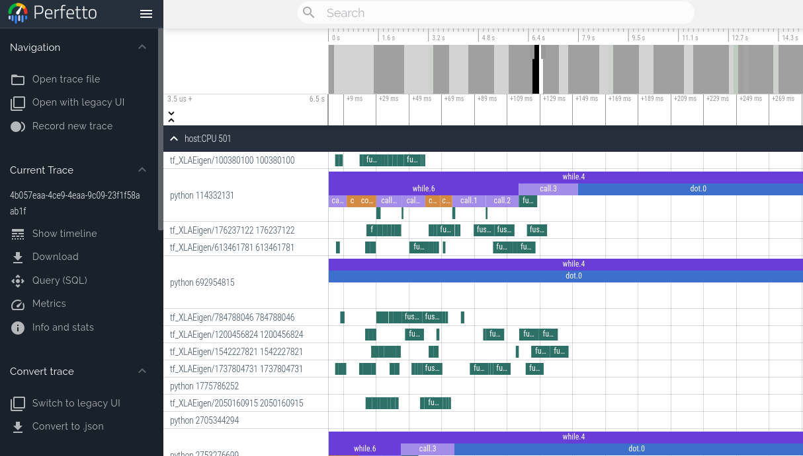

# Profiling computation

<!--* freshness: { reviewed: '2024-03-18' } *-->

## Viewing program traces with Perfetto

We can use the JAX profiler to generate traces of a JAX program that can be
visualized using the [Perfetto visualizer](https://ui.perfetto.dev). Currently,
this method blocks the program until a link is clicked and the Perfetto UI loads
the trace. If you wish to get profiling information without any interaction,
check out the Tensorboard profiler below.

```python
with jax.profiler.trace("/tmp/jax-trace", create_perfetto_link=True):
  # Run the operations to be profiled
  key = jax.random.key(0)
  x = jax.random.normal(key, (5000, 5000))
  y = x @ x
  y.block_until_ready()
```

After this computation is done, the program will prompt you to open a link to
`ui.perfetto.dev`. When you open the link, the Perfetto UI will load the trace
file and open a visualizer.



Program execution will continue after loading the link. The link is no longer
valid after opening once, but it will redirect to a new URL that remains valid.
You can then click the "Share" button in the Perfetto UI to create a permalink
to the trace that can be shared with others.

### Remote profiling

When profiling code that is running remotely (for example on a hosted VM),
you need to establish an SSH tunnel on port 9001 for the link to work. You can
do that with this command:
```bash
$ ssh -L 9001:127.0.0.1:9001 <user>@<host>
```
or if you're using Google Cloud:
```bash
$ gcloud compute ssh <machine-name> -- -L 9001:127.0.0.1:9001
```

### Manual capture

Instead of capturing traces programmatically using `jax.profiler.trace`, you can
instead start a profiling server in the script of interest by calling
`jax.profiler.start_server(<port>)`. If you only need the profiler server to be
active for a portion of your script, you can shut it down by calling
`jax.profiler.stop_server()`.

Once the script is running and after the profiler server has started, we can
manually capture and trace by running:
```bash
$ python -m jax.collect_profile <port> <duration_in_ms>
```

By default, the resulting trace information is dumped into a temporary directory
but this can be overridden by passing in `--log_dir=<directory of choice>`.
Also, by default, the program will prompt you to open a link to
`ui.perfetto.dev`. When you open the link, the Perfetto UI will load the trace
file and open a visualizer. This feature is disabled by passing in
`--no_perfetto_link` into the command. Alternatively, you can also point
Tensorboard to the `log_dir` to analyze the trace (see the
"Tensorboard Profiling" section below).

(tensorboard-profiling)=
## TensorBoard profiling

[TensorBoard's
profiler](https://www.tensorflow.org/tensorboard/tensorboard_profiling_keras)
can be used to profile JAX programs. Tensorboard is a great way to acquire and
visualize performance traces and profiles of your program, including activity on
GPU and TPU. The end result looks something like this:


### Installation

The TensorBoard profiler is available as a plugin to TensorBoard
```shell
pip install tensorboard tensorboard-plugin-profile
```

If you already have TensorBoard installed, you only need to install the
`tensorboard-plugin-profile` pip package. Be careful to only install one version
of TensorFlow or TensorBoard, otherwise you may encounter the "duplicate
plugins" error described {ref}`below <multiple_installs>`. See
<https://www.tensorflow.org/guide/profiler> for more information on installing
TensorBoard.

Profiling with the nightly version of TensorBoard requires the nightly
tensorboard profiler plugin
```shell
pip install tb-nightly tbp-nightly
```

### Programmatic capture

You can instrument your code to capture a profiler trace via the
{func}`jax.profiler.start_trace` and {func}`jax.profiler.stop_trace` methods.
Call {func}`~jax.profiler.start_trace` with the directory to write trace files
to. This should be the same `--logdir` directory used to start TensorBoard.
Then, you can use TensorBoard to view the traces.

For example, to take a profiler trace:

```python
import jax

jax.profiler.start_trace("/tmp/tensorboard")

# Run the operations to be profiled
key = jax.random.key(0)
x = jax.random.normal(key, (5000, 5000))
y = x @ x
y.block_until_ready()

jax.profiler.stop_trace()
```

Note the {func}`block_until_ready` call. We use this to make sure on-device
execution is captured by the trace. See {ref}`async-dispatch` for details on why
this is necessary.

You can also use the {func}`jax.profiler.trace` context manager as an
alternative to `start_trace` and `stop_trace`:

```python
import jax

with jax.profiler.trace("/tmp/tensorboard"):
  key = jax.random.key(0)
  x = jax.random.normal(key, (5000, 5000))
  y = x @ x
  y.block_until_ready()
```

To view the trace, first start TensorBoard if you haven't already:

```shell
$ tensorboard --logdir=/tmp/tensorboard
[...]
Serving TensorBoard on localhost; to expose to the network, use a proxy or pass --bind_all
TensorBoard 2.5.0 at http://localhost:6006/ (Press CTRL+C to quit)
```

You should be able to load TensorBoard at <http://localhost:6006/> in this
example. You can specify a different port with the `--port` flag. See
{ref}`remote_profiling` below if running JAX on a remote server.

Then, either select "Profile" in the upper-right dropdown menu, or go directly
to <http://localhost:6006/#profile>. Available traces appear in the "Runs"
dropdown menu on the left. Select the run you're interested in, and then under
"Tools", select `trace_viewer`. You should now see a timeline of the
execution. You can use the WASD keys to navigate the trace, and click or drag to
select events to see more details at the bottom. See [these TensorFlow
docs](https://www.tensorflow.org/tensorboard/tensorboard_profiling_keras#use_the_tensorflow_profiler_to_profile_model_training_performance)
for more details on using the trace viewer.

You can also use the `memory_viewer`, `op_profile`, and `graph_viewer` tools.

### Manual capture via TensorBoard

The following are instructions for capturing a manually-triggered N-second trace
from a running program.

1. Start a TensorBoard server:

    ```shell
    tensorboard --logdir /tmp/tensorboard/
    ```

    You should be able to load TensorBoard at <http://localhost:6006/>. You can
    specify a different port with the `--port` flag. See {ref}`remote_profiling`
    below if running JAX on a remote server.<br /><br />

1. In the Python program or process you'd like to profile, add the following
   somewhere near the beginning:

   ```python
   import jax.profiler
   jax.profiler.start_server(9999)
   ```

    This starts the profiler server that TensorBoard connects to. The profiler
    server must be running before you move on to the next step. When you're done
    using the server, you can call `jax.profiler.stop_server()` to shut it down.

    If you'd like to profile a snippet of a long-running program (e.g. a long
    training loop), you can put this at the beginning of the program and start
    your program as usual. If you'd like to profile a short program (e.g. a
    microbenchmark), one option is to start the profiler server in an IPython
    shell, and run the short program with `%run` after starting the capture in
    the next step. Another option is to start the profiler server at the
    beginning of the program and use `time.sleep()` to give you enough time to
    start the capture.<br /><br />

1. Open <http://localhost:6006/#profile>, and click the "CAPTURE PROFILE" button
   in the upper left. Enter "localhost:9999" as the profile service URL (this is
   the address of the profiler server you started in the previous step). Enter
   the number of milliseconds you'd like to profile for, and click "CAPTURE".<br
   /><br />

1. If the code you'd like to profile isn't already running (e.g. if you started
   the profiler server in a Python shell), run it while the capture is
   running.<br /><br />

1. After the capture finishes, TensorBoard should automatically refresh. (Not
   all of the TensorBoard profiling features are hooked up with JAX, so it may
   initially look like nothing was captured.) On the left under "Tools", select
   `trace_viewer`.

   You should now see a timeline of the execution. You can use the WASD keys to
   navigate the trace, and click or drag to select events to see more details at
   the bottom. See [these TensorFlow
   docs](https://www.tensorflow.org/tensorboard/tensorboard_profiling_keras#use_the_tensorflow_profiler_to_profile_model_training_performance)
   for more details on using the trace viewer.

   You can also use the `memory_viewer`, `op_profile`, and `graph_viewer`
   tools.<br /><br />

### Adding custom trace events

By default, the events in the trace viewer are mostly low-level internal JAX
functions. You can add your own events and functions by using
{class}`jax.profiler.TraceAnnotation` and {func}`jax.profiler.annotate_function` in
your code.

### Configuring profiler options

The `start_trace` method accepts an optional `profiler_options` parameter, which
allows for fine-grained control over the profiler's behavior. This parameter
should be an instance of `jax.profiler.ProfileOptions`.
<!-- TODO: Add API documentation for jax.profiler.ProfileOptions -->

For example, to disable all python and host traces:

```python
import jax

options = jax.profiler.ProfileOptions()
options.python_tracer_level = 0
options.host_tracer_level = 0
jax.profiler.start_trace("/tmp/tensorboard", profiler_options=options)

# Run the operations to be profiled
key = jax.random.key(0)
x = jax.random.normal(key, (5000, 5000))
y = x @ x
y.block_until_ready()

jax.profiler.stop_trace()
```

#### General options

1.  `host_tracer_level`: Sets the trace level for host-side activities.

    Supported Values:

    `0`: Disables host (CPU) tracing entirely.

    `1`: Enables tracing of only user-instrumented TraceMe events (this is the
    default).

    `2`: Includes level 1 traces plus high-level program execution details like
    expensive TensorFlow or XLA operations.

    `3`: Includes level 2 traces plus more verbose, low-level program execution
    details such as cheap TensorFlow operations.

2.  `python_tracer_level`: Controls whether Python tracing is enabled.

    Supported Values:

    `0`: Disables Python function call tracing.

    `> 0`: Enables Python tracing (this is the default).

#### Advanced configuration options

1.  `tpu_trace_mode`: Specifies the mode for TPU tracing.

    Supported Values:

    `TRACE_ONLY_HOST`: This means only host-side (CPU) activities are traced,
    and no device (TPU/GPU) traces are collected.

    `TRACE_ONLY_XLA`: This means only XLA-level operations on the device are
    traced.

    `TRACE_COMPUTE`: This traces compute operations on the device.

    `TRACE_COMPUTE_AND_SYNC`: This traces both compute operations and
    synchronization events on the device.

    If "tpu_trace_mode" is not provided the trace_mode defaults to
    TRACE_ONLY_XLA.

2.  `tpu_num_sparse_cores_to_trace`: Specifies the number of sparse cores to
    trace on the TPU.
3.  `tpu_num_sparse_core_tiles_to_trace`: Specifies the number of tiles within
    each sparse core to trace on the TPU.
4.  `tpu_num_chips_to_profile_per_task`: Specifies the number of TPU chips to
    profile per task.

For example:

```
options = ProfileOptions()
options.advanced_configuration = {"tpu_trace_mode" : "TRACE_ONLY_HOST", "tpu_num_sparse_cores_to_trace" : 2}

```

Returns InvalidArgumentError if any unrecognized keys or option values are
found.

### Troubleshooting

#### GPU profiling

Programs running on GPU should produce traces for the GPU streams near the top
of the trace viewer. If you're only seeing the host traces, check your program
logs and/or output for the following error messages.

**If you get an error like: `Could not load dynamic library 'libcupti.so.10.1'`**<br />
Full error:
```
W external/org_tensorflow/tensorflow/stream_executor/platform/default/dso_loader.cc:55] Could not load dynamic library 'libcupti.so.10.1'; dlerror: libcupti.so.10.1: cannot open shared object file: No such file or directory
2020-06-12 13:19:59.822799: E external/org_tensorflow/tensorflow/core/profiler/internal/gpu/cupti_tracer.cc:1422] function cupti_interface_->Subscribe( &subscriber_, (CUpti_CallbackFunc)ApiCallback, this)failed with error CUPTI could not be loaded or symbol could not be found.
```

Add the path to `libcupti.so` to the environment variable `LD_LIBRARY_PATH`.
(Try `locate libcupti.so` to find the path.) For example:
```shell
export LD_LIBRARY_PATH=/usr/local/cuda-10.1/extras/CUPTI/lib64/:$LD_LIBRARY_PATH
```

If you still get the `Could not load dynamic library` message after doing this,
check if the GPU trace shows up in the trace viewer anyway. This message
sometimes occurs even when everything is working, since it looks for the
`libcupti` library in multiple places.

**If you get an error like: `failed with error CUPTI_ERROR_INSUFFICIENT_PRIVILEGES`**<br />
Full error:
```shell
E external/org_tensorflow/tensorflow/core/profiler/internal/gpu/cupti_tracer.cc:1445] function cupti_interface_->EnableCallback( 0 , subscriber_, CUPTI_CB_DOMAIN_DRIVER_API, cbid)failed with error CUPTI_ERROR_INSUFFICIENT_PRIVILEGES
2020-06-12 14:31:54.097791: E external/org_tensorflow/tensorflow/core/profiler/internal/gpu/cupti_tracer.cc:1487] function cupti_interface_->ActivityDisable(activity)failed with error CUPTI_ERROR_NOT_INITIALIZED
```

Run the following commands (note this requires a reboot):
```shell
echo 'options nvidia "NVreg_RestrictProfilingToAdminUsers=0"' | sudo tee -a /etc/modprobe.d/nvidia-kernel-common.conf
sudo update-initramfs -u
sudo reboot now
```

See [NVIDIA's documentation on this
error](https://developer.nvidia.com/nvidia-development-tools-solutions-err-nvgpuctrperm-cupti)
for more information.

(remote_profiling)=
#### Profiling on a remote machine

If the JAX program you'd like to profile is running on a remote machine, one
option is to run all the instructions above on the remote machine (in
particular, start the TensorBoard server on the remote machine), then use SSH
local port forwarding to access the TensorBoard web UI from your local
machine. Use the following SSH command to forward the default TensorBoard port
6006 from the local to the remote machine:

```shell
ssh -L 6006:localhost:6006 <remote server address>
```

or if you're using Google Cloud:
```bash
$ gcloud compute ssh <machine-name> -- -L 6006:localhost:6006
```

(multiple_installs)=
#### Multiple TensorBoard installs

**If starting TensorBoard fails with an error like: `ValueError: Duplicate
plugins for name projector`**

It's often because there are two versions of TensorBoard and/or TensorFlow
installed (e.g. the `tensorflow`, `tf-nightly`, `tensorboard`, and `tb-nightly`
pip packages all include TensorBoard). Uninstalling a single pip package can
result in the `tensorboard` executable being removed which is then hard to
replace, so it may be necessary to uninstall everything and reinstall a single
version:

```shell
pip uninstall tensorflow tf-nightly tensorboard tb-nightly tensorboard-plugin-profile tbp-nightly
pip install tensorboard tensorboard-plugin-profile
```

## Nsight

NVIDIA's `Nsight` tools can be used to trace and profile JAX code on GPU. For
details, see the [`Nsight`
documentation](https://developer.nvidia.com/tools-overview).
