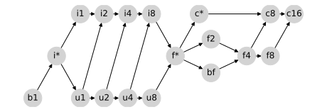

.. _type-promotion:

Type promotion semantics
========================

This document describes JAX's type promotion rules–i.e., the result of :func:`jax.numpy.promote_types` for each pair of types.
For some background on the considerations that went into the design of what is described below, see `Design of Type Promotion Semantics for JAX <https://docs.jax.dev/en/latest/jep/9407-type-promotion.html>`_.

JAX's type promotion behavior is determined via the following type promotion lattice:

.. The graphic above was generated with the following code:
    import networkx as nx
    import matplotlib.pyplot as plt
    lattice = {
      'b1': ['i*'], 'u1': ['u2', 'i2'], 'u2': ['i4', 'u4'], 'u4': ['u8', 'i8'], 'u8': ['f*'],
      'i*': ['u1', 'i1'], 'i1': ['i2'], 'i2': ['i4'], 'i4': ['i8'], 'i8': ['f*'],
      'f*': ['c*', 'f2', 'bf'], 'bf': ['f4'], 'f2': ['f4'], 'f4': ['c8', 'f8'], 'f8': ['c16'],
      'c*': ['c8'], 'c8': ['c16'], 'c16': [],
    }
    graph = nx.from_dict_of_lists(lattice, create_using=nx.DiGraph)
    pos = {
      'b1': [0, 0], 'u1': [2, 0], 'u2': [3, 0], 'u4': [4, 0], 'u8': [5, 0],
      'i*': [1, 1], 'i1': [2, 2], 'i2': [3, 2], 'i4': [4, 2], 'i8': [5, 2],
      'f*': [6, 1], 'bf': [7.5, 0.6], 'f2': [7.5, 1.4], 'f4': [9, 1], 'f8': [10, 1],
      'c*': [7, 2], 'c8': [10, 2], 'c16': [11, 2],
    }
    fig, ax = plt.subplots(figsize=(8, 2.6))
    nx.draw(graph, with_labels=True, node_size=650, node_color='lightgray', pos=pos, ax=ax)
    fig.savefig('type_lattice.svg', bbox_inches='tight')

where, for example:

* ``b1`` means :code:`np.bool_`,
* ``i2`` means :code:`np.int16`,
* ``u4`` means :code:`np.uint32`,
* ``bf`` means :code:`np.bfloat16`,
* ``f2`` means :code:`np.float16`,
* ``c8`` means :code:`np.complex64`,
* ``i*`` means Python :code:`int` or weakly-typed :code:`int`,
* ``f*`` means Python :code:`float` or weakly-typed :code:`float`, and
* ``c*`` means Python :code:`complex` or weakly-typed :code:`complex`.

(for more about weak types, see :ref:`weak-types` below).

Promotion between any two types is given by their `join <https://en.wikipedia.org/wiki/Join_and_meet>`_
on this lattice, which generates the following binary promotion table:

.. raw:: html

    

    <table id="types">
    <tr><th></th><th>b1</th><th>u1</th><th>u2</th><th>u4</th><th>u8</th><th>i1</th><th>i2</th><th>i4</th><th>i8</th><th>bf</th><th>f2</th><th>f4</th><th>f8</th><th>c8</th><th>c16</th><th>i*</th><th>f*</th><th>c*</th></tr>
    <tr><td>b1</td><td>b1</td><td>u1</td><td>u2</td><td>u4</td><td>u8</td><td>i1</td><td>i2</td><td>i4</td><td>i8</td><td class="d">bf</td><td>f2</td><td>f4</td><td>f8</td><td>c8</td><td>c16</td><td>i*</td><td>f*</td><td>c*</td></tr>
    <tr><td>u1</td><td>u1</td><td>u1</td><td>u2</td><td>u4</td><td>u8</td><td>i2</td><td>i2</td><td>i4</td><td>i8</td><td class="d">bf</td><td>f2</td><td>f4</td><td>f8</td><td>c8</td><td>c16</td><td class="d">u1</td><td>f*</td><td>c*</td></tr>
    <tr><td>u2</td><td>u2</td><td>u2</td><td>u2</td><td>u4</td><td>u8</td><td>i4</td><td>i4</td><td>i4</td><td>i8</td><td class="d">bf</td><td class="d">f2</td><td>f4</td><td>f8</td><td>c8</td><td>c16</td><td class="d">u2</td><td>f*</td><td>c*</td></tr>
    <tr><td>u4</td><td>u4</td><td>u4</td><td>u4</td><td>u4</td><td>u8</td><td>i8</td><td>i8</td><td>i8</td><td>i8</td><td class="d">bf</td><td class="d">f2</td><td class="d">f4</td><td>f8</td><td class="d">c8</td><td>c16</td><td class="d">u4</td><td>f*</td><td>c*</td></tr>
    <tr><td>u8</td><td>u8</td><td>u8</td><td>u8</td><td>u8</td><td>u8</td><td>f*</td><td>f*</td><td>f*</td><td>f*</td><td class="d">bf</td><td class="d">f2</td><td class="d">f4</td><td>f8</td><td class="d">c8</td><td>c16</td><td class="d">u8</td><td>f*</td><td>c*</td></tr>
    <tr><td>i1</td><td>i1</td><td>i2</td><td>i4</td><td>i8</td><td>f*</td><td>i1</td><td>i2</td><td>i4</td><td>i8</td><td class="d">bf</td><td>f2</td><td>f4</td><td>f8</td><td>c8</td><td>c16</td><td class="d">i1</td><td>f*</td><td>c*</td></tr>
    <tr><td>i2</td><td>i2</td><td>i2</td><td>i4</td><td>i8</td><td>f*</td><td>i2</td><td>i2</td><td>i4</td><td>i8</td><td class="d">bf</td><td class="d">f2</td><td>f4</td><td>f8</td><td>c8</td><td>c16</td><td class="d">i2</td><td>f*</td><td>c*</td></tr>
    <tr><td>i4</td><td>i4</td><td>i4</td><td>i4</td><td>i8</td><td>f*</td><td>i4</td><td>i4</td><td>i4</td><td>i8</td><td class="d">bf</td><td class="d">f2</td><td class="d">f4</td><td>f8</td><td class="d">c8</td><td>c16</td><td class="d">i4</td><td>f*</td><td>c*</td></tr>
    <tr><td>i8</td><td>i8</td><td>i8</td><td>i8</td><td>i8</td><td>f*</td><td>i8</td><td>i8</td><td>i8</td><td>i8</td><td class="d">bf</td><td class="d">f2</td><td class="d">f4</td><td>f8</td><td class="d">c8</td><td>c16</td><td>i8</td><td>f*</td><td>c*</td></tr>
    <tr><td>bf</td><td class="d">bf</td><td class="d">bf</td><td class="d">bf</td><td class="d">bf</td><td class="d">bf</td><td class="d">bf</td><td class="d">bf</td><td class="d">bf</td><td class="d">bf</td><td class="d">bf</td><td class="d">f4</td><td class="d">f4</td><td class="d">f8</td><td class="d">c8</td><td class="d">c16</td><td class="d">bf</td><td class="d">bf</td><td class="d">c8</td></tr>
    <tr><td>f2</td><td>f2</td><td>f2</td><td class="d">f2</td><td class="d">f2</td><td class="d">f2</td><td>f2</td><td class="d">f2</td><td class="d">f2</td><td class="d">f2</td><td class="d">f4</td><td>f2</td><td>f4</td><td>f8</td><td>c8</td><td>c16</td><td class="d">f2</td><td class="d">f2</td><td class="d">c8</td></tr>
    <tr><td>f4</td><td>f4</td><td>f4</td><td>f4</td><td class="d">f4</td><td class="d">f4</td><td>f4</td><td>f4</td><td class="d">f4</td><td class="d">f4</td><td class="d">f4</td><td>f4</td><td>f4</td><td>f8</td><td>c8</td><td>c16</td><td class="d">f4</td><td class="d">f4</td><td class="d">c8</td></tr>
    <tr><td>f8</td><td>f8</td><td>f8</td><td>f8</td><td>f8</td><td>f8</td><td>f8</td><td>f8</td><td>f8</td><td>f8</td><td class="d">f8</td><td>f8</td><td>f8</td><td>f8</td><td>c16</td><td>c16</td><td>f8</td><td>f8</td><td>c16</td></tr>
    <tr><td>c8</td><td>c8</td><td>c8</td><td>c8</td><td class="d">c8</td><td class="d">c8</td><td>c8</td><td>c8</td><td class="d">c8</td><td class="d">c8</td><td class="d">c8</td><td>c8</td><td>c8</td><td>c16</td><td>c8</td><td>c16</td><td class="d">c8</td><td class="d">c8</td><td class="d">c8</td></tr>
    <tr><td>c16</td><td>c16</td><td>c16</td><td>c16</td><td>c16</td><td>c16</td><td>c16</td><td>c16</td><td>c16</td><td>c16</td><td class="d">c16</td><td>c16</td><td>c16</td><td>c16</td><td>c16</td><td>c16</td><td>c16</td><td>c16</td><td>c16</td></tr>
    <tr><td>i*</td><td>i*</td><td class="d">u1</td><td class="d">u2</td><td class="d">u4</td><td class="d">u8</td><td class="d">i1</td><td class="d">i2</td><td class="d">i4</td><td>i8</td><td class="d">bf</td><td class="d">f2</td><td class="d">f4</td><td>f8</td><td class="d">c8</td><td>c16</td><td>i*</td><td>f*</td><td>c*</td></tr>
    <tr><td>f*</td><td>f*</td><td>f*</td><td>f*</td><td>f*</td><td>f*</td><td>f*</td><td>f*</td><td>f*</td><td>f*</td><td class="d">bf</td><td class="d">f2</td><td class="d">f4</td><td>f8</td><td class="d">c8</td><td>c16</td><td>f*</td><td>f*</td><td>c*</td></tr>
    <tr><td>c*</td><td>c*</td><td>c*</td><td>c*</td><td>c*</td><td>c*</td><td>c*</td><td>c*</td><td>c*</td><td>c*</td><td class="d">c8</td><td class="d">c8</td><td class="d">c8</td><td>c16</td><td class="d">c8</td><td>c16</td><td>c*</td><td>c*</td><td>c*</td></tr>
    </table>

.. The table above was generated by the following Python code.
    import numpy as np
    import jax.numpy as jnp
    from jax._src import dtypes

    types = [np.bool_, np.uint8, np.uint16, np.uint32, np.uint64,
              np.int8, np.int16, np.int32, np.int64,
              jnp.bfloat16, np.float16, np.float32, np.float64,
              np.complex64, np.complex128, int, float, complex]

    def name(d):
      if d == jnp.bfloat16:
        return "bf"
      itemsize = "*" if d in {int, float, complex} else np.dtype(d).itemsize
      return f"{np.dtype(d).kind}{itemsize}"

    out = "<tr><th></th>"
    for t in types:
      out += "<th>{}</th>".format(name(t))
    out += "</tr>\n"

    for t1 in types:
      out += "<tr><td>{}</td>".format(name(t1))
      for t2 in types:
        t, weak_type = dtypes._lattice_result_type(t1, t2)
        if weak_type:
          t = type(t.type(0).item())
        different = jnp.bfloat16 in (t1, t2) or jnp.promote_types(t1, t2) is not np.promote_types(t1, t2)
        out += "<td{}>{}</td>".format(" class=\"d\"" if different else "", name(t))
      out += "</tr>\n"

    print(out)

Jax's type promotion rules differ from those of NumPy, as given by
:func:`numpy.promote_types`, in those cells highlighted with a green background
in the table above. There are three key classes of differences:

* When promoting a weakly typed value against a typed JAX value of the same category,
  JAX always prefers the precision of the JAX value. For example, ``jnp.int16(1) + 1``
  will return ``int16`` rather than promoting to ``int64`` as in NumPy.
  Note that this applies only to Python scalar values; if the constant is a NumPy
  array then the above lattice is used for type promotion.
  For example, ``jnp.int16(1) + np.array(1)`` will return ``int64``.

* When promoting an integer or boolean type against a floating-point or complex
  type, JAX always prefers the type of the floating-point or complex type.

* JAX supports the
  `bfloat16 <https://en.wikipedia.org/wiki/Bfloat16_floating-point_format>`_
  non-standard 16-bit floating point type
  (:code:`jax.numpy.bfloat16`), which is useful for neural network training.
  The only notable promotion behavior is with respect to IEEE-754
  :code:`float16`, with which :code:`bfloat16` promotes to a :code:`float32`.

The differences between NumPy and JAX are motivated by the fact that
accelerator devices, such as GPUs and TPUs, either pay a significant
performance penalty to use 64-bit floating point types (GPUs) or do not
support 64-bit floating point types at all (TPUs). Classic NumPy's promotion
rules are too willing to overpromote to 64-bit types, which is problematic for
a system designed to run on accelerators.

JAX uses floating point promotion rules that are more suited to modern
accelerator devices and are less aggressive about promoting floating point
types. The promotion rules used by JAX for floating-point types are similar to
those used by PyTorch.

Effects of Python operator dispatch
-----------------------------------
Keep in mind that Python operators like `+` will dispatch based on the Python type of
the two values being added. This means that, for example, ``np.int16(1) + 1`` will
promote using NumPy rules, whereas ``jnp.int16(1) + 1`` will promote using JAX rules.
This can lead to potentially confusing non-associative promotion semantics when
the two types of promotion are combined;
for example with ``np.int16(1) + 1 + jnp.int16(1)``.

.. _weak-types:

Weakly-typed values in JAX
--------------------------
*Weakly-typed* values in JAX can in most cases be thought of as having promotion behavior
equivalent to that of Python scalars, such as the integer scalar ``2`` in the following:

.. code-block:: python

   >>> x = jnp.arange(5, dtype='int8')
   >>> 2 * x
   Array([0, 2, 4, 6, 8], dtype=int8)

JAX's weak type framework is designed to prevent unwanted type promotion within
binary operations between JAX values and values with no explicitly user-specified type,
such as Python scalar literals. For example, if ``2`` were not treated as weakly-typed,
the expression above would lead to an implicit type promotion:

.. code-block:: python

   >>> jnp.int32(2) * x
   Array([0, 2, 4, 6, 8], dtype=int32)

When used in JAX, Python scalars are sometimes promoted to :class:`~jax.numpy.DeviceArray`
objects, for example during JIT compilation. To maintain the desired promotion
semantics in this case, :class:`~jax.numpy.DeviceArray` objects carry a ``weak_type`` flag
that can be seen in an array's string representation:

.. code-block:: python

   >>> jnp.asarray(2)
   Array(2, dtype=int32, weak_type=True)

If the ``dtype`` is specified explicitly, it will instead result in a standard
strongly-typed array value:

.. code-block:: python

   >>> jnp.asarray(2, dtype='int32')
   Array(2, dtype=int32)

.. _strict-dtype-promotion:

Strict dtype promotion
----------------------
In some contexts it can be useful to disable implicit type promotion behavior, and
instead require all promotions to be explicit. This can be done in JAX by setting the
``jax_numpy_dtype_promotion`` flag to ``'strict'``. Locally, it can be done with a\
context manager:

.. code-block:: python

  >>> x = jnp.float32(1)
  >>> y = jnp.int32(1)
  >>> with jax.numpy_dtype_promotion('strict'):
  ...   z = x + y  # doctest: +SKIP
  ...
  Traceback (most recent call last):
  TypePromotionError: Input dtypes ('float32', 'int32') have no available implicit
  dtype promotion path when jax_numpy_dtype_promotion=strict. Try explicitly casting
  inputs to the desired output type, or set jax_numpy_dtype_promotion=standard.

For convenience, strict promotion mode will still allow safe weakly-typed promotions,
so you can still write code code that mixes JAX arrays and Python scalars:

.. code-block:: python

  >>> with jax.numpy_dtype_promotion('strict'):
  ...   z = x + 1
  >>> print(z)
  2.0

If you would prefer to set the configuration globally, you can do so using the standard
configuration update::

  jax.config.update('jax_numpy_dtype_promotion', 'strict')

To restore the default standard type promotion, set this configuration to ``'standard'``::

  jax.config.update('jax_numpy_dtype_promotion', 'standard')
